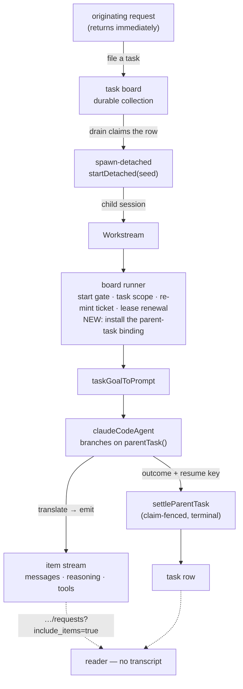

# LAB-133: Mirror a Claude Code run as an FSD workstream — Implementation Spec

## Part I — The Case *(for the human)*

### 1. Problem — why it matters, why now

When we hand a coding job to a Claude Code agent today, we get back one line: it worked, or
it didn't. Everything the agent did on the way — what it decided its job was, which files it
touched, where it got stuck, what it asked — is thrown away as it happens. Nobody can check a
run except by opening the transcript and reading it.

That is fine when a person is watching one run. It stops working the moment anything else has
to act on the result: route the next step, decide whether to retry, notice that the agent
asked a question and never got an answer, or grade whether the run did what it was asked.

**Why now.** This is the bottom of the epic. Every layer above it reads state this layer
produces — grading a run, filing what came back, deciding what happens next. Build those first
and they read nothing, which is precisely the sequencing mistake the epic exists to avoid. It
is also the easiest layer to skip, because a blocking call that returns a summary *looks* like
it works.

The kill line sits here too: if state alone can't say what a run did, nothing above it stands.

### 2. Solution in plain terms

Give a coding run its own place in the system instead of hiding it inside the request that
started it.

The originating request starts the run as a **workstream** — a child session dedicated to that
one job — and then returns. The run keeps going. As the agent works, its top-level messages
land in that workstream's stream, in order, as they happen. When the run ends, the ending is
recorded on the task it was started for. Asking "what did that run do?" then means reading FSD
state, not reading a transcript.

Almost all of this already exists and is unused. The agent block that turns a Claude Code run
into stream items has been in the repo since the harness work and nothing dispatches through
it. The task board already knows how to run a worker outside the request that claimed it. The
routes that list a session's background jobs and read one job's history already ship. **The
work is the composition, plus three things standing in its way** — all in the framework, not in
our orchestration code:

- The agent block hard-codes where it keeps its "resume this conversation" key: session state.
  The task board **refuses** a detached worker that declares session state, by name, at
  construction. So the two pieces cannot currently be connected at all.
- The framework already has the right home for that key — a background run can read and settle
  the task it was started for — but **nothing hooks it up** for a task board's detached work.
  The wiring is declared and refuses by name; it needs connecting, not inventing.
- Nothing records how a run ended in a form anything can act on.

**On the question the issue asked us to answer rather than route around** — is a harness
dispatch a detached session or a job? **It is a false fork, and the repo already answers it:
the same call produces both, and which one you get is decided by the deployment's dispatcher.**
§7c carries the argument, the evidence, and the gap it leaves open; §12 carries what the epic
should take from it.

**Philosophy.** Tenet 2 (composition over features) — this adds no public option at all; the
block reads a fact the runtime already offers and behaves accordingly. Tenet 3 (earn every
addition) — the failure vocabulary is cut to what the signals actually support. Tenet 5 (fix at
the owning layer) — the missing wiring is connected where it belongs rather than worked around
in the vendor package. Tenet 7 (prove the goal) — the proof is a real coding task read back
from state with the transcript closed.

### 6. Decisions & rules — the sign-off surface

1. **No new option. The agent block asks the runtime whether it is running for a task, and
   keeps its resume key wherever the answer says.** Running for a task: read it from that task,
   hand it back when the job finishes. Not running for a task: today's session state, unchanged.
   *Rejected:* a new `continuity` option (and a helper to build one). It would put a second knob
   on a shipped package beside the session provider that already owns half the job, and commit
   us to a per-vendor continuity contract for one caller.
   *Rejected:* keeping the key up to date mid-run. The only write available mid-run is
   unfenced, so a run whose claim had been taken could overwrite the current holder's key and
   send recovery to the wrong conversation (§7b).
   *Locks in:* behaviour now depends on context rather than on configuration, which is what
   keeps the default byte-identical — but it also means a caller cannot override it. The cost is
   that a run killed part-way loses its key and starts over rather than resuming, which is
   [FIX-1179](https://linear.app/fixpoint-labs/issue/FIX-1179) and is not deepened by this. **And
   it commits us to connecting framework wiring that is currently declared-but-absent** — real
   work in two packages, priced in §6's size line.

2. **A run that fails is a *finished* job that reports why. Only a run we *lost* gets retried.**
   The board's automatic-retry machinery stays for the case it was built for — the process died,
   the lease lapsed, the run was cancelled. An agent that ran and could not do the job settles
   its own row and records the ending.
   *Rejected:* letting a failed run fall through to the board's retry. Re-running a coding agent
   that has already written files and pushed commits is not a retry; it is a second,
   partly-informed attempt at a job whose state has already moved.
   *Locks in:* nothing above this layer gets free retries. Anything that wants a failed run
   tried again decides that deliberately, which is the behaviour we want but is work somebody
   does later. **The dangerous half is the boundary, not the rule** — an aborted run must stay
   *lost*, never be recorded as finished (§7d).

3. **We prove the mirror on the plain in-process deployment, and report durability as a
   deployment choice instead of building for it.**
   *Rejected:* standing up a Redis-backed queued deployment inside this issue so the goal check
   proves durability too.
   *Locks in:* the epic gets its answer on events architecture this week and pays for it with a
   known hole — we will have run this end to end without ever having survived a restart mid-run.
   If durability behaves differently in practice from what the topology matrix says, we find out
   one issue later than we could have.

**Non-goals** — sub-agent internals as their own workstreams (they already nest under a
container item; a reader filters them out). A failure taxonomy — see §7e; the signals do not
support one. Anything the epic already excluded: an event bus, `waitForEvent`, change signals,
a Vercel or HarnessAgent abstraction. File writes and todos — LAB-134. Grading the run —
LAB-135. Resuming a run interrupted mid-flight — FIX-1179.

**Size:** Medium — 7 production files across three packages · 12 test behaviours · 2 doc
surfaces · 1 PR. (Bigger than first drafted: review established that the framework wiring in §7a
is genuinely absent and has to be connected. One PR rather than two, because a wiring PR proves
nothing until something runs through it.)

---

### 3. Tradeoffs & alternatives

**Alternative: dispatch a workstream without a task board.** `startDetached` is board-only —
the routing table it resolves against is assembled purely from bindings a board's drain stamps.
A board-free path would be a framework change of real size. Rejected, and not reluctantly: a
coding job *is* a task, and the board buys the lease, the abandonment counting and the
dead-process recovery for free. If a later layer needs board-free detachment, that is an FSD
issue to file (§12), not machinery to grow here.

**The simpler approach: don't detach at all.** Run the agent inline and let its messages land
in the session that asked. Genuinely tempting — a fraction of the work, and the mirroring
already functions. Insufficient for two reasons. The originating request would have to stay
open for the whole run, minutes to an hour, which is the same black box with a longer timeout.
And a stream that exists only while one HTTP request is alive is not something a later block
can attach to — which is the property that makes real-time processing of a harness's output a
next step instead of a rewrite.

**Where the complexity is.** Not the mirroring; that already works and is not being rewritten.
It is the boundary between *the run failed* and *we lost the run*. Decision 2 draws the line;
§7d and §9 handle the cases either side of it, and an aborted run is the one that will be got
wrong if nobody is looking for it.

### 4. Focus practices (1–5)

1. **BP-030 (tolerate the old shape)**, with a specific trap. Today the block *returns* an
   errored handle for a terminal error subtype but *rethrows* a mid-stream SDK failure. A caller
   not running for a task must keep both behaviours unchanged; the settle-don't-throw behaviour
   decision 2 describes applies to the detached path only.
2. **Tenet 7 — a check that cannot fire is not a check.** The abort path (§7d) is the one that
   silently inverts decision 2, and it is invisible to a test that only exercises clean
   completion and clean failure. Break it on purpose.
3. **Tenet 3 (earn every addition)** — no exported failure type, no new public option. The
   ending rides the row as the values the SDK already produces.
4. **Tenet 5 (fix at the owning layer)** — the board refuses this composition for a real reason
   and the parent-task verbs refuse for another. Satisfy both where they live; do not reach for
   the channel a check happens not to inspect (a capability's contribution is invisible to it).

### 5. What using it looks like (1–5 examples)

**Declaring a coding run as detached work** *(what this spec proposes; today the board throws
at construction on the last line):*

```ts
const codingBoard = taskBoard({
  name: "coding",
  boardId: "coding",
  collection: codingTasks,            // a defineTaskCollection() — durable
  workers: {
    implement: { worker: codingRun, dispatch: { mode: "detached" } },
  },
});
```

**The worker itself — an adapter, not the block alone** *(§7f):*

```ts
// The board hands a worker { goal, taskId, … }; the agent block wants a prompt.
const codingRun = sequencer({ name: "coding-run" })
  .step(taskGoalToPrompt)                     // goal + context → { prompt }
  .step(claudeCodeAgent({ model: "…" }));     // no continuity option — see below
```

**Nothing changes for anyone else** *(before / after — the point is that there is no diff):*

```ts
// before and after, identical: no task in context, so session state as today
const chatAgent = claudeCodeAgent({ model: "…" });
```

**Reading the run back, with the transcript closed:**

```ts
// which background jobs did this conversation start, and how did they end?
GET /api/flows/sessions/:sessionId/workstreams
// → [{ id: "sess_…", topic: "LAB-129", status: "completed", … }]

// what happened inside one of them — include_items is required; without it
// this returns summaries and cannot reconstruct the run
GET /api/flows/sessions/sess_…/requests?include_items=true
// → the run's top-level messages, tool calls and reasoning, in order
```

---

## Part II — The Build Plan *(for the implementing agent)*

### 7. Technical design



**(a) The home for the resume key already exists in the framework, and is not connected.**
`RequestHost` is closed at four verbs and two of them are exactly this: `parentTask()` reads the
one parent-board row this request was dispatched for, and `settleParentTask()` writes back to
it — **fenced**, by a ticket stamped into the child request at spawn and closed over, so a
displaced child cannot settle over work it no longer owns. Both are pinned on the public
`BlockContext` boundary (`packages/core/src/types/tests/block-context-boundary.type-test.ts`)
and are reachable from `claudeCodeAgent` today with no new dependency and no capability wrapper.

So the block needs **no option at all**: it calls `parentTask()`, and a row means "I am running
for a task — keep the key there"; `undefined` means today's session-state path. Given a row it
declares no `sessionStateSchema`, which is what unblocks the board. Two behaviours scope to that
branch and must leave the default untouched (practice 1): it does not accumulate run handles in
`sdkAgentRuns` (**the item stream is the record — that is this layer's entire point**), and the
ending rides the settlement instead of a throw.

**What is genuinely missing is narrower than "a seam."** `ParentTaskBinding` (`{ read, settle }`)
is declared in `engine/src/context/create-request-host.ts`, threaded through
`createExecutionContext` and `createFlowApiRouter` — and **constructed nowhere**.
`createFlowState.ts` says so outright: *"`parentTask` stays unwired here, and that verb refuses
by name rather than pretending otherwise."* Nothing in `@flow-state-dev/orchestration` references
either verb. **Connecting it is this issue's framework work**, and the natural place is the
board's detached runner: it already re-reads the row, verifies the claim and re-mints the
ticket, so it holds everything a binding needs and sits on the orchestration side of the package
graph, where a board can be named. Doing it in the engine instead would mean the engine naming a
board. Directional; the exact placement is the implementer's.

**(b) Why the key rides the settlement and is not kept current.** The board has two write paths
and only one is fenced. A **transition** (complete / fail / cancel — which is what
`settleParentTask` is) presents the claim and is declined if this worker no longer holds the row.
A **patch** (`updateTask` / `assignTask`, and `patchMetadata` on a collection ref) *presents
nothing, deliberately* — "a live block relabelling tasks it does not hold is a supported thing to
do." **There is no non-terminal fenced task write in the public API**; say so where anyone might
assume otherwise, because assuming it is how an unfenced mid-run write gets written. So a run
that lost its claim while still executing could patch its key over the current holder's, and
recovery would resume the wrong conversation — the window is real, since lease loss reaches a
worker up to about a third of a lease late and the renewal driver's own contract says it "is not
a substitute for the write fence."

The fold is to **not need the write**. A resume key is wanted at exactly two moments — read at
the start, written at the end — and the end already has the fenced, terminal write. What this
gives up is a mid-run key: a run killed part-way leaves none and starts over. That is exactly
FIX-1179 and this does not deepen it — a re-delivered detached run restarts today regardless.

**(c) Detached-vs-job, answered.** Locality is decided by `isInProcessDispatcher` over the
*effective* dispatcher, not by anything the caller writes
(`docs/architecture/detached-work.md`). No dispatcher, or one exposing `dispatchLocal` → the
child runs here and does not survive the process; `dispose()` drains it against
`detachedDrainTimeoutMs`, default **30 s**, a figure tuned to a serverless SIGTERM grace period
rather than to a coding run. A queue dispatcher (`colocated` / `dispatch-only`) → the same
dispatch is enqueued and survives. Both arms are already covered in
`packages/engine/test/flowstate/runtime-detached-start.test.ts`, including launching a workstream
from inside a colocated queue worker and cancelling an in-flight in-process child at the drain
budget. So the substrate exists on both arms and the choice is a deployment one. **The SLA that
follows:** an in-process host raises `detachedDrainTimeoutMs` past its longest expected run or
accepts that any shutdown kills one; a queued host instead sizes its platform kill timeout for
the longest job, because a claimed job holds `Worker.close()` open with no framework budget over
it. What neither arm gives is **run resumption** — §12.

**(d) Aborts are not failures, and getting this wrong inverts decision 2.** The block forwards
`ctx.signal` to the SDK's abort controller, so a shutdown drain or a lease loss makes the query
reject through the *same* mid-stream-throw path a naive settle-don't-throw converts into a
returned outcome. The runner would then record success and settle the row — leaving a **lost**
attempt marked done and unrecoverable, which is the exact opposite of what decision 2 says. So:
**check for an aborted context and abort-like rejections first, and rethrow them**, before
anything classifies a genuine agent failure. An abort must leave the task recoverable.

**(e) What the ending actually records — one bucket, not a taxonomy.** The SDK distinguishes
terminal subtypes (max turns, max budget, execution error, structured-output retries) and
nothing else. It cannot tell *underspecified* from *blocked*: a well-specified task can hit max
turns, and an agent can return a **successful** terminal result whose text explains it cannot
proceed. A four-value vocabulary would therefore be guessing on two of its four values. So the
row carries what is real — the existing `resultSubtype` and the `isErroredSubtype()` verdict —
plus **one bucket for a non-abort throw**. Any richer reading requires a semantic judgment about
what the agent *said*, which belongs to a later layer that has a model in it, not to a switch
statement here. Keep whatever helper does this internal to `@flow-state-dev/claude-code`; export
no type.

**(f) The board's payload is not the block's input.** The drain hands every worker a
`TaskWorkerInput` (`goal`, `taskId`, …); `claudeCodeAgent` validates a required
`{ prompt: string }` *before* its prompt callback runs. Wiring the block in directly rejects
every detached task before the SDK is ever invoked. An explicit adapter step from the task's goal
and context to the agent's prompt is required, and the goal check must cover it — this is the
first thing that breaks and it breaks silently early.

**Packages touched:** `@flow-state-dev/claude-code` (the branch, the abort guard, the ending),
`@flow-state-dev/orchestration` (construct and install the parent-task binding on the detached
runner), and `@flow-state-dev/engine` only if the binding cannot be installed from the
orchestration side. The composition and the adapter live in the goal check; **export nothing for
one caller.**

**Reference pointers** (read before building; none is a template to copy wholesale):

- `apps/kitchen-sink/flows/chat-agent/run/thinking-styles/pipelines/background-work.ts` — a
  shipped detached-work composition.
- `packages/integration-tests/src/scenarios/task-board-detached-{handoff,child-death,on-error,shared-key}.test.ts`
  — the four detached scenarios already characterized; `child-death` and `on-error` are where
  decision 2's boundary lives.
- `packages/orchestration/src/task-board/blocks/record-result.ts` — how a worker's return becomes
  a settlement.
- `packages/engine/test/workstream-listing-route.test.ts` — what the read surface actually
  returns, so the goal check asserts real shape.
- `goals/task-board/contains-a-worker-outcome-that-lands-on-a-settled-task/run.mts` — a goal
  already driving a real board over real stores; closest thing to a starting point.

> **Sketch — pseudocode. Illustrative, not the contract. React to the shape.**
>
> ```
> in the agent block:
>     my task ← ask the runtime for the row I was dispatched for
>     declare session state ONLY when there is no such row   ← unblocks the board
>
>     resume key ← my task ? (read it off the row) : (read it off session state)
>
>     run …
>
>     if the context was aborted, or the failure is abort-like:
>         RETHROW — this is a lost run, not a failed one          (§7d, decision 2)
>     if no task:      behave exactly as today (rethrow a mid-stream failure)
>     if a task:       settle it, carrying the ending and the resume key
>                      (the fenced, terminal write — §7b)
>
> the ending is: the SDK's own terminal subtype + errored verdict,
>                plus one bucket for a non-abort throw. No taxonomy.   (§7e)
>
> in the board's detached runner, where the ticket is already re-minted:
>     install the parent-task binding, so the two verbs above stop refusing  (§7a)
> ```
>
> What this asks a reviewer: *is branching on "am I running for a task" the right trigger, or
> should it be explicit?* Implicit keeps the surface at zero and makes the default automatic;
> explicit is greppable and lets a caller opt out. This spec takes implicit.

### 8. Implementation sequence

1. **Pin the two refusals.** Characterization tests: a board with `claudeCodeAgent` as a detached
   worker throws naming `sessionStateSchema`; and `parentTask()` refuses by name in a detached
   run today. Both are green now and are what steps 2–3 flip. *Depends on:* nothing.
2. **Wire the parent-task binding** on the board's detached runner (§7a), so `parentTask()` and
   `settleParentTask()` answer instead of refusing. *Test:* a detached worker reads its own row
   and settles it; a displaced attempt's settle is declined at the fence. *Depends on:* 1.
3. **Branch the block** on `parentTask()` (§7a): with a row, no session-state schema, key read
   from the row; with none, byte-identical to today. *Test:* both paths resume across two runs;
   the default path unchanged **including its throw**; the board now accepts the block.
   *Depends on:* 1.
4. **The abort guard** (§7d): rethrow an aborted context and abort-like rejections before any
   ending is recorded. *Test:* an aborted run leaves the task **recoverable, not settled**.
   *Depends on:* 3.
5. **The ending** (§7e): carry `resultSubtype` + the errored verdict + one throw bucket onto the
   settlement. *Test:* a failed run leaves a settled row carrying the ending and no retry.
   *Depends on:* 4.
6. **The adapter and the composition** in the goal check (§7f): task goal/context → prompt, then
   the agent. *Depends on:* 3.
7. **The goal check** end to end — a real coding task, in-process, drain budget raised past the
   run (§9). *Depends on:* 2, 5, 6.
8. **Docs** (§11).

**No removals.** Nothing supersedes existing code; the CLI path and the default session-state
path both stay.

### 9. Edge cases & error handling

| Case | Expected |
|---|---|
| Run outlives the drain budget in-process | Cancelled at 30 s by default — and **cancel does not settle**. The row stays `in_progress`, the lease lapses, and decision 2's lost path re-dispatches from the prompt until abandonments exhaust: a cancel→abandon→retry storm, not a classified failure. This is what "deployment choice" means concretely — size the drain or use a queue. The goal check **must** raise `detachedDrainTimeoutMs` past the expected run, with a comment saying this is the finding, not a workaround |
| Context aborted mid-run | Rethrow, never record (§7d). The row must remain recoverable |
| Process dies mid-run | Lease lapses; the next claim hands the row back and advances `abandonments`; past the allowance it settles `errored`. The *lost* case, deliberately not an ending |
| A displaced attempt tries to write the resume key | Cannot: the key rides the terminal settlement, which the fence declines (§7b). Assert it rather than assume it |
| Hand-off longer than the lease before the child starts | Known framework gap (FIX-1070); the start gate rejects the stale claim and the row recovers. Do not close it here |
| Agent asks a question and stops | Not a failure. A question is a top-level message, already in the stream. Verify it; don't handle it |
| Agent returns *success* whose text says it cannot proceed | Recorded as success. Reading intent out of prose is a later layer's job (§7e), and guessing here would be worse than not guessing |
| Unrecognized terminal subtype | A failure, never a silent success — `isErroredSubtype` already treats it so |
| Sub-agent activity | Already nests under a container item via `ownedBy`. Top-level reconstruction filters on it. No change |
| A run producing no assistant text | A legitimate outcome, not an error. The handle's final message is already nullable |

**Taxonomy.** Everything the agent does is non-fatal to the request — the run settles its own row
and the workstream ends normally. Aborts are the exception and propagate (§7d). The only fatal
paths are construction-time: the board's refusals, which fire before anything runs, and a missing
request host.

### 10. Testing strategy

**Goal:** dispatch a real, small coding task, let the workstream run it to completion, then
reconstruct what it did **reading only FSD state** — the workstream row, its item stream (via
`include_items=true`), and the task's settled outcome — with the harness transcript never opened.
Pass when the reconstruction names the job the run was given and the shape of what it did, and
the task's ending is present. `goals/harness-workstream/<it>/run.mts`, real model, real path,
real stores.

*Anti-game:* must not read the SDK transcript, the working tree, or git. Must not assert on
whether the coding agent did a **good** job — that is LAB-135's question. A run that completes
with an empty item stream is a fail, not a pass.

**CI specs** (the behaviours, not the test names):

- one behaviour per decision in §6, in observable terms
- **both refusals pinned in both directions** — the board rejects the block as it is today and
  accepts it once branched; `parentTask()` refuses today and answers once wired
- **what must not change** (BP-030, practice 1): with no task in context the block behaves exactly
  as today — same session-state schema, resume across requests, **and the mid-stream throw still
  throws**
- **the abort path** (practice 2, §7d): an aborted run leaves the task recoverable and **not
  settled**. This is the behaviour that silently inverts decision 2, so break it on purpose and
  confirm the signal changes
- **the lost-vs-failed split**: a recorded ending leaves a settled row and no new attempt; an
  abandoned claim leaves an unsettled row a later claim picks up. Asserting only the first passes
  an implementation that quietly retries
- **a displaced attempt cannot land its resume key** over the current holder's (§7b)
- **the adapter** (§7f): a task's goal reaches the agent as its prompt, and a task the adapter
  cannot render fails loudly rather than reaching the SDK

**Discipline:** `tdd`. The seams are the agent block's `execute` (vitest with the mock context and
a scripted fake `query`, as the existing sdk specs do), the board's construction-time assertion,
and the runner's binding install — all reachable without a server, so every behaviour above is a
tracer bullet.

**One thing that will otherwise cost a cycle:** the goal check needs a **runtime**, not a bare
`runAction`. The detached start operation is installed by `createFlowState`; a script that only
calls `runAction` has no request host and the first `startDetached` throws by name. One goal
already builds a runtime this way (`goals/personal-knowledge-mcp/…`).

### 11. Documentation plan

- **EXTEND** `apps/docs/docs/tools/claude-code-sdk.md` — two existing sections, no new page.
  Under **"Session continuity"**, that running the agent as background work keeps its resume key
  with the work rather than the conversation, and that this needs no configuration. Under
  **"Error handling"**, that a failed run settles rather than retries, that an interrupted one
  stays recoverable, and what the recorded ending contains. One minimal example each. Cross-link
  → `apps/docs/docs/server/background-work.md`, ← from that page's "Related" list.
  *Voice risks:* no "seamless" or "first-class"; introduce **workstream** in plain terms on first
  use here (a tools-page reader may not have met it); no Linear ids under `apps/docs/`.
- **EXTEND** `packages/claude-code/README.md` — the "Session state" section covers the branch; the
  `/cli` vs `/sdk` table gains a row for background use. Terse; BP-009.
- **No new page, and no architecture-doc change.** `docs/architecture/detached-work.md` describes
  the topology this uses and nothing about that contract changes — §7c is a *reading* of it. The
  parent-task wiring makes a declared verb answer; it does not alter the four-verb seam.

### 12. Dependencies, open questions & follow-ups

**Dependencies:** none blocking. LAB-134 and LAB-135 depend on this; neither is required by it.
`@anthropic-ai/claude-agent-sdk` is already an optional peer.

**Open questions:** none.

**Reported to the epic (LAB-68), not decided here:**

- **The events-architecture answer.** Detached and job are one call under two topologies, so no
  new substrate is needed for a run to survive a restart — only a queue dispatcher. The epic can
  keep event-bus / `waitForEvent` in "not doing" on the strength of this (§7c).
- **The gap that is real:** run resumption — [FIX-1179](https://linear.app/fixpoint-labs/issue/FIX-1179).
  Filed; do not re-file. Its natural seam is the resume key decision 1 puts on the task row.
- **Board-free detachment.** `startDetached` is board-only by construction. Right for a coding
  task; may not be for whatever L3 needs. FSD issue if and when.

**Follow-ups (flagged, not built):**

- **Framework gap, existing:** FIX-1070 — nothing renews a detached row's lease between hand-off
  and the child's first breath. Bounded per occurrence; can starve under sustained backlog.
- **Framework gap, surfaced here (coordinator is filing it; do not absorb):** there is no
  non-terminal fenced task write. This design does not need one, but the next thing that wants to
  update a claimed row mid-run will (§7b).
- **Deepening:** the `sessionStateSchema` refusal walks composed blocks but cannot see a
  capability's contribution — the same separate-channel problem `tools` has, already noted in that
  module's header. Follow up via `improve-codebase-architecture`.
- **`@flow-state-dev/claude-code` has zero consumers** anywhere in the repo. After this it has one,
  in `goals/`. Whether it earns a kitchen-sink surface is a question for after LAB-135.

---

## Spec evolution *(the change story, not an audit log)*

- **Spec drafted** — framed as "give a coding run its own place in the system" rather than as a
  streaming feature; chose to compose the four existing primitives over building anything new;
  found that the board refuses the agent block as a detached worker because it declares session
  state, and made satisfying that refusal the first build step; answered detached-vs-job from the
  architecture doc and the engine's existing tests rather than leaving it open.
- **After spec review** — the design got *smaller* and the scope got *bigger*, from the same
  finding. Review established that the framework already has the right home for a run's resume
  key (`parentTask()` / `settleParentTask()`, fenced) and that nothing constructs the binding for
  a task board's detached spawn. So the proposed `continuity` option and its helper were dropped
  in favour of the block branching on whether it is running for a task — no public surface at all
  — while connecting that wiring became this issue's framework work, in two packages rather than
  one. Three further corrections: aborts must rethrow before any ending is recorded, or a lost run
  is settled as finished and decision 2 inverts; the four-value failure taxonomy was cut to what
  the SDK can actually distinguish, since nothing separates *underspecified* from *blocked*; and a
  task-goal-to-prompt adapter was added, without which every detached task is rejected before the
  SDK is invoked.
