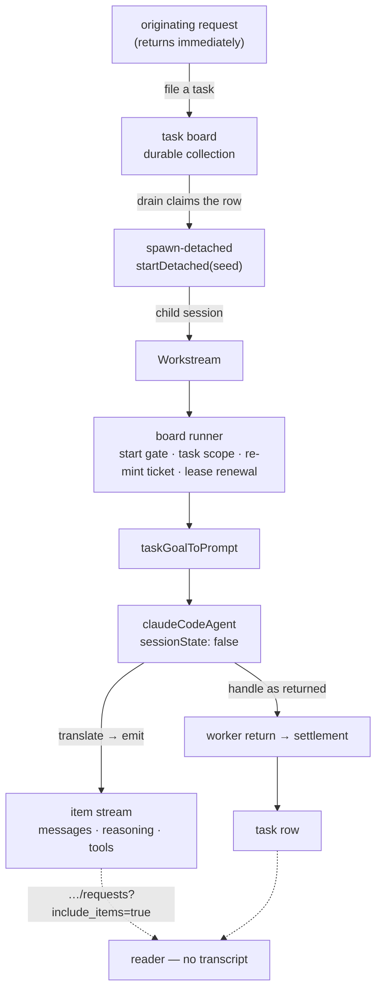

# LAB-133: Mirror a Claude Code run as an FSD workstream — Implementation Spec

## Part I — The Case *(for the human)*

### 1. Problem — why it matters, why now

When we hand a coding job to a Claude Code agent today, we get back one line: it worked, or
it didn't. Everything the agent did on the way — what it decided its job was, which files it
touched, where it got stuck, what it asked — is thrown away as it happens. Nobody can check a
run except by opening the transcript and reading it.

That is fine when a person is watching one run. It stops working the moment anything else has
to act on the result: route the next step, decide whether to retry, notice that the agent
asked a question and never got an answer, or grade whether the run did what it was asked.

**Why now.** This is the bottom of the epic. Every layer above it reads state this layer
produces — grading a run, filing what came back, deciding what happens next. Build those first
and they read nothing, which is precisely the sequencing mistake the epic exists to avoid. It
is also the easiest layer to skip, because a blocking call that returns a summary *looks* like
it works.

The kill line sits here too: if state alone can't say what a run did, nothing above it stands.

### 2. Solution in plain terms

Give a coding run its own place in the system instead of hiding it inside the request that
started it.

The originating request starts the run as a **workstream** — a child session dedicated to that
one job — and then returns. The run keeps going. As the agent works, its top-level messages
land in that workstream's stream, in order, as they happen. When the run ends, the ending is
recorded on the task it was started for. Asking "what did that run do?" then means reading FSD
state, not reading a transcript.

Almost all of this already exists and is unused. The agent block that turns a Claude Code run
into stream items has been in the repo since the harness work and nothing dispatches through
it. The task board already knows how to run a worker outside the request that claimed it. The
routes that list a session's background jobs and read one job's history already ship.

**So the work is the composition, one small removal, and one small correction.**

The removal: the agent block declares a slice of conversation state for itself, and the task
board refuses a detached worker that does that, by name, at construction. The block does not
need that state when it runs as background work — each job is one run — so the fix is to let it
**stop declaring it**, not to find the state a new home. A flag and a conditional.

The correction: a run that **failed on its own terms** and a run we **lost** need to end up in
different places — one finished and reported, one picked up again. Today the block signals both
the same way, so the board can't tell them apart. The fix is in how the block reports its ending,
not in the board: an agent-side failure is a *result*, a lost run is an *exception*. The board
already routes those two differently and correctly.

**On the question the issue asked us to answer rather than route around** — is a harness
dispatch a detached session or a job? **It is a false fork, and the repo already answers it:
the same call produces both, and which one you get is decided by the deployment's dispatcher.**
§7c carries the argument, the evidence, and the gap it leaves open; §12 carries what the epic
should take from it.

**Philosophy.** Tenet 3 (earn every addition) is doing most of the work here: three rounds of
review turned up a resume-handle home, a fenced write and a failure taxonomy, and **none of them
survived contact with "who reads this?"** — each is cut. Tenet 2 (composition over features) —
what remains composes four primitives that already exist. Tenet 7 (prove the goal) — the proof
is a real coding task read back from state with the transcript closed.

### 6. Decisions & rules — the sign-off surface

1. **The agent block gets an opt-out that stops it declaring conversation state, and detached
   runs use it.** Nothing else moves. Callers who don't set it are unaffected in every respect.
   *Rejected:* giving the state a new home — a caller-supplied place, or the task row via the
   runtime's own task verbs. Both were drafted and both were cut for the same reason: on this
   path **nothing reads the value back.** A background job is one run in one workstream, so the
   resume handle it would carry is never consulted. Building a home for a value nobody reads,
   and then a fence to protect writing it, is two mechanisms in service of nothing.
   *Locks in:* a detached run does not resume a prior Claude conversation — a second task
   addressed to the same workstream starts the agent fresh, while the workstream's own item
   history continues as normal. That is the right trade at one-run-per-job, and it is the same
   ground [FIX-1179](https://linear.app/fixpoint-labs/issue/FIX-1179) covers if it ever matters.

2. **A coding run has three endings, not two, and the board must tell them apart.**

   | What happened | Where the row ends up | How the block says so |
   |---|---|---|
   | The run **failed on its own terms** | **Terminally settled**, reporting why | **returns** an errored result |
   | We **lost** the run — shutdown, lease loss, cancellation | **Recoverable.** Another attempt may claim it | **throws** |
   | The run **succeeded** | Settled complete | returns |

   *Rejected:* letting a failed run fall through to the board's retry. Re-running a coding agent
   that has already written files and pushed commits is not a retry; it is a second,
   partly-informed, side-effecting attempt at a job whose state has already moved.
   *Locks in:* nothing above this layer gets free retries. Anything that wants a failed run
   tried again decides that deliberately — the behaviour we want, but work somebody does later.
   **And it locks in one board setting:** coding tasks must carry a retry allowance, or a lost
   run is written off instead of picked up (§7c). That is a line of configuration, not code, but
   it is load-bearing and easy to omit.

   **Two reviewers found this hole from opposite ends** — one that a killed run is written off,
   one that a failed run is re-run — which is the tell that the *wording* was doing too little
   work. Both are one defect: the block signals two outcomes where the decision needs three.
   Fixing it where the *signal* is made, rather than where it is interpreted, leaves the board
   untouched and extends a pattern that already ships — a terminal error subtype already returns
   an errored handle rather than throwing.

3. **We prove the mirror on the plain in-process deployment, and report durability as a
   deployment choice instead of building for it.**
   *Rejected:* standing up a Redis-backed queued deployment inside this issue so the goal check
   proves durability too.
   *Locks in:* the epic gets its answer on events architecture this week and pays for it with a
   known hole — we will have run this end to end without ever having survived a restart mid-run.
   If durability behaves differently in practice from what the topology matrix says, we find out
   one issue later than we could have.

**Non-goals** — sub-agent internals as their own workstreams (they already nest under a
container item). A failure taxonomy — §7d; the signals do not support one. Resuming a prior
Claude conversation on the detached path — decision 1. Anything the epic already excluded: an
event bus, `waitForEvent`, change signals, a Vercel or HarnessAgent abstraction. File writes and
todos — LAB-134. Grading the run — LAB-135.

**Size:** Small — 3 production files in one package · 8 test behaviours · 2 doc surfaces ·
1 PR. (Back to one package: review established the board cannot express the outcome decision 2
needs, and the block can — §7c.)

---

### 3. Tradeoffs & alternatives

**Alternative: dispatch a workstream without a task board.** Someone went looking to cut the
board and could not. `buildWorkstreamCore` assembles a core *only* from board-stamped bindings,
and `startDetached` refuses `no-workstream-core` without one — so board-free detachment is a
real framework change, not a shortcut we declined. Going through the board is therefore forced,
and it is also right: a coding job *is* a task, and the board brings the lease, the abandonment
counting and the dead-process recovery. **The lost-vs-failed complexity in §7c and §9 is forced
by that substrate too** — it is not something this design chose.

**The simpler approach: don't detach at all.** Run the agent inline and let its messages land in
the session that asked. Genuinely tempting — a fraction of the work, and the mirroring already
functions. Insufficient for two reasons. The originating request would have to stay open for the
whole run, minutes to an hour, which is the same black box with a longer timeout. And a stream
that exists only while one HTTP request is alive is not something a later block can attach to —
the property that makes real-time processing of a harness's output a next step rather than a
rewrite.

**Where the complexity is.** Not the mirroring; that already works and is not being rewritten.
It is the boundary between *the run failed* and *we lost the run*, and specifically the aborted
run — the case that looks like a failure and must be treated as a loss.

### 4. Focus practices (1–5)

1. **Tenet 3, applied to review feedback itself.** Three rounds proposed three mechanisms and
   each dissolved under "who reads this?". Ask it again of anything added during implementation
   before building it.
2. **Tenet 7 — a check that cannot fire is not a check**, and the abort path (§7c) is the live
   example. It is invisible to a test that only exercises clean success and clean failure, and
   *also* to one that stops at the block's rethrow while the board still fails the row. Assert
   past the recorder, and break it on purpose.
3. **BP-030 (tolerate the old shape)** — the opt-out defaults off and an unset caller keeps
   today's behaviour exactly, including that a mid-stream failure still throws.
4. **Tenet 5 (fix at the owning layer)** — the board refuses this for a real reason. Satisfy it
   by not declaring the state; do not route around it through the capability channel, which the
   board's walk cannot see (§8).

### 5. What using it looks like (1–5 examples)

**Declaring a coding run as detached work** *(what this spec proposes; today the board throws
at construction on the last line):*

```ts
const codingBoard = taskBoard({
  name: "coding",
  boardId: "coding",
  collection: codingTasks,            // a defineTaskCollection() — durable
  workers: {
    implement: { worker: codingRun, dispatch: { mode: "detached" } },
  },
});
```

**The worker — an adapter plus the block, with the opt-out set** *(§7e):*

```ts
// The board hands a worker { goal, taskId, … }; the agent block wants a prompt.
const codingRun = sequencer({ name: "coding-run" })
  .step(taskGoalToPrompt)                       // goal + context → { prompt }
  .step(claudeCodeAgent({ model: "…", sessionState: false }));
```

**Nothing changes for anyone else** *(before / after — the point is that there is no diff):*

```ts
// before and after, identical: the opt-out is absent, so today's behaviour
const chatAgent = claudeCodeAgent({ model: "…" });
```

**Reading the run back, with the transcript closed:**

```ts
// which background jobs did this conversation start, and how did they end?
GET /api/flows/sessions/:sessionId/workstreams
// → { workstreams: [{ id: "sess_…", topic: "LAB-129", status: "completed", … }] }
//   note the envelope — the rows are under `workstreams`, not at the top level

// what happened inside one of them — include_items is required; without it
// this returns summaries and cannot reconstruct the run
GET /api/flows/sessions/sess_…/requests?include_items=true
// → the run's top-level messages, tool calls and reasoning, in order
```

---

## Part II — The Build Plan *(for the implementing agent)*

### 7. Technical design



**Packages touched: `@flow-state-dev/claude-code` only.** `@flow-state-dev/orchestration` and
`@flow-state-dev/engine` are both untouched — the board, its recorders, the start gate, the
lease, `startDetached`, the workstream listing route and the per-session request history all
already do what this needs. (An earlier draft took a branch in the board's failure recorder;
§7c explains why that route cannot express the outcome and why the block is the right place.)
The composition and the prompt adapter live in the goal check; **export nothing for one caller.**

**(a) The blocker is a declaration, and the fix is to stop making it.** The board's refusal
requires only that a detached worker (and every block under it) not author a
`sessionStateSchema`. `claudeCodeAgent` authors one holding `sdkSessionId` and `sdkAgentRuns`. On
the detached path neither is wanted: a background job is one run in one workstream, so the resume
handle is never read back, and the run history it would accumulate is the item stream's job —
which is this layer's entire point. So the opt-out suppresses the declaration **and the reads and
writes that go with it**; a value written under an undeclared key is not a smaller version of the
same behaviour.

**And it must also stop the resume, which is a separate path.** Suppressing the schema and the
`ctx.session` access is not enough: the block still resolves its `sessionProvider` and forwards
whatever id comes back as the SDK's `resume` option. A caller supplying a provider whose
`resolve("")` returns a saved session therefore gets a **resumed** run while every declared-schema
assertion still passes. The default provider returns nothing for an empty key, which is exactly
why this hides — the obvious tests and the goal check would both stay green while a custom
provider silently breaks the one-run-per-job behaviour decision 1 locks in. That is a check aimed
at a neighbour of the claim (tenet 7). Disabled mode must **bypass provider resolution, or force
`resume` absent**, and the test for it inspects the **query options handed to the SDK**, not the
declared schema.

**The opt-out has to be a construction-time flag, and that is not a preference.** An earlier
draft had the block decide at runtime — ask whether it is running for a task, and declare state
or not accordingly. **It could not have worked.** `claudeCodeAgent()` attaches
`sessionStateSchema` while building its static handler definition, and
`assertDetachedBoardSupported()` inspects that definition and rejects the board *before any
`execute` callback ever receives a context*. There is no runtime moment early enough. Recorded
here so nobody re-proposes the branch.

**Two earlier drafts also proposed a new home for the handle** — a caller-supplied place, then
the runtime's own `parentTask()` / `settleParentTask()` verbs. Both are cut. Recorded so nobody
re-derives them: the runtime's verbs *are* a real fenced write, **and** they are terminal-only
with no mid-run patch verb; both readings argued in review are correct and neither matters,
because there is no value that needs writing. If a future issue does need mid-run continuity,
those verbs are where it belongs and `ParentTaskBinding` is declared-but-unconstructed — that is
the seam, and connecting it is not this issue's work.

**(b) Detached-vs-job, answered.** Locality is decided by `isInProcessDispatcher` over the
*effective* dispatcher, not by anything the caller writes
(`docs/architecture/detached-work.md`). No dispatcher, or one exposing `dispatchLocal` → the
child runs here and does not survive the process; `dispose()` drains it against
`detachedDrainTimeoutMs`, default **30 s**, a figure tuned to a serverless SIGTERM grace period
rather than to a coding run. A queue dispatcher (`colocated` / `dispatch-only`) → the same
dispatch is enqueued and survives. Both arms are already covered in
`packages/engine/test/flowstate/runtime-detached-start.test.ts` (~23 tests, both arms, including
the drain budget). So the substrate exists on both arms and the choice is a deployment one.
**The SLA that follows:** an in-process host raises `detachedDrainTimeoutMs` past its longest
expected run or accepts that any shutdown kills one; a queued host instead sizes its platform
kill timeout for the longest job, because a claimed job holds `Worker.close()` open with no
framework budget over it. What neither arm gives is **run resumption** — §12.

**(c) Decision 2 is satisfied by how the block *reports*, not by changing the board.**

The worker body is `.tap(recordSuccess).rescue([{ block: recordError }])`. A **return** routes to
`recordSuccess` → `complete()`; a **throw** routes to `recordError` → `fail()`. Those two routes
already land in the two places decision 2 wants, so nothing in the board changes — what has to
change is which route each ending takes:

| Ending | Block | Route | Row |
|---|---|---|---|
| Agent failed on its own terms | **returns** an errored handle | `recordSuccess` → `complete()` | terminally settled, reason in the task's output |
| Run was lost (abort, lease loss) | **rethrows** | `recordError` → `fail()` | recoverable |
| Succeeded | returns | `recordSuccess` → `complete()` | complete |

**Why not discriminate in the rescue recorder** (an earlier draft's answer, and it does not
work): `createRecordError`'s only error write is `TaskCollectionRef.fail()`, which **re-pends**
when the task has retry budget left. The transition options expose no force-terminal flag, and
`complete()` / `cancel()` record different outcomes — so the rescue path cannot express
"terminally settled with a reason." Forcing `fail()` terminal there would also disable configured
retries for every unrelated task-board worker. The recorder is shared; leave it alone.

**The one condition that has to hold, and it is a board setting, not code.** "Lost → recoverable"
is not free in every configuration. `routeFailure` consults `shouldRetryOnFail`, which returns
**false when `maxAttempts` is undefined** — the default — sending `fail()` straight to terminal
`errored`. So the three lost sub-cases differ:

- **Claim already displaced** (a successor took the lease): `fail(…, { ifAllowed: true, claim })`
  is fenced and declined, the row is untouched, and the successor owns it. Recoverable regardless
  of any setting.
- **Abort, claim still valid, retry budget remaining:** re-pends. Recoverable — and re-pending
  *is* the recovery, so no special handling is needed.
- **Abort, claim still valid, `maxAttempts` unset:** terminal `errored`. **Not recoverable** —
  the killed run is written off.

So the composition **must set a retry allowance on coding tasks**, and the goal check must too.
The abandonment discount (`attempts - abandonments`) means crash recovery does not spend that
budget, so it genuinely governs the abort path rather than being consumed by dead processes.
Note this is only safe *because* agent-side failures now return: with failures also throwing, a
retry allowance would re-run the agent over its own half-finished work — which is exactly the
harm decision 2 forbids. **The two halves of this section are load-bearing together and neither
works alone.**

If a task legitimately cannot carry a retry allowance, the honest move is to narrow decision 2's
first row for that case rather than pretend it holds — escalate rather than improvise.

**(d) What the ending records — the handle as returned, no vocabulary.** The SDK distinguishes
terminal subtypes and nothing else, and they do not carve at the joint a router would want:
`error_max_turns` and `error_max_budget_usd` are both *budget exhaustion*, neither
"underspecified" nor "can't be done". An agent can also return a **successful** terminal result
whose text explains it cannot proceed. So a four-value map would be lossy rather than
classifying. LAB-135 enumerates what it reads — the workstream's items, the resources, the todo
state — and a failure class is not among them. Ship the handle as it already is, carrying its
existing `resultSubtype` and errored verdict, and let LAB-135 define classes from real failures
rather than from guesses made before the first run.

**(e) The board's payload is not the block's input.** The drain hands every worker a
`TaskWorkerInput` (`goal`, `taskId`, …); `claudeCodeAgent` validates a required
`{ prompt: string }` *before* its prompt callback runs. Wiring the block in directly rejects
every detached task before the SDK is invoked. An explicit adapter from the task's goal and
context to the agent's prompt is required, and the goal check must cover it — this is the first
thing that breaks and it breaks silently early.

**Reference pointers** (read before building; none is a template to copy wholesale):

- `apps/kitchen-sink/flows/chat-agent/run/thinking-styles/pipelines/background-work.ts` — a
  shipped detached-work composition.
- `packages/integration-tests/src/scenarios/task-board-detached-{handoff,child-death,on-error,shared-key}.test.ts`
  — the four detached scenarios already characterized; `child-death` and `on-error` are where
  decision 2's boundary lives.
- `packages/orchestration/src/task-board/blocks/record-result.ts` — how a worker's return becomes
  a settlement.
- `packages/engine/test/workstream-listing-route.test.ts` — what the read surface actually
  returns, so the goal check asserts real shape.
- `goals/task-board/contains-a-worker-outcome-that-lands-on-a-settled-task/run.mts` — a goal
  already driving a real board over real stores; closest thing to a starting point.

> **Sketch — pseudocode. Illustrative, not the contract. React to the shape.**
>
> ```
> in the agent block:
>     declare conversation state ONLY when the opt-out is absent   ← the blocker
>     and skip the reads and writes that go with it when it is set
>
>     run …
>
>     if the context was aborted, or the failure is abort-like:
>         RETHROW → the board's failure route → recoverable    (§7c, decision 2)
>     if the agent failed on its own terms:
>         RETURN an errored handle → the board's success route → settled
>                                    terminally, with the reason on the row
>     otherwise RETURN — today's behaviour, unchanged
>
>     nothing in the board changes: those two routes already exist
>
> in the goal check's worker and board:
>     goal + context → { prompt }                                       (§7e)
>     tasks carry a retry allowance, or "lost" is written off, not retried (§7c)
> ```
>
> What this asks a reviewer: *is an opt-out the right shape, or should the block detect it is
> running as background work and decide for itself?* Detection needs no flag and cannot be
> forgotten; a flag is greppable and does not make behaviour depend on where a block is wired.
> This spec takes the flag.

### 8. Implementation sequence

1. **Pin the refusal's *accepting* half.** A characterization test that a board with
   `claudeCodeAgent` as a detached worker constructs cleanly **once the opt-out is set**. Red
   until step 2. The rejecting half is *not* re-pinned — `task-board-detached-config.test.ts`
   already covers that refusal with six tests, including one naming `sessionStateSchema`
   explicitly; re-asserting it here would characterize someone else's guarantee. *Depends on:*
   nothing.
2. **The opt-out** (§7a): suppress the declaration, the reads/writes that go with it, **and the
   resume** — bypass provider resolution or force `resume` absent.
   **It must be honoured in two places** — the block, and `createClaudeCodeAgentCapability`,
   which declares the same schema separately and forwards all agent options. Missing the second
   would let the capability re-contribute the schema through the exact channel the board's walk
   cannot see, which is the loophole practice 4 rules out — and it would *appear* to work.
   *Test:* with the opt-out set no schema is declared; absent, one still is. *Depends on:* 1.
3. **The three-way signal in the block** (§7c) — the step decision 2 rests on. An agent-side
   failure **returns** an errored handle; an abort or abort-like rejection **rethrows**. Nothing
   in the board changes. *Test:* all three rows of decision 2's table, asserted on the resulting
   task row. *Depends on:* 2.
4. **The retry allowance on the board's tasks** (§7c) — configuration, not code, and the half
   that makes the lost row actually recoverable. *Test:* a lost run with the allowance set is
   re-claimable; without it, it settles terminally (pin the condition so the requirement can't
   be silently dropped). *Depends on:* 3.
5. **The adapter and the composition** in the goal check (§7e): task goal/context → prompt, then
   the agent; return the handle so the board settles on it. *Depends on:* 2.
6. **The goal check** end to end — a real coding task, in-process, drain budget raised past the
   run (§9). *Depends on:* 4, 5.
7. **Docs** (§11).

**No removals in this issue** — but one note so a false justification is not carried forward:
`sdkAgentRuns` has **zero production readers** repo-wide (written in the block, read only by tests
and one docs example). Removing it is not this issue's job; do not claim it is load-bearing.

### 9. Edge cases & error handling

| Case | Expected |
|---|---|
| Run outlives the drain budget in-process | Cancelled at 30 s by default — and **cancel does not settle**. The row stays `in_progress`, the lease lapses, and decision 2's lost path re-dispatches from the prompt until abandonments exhaust: a cancel→abandon→retry storm, not a recorded failure. This is what "deployment choice" means concretely — size the drain or use a queue. The goal check **must** raise `detachedDrainTimeoutMs` past the expected run, with a comment saying this is the finding, not a workaround |
| Context aborted mid-run | Rethrow (§7c). With a retry allowance on the task the row re-pends and is re-claimed; if the claim was already displaced the write is declined at the fence and the successor owns it. **With no allowance set it settles terminally `errored`** — which is why the allowance is a stated requirement, not a nicety |
| Process dies mid-run | Lease lapses; the next claim hands the row back and advances `abandonments`; past the allowance it settles `errored`. The *lost* case, deliberately not an ending. Already covered by `lease-recovery.test.ts` and `collection/recovery.test.ts` — do not re-test it here |
| Second task on the same workstream | Starts the agent fresh — no prior Claude conversation is resumed (decision 1). The workstream's item history still continues |
| Agent asks a question and stops | Not a failure. A question is a top-level message, already in the stream. Verify it; don't handle it |
| Agent returns *success* whose text says it cannot proceed | Recorded as success. Reading intent out of prose is a later layer's job (§7d); guessing here would be worse than not guessing |
| Unrecognized terminal subtype | A failure, never a silent success — `isErroredSubtype` already treats it so |
| Sub-agent activity | Already nests under a container item via `ownedBy`. Top-level reconstruction filters on it. No change |
| A run producing no assistant text | A legitimate outcome, not an error. The handle's final message is already nullable |

**Taxonomy.** Everything the agent does is non-fatal to the request — the run settles its own row
and the workstream ends normally. Aborts are the exception and propagate (§7c). The only fatal
paths are construction-time: the board's refusal, which fires before anything runs, and a missing
request host.

### 10. Testing strategy

**Goal:** dispatch a real, small coding task, let the workstream run it to completion, then
reconstruct what it did **reading only FSD state** — the workstream row, its item stream (via
`include_items=true`), and the task's settled outcome — with the harness transcript never opened.
Pass when the reconstruction names the job the run was given and the shape of what it did, and
the task's ending is present. `goals/harness-workstream/<it>/run.mts`, real model, real path,
real stores.

*Anti-game:* must not read the SDK transcript, the working tree, or git. Must not assert on
whether the coding agent did a **good** job — that is LAB-135's question. A run that completes
with an empty item stream is a fail, not a pass.

**CI specs — eight behaviours.** The list is short on purpose: four further candidates were cut
because existing suites already cover them, and each cut is named so nobody re-adds it.

- **The board accepts the block once the opt-out is set** (§8 step 1).
- **The opt-out suppresses the declaration in both places** — block and capability (§8 step 2).
  The capability half is the one that fails silently if missed.
- **What must not change** (practice 3): with the opt-out absent, the schema is still declared.
  One assertion — cross-request resume is already `agent.spec.ts:205`/`:222` and those fail on
  regression today.
- **All three rows of decision 2's table** (practice 2, §7c), asserted **on the resulting task
  row, not on what the block did** — a test that only checks the block threw or returned proves
  the signal, not the outcome, and the outcome is the decision. Specifically: a lost run leaves
  the task **re-claimable**; an agent-side failure settles **terminally** with the reason on the
  row and starts **no new attempt even with retry allowance remaining**; a success settles
  complete. Break each on purpose.
- **The retry allowance is load-bearing** (§7c): with it unset, a lost run settles terminally
  rather than becoming re-claimable. Pin that, so the board-configuration requirement cannot be
  dropped later without a test going red.
- **The opt-out stops the resume** (§7a): with a `sessionProvider` that returns a saved id for an
  empty key, a disabled run must hand the SDK **no `resume`**. Assert on the **query options**,
  not on the declared schema — the schema assertion passes either way, which is why this hole
  exists.
- **A recorded ending settles the row and triggers no new attempt** (decision 2). The contrasting
  half — an abandoned claim being picked up by a later claim — is a comment, not a test:
  `lease-recovery.test.ts:63` and `collection/recovery.test.ts` cover it, and simulating a dead
  process with a manipulated lease clock is the most expensive test of the set.

*Cut, with the coverage that replaces them:* decision 3 has no behaviour of its own (it is a
deployment choice; `runtime-detached-start.test.ts` covers both topologies). The board *rejecting*
today's block is `task-board-detached-config.test.ts:155`. The abandonment path is above.
Cross-request resume is `agent.spec.ts`.

**Discipline:** `tdd`. The seams are the agent block's `execute` (vitest with the mock context and
a scripted fake `query`, as the existing sdk specs do) and the board's construction-time
assertion — both reachable without a server, so every behaviour above is a tracer bullet.
`packages/integration-tests/src/scenarios/task-board-detached-on-error.test.ts` is the closest
existing shape for asserting decision 2's rows on the resulting row.

**One thing that will otherwise cost a cycle:** the goal check needs a **runtime**, not a bare
`runAction`. The detached start operation is installed by `createFlowState`; a script that only
calls `runAction` has no request host and the first `startDetached` throws by name. One goal
already builds a runtime this way (`goals/personal-knowledge-mcp/…`).

### 11. Documentation plan

- **EXTEND** `apps/docs/docs/tools/claude-code-sdk.md` — two existing sections, no new page.
  Under **"Session continuity"**, that running the agent as background work turns the
  conversation state off, and what that means (each job is one run; the job's own history is the
  item stream). Under **"Error handling"**, that a failed run settles rather than retries and an
  interrupted one stays recoverable. One minimal example each. Cross-link →
  `apps/docs/docs/server/background-work.md`, ← from that page's "Related" list.
  *Voice risks:* no "seamless" or "first-class"; introduce **workstream** in plain terms on first
  use here (a tools-page reader may not have met it); no Linear ids under `apps/docs/`.
- **EXTEND** `packages/claude-code/README.md` — the "Session state" section covers the opt-out;
  the `/cli` vs `/sdk` table gains a row for background use. Terse; BP-009.
- **No new page, and no architecture-doc change.** `docs/architecture/detached-work.md` describes
  the topology this uses and nothing about that contract changes — §7b is a *reading* of it.

### 12. Dependencies, open questions & follow-ups

**Dependencies:** none blocking. LAB-134 and LAB-135 depend on this; neither is required by it.
`@anthropic-ai/claude-agent-sdk` is already an optional peer.

**Open questions:** none.

**Reported to the epic (LAB-68), not decided here:**

- **The events-architecture answer.** Detached and job are one call under two topologies, so no
  new substrate is needed for a run to survive a restart — only a queue dispatcher. The epic can
  keep event-bus / `waitForEvent` in "not doing" on the strength of this (§7b).
- **The gap that is real:** run resumption — [FIX-1179](https://linear.app/fixpoint-labs/issue/FIX-1179).
  Filed; do not re-file.
- **Board-free detachment.** `startDetached` is board-only by construction (`buildWorkstreamCore`
  assembles a core only from board-stamped bindings; `startDetached` refuses
  `no-workstream-core` without one). Right for a coding task; may not be for whatever L3 needs.
  FSD issue if and when.

**Follow-ups (flagged, not built):**

- **Framework gap, existing:** FIX-1070 — nothing renews a detached row's lease between hand-off
  and the child's first breath. Bounded per occurrence; can starve under sustained backlog.
- **Framework gap, surfaced here:** the board's error write cannot express "settle terminally with
  a reason" — `TaskCollectionRef.fail()` re-pends when retry budget remains and the transition
  options expose no force-terminal flag. This design routes around it (§7c) rather than widening
  a shared surface, but the next worker that needs a terminal failure *and* retries for lost work
  will hit it.
- **Framework seam, unconstructed:** `ParentTaskBinding` is declared and threaded but built
  nowhere, so `parentTask()` / `settleParentTask()` refuse by name. Not needed here (§7a); it is
  where mid-run task continuity belongs when something needs it. The coordinator is filing the
  related "no non-terminal fenced task write" gap — do not absorb either.
- **Dead surface:** `sdkAgentRuns` has zero production readers. A removal candidate for a later
  pass, not this one.
- **Deepening:** the `sessionStateSchema` refusal walks composed blocks but cannot see a
  capability's contribution — the same separate-channel problem `tools` has. Follow up via
  `improve-codebase-architecture`.
- **`@flow-state-dev/claude-code` has zero consumers** anywhere in the repo. After this it has one,
  in `goals/`. Whether it earns a kitchen-sink surface is a question for after LAB-135.

---

## Spec evolution *(the change story, not an audit log)*

- **Spec drafted** — framed as "give a coding run its own place in the system" rather than as a
  streaming feature; chose to compose the four existing primitives over building anything new;
  found that the board refuses the agent block as a detached worker because it declares session
  state, and made satisfying that refusal the first build step; answered detached-vs-job from the
  architecture doc and the engine's existing tests rather than leaving it open.
- **After spec review** — the issue got substantially **smaller**, and the same question did it
  each time: *who reads this?* Review first proposed giving the agent's resume handle a
  caller-supplied home, then the runtime's fenced task verbs, and then a fence to protect the
  write — until a restraint pass established that on this path **nothing ever reads the handle
  back.** All three were cut for a plain opt-out that stops the block declaring the state at all,
  which drops the framework wiring the second draft had taken on and returns the change to one
  package. The failure taxonomy went the same way: cut to the handle the SDK already returns,
  because `error_max_turns` and `error_max_budget_usd` are both budget exhaustion and the
  four-value map was lossy rather than classifying. Four of nine planned test behaviours were
  dropped against existing coverage.
- **After spec review, decision 2 was found false in both directions** — a run we *lost* was
  settled as failed and never re-claimed, and a run that *failed on its own terms* was re-pended
  and re-run over its own half-finished work. Two reviewers found one end each, which said the
  wording was doing too little work, not just the mechanism. It is now an explicit three-row
  table. The fix moved twice before landing: first into a discrimination in the board's rescue
  recorder, then out again once that path turned out to be unable to express "terminally settled
  with a reason" at all — its only error write re-pends when retry budget remains, and forcing it
  terminal would disable configured retries for every unrelated worker. **The block reports the
  difference instead** — an agent-side failure *returns*, a lost run *throws* — which the board's
  two existing routes already handle correctly, so orchestration is untouched and the change is
  back to one package. One condition rides with it: coding tasks must carry a retry allowance, or
  a lost run settles terminally rather than becoming re-claimable.
- **Three smaller corrections from the same review** — the opt-out must also stop the SDK
  **resume**, or a custom session provider silently keeps resuming while every schema assertion
  passes; a task-goal-to-prompt adapter was missing, without which every detached task is rejected
  before the SDK is invoked; and the opt-out was confirmed to require a construction-time flag,
  since the board inspects the block's static definition before any context exists — the runtime
  branch an earlier draft proposed could not have worked.
