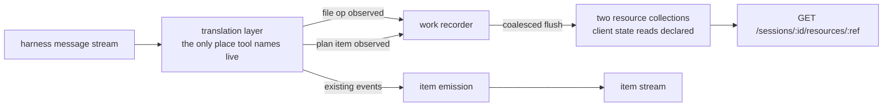

# LAB-134: Graph a coding agent's file writes and todos into FSD state — Implementation Spec

## Part I — The Case *(for the human)*

### 1. Problem — why it matters, why now

When we hand a coding job to an agent, we can now watch it talk. We cannot see what it *did*.
The two things that best describe a coding run — which files it changed, and what it decided
its job was — are thrown away as they happen. They exist only inside the harness's own
transcript, which nothing but a person can read.

So today, answering "did this run touch something it shouldn't have?" or "did it quietly
decide to do four things when we asked for one?" means opening the transcript and reading it.
That works while one person watches one run. It stops the moment anything else has to act on
the answer.

**Why now.** The mirror shipped: a run's messages land in our system as they happen. Every
layer above this one — grading a run, filing what came back, deciding what happens next —
reads state this layer produces. Built in the other order they read nothing. And the todo half
is the first real test of the epic's claim, because a to-do list containing work nobody asked
for is exactly the signal a knowledge layer is supposed to catch.

### 2. Solution in plain terms

Two things the run produces get recorded as ordinary state, alongside the messages we already
keep.

**The file operations we saw it perform.** Every time the run uses its file-writing or
file-editing tool, we record an entry keyed by the file's path: how it was touched, when, and
whether it worked. Not the contents.

**What it thought its job was.** The run's own to-do list becomes readable progress: one row
per item, carrying the item's wording and its current and previous status. These rows go in
their own place, **not** onto the board that gave the run its work. So we can see that the
agent decided to do five things and compare that against the one thing we asked for, while
nothing starts executing those five. Adopting one is a separate, deliberate act, which is the
whole point of being able to see it.

**What this record is, precisely — and what it is not.** It is a log of **file operations we
observed the agent's file tools perform**. It is *not* an authoritative index of everything
that changed on disk. A run that edits a file through its shell — a `sed -i`, a redirect, a
`mv`, a formatter, `git apply` — performs no file-tool call, so nothing is recorded and the
file does not appear. Reconciling against the filesystem to close that gap is a different
feature and is deliberately out of scope. The claim this ships is the narrower one, and §6
decision 2 states it in those words so nobody reads the wider one into it later.

**On the epic's kill line.** The issue asks whether this can only be expressed as a
Claude-specific shim. It cannot. The vendor-specific part is a small table mapping tool names
to two events. Everything below it is existing FSD vocabulary — resource collections, read over
the resource route that already ships. Nothing new is added to the framework. And the edge
turned out to be *load-bearing today* rather than defensive: the harness changed its own
to-do tooling between versions, and the type declarations we depend on still describe the old
one (§7's POC).

**Philosophy** — tenet 2 (composition over features): both halves are instances of the
resource-collection primitive that already exists; no new concept, no new route, no new store.
Tenet 4 (the framework absorbs infrastructure, not knowledge): tool names live in the vendor
adapter, and the framework side never learns the word "Claude". Tenet 3 (earn every addition):
the public surface grows by exactly one option, off by default.

### 6. Decisions & rules — the sign-off surface

1. **A run's to-do list is recorded where nothing will execute it.** The observed items go in
   their own list, separate from the work queue that dispatched the run. *Alternative
   rejected:* writing them straight onto that queue, which reads as "the agent's plan is now
   our plan". *Locks in:* an agent that decides mid-run to do five more things cannot start
   five more jobs by writing a to-do list — a human or a later step has to pick one up on
   purpose. The cost is one extra step whenever we do want to adopt one.

2. **We record the file operations we observed, not everything that changed — and never the
   contents.** Paths, how each was touched, when, and whether it succeeded, for the agent's
   file-writing and file-editing tools only. Work done through the shell is invisible to this
   record and stays invisible. *Alternative rejected:* reconciling against the working tree so
   the record is authoritative, and keeping the written content, which the harness does hand us
   for free. *Locks in:* two things. Anyone asking "what did this run change?" gets a reliable
   answer about tool-driven edits and **no answer at all** about shell-driven ones, so the
   record must never be described as complete. And our store holds an index pointing at the
   working tree rather than a second copy of the customer's source, with the storage growth and
   disclosure question that copy would bring.

3. **We keep where each to-do item is now and where it was, not how it got there — and we prove
   it at that same depth.** A plan row carries its wording, its current status and its previous
   one. No history log, and the goal check grades the plan half on wording and status rather
   than on a sequence. *Alternative rejected:* keeping the full transition history, which would
   let someone replay how an agent's plan evolved. *Locks in:* we can answer "what did it plan,
   and did that item move?" and cannot answer "what order did it change its mind in" — and our
   proof stays red for our own bugs rather than going red every time the vendor renames
   something. Reversible: adding history later is additive, and nothing depends on its absence.

**Also decided, and not on this surface:** watching the work must never break the work. Anything
the recorder cannot handle is skipped and left visible as a gap; it never fails the run. Nobody
would overrule that, so it is a rule in §9 rather than a fourth Decision — but it is *why* §10
grades "recorded nothing" as a failure, and that consequence is real.

**Size:** Medium — ~6 production files · 1 goal check extended · ~14 test behaviours · 2 doc
surfaces · 1 PR. *(Up from ~5 and ~12: review established that the capability must declare the
collections itself rather than inheriting them, which is a real sixth step with its own test.)*

---

### 3. Tradeoffs & alternatives

**Alternative: return it on the run's result instead of writing state.** The run already hands
back a summary object; paths and to-do items could ride on it. Rejected because a background
job's result goes nowhere — conversation state is deliberately off for detached runs, so the
summary is returned into a void. The proof this issue owes is *readable afterwards, from
state*, and a return value is not that.

**The simpler approach: record only the files, drop the to-do half.** Genuinely tempting — the
file half has the stable surface and most of the immediate value. Insufficient because the
to-do half is the only part that tests the epic's actual claim. Files say what happened; the
to-do list is the only place the agent says what it *thought it was doing*. Dropping it defers
the risk rather than retiring it.

**Where the complexity is:** not the recording. It is that the harness's to-do surface is
unstable, optional, and partly undocumented. The tool the issue names does not exist on the
version we run; the tool that does exist is one a run may simply decline to use — measured at
roughly half of real runs, including one explicitly instructed to use it. §10 is mostly about
how a check stays honest when the thing it measures is optional.

### 4. Focus practices (1–5)

1. **Scope every claim to exactly what was measured** (tenet 7). Not just "verify by running" —
   this spec's POC ran a real job and still stated a conclusion about "tool results" having
   measured one of the two fields that carry them. A claim wider than its evidence fails the
   same way an unrun claim does.
2. **Every assertion proved able to fail** (tenet 7). The failure mode here is a recorder that
   records nothing while every test passes, because a scripted fixture fires a tool the real
   harness never sends. Each check gets broken on purpose and observed red before it counts.
3. **BP-030 (tolerate the old shape).** The recorder meets tool shapes it has never seen, by
   construction. Unknown shapes read as "nothing to record", never as an error.
4. **BP-006 (no tracking labels in code or tests).** Names describe behaviour; fixture ids are
   invented, never real tracker ids.
5. **One convergence point for the vendor mapping** (tenet 5). Every tool name this change
   understands is named in one place. A second site that also knows what `Edit` means is how
   the next harness change breaks half the recording and passes the tests for the other half.

### 5. What using it looks like (1–5 examples)

**Turning it on** *(what this spec proposes; today the option does not exist)*:

```ts
claudeCodeAgent({
  sessionState: false,   // detached background work, as today
  recordWork: true,      // new: record observed file operations and the run's plan
})
```

**Reading back what a finished run did**, over the resource route that already ships. Both
collections declare client state reads, which is what makes these calls 200 rather than 403 —
and each row's payload is on **`clientData`**, not `state`:

```
GET /sessions/<workstreamId>/resources/observed-file-ops

{ "items": [
  { "topic": "<runId>/repo/src/checkout.ts",
    "storageKey": "observed-file-ops/<runId>/repo/src/checkout.ts",
    "clientData": { "lastKind": "edited", "outcome": "applied",
                    "lastTouchedAt": 1787021400123 } }
] }
```

```
GET /sessions/<workstreamId>/resources/observed-plan

{ "items": [
  { "topic": "<runId>/3",
    "storageKey": "observed-plan/<runId>/3",
    "clientData": { "title": "Create the file", "status": "completed",
                    "previousStatus": "in_progress", "lastOutcome": "applied" } }
] }
```

**`clientData`, and it is a projection.** `handleListCollectionState` builds each row as
`{ topic, storageKey, clientData: await applyClientData(config, state) }` — there is no `state`
key on the row. Reading `state` returns `undefined` after a perfectly valid 200, which is the
same shape as the `seq`/`itemIndex` class of bug: a check reading a field the payload never
carries reports "no data" rather than failing. Because `clientData` is a projection, whatever
the collection's client config exposes is what a reader can see — so the fields §10 asserts on
must be in that exposed set, and §10 tests the read rather than assuming it.

**What stays true (before / after):**

```
before  claudeCodeAgent({...})                   → messages, reasoning, tool calls
after   claudeCodeAgent({...})                   → identical; records nothing, declares nothing
after   claudeCodeAgent({..., recordWork: true}) → the same items, plus the two lists above
```

---

## Part II — The Build Plan *(for the implementing agent)*

### 7. Technical design

The vendor edge already exists and is already pure: the translation layer turns harness
messages into a small union of framework-vocabulary events, and a separate layer performs the
side effects. This change adds two event kinds to that union and one consumer for them.



**Ownership is settled, not open.** The translation layer owns the tool-name table *and* the
call/result correlation; the recorder consumes only framework-vocabulary events and contains no
tool names. That keeps the recorder unit-testable with scripted events and gives the vendor
mapping one convergence point.

**How the recorder is fed — two shapes, and why the second wins on precedent, not taste.**
A reviewer's objection is worth answering here rather than in code: the existing
`tool_call` / `tool_result` events already carry a name, arguments and an outcome, so new event
kinds may be surface we do not need.

```
Shape A — the recorder consumes the EXISTING tool_call / tool_result events.
    no new union members, no new branches anywhere
    BUT the recorder must match "Write" / "Edit" / "TaskCreate" itself
    → the vendor names are now in two places, which is the one thing
      the seam above exists to prevent

Shape B — translation emits two new framework-vocabulary kinds.
    the tool names stay in exactly one place
    the recorder reads "a file op happened" / "a plan item moved"
    COST: emit's exhaustive switch gains two arms that emit nothing
```

**Shape B.** The cost Shape A avoids is smaller than it looks, and the codebase already
answers it: `emit.ts` carries a `result` kind whose entire body is a comment and a `return`,
because that event "mutates the handle, not the stream". An event kind that carries data to a
non-stream consumer is therefore the **established** pattern here, not a new one — two more
arms of that shape cost two lines and introduce nothing. Shape A's cost, by contrast, is
structural and permanent: a second site that knows what `Edit` means is exactly how the next
harness rename breaks half the recording while the tests for the other half stay green.

*(A middle shape — annotating the existing `tool_call` with a framework-vocabulary field —
keeps the seam and adds no union members, but gives one event two meanings and leaves a plan
*update* with no natural home. Rejected as the more confusing of the two cheap options, not as
unworkable.)*

- **`@flow-state-dev/claude-code`** — translation gains the table and correlation state; a
  recorder module owns the writes; the agent block gains one option and, when set, declares the
  two collections. Note the current block API is a flat `resources` map keyed by accessor name,
  with scope carried on the collection — `sessionResources` is legacy (`blocks/handler.ts`).
- **`@flow-state-dev/core`**, **`@flow-state-dev/engine`** — untouched.
- **`@flow-state-dev/orchestration`** — deliberately **not** a dependency.

**Where the data actually is — measured, and narrower than it first looked.** A `user` message
carries two different things and they must not be conflated:

- `message.content[].tool_result.content` is the **prose string sent to the model**.
- `tool_use_result` on the message is the **full structured Output object**, typed per tool.

For the file tools this was measured directly: `tool_use_result` is present and carries
`FileWriteOutput` / `FileEditOutput` in full — `type` (`create`/`update`), `filePath`,
`structuredPatch`. **Read the record from there**, falling back to the tool input's `file_path`
when it is absent. For the **plan** tools this is *unmeasured* — see §12. Check the typed field
first (`TaskCreateOutput.task.id`) and fall back to recovering the id from the result prose;
build the fallback either way, since a run that yields no id must degrade rather than throw (§9).

**The shipped table starts at `Write` and `Edit` only.** Those are the two measured. The POC
deliberately watches a wider set (`NotebookEdit`, `MultiEdit`) so a tool we do not handle shows
up as a *measurement* rather than as a silent gap — that asymmetry is intentional, not drift.
Add a name to the shipped table when a run is observed using it; until then the table would be
claiming coverage nothing has exercised, which is the failure mode §12's settled claims exist to
prevent.

**The capability cannot inherit the declarations, and the failure is a 404 at read time.**
This was checked in the code after two readings disagreed, and the earlier one in this spec was
wrong. `createClaudeCodeAgentCapability` contributes the agent block through
`presets.tools`, and three things line up against that:

- `mergeSurfaceInto` merges `surface.resources` into the accumulated capability surface and
  **never reads `surface.tools` for resources** — tools are merged as tools, generator-only.
- `collectBlockResources` gathers `declaredResources` from **action blocks**, and a tool block
  is not one.
- `defineFlow`'s own comment settles it: *"A generator is a leaf that bubbles none of its tools'
  rails **by design**."*

So a capability whose only contribution is a resource-declaring block in its `tools` preset
contributes **no resource declarations at all**. The flow never registers the refs,
`findResourceConfig` misses, and the route answers **404** — at read time, on a build that
succeeded. *(The earlier conclusion here read `blocks/handler.ts`'s true statement that `uses`
merges a capability's resources into the consuming block's config, and applied it to a case it
does not cover: resources the capability declares **itself**, versus resources declared by a
block inside its `tools`. Same failure shape as the `tool_use_result` correction — a true
sentence carried past its scope.)*

This is the mirror of the asymmetry `capability.ts` already documents for `sessionStateSchema`,
where a capability contributes through a channel the task board's walk cannot see. Here the
capability's tools contribute through a channel the flow's collector cannot see. Both directions
of that seam now have a note.

**Why the plan is a resource collection and not a task collection.** Our `Task` carries an
execution contract — attempts, lease, claimant, retry budget. Nothing on our side ever claims,
leases, or settles an observed to-do, so writing one as a `Task` populates that envelope with
defaults nobody honours and leaves rows that look claimable and are not. It would also invert
the package layering. The observed shape is deliberately *smaller* than a task.

**State shapes are deliberately flat — no accumulating history.** A file entry carries
`lastKind`, `lastTouchedAt`, and an **`outcome`**. A plan entry carries `title`, `status`,
`previousStatus`, `lastTouchedAt`, and a **`lastOutcome`**.

**Neither outcome field is a boolean, and that is forced by two cases a boolean cannot hold.**
Because a mutation is recorded when the call is *seen* and settled when its result arrives, a
record can legitimately be in flight — and `ok: false` would report a pending write as a failed
one, while waiting for settlement would lose exactly the killed-run attempts this design exists
to capture. Separately, a plan update the harness *rejects* has to be recordable without
applying its status: leaving `status`/`previousStatus` untouched records nothing, and moving
either falsifies what the harness actually holds. One three-valued field answers both —
**`pending` · `applied` · `failed`** — so a rejected update lands as `lastOutcome: "failed"`
with the statuses left as the harness has them, and an unsettled write is visibly unsettled
rather than quietly wrong. There is **no transition array and no cap policy**: the sibling file entry
already declined a per-touch log in favour of scalars, no resource-collection state schema in
the repo carries a growing-history shape, and it is the one field that would grow with a run's
length. Dropping the array removes the cap sub-problem entirely — do not leave cap machinery
orphaned around a scalar.

**Both collections must declare client state reads.** `defineResourceCollection` keeps a
collection invisible to clients by default, and the list-collection-state route returns **403**
unless `client.state.read === true` (`engine/src/routes/resource-routes.ts`). Without the
declaration on **both**, §5's reads 403 and §10 cannot pass. This is a deliverable, with a test
that the permission holds.

**Records are namespaced per run.** The board reuses an existing workstream session for the same
board / worker / topic, so session-scoped collections would otherwise keep the previous run's
rows: a second run would merge its file entries by path with the first run's and mix its plan
items in, and the route would answer "what has this workstream ever done" instead of "what did
this run do". **Key every entry under the run's own identity** (the request id is the natural
handle) rather than resetting, so a workstream's history stays inspectable per run.

**Write cadence — neither per-event nor once at the end.** Per-result upserts stack a
read-modify-write and a persist on top of the per-message emission awaits, and item persistence
is already quadratic on long runs (FIX-1180); a coding run is exactly that shape. But flushing
only at run end loses everything if the process is cancelled or killed after a file was written
— and a run that did not finish is precisely the one whose file record matters most, since
settlement is out of scope (FIX-1182). So: **record a mutation as attempted when the call is
seen, settle it when the result arrives, and flush on a coalesced interval.** Both constraints
belong in the implementation's comments; either one alone produces the wrong design.

> **Sketch — pseudocode. Illustrative, not the contract. React to the shape.**
>
> ```
> in the translation layer (the only place tool names appear):
>
>     on a tool call:
>         file-mutation table  → remember (call id → path, kind); emit "attempted"
>         plan table           → remember (call id → wording, intent)
>
>     on that call's result:
>         result says it failed → emit the outcome as FAILED, never as applied
>         file mutation         → prefer the structured output's path; else the input's
>         plan create           → id from the typed field if present, else from the prose
>         plan update           → id was on the input
>         nothing recoverable   → emit nothing                        (never throw, §9)
>
> in the work recorder (framework vocabulary only, no tool names):
>
>     file op    → upsert under (run id, canonical path), set kind/when/ok
>     plan item  → upsert under (run id, item id), moving status → previousStatus
>     anything that throws → swallow, surface as a status note, keep going
>     flush on a coalesced interval, and once more at the end
> ```
>
> What this asks a reviewer: *is "attempted at the call, settled at the result" the right shape,
> or should an unsettled attempt not be written at all?* The first keeps a killed run's record;
> the second keeps the record free of operations that may never have happened.

**POC — `spec-poc/LAB-134-harness-graph-surface/`**, on this branch, never merges.
Run: `node spec-poc/LAB-134-harness-graph-surface/probe.mjs`. Four real runs on `claude`
2.1.234 — the CLI version `@anthropic-ai/claude-agent-sdk@0.3.234` pins, so this is the binary
the SDK spawns. **What it showed:** file mutations arrive as `Write`/`Edit` tool calls with
`file_path` on the input (premise held); the to-do surface is **`TaskCreate`/`TaskUpdate`, not
the `TodoWrite` the issue names — which the shipped binary does not offer at all**, though its
own `.d.ts` still declares it; ids are not positional across runs; the structured Output *is* on
the wire for file tools, on a field the first probe never read; and **a run may simply decline
to keep a to-do list**, observed in two of four runs including one explicitly instructed to.
The last two findings each changed a section.

### 8. Implementation sequence

1. **The tool-name table and the two events**, in translation, with correlation state. Nothing
   writes yet. *Test:* both real shapes scripted — a `Write`/`Edit` pair, a
   `TaskCreate`→result→`TaskUpdate` sequence — plus an unrecognised tool, a create with no
   recoverable id, a **rejected update** (`is_error`), and a failed mutation. *Depends on:*
   nothing.
2. **The work recorder.** Consumes only the two events; no tool names. Owns run-scoped keying,
   path canonicalization, and the coalesced flush. *Test:* upsert behaviours, `previousStatus`
   movement, that a throwing collection write does not propagate, and that two runs in one
   workstream do not merge. *Depends on:* 1.
3. **The block option and its two collection declarations, including `client.state.read`.** Off
   by default. *Test:* off is byte-identical to today and declares no resources; on declares
   both, and the route returns 200 with the expected fields on `clientData` rather than 403.
   *Depends on:* 2.
4. **The capability declares the two collections itself.** Forwarding the option is *not*
   sufficient — see below. `createClaudeCodeAgentCapability` must put the collections in its
   own `resources`, not rely on the agent block sitting in its `tools` preset. *Test:* a flow
   built through the capability resolves both refs and the route returns 200 — a test that
   fails without the declaration, since the symptom is a 404 rather than an error at build
   time. *Depends on:* 3.
5. **Extend the existing goal check** (§10). *Depends on:* 4.
6. **Docs and changeset** (§11). *Depends on:* 3.

No removals — this adds a consumer to an existing union.

### 9. Edge cases & error handling

| Case | Expected |
|---|---|
| A file changed through the shell (`sed -i`, redirect, `mv`, formatter, `git apply`) | Not recorded, by design. Decision 2; never closed by reading the filesystem |
| Path that cannot be keyed (traversal segments, control characters) | Skip the entry, note it, continue — the key normalizer throws and that must not reach the run |
| Same file as `/workspace/repo/src/a.ts` and `src/a.ts` | One entry. Canonicalize against the run's working directory before keying; the key normalizer alone only strips leading slashes |
| A `TaskUpdate` whose result is an error | Recorded as a failed attempt, **never as applied** — writing the requested status for a transition the harness refused is the worst available outcome |
| A to-do tool we do not recognise | Record nothing. The run is unaffected; §10 grades the empty result |
| `TaskCreate` with no recoverable id | Record nothing for that item; later updates naming it also record nothing |
| A file mutation that failed | Recorded with `ok: false` — absence would be indistinguishable from "never attempted" |
| A run killed mid-flight | Attempts recorded at call time survive the last coalesced flush; unsettled entries keep their attempted state |
| Second run in the same workstream | Separate entries — records are keyed per run |
| The option is off | No resources declared, no writes, no events consumed |

**The rule the whole table is an instance of: watching the work must never break the work.**
Every recording failure is non-fatal and degrades to a missing or attempted-state entry. There
is no fatal path in this change. Failing loudly is the usual right answer and is wrong here — a
coding run that has already written files and pushed commits must not be killed by our
bookkeeping. This is the property most worth a test that has been watched to fail, and it is
also what makes §10's "recorded nothing is a failure" load-bearing: a recorder that swallows
everything looks exactly like a run that did nothing, so the check has to be the thing that
tells them apart.

**Second path (BP-035):** the option's off state; the detached path (where this actually runs);
the recorder's failure branch; and the second-run-in-one-workstream path.

### 10. Testing strategy

**Goal:** after a real coding run dispatched into a workstream, the file operations it performed
and the plan it kept are both readable from FSD state alone — no transcript, no working tree, no
git.

**Extend the existing harness rather than standing up a second one.**
`goals/harness-workstream/mirrors-a-coding-run-as-workstream-items/` already has SQLite, a real
`serve()` host, real detached dispatch and `sessionState: false`; adding resource-route readback
to that shape is far less surface than a parallel runner. Keep the **store adapter named
deliberately** for the same reason it is named there: the workstream is a different session from
the dispatcher, so the readback must cross a real persistence boundary, and an in-process store
can make that succeed on shared memory while proving nothing.

**Graded at two different depths, deliberately.** The file half is graded hard — its surface is
POC-confirmed and stable. The plan half is graded at **wording and status** (decision 3), not on
a sequence of transitions, so the check goes red for our bugs rather than every time the vendor
adjusts a field.

**What it asserts:**
- the file-ops list names the held-out files with the kinds the job implies
- the plan list carries the held-out number of distinct items, keyed by the harness's own ids,
  each with its wording and a status, and at least one whose `previousStatus` differs from its
  `status`
- **the dispatching board's task collection still holds exactly the one row that was filed** —
  the run's to-dos did not become queued work (decision 1, and the assertion that matters most)
- both reads return 200, not 403 — the client-visibility declaration is under test, not assumed
- a second run in the same workstream does not merge with the first

**An empty file list is a FAIL.** Every run writes files, so nothing legitimate produces an
empty one — and since the recorder never throws (§9), a recorder that silently skips everything
looks exactly like a run that did nothing. Grading it as anything but a failure designs that
blindness in.

**An empty plan list is a FAIL *or* INCONCLUSIVE, and the check must say which.** The plan
surface is optional at the source: two of four measured runs used no plan tools, **including one
whose job explicitly requested a two-item plan and whose steps were dependent** (write a file,
then edit that same file). Shaping the job harder is not a remedy — it is the thing that was
already tried and already failed. So the two causes of an empty list need opposite verdicts, and
they are distinguishable from FSD state alone: the run's own item stream carries a `tool_output`
item for every tool call it made, including the plan tools.

| Plan tools invoked? | Plan rows present? | Verdict |
|---|---|---|
| yes | yes | **PASS** |
| yes | no | **FAIL** — the tools fired and we recorded nothing; our bug |
| no | — | **INCONCLUSIVE** — the run never planned; nothing was measured |

Reading our own item stream is not the anti-game: the prohibition is on the *harness transcript*,
and the item stream is state this epic shipped.

**Why a third verdict rather than a hard fail.** A check that cannot see what it claims to
measure must say so rather than answer — the rule this epic has applied everywhere else. Here
both answers would be blind: green would claim a recorder works on evidence that never existed,
and red would blame the recorder for a choice the model made. The honest output is neither.

**Two constraints on the arm, because an inconclusive verdict is the one that rots.**
INCONCLUSIVE **must name why it fired** — "the run invoked no plan tools", never a bare
"inconclusive" — so it can never be confused with the FAIL above it. And it **must not count as a
pass**: it is not a green run, it is an unmeasured one, and the goal's verdict log records the arm
each run took so a drift toward never measuring the plan half is visible rather than comfortable.
If the arm starts firing most runs, that is a finding about the harness, which is worth knowing.

**Anti-game:** must not read the working tree, the file the run wrote, git, or the harness
transcript. Must not grade whether the run did a *good* job — that is LAB-135. Must not assert on
**how the run was settled** — the row's status, retries, whether a lost run stayed recoverable.
Settlement is out of scope by design (FIX-1182); this board takes the task board's defaults, which
means a lost run is written off. A stated gap, not something this goal should grow to cover.

**Every assertion proved able to fail.** Before the check counts, each is broken on purpose,
observed red, and reverted — recorded in the goal's verdict log, along with the arm each run
took (PASS / FAIL / INCONCLUSIVE) and, for a failure, which of the two empty causes it named.

**CI specs** (behaviours, not test names):
- one behaviour per decision in §6, in observable terms
- both real tool shapes scripted, including id recovery from the typed field *and* from prose
- a rejected `TaskUpdate` records a failed attempt, never the requested status
- unknown-tool and unrecoverable-id paths record nothing and raise nothing
- the option's off state is byte-identical to today
- a collection write that throws does not fail the run
- two runs in one workstream stay separate

**Discipline:** `tdd`. The seam is translation plus the recorder, both reachable from a vitest
spec with the mock context and scripted messages.

### 11. Documentation plan

- **EXTEND** `apps/docs/docs/tools/claude-code-sdk.md` — a new section after the session-state
  note: what gets recorded when the option is on, where to read it back, **that the record covers
  tool-driven file operations only and not shell-driven ones**, and that contents are not kept.
  One minimal example (§5's read-back). Cross-link → `apps/docs/docs/resources/collections.md`,
  ← from `apps/docs/docs/server/background-work.md`.
  *Voice risks:* no tracking ids in published prose (BP-006); avoid "seamless"/"powerful";
  introduce "resource collection" in plain terms on first use. The scope limit must read as a
  plain statement of what the feature does, not as an apology.
- **EXTEND** `packages/claude-code/README.md` — the option in the options table, plus one line on
  the two collections it declares.
- **No new page.**
- **Changeset** (BP-022): user-facing, `minor`.

### 12. Dependencies, open questions & follow-ups

**Dependencies.** **LAB-133 (PR #1327, branch `fix/LAB-133`) — not merged.** This spec's branch
is cut from `fix/LAB-133`, not `main`, and the implementation branch must be too. Nothing in this
epic merges until sign-off. LAB-133 supplies the workstream, the item stream, and the goal harness
§10 extends.

**Open questions:** none for the owner.

**Unmeasured — the implementer must settle this before building the plan half.** Whether the plan
tools carry a structured `tool_use_result` (giving `TaskCreateOutput.task.id` as a typed field) or
only the prose result. Four probe runs measured it for the **file** tools only; the two runs that
did keep a to-do list predate the field being logged, and the two runs that logged it kept no
to-do list. Settle it by re-running the POC until a run exercises the plan tools. It changes
implementation cost, not direction — the fallback is built either way — which is why it is here
rather than in the sign-off surface.

**Settled claims** — each scoped to exactly what was run:
- **Settled:** the to-do list arrives as `TodoWrite` — **REFUTED.** The shipped CLI (2.1.234, the
  version the SDK pins) does not offer `TodoWrite` at all; the surface is `TaskCreate` /
  `TaskUpdate`. Measured twice.
- **Settled:** file mutations arrive as `Write` / `Edit` calls carrying `file_path` on the input,
  at the seam translation already sees — **CONFIRMED.** Measured four times.
- **Settled:** for the **file tools**, `tool_use_result` carries the full declared structured
  Output (`type`, `filePath`, `structuredPatch`) — **CONFIRMED.** Measured twice. *This corrects
  an earlier, over-broad claim in this spec that "tool results are prose": the prose is the
  content block sent to the model; the structured Output is a sibling field the first probe never
  read.* Not measured for the plan tools — see above.
- **Settled:** a coding run always keeps a to-do list — **REFUTED.** Two of four runs kept none,
  including one whose job explicitly requested a plan and whose steps were dependent. Shaping the
  job is therefore not a remedy, and §10 carries an INCONCLUSIVE arm instead.

**Follow-ups (flagged, not built):**
- **Settlement** — how a finished, failed, or lost run is recorded is **FIX-1182**. This takes the
  board's defaults and references it rather than working around it.
- **FIX-1180** (quadratic item persistence) is the reason the flush is coalesced rather than
  per-event. Not blocked on it; noted so the next reader does not re-derive it.
- **Shell-driven file changes are invisible** (decision 2). If an authoritative changed-file index
  is ever wanted, it is a separate issue and a different mechanism.
- **The vendor's type declarations are stale** — `sdk-tools.d.ts` declares a tool the binary does
  not offer. Worth a note wherever we record the pinned SDK version.

---

## Spec evolution

- **Spec drafted** — framed as two independent records built on the existing resource-collection
  primitive rather than new machinery; the to-do half deliberately kept off the work queue so
  seeing a fork stays separate from acting on one.
- **After POC** — rewrote the to-do half's surface, because a real run showed the tool the issue
  names is not offered by the version we run, and its replacement's ids are not positional.
- **After spec review** — corrected the structured-output claim, which was stated about "tool
  results" having measured only the content block and not `tool_use_result`; narrowed the headline
  claim to observed file-tool operations, because shell-driven edits are invisible to the
  mechanism; namespaced records per run, because a workstream session is reused; changed the write
  cadence to coalesced, because flush-at-end loses exactly the killed runs whose record matters
  most; dropped the transition log and its cap in favour of `previousStatus`, after four reviewers
  arrived at that cut independently.
- **After spec review, round 2** — restored the capability's own resource declaration as a
  separate deliverable, because reading `mergeSurfaceInto`, `collectBlockResources` and
  `defineFlow` showed a capability's `tools` contribute no resources and the route would have
  404'd; corrected the read-back examples to `clientData`, which is the field the route actually
  returns; replaced the `ok` boolean with a three-valued outcome, because recording at attempt
  time makes "pending" a real state and a rejected plan update needs somewhere to land; and gave
  §10 an INCONCLUSIVE arm, because the job-shaping that was meant to make a hard fail safe had
  already been measured failing.
