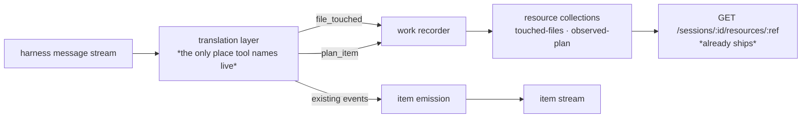

# LAB-134: Graph a coding agent's file writes and todos into FSD state — Implementation Spec

## Part I — The Case *(for the human)*

### 1. Problem — why it matters, why now

When we hand a coding job to an agent, we can now watch it talk. We cannot see what it
*did*. The two things that actually describe a coding run — which files it changed, and what
it decided its job was — are thrown away as they happen. They exist only inside the harness's
own transcript, which nothing but a person can read.

So today, answering "did this run touch anything it shouldn't have?" or "did it quietly
decide to do four things when we asked for one?" means opening the transcript and reading it.
That works while one person watches one run. It stops the moment anything else has to act on
the answer.

**Why now.** The mirror shipped: a run's messages land in our system as they happen. Every
layer above this one — grading a run, filing what came back, deciding what happens next —
reads state this layer produces. Built in the other order they read nothing. And the todo
half is the first real test of the whole epic's claim, because a to-do list that contains
work nobody asked for is exactly the signal a knowledge layer is supposed to catch.

### 2. Solution in plain terms

Two things the run produces get recorded as ordinary state, alongside the messages we already
keep.

**What it touched.** Every file the run writes or edits becomes an entry in a list, keyed by
the file's path, recording how it was touched, when, and whether it worked. Not the contents
— just the fact of the change. Afterwards you can ask "what did this run change?" and get an
answer without opening a transcript or a diff.

**What it thought its job was.** The run's own to-do list becomes readable progress: one row
per item, carrying the item's wording and how its status moved. Crucially these rows go in
their own place, **not** onto the board that gave the run its work. So we can see that the
agent decided to do five things, and compare that against the one thing we asked for — but
nothing starts executing those five things on its own. Adopting one is a separate, deliberate
act, which is the whole point of being able to see it.

**On the epic's kill line.** The issue asks whether this can only be expressed as a
Claude-specific shim. It cannot, and we now have evidence rather than an opinion. The
vendor-specific part is a small table mapping tool names to two events. Everything below that
is existing FSD vocabulary — resource collections, read over the resource route that already
ships. Nothing new is added to the framework. And the edge turned out to be *load-bearing
today*, not defensive engineering: the harness changed its own to-do tooling between versions,
and the type declarations we depend on still describe the old one (see §7's POC).

**Philosophy** — tenet 2 (composition over features): both halves are instances of the
resource collection primitive that already exists; no new concept, no new route, no new store.
Tenet 4 (the framework absorbs infrastructure, not knowledge): the tool names live in the
vendor adapter, and the framework side never learns the word "Claude". Tenet 3 (earn every
addition): the public surface grows by exactly one option, off by default.

### 6. Decisions & rules — the sign-off surface

1. **A run's to-do list is recorded where nothing will execute it.** The observed items go in
   their own list, separate from the work queue that dispatched the run. *Alternative
   rejected:* writing them straight onto that queue, which reads as "the agent's plan is now
   our plan". *Locks in:* an agent that decides mid-run to do five more things cannot start
   five more jobs by writing a to-do list — a human or a later step has to pick one up on
   purpose. The cost is one extra step whenever we do want to adopt one.

2. **We record what the run touched, never what it wrote.** Paths, how each was touched, when,
   and whether it succeeded. Not file contents, not diffs. *Alternative rejected:* keeping the
   written content, which the harness does hand us for free. *Locks in:* our record stays a
   small index pointing at the working tree instead of becoming a second copy of the
   customer's source in our store — with the storage growth and the disclosure question that
   would bring. Anyone who needs the content reads the repo.

3. **Watching the work must never break the work.** Anything the recorder cannot handle — a
   path it cannot key, a to-do shape it does not recognise, a list that has hit its cap — is
   skipped and left visible as a gap. It never fails the run. *Alternative rejected:* failing
   loudly, which is the usual right answer and is wrong here. *Locks in:* a coding run that has
   already written files and pushed commits is never killed by our bookkeeping. The cost is
   that a gap can be silent, which is why §10 makes "recorded nothing" a test failure rather
   than a pass.

**Size:** Medium — ~5 production files · 1 goal check · ~10 test behaviours · 2 doc surfaces ·
1 PR.

---

### 3. Tradeoffs & alternatives

**Alternative: return it on the run's result instead of writing state.** The run already
hands back a summary object; file paths and to-do items could ride on it, and the caller
decides what to do with them. Rejected because a background job's result object goes nowhere
— the conversation-state half is deliberately off for detached runs, so the summary is
returned into a void. The proof this issue owes is *readable afterwards, from state*, and a
return value is not that.

**The simpler approach: record only the files, drop the to-do half.** Genuinely tempting —
the file half is the one with a stable surface and it carries most of the immediate value.
Insufficient because the to-do half is the only part that tests the epic's actual claim. Files
tell you what happened; the to-do list is the only place the agent says what it *thought it was
doing*, which is the thing a knowledge layer weighs. Dropping it defers the risk rather than
retiring it.

**Where the complexity is:** not the recording. It is that the harness's to-do surface is
unstable and partly undocumented — the tool the issue names does not exist on the version we
run, the tool that does exist reports its item ids only inside a prose sentence, and those ids
are not positional across runs. §7's POC is what established all three, and §9 is mostly about
what happens when the surface shifts again.

### 4. Focus practices (1–5)

1. **Every assertion proved able to fail** (tenet 7). This change's failure mode is a recorder
   that records nothing while every test passes, because a scripted fixture fires a tool the
   real harness never sends. Each check gets broken on purpose and observed red before it
   counts. Four defects in this epic already had exactly this shape.
2. **Verify by running, not reading** (BP-003, tenet 7). The premise here was wrong on first
   reading and the type declarations still say so. Anything load-bearing about what the wire
   carries gets measured against a real run.
3. **BP-030 (tolerate the old shape).** The recorder meets tool shapes it has never seen, by
   construction — that is what decision 3 is about. Unknown shapes read as "nothing to record",
   never as an error and never as a crash.
4. **BP-006 (no tracking labels in code or tests).** Names describe behaviour. Fixture ids are
   invented, never real tracker ids.
5. **One convergence point for the vendor mapping** (tenet 5). Every tool name this change
   understands is named in one place. A second site that also knows what `Edit` means is how
   the next harness change breaks half the recording and passes the tests for the other half.

### 5. What using it looks like (1–5 examples)

**Turning it on** *(what this spec proposes; today the option does not exist and the run
records neither)*:

```ts
claudeCodeAgent({
  sessionState: false,   // detached background work, as today
  recordWork: true,      // new: record what it touched and what it planned
  allowedTools: ["Write", "Edit", "Read"],
})
```

**Reading back what a finished run changed**, over the resource route that already ships:

```
GET /sessions/<workstreamId>/resources/touched-files

{ "items": [
  { "topic": "tmp/checkout/notes.txt",
    "state": { "writes": 1, "edits": 1, "failures": 0, "lastTouchedAt": 1787021400123 } }
] }
```

**Reading back what it thought its job was:**

```
GET /sessions/<workstreamId>/resources/observed-plan

{ "items": [
  { "topic": "3", "state": { "title": "Create notes.txt", "status": "completed",
      "transitions": [ { "status": "pending", "at": … },
                       { "status": "in_progress", "at": … },
                       { "status": "completed", "at": … } ] } },
  { "topic": "4", "state": { "title": "Edit notes.txt", "status": "in_progress", … } }
] }
```

**What stays true (before / after):**

```
before  claudeCodeAgent({...})                  → messages, reasoning, tool calls
after   claudeCodeAgent({...})                  → identical; records nothing
after   claudeCodeAgent({..., recordWork: true}) → the same items, plus the two lists above
```

---

## Part II — The Build Plan *(for the implementing agent)*

### 7. Technical design

The vendor edge already exists and is already pure: the translation layer turns harness
messages into a small union of framework-vocabulary events, and a separate emission layer
performs the side effects. This change adds two event kinds to that union and one consumer for
them. Nothing new is introduced at either end.



- **`@flow-state-dev/claude-code`** — the translation layer gains the tool-name table and the
  correlation state the two new events need. A recorder module owns the writes. The agent block
  gains one option and, when it is set, declares the two collections.
- **`@flow-state-dev/core`** — untouched. Both collections are ordinary
  `defineResourceCollection` values.
- **`@flow-state-dev/engine`** — untouched. `GET /sessions/:id/resources/:ref` already lists a
  collection's instances with their state.
- **`@flow-state-dev/orchestration`** — **deliberately not a dependency.** See the note below.

**Why the plan is a resource collection and not a task collection.** Our `Task` carries an
execution contract — attempts, lease, claimant, retry budget. Nothing on our side ever claims,
leases, or settles an observed to-do, so writing one as a `Task` would populate that envelope
with defaults nobody set and nobody honours, and leave rows that look claimable and are not.
It would also invert the package layering: the vendor adapter depends on core alone, and the
task substrate is a layer above it. The observed shape is deliberately *smaller* than a task —
which is decision 1 expressed in the type.

**Correlation, and where the data actually is.** Both events are emitted on the tool
**result**, not the call, because the call carries the subject and the result carries the
outcome. The translation layer already does exactly this for tool items via an open-call map;
these follow that pattern.

- A file mutation's path is on the **tool input** (`file_path`). The result is a prose
  sentence, so it supplies only success or failure.
- A to-do creation's wording is on the tool input; its **id is only in the result's prose**,
  and ids are not positional across runs. The id must be recovered from each create's own
  result, with a run that yields no id degrading per decision 3.

**Where the two collections live.** Session-scoped, so a detached run's records land in that
run's own workstream session and are read back there — the same place its items already are.
Session-scoped resources are permitted on a detached worker; the board's refusal covers
`sessionStateSchema` only.

> **Sketch — pseudocode. Illustrative, not the contract. React to the shape.**
>
> ```
> in the translation layer (pure, the only place tool names appear):
>
>     on a tool call:
>         if the name is in the file-mutation table   → remember (call id → path, kind)
>         if the name is in the plan table            → remember (call id → wording, intent)
>
>     on that call's result:
>         file mutation  → emit file_touched { path, kind, ok }
>         plan create    → recover the id from the result; emit plan_item { id, title, status }
>         plan update    → emit plan_item { id, status }              ← id was on the input
>         id not recoverable → emit nothing                            (decision 3)
>
> in the work recorder (framework vocabulary only, no tool names):
>
>     file_touched → upsert the file list, keyed by the normalized path,
>                    bumping the counter for its kind
>     plan_item    → upsert the plan list, keyed by the id,
>                    appending the status to a bounded transition log
>     anything that throws → swallow, surface as a status note, keep going  (decision 3)
> ```
>
> What this asks a reviewer: *is the translation layer the right home for the tool-name table,
> or should the recorder own it?* Keeping it in translation is what makes the recorder
> vendor-free and unit-testable with scripted events — but it also means the pure layer now
> carries a little correlation state it did not before.

**POC — [`spec-poc/LAB-134-harness-graph-surface/`](https://github.com/fixpoint-labs/flow-state-dev/pull/PR_NUMBER/files)**, on this branch, never merges.
Run: `node spec-poc/LAB-134-harness-graph-surface/probe.mjs`. It drives a real coding job and
classifies every tool call. **What it showed:** the file half's premise holds exactly (`Write`
/ `Edit` with `file_path` on the input); tool results are prose rather than the structured
outputs the type declarations promise; and the to-do surface is **`TaskCreate` / `TaskUpdate`,
not `TodoWrite` — which the shipped binary does not offer at all**, though its own `.d.ts`
still declares it. A second run showed the ids are not positional. All three moved the design;
the first would have produced a recorder that fired on nothing and passed every test.

### 8. Implementation sequence

1. **The tool-name table and the two events**, in the translation layer, with the correlation
   state they need. Nothing writes yet. *Test:* scripted messages in both real shapes — a
   `Write`/`Edit` pair, and a `TaskCreate`→result→`TaskUpdate` sequence — plus an unrecognised
   tool, a create whose result carries no recoverable id, and a failed mutation. *Depends on:*
   nothing.
2. **The work recorder.** Consumes only the two events; contains no tool names. *Test:* the
   upsert behaviours, the bounded transition log, and that a throwing collection write does not
   propagate (decision 3). *Depends on:* 1.
3. **The block option and its two collection declarations**, off by default. *Test:* off is
   byte-identical to today, including declaring no resources; on declares both. *Depends on:* 2.
4. **Forward the option through the capability.** *Test:* a capability built with it declares
   the same two collections — the block and the capability cannot disagree. *Depends on:* 3.
5. **The goal check** (§10). *Depends on:* 4.
6. **Docs and changeset** (§11). *Depends on:* 4.

No removals — this adds a consumer to an existing union and removes nothing.

### 9. Edge cases & error handling

| Case | Expected |
|---|---|
| Path that cannot be keyed (traversal segments, control characters) | Skip the entry, note it, continue — the key normalizer throws, and decision 3 says that must not reach the run |
| Relative and absolute forms of one path | Collide into one entry; leading slashes are stripped by the key normalizer. Acceptable; note it |
| A to-do tool we do not recognise (a future surface) | Record nothing. The run is unaffected and the plan list is empty, which §10 grades as a failure |
| `TaskCreate` result with no recoverable id | Record nothing for that item. Later updates naming that id also record nothing |
| A file mutation that failed | Recorded, with the failure counted — absence would be indistinguishable from "never attempted" |
| Same file touched many times | One entry, counters bumped |
| Collection at `maxInstances` | Evict per the collection's policy; never throw into the run |
| Sub-agent's own file writes | Recorded the same as top-level ones — it is the same run touching the same tree. Unlike items, the record is not nested |
| The option is off | No resources declared, no writes, no events consumed |

**Taxonomy:** every recording failure is non-fatal and degrades to a missing entry. There is no
fatal path in this change — that is decision 3, and it is the property most worth a test that
has been watched to fail.

**Second path (BP-035):** the off state of the new option is the second path and must be
tested; the detached path is where this actually runs, so the goal check exercises it there
rather than inline; the recorder's failure branch is the third.

### 10. Testing strategy

**Goal:** after a real coding run dispatched into a workstream, the files it changed and the
plan it kept are both readable from FSD state alone — no transcript, no working tree, no git.

`goals/harness-workstream/graphs-a-runs-files-and-plan-into-state/run.mts`, real model, real
detached dispatch through the real board, read back over the real HTTP routes. **Store
adapter: `@flow-state-dev/store-sqlite`, named deliberately** — the workstream is a different
session from the one that dispatched, so the readback must cross a real persistence boundary; an
in-process store can make that read succeed on shared memory and prove nothing about the route.

Held out in `fixtures/input.json`: the file names the run is asked to write and the number of
plan items it is asked to keep. Every assertion keys on those values round-tripped through the
real run, so a different valid fixture must still pass a correct implementation.

**What it asserts:**
- the touched-files list names the held-out files, with the touch kinds the job implies
- the plan list carries at least the held-out number of distinct items, keyed by the harness's
  own ids, and at least one row's transition log shows a status actually moving
- **the dispatching board's task collection still holds exactly the one row that was filed** —
  the run's to-dos did not become queued work (decision 1, and the assertion that matters most)
- the same reads on the originating session carry none of it

**Anti-game:** must not read the working tree, the file the run wrote, git, or the harness
transcript. Must not grade whether the run did a *good* job — that is LAB-135. Must not assert
on **how the run was settled** — the row's status, retries, whether a lost run stayed
recoverable. Settlement is out of scope by design (FIX-1182); this board takes the task board's
defaults, which means a lost run is written off. That is a stated gap, not something this goal
should grow to cover.

**An empty list is a FAIL, not a pass.** A run that finishes having recorded no files, or no
plan items, fails the check. This is the single most important line in this section: the POC
established that the plan surface can change under us, and a check that reports "fine" when it
recorded nothing is the exact failure shape this epic has hit four times.

**Every assertion proved able to fail.** Before the check counts, each assertion is broken on
purpose, observed red, and reverted — recorded in the goal's verdict log. A green nobody has
watched fail is worth less than a red.

**CI specs** (behaviours, not test names):
- one behaviour per decision in §6, in observable terms
- both real tool shapes from the POC, scripted — including the id-in-prose recovery
- the unknown-tool and unrecoverable-id paths record nothing and raise nothing
- the option's off state is byte-identical to today
- a collection write that throws does not fail the run

**Discipline:** `tdd`. The seam is the translation layer plus the recorder, both reachable from
a vitest spec with the mock context and scripted messages — every behaviour above except the
goal is a tracer bullet with no harness and no HTTP server.

### 11. Documentation plan

- **EXTEND** `apps/docs/docs/tools/claude-code-sdk.md` — a new section after the existing
  session-state note, covering what gets recorded when the option is on, where to read it back,
  and the explicit statement that contents are not kept. One minimal example (the §5 read-back).
  Cross-link → `apps/docs/docs/resources/collections.md`, ← from
  `apps/docs/docs/server/background-work.md`'s note on inspecting a finished job.
  *Voice risks:* no tracking ids in published prose (BP-006); "seamless"/"powerful" are the
  obvious adjectives for an observability feature — don't; introduce "resource collection" in
  plain terms on first use.
- **EXTEND** `packages/claude-code/README.md` — the new option in the options table, plus one
  line on the two collections it declares.
- **No new page.** This is one section under an existing integration's page, not a term users
  will search for on its own.
- **Changeset** (BP-022): user-facing, `minor` — it adds a public option to a published
  package.

### 12. Dependencies, open questions & follow-ups

**Dependencies.** **LAB-133 (PR #1327, branch `fix/LAB-133`) — not merged.** This spec's branch
is cut from `fix/LAB-133`, not `main`, and the implementation branch must be too. Nothing in
this epic merges until the user says so. LAB-133 supplies the workstream a detached run lands
in, the item stream this sits beside, and the goal-check shape §10 follows.

**Open questions:** none.

**Settled claims:**
- **Settled:** the harness's to-do list arrives as `TodoWrite` — **REFUTED.** The shipped CLI
  (2.1.234, the version the SDK pins) does not offer `TodoWrite` at all; the surface is
  `TaskCreate` / `TaskUpdate`, with ids reported only in the result's prose and not positional
  across runs. Measured twice. ([POC](#7-technical-design))
- **Settled:** file mutations arrive as `Write` / `Edit` tool calls carrying `file_path` on the
  input, at the seam the translation layer already sees — **CONFIRMED.** Measured twice. The
  premise held; the design did not change.
- **Settled:** a tool result carries the structured output its type declares — **REFUTED.**
  Results are prose sentences, so the authoritative record is the tool input.

**Follow-ups (flagged, not built):**
- **Settlement is out of scope** — how a finished, failed, or lost run is recorded is
  **FIX-1182**. This spec takes the board's defaults and references it rather than working
  around it.
- **FIX-1180** (streaming item persistence is quadratic on long runs) gets slightly worse in
  wall-clock terms here, since a recording run does more per tool call. Not blocked on it; noted
  so the next reader does not re-derive it.
- **The stale type declarations** (`sdk-tools.d.ts` declaring a tool the binary does not offer)
  are the vendor's, not ours. Worth a note wherever we document the pinned SDK version, so the
  next person to read those types knows not to trust them alone.

---

## Spec evolution

- **Spec drafted** — framed as two independent records (what the run touched, what it thought
  its job was) built on the existing resource-collection primitive rather than any new
  machinery; the to-do half deliberately kept off the work queue so seeing a fork stays separate
  from acting on one.
- **After POC** — rewrote the to-do half's surface, because a real run showed the tool the issue
  names is not offered by the version we run, its replacement reports item ids only in prose,
  and those ids are not positional; the same run showed tool results carry prose rather than the
  structured outputs their types declare, which moved the record's source to the tool input.
