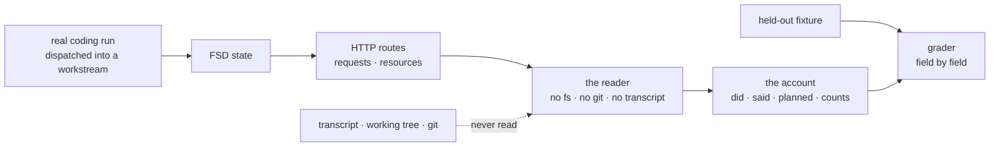

# LAB-135: Prove a coding run is readable from FSD state alone — Implementation Spec

## Part I — The Case *(for the human)*

### 1. Problem — why it matters, why now

Three layers now record what a coding agent did — its messages, the files it touched, the plan
it kept. Nobody has checked whether what they record is **enough**.

The two checks we have can't tell us. Both already know the file the run was told to write and
search the stored record for that name, so a record that kept a *fraction* of the run passes:
the fraction it kept is the part we asked about. Nobody has put the question the other way
round — hand a reader only the stored state, ask it what the run did, and see whether the
answer holds up.

**Why now.** This is the epic's kill line. If state alone can't say what a run did, the layer
above has nothing to read and the one above that has nothing to file, and the two layers
already built are worth throwing away. Nothing in this epic merges until this comes back.

### 2. Solution in plain terms

One more entry in the goal-check library we already run, on the same real host, database and
coding run the previous two layers proved themselves on.

It dispatches a real coding job, hands a reader **nothing but the system's own web routes**,
and has it produce an *account* of the run — which files were touched and how each turned out,
in what order, what the run said, and what it thought its job was (or, when it kept no plan,
that it kept none, with the evidence). Only then does it compare that account against the
expectation the run was given, field by field. Deriving the answer before comparing is the
whole difference from the checks we have, which go looking for an answer they already hold.

**No judge, no score, no eval framework** — the objective cut those and the cut stands. It
never grades whether the agent did a *good* job, and never asserts how the run was settled.
**And it may come back FAIL**, which is what makes it a proof rather than a formality.

**Philosophy** — tenet 7 (*a check that cannot fire is not a check*): every assertion reports
the size of the set it read, and an empty one fails or declares itself unmeasured rather than
passing vacuously. Tenet 2: a directory in a library, not a new instrument. Tenet 3: zero new
public surface.

### 6. Decisions & rules — the sign-off surface

1. **The account is derived from state first, then compared — never searched for.**
   *Rejected:* searching the stored text for the values we expect, which is what both existing
   checks do and what FIX-1184 found produces new defects faster than guards can be bolted on.
   *Locks in:* a green result is evidence about the graph rather than about our search string,
   and the account can report things we never asked about — which is where the next layer's
   value comes from. The bill is derivation code we own and have to keep honest.

2. **The proof rests on what the run *did*; what it *thought its job was* is graded separately
   and may come back unmeasured.** Files touched is always there, and is PASS/FAIL. The plan
   half takes the predecessor's three verdicts — read it, lost it, or the run never planned —
   and the last is reported unmeasured, never as a pass. *Rejected:* one verdict over both,
   which either pins the kill line to a surface the runs we actually make never populate, or
   quietly counts an unexercised half as proven. *Locks in:* we sign the epic off on evidence
   that exists, and accept that a run which kept no plan **proves nothing about the plan
   half** — the verdict log records which arm each run took, so if it never fires we find out
   rather than assume.

   **This is now measured, not cautious.** Through the in-process SDK path — the path this
   check runs on — the agent invoked the plan tools **zero times across eight consecutive real
   runs**, writing its to-do list as prose in its closing message instead. The same binary
   driven through the CLI used the plan tools on the first attempt, so it is the driver, not
   our configuration; tool permissions and turn limits were both ruled out by measurement.
   Expect the plan half to report UNMEASURED on essentially every run of this check until that
   changes. Under a single verdict this issue could not ship at all.

3. **The run is a seeded throwaway job, not the live backlog issue the ticket names.**
   *Rejected:* running the real backlog fix against the working tree, as the issue text
   proposes. *Locks in:* a regression check we can re-run any time, forever, without reverting
   anything or racing a fix that has since landed — at the cost that it proves the
   **instrument**, not any particular agent's competence. Comparing agents is a later,
   separate question.

**Non-goals** — grading the coding agent's output quality; asserting how a run was settled (a
known gap, FIX-1182); re-asserting what the two existing goal checks already cover; any
reusable judge, scorer, harness or corpus.

**Size:** Small — 0 production files · 1 new goal check (4 files) · 8 graded assertions plus 2
preconditions · 0 doc surfaces · 1 PR.

---

### 3. Tradeoffs & alternatives

**Alternative: extend the existing goal check instead of adding a third.** Tempting — it
already has the host, the store and the dispatch. Rejected because the two ask different
questions and would grade at different strengths under one verdict: the existing one proves
*capture* at its own layer and is the cheaper thing to diagnose when something breaks, while
this one proves *sufficiency* across both layers. Folded together, a failure tells you less
than either does apart. §10 says explicitly what this one does not re-assert, so the three stay
non-overlapping.

**The simpler approach: assert the account is non-empty and stop.** Genuinely tempting, and it
would catch the catastrophic case. Insufficient because "non-empty" is the exact bar a lossy
graph clears — the epic's failure mode is a record that keeps *some* of a run, and a
non-emptiness check reports fine on it. The field-by-field comparison is the smallest thing
that separates *some* from *enough*.

**Where the complexity is:** not the derivation. It is keeping the check honest about its own
blind spots — every assertion has to fail (or report itself unmeasured) when the set it reads
is empty; the reader has to be structurally unable to reach the transcript rather than merely
instructed not to; and the grading must not quietly become a test of whether the coding agent
was any good. §9 and §10 are almost entirely about those three.

### 4. Focus practices (1–5)

1. **Every assertion has a can't-tell branch** (tenet 7, FIX-1183). An assertion derived from a
   filtered set **fails** when the set is empty, unless emptiness is the property being
   asserted or the predecessor's INCONCLUSIVE arm applies. The account carries the count each
   derivation saw, and the message names which one could not be evaluated. This is the practice
   the whole issue exists to embody: a blind check here would report the epic succeeded when it
   hadn't.
2. **Grade structured, field-specific fragments** (FIX-1184). Parsed fields against parsed
   fields. No `haystack.includes(fragment)` anywhere in the grading, and no locating a region
   by `indexOf` over a rendered blob.
3. **Scope every claim to exactly what was measured** (tenet 7). The evidence string names
   which routes were read, how many pages were followed, which arm the plan half took, and what
   each count was. It never claims a property no assertion covered.
4. **Sanity-check the instrument against a known case before trusting its sweep.** The reader
   runs first against a checked-in state fixture whose correct account is known, and the goal
   aborts if it does not derive exactly that. Model-free, so it costs nothing.
5. **Prove every guard fires** (tenet 7). Each assertion is broken on purpose, observed red,
   and reverted before the verdict counts — recorded in the goal's verdict log. A guard nobody
   has watched fail is what produced six of these.

### 5. What using it looks like (1–5 examples)

*No public API changes — this adds a goal check, not framework surface.* What matters to a
reader is the artifact it produces, so that is what these show.

**Running it:**

```
pnpm tsx goals/harness-workstream/reconstructs-a-run-from-state-alone/run.mts
```

**The account it derives, from the routes alone** *(the shape this spec proposes; the reader
does not exist today)*:

```
did       src/report.ts    created  applied   first at 7
          src/format.ts    edited   applied   first at 11
          src/summary.ts   created  applied   first at 15
gaps      1 — a path the recorder could not key, raw path carried on the row
said      2 top-level messages
planned   UNMEASURED — the run invoked no plan tool in its own item stream
shell     1 Bash call — the record cannot cover what it did
counts    items 34 · tool_outputs 9 · file-op rows 3 · gap rows 1 · plan rows 0 ·
          pages followed 1
```

**And the verdicts it can print:**

```
PASS — 3 of 3 held-out paths present, each with a recorded kind and a settled outcome;
       every stream mutation the file-op collection does not carry is accounted for by
       a gap row (1); order non-decreasing across 9 tool_outputs at 6 distinct positions.
       PLAN HALF UNMEASURED: the run invoked no plan tool, so this run is evidence
       about what the run DID and none about what it planned.

FAIL — src/summary.ts appears in the item stream as a Write, has no row in the file-op
       collection, and no gap row accounts for it: the graph lost a tool-driven
       mutation without admitting it

FAIL — ordering could not be evaluated: 0 of 3 mutations carried an itemIndex
```

---

## Part II — The Build Plan *(for the implementing agent)*

### 7. Technical design

The check is two halves that must not be able to see each other's inputs.



**The deprivation is a parameter shape, not a promise.** The reader is its own module whose
only input is a bound HTTP reader for one host. It imports no filesystem, process or git
module, and the goal asserts that mechanically over the module's own source — cheap, and a
guard that can be watched to fail by adding an import. Only the reader is constrained; the run
harness around it legitimately uses the filesystem to seed a temp directory.

**Where each field comes from, and why not the other surface:**

- **Identity and outcome of a file touch** come from the **file-op collection** (`lastKind`,
  `lastTouchedAt`, and the three-valued `outcome`), which is already vendor-normalized. Reading
  it here is also what exercises that normalization.
- **Order** comes from **`itemIndex`** on the item stream, not from the collection's timestamp:
  the collection keeps a *last*-touch scalar by the predecessor's decision 3, so a file touched
  twice collapses and cannot order anything.
- **Whether a plan was kept** comes from the **plan collection**; **why it is empty** comes from
  the item stream, which carries a `tool_output` for every tool the run invoked, plan tools
  included. Reading our own item stream is not the anti-game — the prohibition is on the
  *harness transcript*.
- **What the recorder could not record** comes from the **gap collection**, a third
  session-scoped collection keyed by run id plus an ordinal, carrying the raw path on the row.
  It is deliberately *not* keyed by the value that failed, because the commonest skip is a path
  that cannot become a key.
- **Nothing parses a tool result's prose, and nothing recovers a gap from prose either.** The
  path is a field, and a gap is a row. A status note is not a substitute for either: `emit.status`
  drops a message identical to the one in the slot (`createExecutionContext.ts`), so N skips of
  the same shape emit one item, and reading the count back out of a sentence would be exactly
  the substring grading FIX-1184 exists to retire.

**A run can use tools the allowlist does not name.** `allowedTools` is a *permission* allowlist,
not an availability filter — a measured run used `Bash` while it was absent from the list. That
matters here because shell-driven edits are invisible to the recorder by the predecessor's
decision 2, so a missing path can mean *the graph lost it* or *the work happened through a
channel the record does not cover*, and those need opposite verdicts. The account therefore
carries whether the run made any shell call, and §9 splits the two.

**The two surfaces spell a path differently, and the comparison has to survive that.** The
collection's topic is run-namespaced and canonicalized against the run's working directory
(`<runId>/repo/src/checkout.ts`); the item stream carries the raw tool input
(`/tmp/xyz/src/checkout.ts`). **Match on whole trailing path segments**, and require the
fixture's paths to have distinct basenames as a setup precondition so a suffix match cannot be
ambiguous. *Rejected: canonicalizing the stream side identically to the recorder* — it would
couple this check to a storage-key format that is not a contract, so a harmless change to the
key would turn the agreement check red for the wrong reason.

**One convergence point for the vendor edge.** Exactly one constant in the reader lists the
file-mutation tool names, plus the shell tool. It is used only for the stream-versus-collection
agreement check and the shell-call flag, and must match the recorder's shipped table; nothing
else in the reader knows a tool name.

> **Sketch — pseudocode. Illustrative, not the contract. React to the shape.**
>
> ```
> reader(read, workstreamId) -> account:          # `read` is the ONLY input
>     items <- every page of the run's request history, items included
>     ops   <- every page of the file-op collection      # follow the cursor
>     gaps  <- every page of the gap collection          # what it could not record
>     plan  <- every page of the plan collection
>
>     did     <- for each op row: path, recorded kind, recorded outcome
>                ordered by the first stream position naming that path
>     said    <- top-level message items, in stream order
>     planned <- rows                    if any
>                else UNMEASURED         if no plan tool appears in the stream
>                else LOST               # the tools fired and nothing was recorded
>     shell   <- did the run call the shell tool at all
>     counts  <- how many of each thing every derivation above actually saw
>
> grader(account, expectation) -> verdict:
>     any count an assertion reads is zero          -> FAIL, naming which
>     every expected path present, with a kind and a settled outcome
>         missing, and the run used the shell         -> unmeasured for that path
>         missing, and it did not                     -> FAIL
>     a stream mutation the collection lacks
>         accounted for by a gap row                  -> fine, and reported
>         not accounted for                           -> FAIL
>     order non-decreasing, over at least two distinct positions
>     activity precedes the report written about it
>     planned is rows -> graded;  LOST -> FAIL;  UNMEASURED -> reported, not passed
>     every expected path unmeasured                  -> the run proved nothing
> ```
>
> What this asks a reviewer: *is "derive an account, then compare" the right shape — or should
> the check assert directly against the routes, one property at a time?* The account costs a
> layer; what it buys is a reader that can report what the state says **without being told what
> to look for**, which is the thing the epic is actually claiming.

**POC — `spec-poc/LAB-135-state-readback-surface/`**, on this branch, never merges. Run:
`pnpm tsx spec-poc/LAB-135-state-readback-surface/probe.mts`. Model-free, seconds. It drives
the real translation and emission layers with SDK messages transcribed from the predecessor's
measured runs, persists through real SQLite, and reads back over the shipped routes.

**What it showed** — all three premises held, and two of them changed §9 rather than the
direction. A file path survives as a parseable **field** (`toolCall.arguments` →
`{ file_path }`) with `toolCall.name` and a `completed`/`failed` status beside it, which is
what makes structured grading possible at all. The ordering key is **`itemIndex`**; **`seq`
does not exist** on a persisted item, and the measured values carry a duplicate and a gap, so
the assertion is non-decreasing and never contiguous. The collection route returns per-item
state as **`clientData`**, addresses a collection by its **accessor key** (a wrong ref is a
404, distinct from the 403), pages at **50** rows with `nextCursor`, and 403s without the
visibility declaration. Two traps worth carrying into the code: `item.blockName` is the *tool*
name while `item.provenance.blockName` is the *FSD block*, and a tool result's `output` is the
prose shown to the model rather than a structured result. Scoped to persistence and readback
only — it measures nothing about what the harness emits, which the predecessor's POC measured
and this takes as given.

### 8. Implementation sequence

1. **The reader, with its calibration fixture.** Pure, model-free, one input. Build it against
   `fixtures/known-state.json` and require it to derive `fixtures/known-account.json` exactly.
   *Test:* the calibration itself, plus a deliberately lossy known state that must produce a
   different account. *Depends on:* nothing — no coding run needed to build this half.
2. **The grader**, over the account and the held-out expectation, with a can't-tell branch on
   every assertion. *Test:* hand it accounts that are empty, partial, out of order, disagreeing
   between surfaces both with and without a gap row accounting for the difference, missing a
   path with and without a shell call in the run, and carrying each of the three plan arms;
   each must resolve for its own named reason. *Depends on:* 1.
3. **The run harness** — seed a temp directory from the fixture, dispatch a real detached
   coding run into a workstream with the recorder switched **on**, poll until the workstream is
   no longer active, then read. Reuse the predecessor goal's shape: real `createFlowState`,
   real `serve()`, `store-sqlite` named deliberately, raised detached-drain timeout, and the
   agent block constructed directly rather than through its capability (the capability's own
   declaration path has its own test in the predecessor's step 4 and is not this goal's to
   prove). *Depends on:* 2.
4. **`goal.md`**, Anti-game written first, plus the verdict log's first rows recording which
   plan arm each run took. *Depends on:* 3.
5. **Changeset** (`--empty`, internal-only).

No removals. The existing goal check's `seq` defect belongs to FIX-1183 and its own PR, and is
not fixed here.

### 9. Edge cases & error handling

| Case | Expected |
|---|---|
| A derivation's set comes back empty | **FAIL**, naming which assertion could not be evaluated — never a vacuous pass |
| The run invoked no plan tool | Plan half **UNMEASURED**: reported, recorded in the verdict log, and explicitly not counted as a pass (decision 2) |
| Plan tools fired but nothing was recorded | **FAIL** — our bug, and distinguishable from the row above using the run's own item stream |
| A stream mutation with no collection row, and **no gap row** accounting for it | **FAIL** — the graph lost a tool-driven mutation without admitting it |
| A stream mutation with no collection row, but a **gap row** carrying its path | Fine, and reported. The recorder skipping is by design (predecessor decision 2's rule that watching must never break the work); skipping *silently* is not |
| A collection row with no matching stream mutation | **FAIL** — the record claims an operation the run's own stream does not show |
| An expected path missing, and the run made **no** shell call | **FAIL** — nothing else could have made the change |
| An expected path missing, and the run **did** call the shell | **Unmeasured for that path**, named as such. Shell-driven edits are invisible by the predecessor's decision 2, so failing would blame the graph for a stated gap. If *every* expected path lands here, the run proved nothing and the goal is inconclusive |
| An expected path whose outcome is still `pending` after the run finished | **FAIL** — the settle path did not run; a finished run should have no unsettled write |
| The outcome field is absent entirely | **FAIL**, naming it as a projection problem — the field is exposed through `clientData`, so absence means it was projected away, not that it is false |
| The run wrote a file the fixture didn't name | **Reported** in the account, not failed. Failing would grade the agent's judgement rather than the state |
| The agent used `Write` where the fixture expected an edit | Passes. The assertion is *a kind was recorded*, not *which* — the kind is the agent's choice |
| Two fixture paths share a basename | Rejected at setup — trailing-segment matching cannot be ambiguous |
| More than 50 rows in a collection | Follow `nextCursor` to exhaustion. A single-page read under-reads silently, which is the same failure as an empty set |
| A wrong collection ref | 404, and the message must say so rather than reporting it as a permission problem |
| Any of the three collection reads returns 403 | Abort before grading — the reader cannot work, and this is the predecessor's assertion, not ours to re-grade |
| A gap row whose raw path matches nothing in the stream | **Reported**, not failed. Gaps are keyed by run id plus an ordinal, so a gap for something other than a file mutation is legitimate |
| The run never finished, or the dispatch failed | Abort before grading — assertions over a half-finished run are not evidence |
| `itemIndex` values repeat or skip | Normal, measured in the POC. Assert non-decreasing only |

**Taxonomy:** everything from "a derivation came back empty" downward is a graded outcome, not
a thrown error. The only aborting paths are a failed dispatch, a missing or still-active
workstream, a 403, and a failed calibration — each stops before grading rather than producing a
partial verdict.

**Second path (BP-035):** the empty-plan run (the *expected* path on this driver, not the rare
one — see decision 2); the run that reached for the shell; the multi-page collection read; a
second run in the same workstream, whose rows are namespaced per run and must not be mixed in;
and the calibration path, which must be runnable with no model.

### 10. Testing strategy

**Goal:** dispatch a real coding run, then reconstruct what it did from FSD state alone — no
transcript, no working tree, no git — and have that reconstruction hold up against the
expectation the run was given.

`goals/harness-workstream/reconstructs-a-run-from-state-alone/`. Real model (the Agent SDK
resolves its own). Same describe as the two existing checks, a new behaviour.

**Two preconditions, both of which abort rather than grade.** The calibration gate runs first
and model-free: the reader derives the known account from the checked-in state fixture,
exactly, or the goal stops before spending a run. Then the run must have finished and all three
collection reads must have returned 200.

**Eight graded assertions**, in observable terms:

1. Every held-out path appears in the account with a recorded kind and a settled outcome — or,
   when it is absent and the run called the shell, is named unmeasured for that path
2. Every mutation the item stream shows and the file-op collection lacks is **accounted for by
   a gap row**; a difference nothing accounts for fails, and so does a collection row the
   stream does not show
3. The account's order is non-decreasing over `itemIndex`, across at least two distinct
   positions — fewer and ordering is unverifiable, which fails
4. The run's activity precedes the report it wrote about that activity
5. The plan half resolves to rows (each carrying a wording and a status), or to UNMEASURED with
   its reason named — never to LOST
6. Every count an assertion reads is greater than zero, or that assertion fails by name
7. No page was left unfollowed — every `nextCursor` exhausted, across all three collections
8. The reader's own module imports nothing that could reach the transcript, tree or git

**Verdict shape.** The overall verdict is PASS or FAIL on assertions 1–4 and 6–8, which are
about what the run **did**. Two arms report rather than fail, and neither may pass silently:
assertion 5's UNMEASURED (the run never planned), and assertion 1's per-path unmeasured (the
run worked through the shell, which the record does not cover by design). Both are named in the
evidence and logged per run, so a drift toward never measuring anything is visible instead of
comfortable. If *every* expected path lands unmeasured, the run proved nothing and the goal is
inconclusive rather than green. This is the predecessor's three-verdict rule applied per claim
rather than per run — same table, same "must name why", same logging.

**Expect assertion 5 to report UNMEASURED on nearly every run**, on the measurement in decision
2. That is the designed behaviour, not a defect to chase, and it is the reason the kill line
does not ride on it.

**What this check deliberately does not re-assert**, because each has its own goal and
duplicating it would inflate this one's PASS into a claim about theirs: that the workstream is
a child session carrying the held-out topic; that `include_items=true` is load-bearing on this
adapter; that the originating request's stream carries none of the run's items; that the
dispatching board's task collection was not polluted by the run's plan; and that the two
collections declare client state reads.

**Anti-game.** Must not read the harness transcript, the working tree (including any file the
run wrote), or git. Must not grade whether the run did a **good** job — no assertion on the
run's prose, on any file's contents, or on whether the change would compile. Must not assert on
**how the run was settled**; settlement is a stated gap (FIX-1182). An account that comes back
empty is a FAIL, and the failure must say *which* emptiness it hit.

**Every assertion proved able to fail.** Each is broken on purpose, observed red, and reverted
before the check counts — recorded in the verdict log with what each failing run reported.
Assertion 6 gets the sharpest version: point a derivation at a field that does not exist and
confirm it fails rather than passing over zero rows, which is the exact defect FIX-1183 was
filed for and which the POC reproduced deliberately.

**No CI specs.** `goals/` sits outside every package's vitest root by design, so the reader
cannot be covered by a mocked spec. The calibration gate is the deterministic cover for it and
runs on every invocation.

**Discipline:** `tdd`. Steps 1 and 2 are pure functions over fixtures, so the red-green loop
runs with no host and no model; only step 3 needs the real path.

### 11. Documentation plan

**No docs changes required.** This adds an internal verification artifact, not user-facing
functionality: no public API, no observable behaviour change, nothing an end user of the
framework can call. `goals/README.md` already documents how the library works and how a goal is
added, and this follows it without changing it — the issue reference lives in `goal.md`, where
that README puts it.

**Changeset** (BP-022): `--empty`, internal-only.

### 12. Dependencies, open questions & follow-ups

**Dependencies.** Both blockers are unmerged, and this branch is cut from the second, not from
`main`; the implementation branch must be too. **LAB-133** (PR #1327) supplies the workstream,
the item stream and the goal harness this reuses. **LAB-134** (PR #1329, at its approval gate,
extended by PR #1332) supplies the **three** collections the account reads — file operations,
plan, and gaps. Nothing in this epic merges until sign-off.

**The gap collection exists because this spec asked for it.** Assertion 2 needs a durable,
per-gap record it can correlate to a path; the predecessor's original mechanism was a status
note, which cannot serve — `emit.status` drops a message identical to the one already in its
slot, so repeated skips of one shape collapse to a single item, and recovering a count from
prose would be the substring grading FIX-1184 exists to retire. Persistence was never the
obstacle: a status item emitted with `{ transient: false }` *does* survive
(`runAction.ts` filters on `item.transient !== true`), and `docs/architecture/items.md`
contradicts itself on this — line 124 says every emitter takes a per-call override, line 180's
table says status is "always transient". The dedupe is the reason, not the persistence.

**One coupling worth naming.** A collection's per-item payload arrives as `clientData`, which
is a **projection** — so every field this check grades (`lastKind`, `outcome`, `title`,
`status`) has to be in the predecessor's exposed set. If that projection narrows, this check
reads `undefined` and its can't-tell branches fire. That is the correct behaviour and not a
silent pass, but it is a change on their side that goes red on ours.

**Open questions:** none for the owner.

**Settled claims** — each scoped to exactly what the POC ran (persistence and readback; it
measured nothing about what the harness emits):

- **Settled:** a persisted `tool_output` read back over the requests route carries
  `toolCall.name` and a parseable `toolCall.arguments`, so a file path is a **field** —
  **CONFIRMED.** Measured on a `Write` and a failing `Edit`.
- **Settled:** the ordering key on a persisted item is `itemIndex`; `seq` is absent —
  **CONFIRMED** (`seq` values, length 0). Measured values carry a duplicate and a gap, so the
  assertion is non-decreasing, never contiguous.
- **Settled:** the collection-state route returns per-item state as `clientData`, addresses a
  collection by its accessor key, pages at 50 with `nextCursor`, and 403s without
  `client.state.read` — **CONFIRMED**, all four in one run.
- **Settled:** a tool result's `output` on the item is the prose shown to the model, not a
  structured result — **CONFIRMED**, consistent with the predecessor's finding. Nothing in the
  reader parses it.

**Settled by the predecessor's measurement**, carried here because two assertions depend on
them:

- **Settled:** through the in-process SDK path, a run keeps a machine-readable plan —
  **REFUTED.** The plan tools were invoked **zero times across eight consecutive real runs**;
  the agent wrote its to-do list as prose in its closing message. The same binary through the
  CLI used them on the first attempt, so it is the driver; tool permissions and turn limits
  were both ruled out by measurement. This is why decision 2 splits the proof.
- **Settled:** `allowedTools` bounds what a run can do — **REFUTED.** It is a permission
  allowlist, not an availability filter: a measured run used `Bash` while it was absent from the
  list. No assertion here may assume the tool set bounds the run's behaviour.

**Follow-ups (flagged, not built):**

- **The plan half of the graph is currently unprovable on the path we run.** With zero plan-tool
  invocations across eight SDK-path runs, nothing end to end exercises the predecessor's plan
  recorder — this check will report it UNMEASURED essentially always. That is handled here (it
  cannot fail the kill line) but it is a real hole in the epic's evidence, and closing it is
  someone's issue: either drive a run through the CLI path, or accept that the plan half ships
  proven only by unit tests. Not this issue's to decide.
- **`docs/architecture/items.md` contradicts itself on status transience** — line 124 grants
  every emitter a per-call `transient` override, line 180's table says status is "always
  transient", and the code agrees with line 124. Worth a one-line fix wherever the item taxonomy
  is next touched; it already misled one reader.

- **The existing goal check asserts ordering on `seq`**, a field persisted items do not carry,
  and both of its verdict-log PASS rows claim a property no code established. Already flagged
  by a reviewer on PR #1327 and covered at the convention level by **FIX-1183**; referenced
  here, not re-filed and not fixed in this issue.
- **The backlog issue this ticket names as its subject** moved teams and is now **FIX-1178**,
  not LAB-129. Not a dependency either way under decision 3.
- **The reader's shape is reusable at the higher rungs the issue names**, and the judge is not:
  a check asking "did our agents act correctly on this state?" reuses the deprived reader and
  the account, and compares against a different expectation. Nothing shared is extracted here —
  `goals/README.md` puts the bar at a third caller, and this is the first.

---

## Spec evolution

- **Spec drafted** — framed as the epic's kill-line check rather than as an eval: the
  instrument is the goal-check library that already exists, the reader is deprived by its
  parameter shape, and the account is derived from state before anything is compared to it.
- **After POC** — pinned ordering to `itemIndex` and to non-decreasing rather than contiguous,
  and the collection read to `clientData`, its accessor key and its cursor, because a
  model-free probe of the real routes showed `seq` does not exist on a persisted item and one
  page holds fifty rows.
- **After the predecessor's round-2 fold** — split the proof into two separately graded claims
  and adopted its three-verdict plan rule, because it established that a run which never
  planned is unmeasured rather than passing, and that its outcome fields are three-valued
  rather than boolean.
- **After round 1** — sharpened the two-surface assertion from *any disagreement fails* to
  *disagreement fails unless a gap row accounts for it*, because the predecessor's recorder is
  allowed to skip and now records each skip durably (a collection this spec's finding caused to
  exist). Added a per-path unmeasured arm for shell-driven work, because `allowedTools` turned
  out to be a permission allowlist rather than an availability filter and a run reached for the
  shell. And put evidence under decision 2, which measurement promoted from cautious to
  load-bearing: zero plan-tool invocations across eight consecutive runs on the path this check
  uses.
