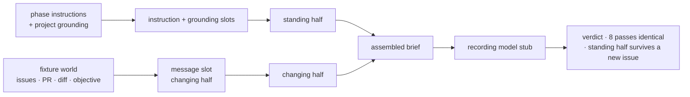

# LAB-136: Fixture proof — one phase's context recipe, byte-identical across eight passes — Implementation Spec

## Part I — The Case *(for the human)*

### 1. Problem — why it matters, why now

Conductor's product claim is that a phase of work gets exactly the context it needs, assembled
the same way on every pass. Nothing tests that today. If the assembly quietly varies between
passes — a timestamp here, a differently-ordered list there — then round eight does not behave
like round one, and the reliability the whole system is being built for is not there.

**Why now.** The two layers that would make the assembly observable — the world model and event
intake — are deliberately last in the epic's build order. On the current plan the claim stays
untested until everything sits on top of it. Proving it here costs one goal check. Discovering
it after the substrate is built costs the substrate.

### 2. Solution in plain terms

Hand-build a small world as literal fixtures — a few issues, a pull request, its diff, the
objective they sit under — with no database and no event feed. Build **one** phase's context
recipe against it, then check two things: a person reads the resulting brief once and agrees it
is what that phase needs, and the machine runs the recipe eight times and gets the same bytes
every time.

The phase is **review**: the fixture list the issue names is exactly a reviewer's input set, its
inputs are the most volatile of any phase, and we already have a written standard for what a
review must cover — so the human read has something to check against rather than a feeling.

The brief is shaped as **a standing half and a small changing half**: the phase's instructions
and the project's grounding never vary, and only "this issue, this pull request" moves. That
shape is what makes byte-identity reachable at all, and cheap caching follows from it rather
than the other way round. The test and the design are the same thing.

**Why the second half of the proof is not optional.** The epic's context-assembly claim *is*
that split — a standing prefix identical on every run by construction, plus a small changing
tail. Eight passes over one issue cannot test it: nothing moved, so they pass by construction
whatever the recipe put where. Only assembling a *second* issue and finding the standing half
unmoved tests the shape rather than the plumbing. So this is not a product invariant borrowed
into a determinism proof — it is the determinism claim stated at the altitude where it can
actually fail.

**What a green here does not prove.** Eight passes in one process, seconds apart, are materially
weaker than "round eight behaves like round one" in production, where rounds are separated by
hours, processes, and machines. This proof rules out per-call nondeterminism in the recipe and
the assembly. It says nothing about drift across restarts or hosts. Read the green for what it
is, and do not report it as the epic's headline claim having been met.

**Nothing else ships.** No assembly framework, no recipe format, no store, no second phase.
If this grows a layer it has failed its own purpose.

**Philosophy** — tenet 2: a recipe is an ordered selection of what already goes into a
generator's instruction, grounding and message slots, not a new subsystem beside them. Tenet 7:
the passes run through the framework's own assembly, and the check is proved able to fail
before it is trusted. Tenet 3: nothing is added to the framework's public surface, and ending
with a written finding and no code kept is a legitimate outcome.

### 6. Decisions & rules — the sign-off surface

1. **The eight passes measure the brief the framework itself would hand a model, not a stand-in
   written for the test.**
   *Rejected:* a plain function over the fixtures returning a string — a dozen lines, proving
   only that our own test helper is deterministic.
   *Locks in:* what we learn transfers to anything built on the framework's assembly, and only
   to that. It does **not** make every red result a framework finding — the recipe's own
   formatters run inside the same execution, so decision 3 requires localizing the drift before
   anyone escalates it.

2. **The proof also assembles two *different* issues and requires the standing half to be
   byte-identical between them.**
   *Rejected:* eight passes over one issue only — they pass by construction and would let us
   report a green that tested nothing (see §2, "Why the second half of the proof is not
   optional").
   *Locks in:* an **observation**, not a rule over L4 — *in this recipe, the standing half
   survived a change of issue.* It does not bind future phase recipes; §12 says the L4
   hypothesis is unsettled and this must not be written up as settling it. What makes the
   observation worth having is that the framework derives the split from *which slot* a value
   arrived in rather than from reading its content, so a misclassification cannot be silently
   absorbed — whoever writes the next recipe finds out as a failure, not as a latent bug.

3. **A drifting brief is reported and stops the issue — but only once the drift is localized to
   the assembly seam.**
   *Rejected:* find the drift, fix it, re-run until green. Also rejected: reporting any red
   capture as a framework finding. Executing a generator runs the recipe's own formatters
   before assembly does anything, so a nondeterministic formatter reddens the check while the
   framework is perfectly correct — the anti-game check is deliberately that exact case. Skip
   localization and the escalation path cries wolf on its own instrument.
   *Locks in:* the issue cannot balloon into unscoped repair work, and the epic is only paused
   by drift that is genuinely ours to escalate. Recipe-owned drift is ours to fix here; seam
   drift lands as a written finding and a new issue.

**Non-goals** — shared assembly machinery, a recipe format, reading the world from a store,
event intake, a second phase, a new package, a CI spec, and any change to shipped code.
*Keeping* the code is also a non-goal: this is throwaway, and the recorded verdict is the
deliverable.

**Size:** Small — 3 files in one goal folder · 0 workspace members · 0 config edits · 0 doc surfaces · 1 PR.

---

### 3. Tradeoffs & alternatives

**Alternative: prove it with a real model run.** Send the brief to a real reviewer model and
judge the review it produces. Rejected — that answers a different question (was the review any
good?) and puts a nondeterministic model inside a determinism proof.

**The simpler approach: a pure function over fixtures, called eight times.** Genuinely
tempting, and it satisfies the literal wording of the issue. Insufficient because the drift
risk is not in the fixture-reading code we would write. It is in the assembly around it — how
grounding from several sources gets ordered and merged into one instruction block. A pure
function proves determinism of the one part nobody doubted.

**Where the complexity is:** making the check able to fail. Eight identical passes over
deterministic inputs pass by construction, so the proof is worth nothing until the same harness
has been shown to go red on a recipe deliberately built to drift.

### 4. Focus practices (1–5)

1. **Tenet 7 — a check that cannot fire is not a check.** The anti-game check is a required
   deliverable, and `goals/README.md` already makes it a required field. Without it the
   eight-pass signal is decoration.
2. **Tenet 3 — earn every addition.** No shipped file changes, no package, no config edit; the
   change is one goal folder. If the implementation finds itself writing a helper a second
   phase would reuse, stop — that is the layer this issue exists in order *not* to build, and
   feeling the pull is itself a finding to write down.
3. **Tenet 2 — composition over features.** The recipe uses a generator's existing instruction
   / grounding / message slots. If it cannot, **that is the result**: write it up rather than
   routing around it with new machinery.
4. **BP-003 — verification evidence.** Every claim is executed and then *recorded*: the byte
   comparison runs on the real path, the anti-game check proves it can fail before any green is
   believed, and both land as a dated row in the goal's verdict log rather than as a sentence
   in a PR nobody can re-run.

### 5. What using it looks like (1–5 examples)

The brief the review phase is handed, in outline, with the boundary marked. The top half is
fixed by construction; only the bottom moves between runs.

```
─ standing half ─────────────────────────────
  You are reviewing a pull request. …            ← the phase's instructions
  <project>    how we build and what we value    ← the project's grounding
  <standards>  what a review must cover
  <objective>  the epic this work sits under
─ changing half ─────────────────────────────
  Issue ISSUE-1 — reported token usage drops …   ← this issue
  PR #101 — 3 files, +47 −12                     ← this pull request
  <diff> …                                       ← this diff
```

Fixture identifiers are invented (`ISSUE-1`, `#101`), never real tracker ids — BP-006 keeps
tracking labels out of tests, and a fixture naming a live issue invites someone to go look it up.

**What the assertions see:**

```
eight passes, same issue    → all eight briefs identical, byte for byte
two passes, issue A vs B    → the standing half identical; only the changing half differs
the anti-game check         → the eight-pass check goes red   (proves the check can fire)
```

---

## Part II — The Build Plan *(for the implementing agent)*

### 7. Technical design

The recipe is a generator definition. Its instruction and grounding slots become the standing
half; its message slot becomes the changing half. A model stub that only records what it was
handed makes the assembled brief observable with no LLM in the loop.



- **`goals/context-supply/<it>/`** — the whole change, as a **model-free goal**: `goal.md`,
  `run.mts`, `fixtures/`. `context-supply` already exists as a describe folder with one
  behaviour, so this is a sibling `it`, not a new subject. Zero workspace members, zero config
  edits, no `knip.json` row — `goals` is already a workspace member and `goals/*/*/goal.md` is
  already swept.
- **`@flow-state-dev/core`, `@flow-state-dev/engine`** — read, **never modified**, and already
  dependencies of `goals`. The recipe runs through the engine's public execution path with a
  recording model resolver injected (`createExecutionContext` takes a `modelResolver`). The
  stub's `options.messages` **is** the assembled brief; that is the capture point.
- **Untouched:** every published surface, `apps/docs`, `labs/`, `packages/*/test`, the stores.

**Why a goal and not a CI spec.** `goals/README.md` states that a model-free goal — real path,
no LLM — is well-formed, and ten-plus already exist. This is one: the assembly is real, the
model is `n/a`, and the outcome is observable without one. It also matches the epic (whose
stated Proof is LAB-135's goal check) and its sibling LAB-133, which puts its composition in
the goal rather than a package. Two issues in one epic must not answer "where does throwaway
proof code live" in opposite directions (tenet 1).

**What that costs, stated plainly:** the byte check stops running on every push, so a later
regression inside `assembleMessages` is not caught automatically. That is the right trade here —
decision 3 says this issue does not own repairing framework drift, and a goal is a re-runnable
regression record by design. Where continuous protection belongs, if the proof passes, is §12.

**Declining one suggestion.** `goals` does *not* depend on `@flow-state-dev/testing`, so
`testBlock` / `createMockModelResolver` would need a `package.json` edit — which breaks the
zero-config-edits property above — and `goals/README.md` is explicit that a goal is not a
dressed-up unit test. An inline stub that records one field is smaller than a scripted mock
resolver anyway. Build the context from `@flow-state-dev/engine` directly.

**Where the standing/changing boundary comes from — and why not the obvious route.**
`assembleMessages` computes `systemPrefixCount`, and it is a declared field on the public item
contract (`GeneratorStepItem`, `packages/contracts/src/items/types.ts`), so reading it off an
emitted item looks like the clean answer. **It appears not to be reachable for this recipe.**
The only emitter is `emitGeneratorStep`, and both call sites
(`packages/core/src/blocks/generator.ts`, the non-streaming and streaming loops) sit *after* a
guard that breaks first:

```
if (!runTools || (frameworkCalls.length === 0 && isTerminalStep)) { …; break; }
await emitGeneratorStep(…)      // not reached by a tool-free generator
```

The review recipe declares no tools, so step 0 should be terminal with no framework calls, the
loop breaks, and no `generator_step` item is emitted — no `prelude`, no `systemPrefixCount`.
**A POC is settling this; see §12.** It is read from source, not run, and that class of claim
has already been wrong once on this spec.

So **derive the boundary from the captured messages**: the leading run of `role: "system"`
entries. For *this* recipe that is exact rather than a heuristic — `assembleMessages` returns
`[...systemPrefix, ...history, ...user]`, the recipe declares no history slot, and its message
slot yields user-role messages. Because that exactness is a property of the recipe's shape and
not of the framework, **assert the precondition rather than assume it**: exactly one leading
system message, and no system-role message after it. If the assertion fails the derivation is
void, which is the correct outcome.

*Rejected:* giving the recipe a tool so the artifact fires. It would change the brief a human is
being asked to judge in order to make telemetry appear — the tail wagging the dog.

**Sketch — pseudocode. Illustrative, not the contract. React to the shape.**

```
the review phase's recipe is one generator, three slots:

    instructions ← what a reviewer is for            ] never varies →
    grounding    ← how we build; what a review covers] the standing half
    message      ← this issue, this PR, this diff      varies per run → the changing half

one named comparator, used by the signal checks AND by the anti-game check:

    briefsAgree(captures) → all captures render to the same bytes

the goal:

    eight times:
        run the recipe over a FRESH copy of the fixture world
        capture what the model stub was handed
    require briefsAgree(the eight captures)

    require exactly one leading system message, and none after it   ← precondition
    run once for issue A and once for issue B
    require the leading system message identical between them

    anti-game: eight times with a variant whose grounding appends a per-call COUNTER
    require briefsAgree(...) is FALSE

    on a red signal, before reporting anything (decision 3):
        re-run the recipe's own slot functions directly across passes
        slot outputs differ  → recipe drift, ours to fix, not a framework finding
        slot outputs agree   → localized to the assembly seam, escalate
```

What this asks a reviewer: *is deriving the boundary from the leading system run — with the
precondition asserted — sound, given the framework's own count appears unreachable here?*

### 8. Implementation sequence

1. **The goal folder.** Copy `goals/_template`. Name the `it` to complete the sentence — the
   behaviour is "assembles the same brief every pass". *Depends on:* nothing.
2. **The fixture world** in `fixtures/`, as literal data — a handful of issues, one pull
   request, its diff, the objective. Invented identifiers (`ISSUE-1`, `#101`), never real
   tracker ids (BP-006). **Held out:** `run.mts` must read the world from the fixture and grade
   against it, so swapping in another valid world still passes a correct implementation; nothing
   hardcodes brief text. Each pass reads a fresh copy. *Depends on:* 1.
3. **The recipe and the capture** in `run.mts` — the generator, the engine context with an
   injected recording model resolver, and one named comparator used by every check below.
   *Depends on:* 2.
4. **Signal: eight passes, byte-identical.** *Depends on:* 3.
5. **Signal: the precondition, then two issues, standing half invariant.** *Depends on:* 3.
6. **Anti-game: the drift check** — a variant whose grounding appends a per-call counter,
   required to make step 4's comparator return false. *Depends on:* 4.
7. **The localization step** decision 3 requires: on any red signal, re-run the recipe's slot
   functions across passes and report which side the drift is on. *Depends on:* 4.
8. **Run it once and record the verdict** — a dated row in `goal.md`'s verdict log (model
   `n/a`), with the notes carrying the human read of the brief and what the proof showed. Then
   the finding as a closing comment on the Linear issue, which is the durable copy the epic
   reads.

**Removals:** none — this supersedes no existing path. Recorded explicitly because tenet 3
expects subtraction, and its absence here is a property of a greenfield goal rather than an
omission.

*(Each step cites the decision it implements rather than restating it; §6 is the one contract.)*

### 9. Edge cases & error handling

The table's job is to be honest about what this instrument does **not** see. A goal that claims
coverage it lacks is worse than one with a short list (BP-003).

| Case | Expected |
|---|---|
| A grounding contribution appends a value that differs per call — a random, a uuid, a counter | **Detected.** This is the class the eight passes exist for, and the anti-game check proves the comparator fires on it |
| A grounding contribution reads the clock | **Not reliably detected.** Eight immediate in-process assemblies can land in the same tick and compare equal — which is exactly why the anti-game check uses a counter and not a clock. Do not add a fake-clock test to rescue the claim; the honest coverage is per-call variation |
| The recipe mutates the fixture world as it reads it | **Not detected, either way.** Each pass starts from a fresh copy, so nothing accumulates from pass 1 to pass 8 and every pass performs the same mutation on clean data — identical output. Fixture mutation is wholly outside this proof's scope. Do not add a mutation check or share one fixture across passes to catch it: nothing here depends on it |
| Drift is in the recipe's own formatters, not in assembly | Localize before reporting (decision 3). The check cannot tell the two apart on its own — that is what step 7 in §8 is for |
| Two issues produce different-length changing halves | Fine. Only the standing half is required invariant |
| More than one leading system message, or a system message after the first | The precondition fails and the standing-half signal is void — correct, because the derived boundary no longer means what it claims |
| The anti-game check passes | A failure of its own design, not good news. Its drift source must differ on **every** call |
| Variance across machines, processes, locales, timezones | Not covered. §12 names it as a gap rather than papering over it with heuristics |

**Taxonomy:** there is no runtime error path — nothing here serves a request. A red signal is
the product, and decision 3 (with its localization precondition) governs what happens next.

### 10. Testing strategy

**This issue's deliverable *is* the check**, so the usual split does not apply: there are no CI
specs, and the goal is not a supplement to them.

**Goal:** `goals/context-supply/<it>/` — model-free (`Model: n/a`), real assembly path, no LLM.
Run by hand with `pnpm tsx`, swept by `pnpm goal:all --model-free`, never by CI. The `goal.md`
fields carry the contract:

- **Outcome** — the review phase is handed a brief that is what a reviewer needs, judged once by
  a human against the written review standard the repo already has, and identical on every pass.
  The human read is a real gate with a real red state: if the brief is missing something a
  reviewer needs, the verdict is FAIL and the recipe changes.
- **Input** — the fixture world, held out (§8 step 2).
- **Signal** — the three checks in §8 steps 4–6, each observable and thresholded.
- **Anti-game** — the drift check. A hollow pass here looks like eight identical passes over a
  comparator that could never have returned false, or a "byte-identical" claim over a brief so
  thin it contains nothing that could drift. The check must not assert on `assembleMessages`'s
  return value directly — that is the unit suite's job; this grades what the model was handed.
- **Model** — `n/a`. Introducing a real model would add nondeterminism to a determinism proof
  and would answer a different question (§3). The stub is a recorder and cannot influence the
  brief, so the assembly under test is the framework's real one (tenet 7).
- **Verdict log** — one dated row per run: date, commit, model `n/a`, verdict, notes. This is
  what makes the human read an artifact rather than a memory, and what makes the goal a
  regression check a year from now.

**Discipline:** `tdd`, at goal altitude — write the signal, watch the anti-game check fail the
comparator, then make the signals pass.

### 11. Documentation plan

**No documentation changes required.** Nothing user-facing changes: no public API, no observable
framework behaviour, no new concept a framework user would search for, no shipped file, and no
new workspace member. `goals/` is an existing library with its own conventions and needs no
index update — `goals/*/*/goal.md` is globbed.

The finding's home is `goal.md` itself — the Outcome states the criterion and the verdict log
records what happened, dated and re-runnable — plus a closing comment on the Linear issue, which
is the durable copy the epic reads.

### 12. Dependencies, open questions & follow-ups

**Dependencies: none.** Explicitly **not** blocked on LAB-133, LAB-134, LAB-135 or the harness
wrap — the world is fixtures, so nothing has to exist first. This can start immediately and in
parallel with them.

**Open questions:** none.

**Claims settled during spec review** — recorded so the next reviewer, who will not have the
thread, cannot reopen them blind:

- **Behaviour: the standing/changing boundary is not readable from an emitted item for a
  tool-free generator.** `systemPrefixCount` reaches an item only through `emitGeneratorStep`,
  whose two call sites both sit behind a guard that breaks first when a step is terminal with no
  framework tool calls. Read from source, not run. **`(POC in flight)`** — a throwaway check is
  confirming whether a tool-free generator emits a `generator_step` at all. Non-blocking: if it
  comes back CONFIRMED the §7 derivation stands as written and is evidence-backed; if REFUTED,
  §7 switches to reading the emitted boundary directly, which is strictly simpler and changes no
  decision in §6.
- **Behaviour 2 is not a product invariant smuggled into a determinism proof.** The epic's
  context-assembly claim *is* the standing/changing split, and eight passes over one issue pass
  by construction. See §2, "Why the second half of the proof is not optional".

**Known gap (deliberate, not deferred work):** eight in-process passes catch per-call
nondeterminism. They do not catch variance across machines, processes, locales or timezones, and
they do not catch a clock read that lands inside one tick (§9). Extending to separate processes
was considered and rejected as apparatus this issue does not need; if the epic later depends on
cross-machine identity, that is its own issue.

**Follow-ups (flagged, not built):**

- **Where continuous protection belongs, if the proof passes.** A goal is run by hand, so
  `assembleMessages` gains no push-by-push determinism guard from this work. The right home for
  one is core's own `packages/core/test/blocks/message-assembly.test.ts`, at the owning layer
  (tenet 5) and shaped as a framework invariant rather than as a conductor recipe. Worth its own
  issue; deliberately not smuggled into this one.
- **L4's real scope** is downstream of this result. If the standing half holds, the working
  hypothesis becomes "a phase recipe needs no machinery beyond what the framework already
  assembles", and L4 shrinks to writing recipes. That hypothesis is **not settled by this issue**
  and must not be written up as if it were — which is why decision 2 records an observation
  rather than a rule.
- **Whether a future phase legitimately needs an issue-specific standing instruction** is left
  open on purpose. It surfaces as a failure when someone hits it, which is the cheapest way to
  find out.
- **A framework finding, if one appears** and survives localization. Non-determinism inside the
  assembly seam is a framework bug — per decision 3 it is reported and filed, and per the epic's
  standing rule the fix lands in the framework.

---

## Spec evolution

- **Spec drafted** — framed as a falsifiability problem rather than a feature; chose the review
  phase because the issue's own fixture list is a reviewer's input set; chose to assemble
  through the framework's real message assembly over a purpose-built function, so a red result
  means something; added the two assertions the eight-pass check alone does not make — the
  standing half surviving a change of issue, and the check being proved able to fail.
- **After spec review** — moved the proof out of a new `labs/conductor` package, because a
  package whose scaffolding outnumbers its content is the layer this issue exists not to build.
  Dropped the committed golden brief, because pinning it taxes every wording change and proves
  nothing the byte comparison does not.
- **After spec review** — derived the standing/changing boundary from the leading system-role
  run instead of reading the framework's `systemPrefixCount`, because that field only reaches an
  emitted item for a tool-calling generator and this recipe has no tools. Put the anti-game
  check on a per-call counter rather than the clock, because eight in-process assemblies can
  share a tick and a flaky check is worse than none.
- **After spec review** — landed the proof as a **model-free goal** in `goals/context-supply/`
  rather than a CI spec in `packages/core/test/`, because `goals/` is this epic's proof
  convention and its sibling LAB-133 puts its composition there too; one epic must not answer
  "where does throwaway proof code live" two ways. The goal's verdict log also gave the human
  read the recorded red state it previously lacked.
- **After spec review** — cut decision 2 from a rule binding all of L4 to an observation about
  this recipe, because §12 says the L4 hypothesis is unsettled and both could not stand. Added
  the localization precondition to decision 3, because a nondeterministic recipe formatter
  reddens the check while the framework is correct, and without it the escalation path fires on
  its own instrument. Corrected §9, which claimed detection of clock reads and fixture mutation
  that the design does not provide.
