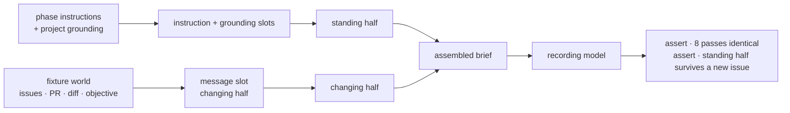

# LAB-136: Fixture proof — one phase's context recipe, byte-identical across eight passes — Implementation Spec

## Part I — The Case *(for the human)*

### 1. Problem — why it matters, why now

Conductor's product claim is that a phase of work gets exactly the context it needs, assembled
the same way on every pass. Nothing tests that today. If the assembly quietly varies between
passes — a timestamp here, a differently-ordered list there — then round eight does not behave
like round one, and the reliability the whole system is being built for is not there.

**Why now.** The two layers that would make the assembly observable — the world model and event
intake — are deliberately last in the epic's build order. On the current plan the claim stays
untested until everything sits on top of it. Proving it here costs a test file. Discovering it
after the substrate is built costs the substrate.

### 2. Solution in plain terms

Hand-build a small world as literal fixtures — a few issues, a pull request, its diff, the
objective they sit under — with no database and no event feed. Build **one** phase's context
recipe against it, then check two things: a person reads the resulting brief once and agrees it
is what that phase needs, and the machine runs the recipe eight times and gets the same bytes
every time.

The phase is **review**: the fixture list the issue names is exactly a reviewer's input set, its
inputs are the most volatile of any phase, and we already have a written standard for what a
review must cover — so the human read has something to check against rather than a feeling.

The brief is shaped as **a standing half and a small changing half**: the phase's instructions
and the project's grounding never vary, and only "this issue, this pull request" moves. That
shape is what makes byte-identity reachable at all, and cheap caching follows from it rather
than the other way round. The test and the design are the same thing.

**Nothing else ships.** No assembly framework, no recipe format, no store, no second phase.
If this grows a layer it has failed its own purpose.

**Philosophy** — tenet 2: a recipe is an ordered selection of what already goes into a
generator's instruction, grounding and message slots, not a new subsystem beside them. Tenet 7:
the passes run through the framework's own assembly, and the check is proved able to fail
before it is trusted. Tenet 3: nothing is added to the framework's public surface, and ending
with a written finding and no code kept is a legitimate outcome.

### 6. Decisions & rules — the sign-off surface

1. **The eight passes measure the brief the framework itself would hand a model, not a stand-in
   written for the test.**
   *Rejected:* a plain function over the fixtures returning a string — a dozen lines, proving
   only that our own test helper is deterministic.
   *Locks in:* what we learn transfers to anything built on the framework's assembly, and only
   to that. It also makes a red result a framework finding rather than a lab bug, which is why
   decision 3 sends it up rather than fixing it here.

2. **The proof also assembles two *different* issues and requires the standing half to be
   byte-identical between them.**
   *Rejected:* eight passes over one issue only.
   *Locks in:* every phase recipe from here on must keep issue-specific material out of its
   standing half. A phase that genuinely needs an issue-specific standing instruction will
   collide with this rule, and we will hear about it then — which is the point.

3. **If the brief drifts, this issue reports it and stops. It does not fix it.**
   *Rejected:* find the drift, fix it, re-run until green.
   *Locks in:* the issue cannot balloon into unscoped repair work. The cost is a triage cycle —
   drift lands as a written finding and a new issue, so the epic pauses on it deliberately
   instead of absorbing unknown work inside this one.

**Non-goals** — shared assembly machinery, a recipe format, reading the world from a store,
event intake, a second phase, and any change to a published package. *Keeping* the code is also
a non-goal: throwaway is an acceptable outcome and the written finding is the deliverable.

**Size:** Small — 7 files · 4 test behaviours · 2 doc surfaces · 1 PR.

---

### 3. Tradeoffs & alternatives

**Alternative: prove it with a real model run.** Send the brief to a real reviewer model and
judge the review it produces. Rejected — that answers a different question (was the review any
good?) and puts a nondeterministic model inside a determinism proof.

**The simpler approach: a pure function over fixtures, called eight times.** Genuinely
tempting, and it satisfies the literal wording of the issue. Insufficient because the drift
risk is not in the fixture-reading code we would write. It is in the assembly around it — how
grounding from several sources gets ordered and merged into one instruction block. A pure
function proves determinism of the one part nobody doubted.

**Where the complexity is:** making the check able to fail. Eight identical passes over
deterministic inputs pass by construction, so the proof is worth nothing until the same harness
has been shown to go red on a recipe deliberately built to drift.

### 4. Focus practices (1–5)

1. **Tenet 7 — a check that cannot fire is not a check.** The drifting variant is a required
   deliverable. Without it the eight-pass assertion is decoration.
2. **Tenet 3 — earn every addition.** Nothing is added to `packages/*`. If the implementation
   finds itself writing a helper a second phase would reuse, stop — that is the layer this
   issue exists in order *not* to build, and feeling the pull is itself a finding to write down.
3. **Tenet 2 — composition over features.** The recipe uses a generator's existing instruction
   / grounding / message slots. If it cannot, **that is the result**: write it up rather than
   routing around it with new machinery.
4. **BP-003 — verification evidence.** "Byte-identical" is executed, and the brief a human
   approved is committed as a file so the approval is an artifact rather than a memory.

### 5. What using it looks like (1–5 examples)

The brief the review phase is handed, in outline, with the boundary marked. The top half is
fixed by construction; only the bottom moves between runs.

```
─ standing half ─────────────────────────────
  You are reviewing a pull request. …            ← the phase's instructions
  <project>    how we build and what we value    ← the project's grounding
  <standards>  what a review must cover
  <objective>  the epic this work sits under
─ changing half ─────────────────────────────
  Issue LAB-129 — reported token usage drops …   ← this issue
  PR #1301 — 3 files, +47 −12                    ← this pull request
  <diff> …                                       ← this diff
```

**What the two assertions see:**

```
eight passes, same issue    → all eight briefs identical, byte for byte
two passes, issue A vs B    → the standing half identical; only the changing half differs
the drifting variant        → the eight-pass check goes red   (proves the check can fire)
```

---

## Part II — The Build Plan *(for the implementing agent)*

### 7. Technical design

The recipe is a generator definition. Its instruction and grounding slots become the standing
half; its message slot becomes the changing half. A model that does nothing but record what it
was handed makes the assembled brief observable without a real call.



- **`labs/conductor`** *(new, private)* — the fixture world, the review-phase recipe, the
  proof. Two source files and one spec file; the rest is package scaffolding. `labs/` is the
  right home per `labs/README.md`: a phase recipe is domain knowledge about how *we* run our
  SDLC, which tenet 4 keeps out of the framework.
- **`@flow-state-dev/core`, `@flow-state-dev/engine`, `@flow-state-dev/testing`** — consumed,
  **not modified.** The assembly seam is `assembleMessages` in
  `packages/core/src/blocks/internal/message-assembly.ts`; it already returns a
  `systemPrefixCount` marking exactly the standing/changing boundary this design depends on, so
  the boundary is read, not invented. `createMockModelResolver`
  (`packages/testing/src/mocks/mockGenerator.ts`) records the assembled array on each call.
- **Untouched:** every published package, `apps/docs`, the item taxonomy, the store adapters.

**Premise check.** The approach rests on "the assembled brief is observable from a test without
a real model or a store". Confirmed by reading the three seams above rather than by running
anything — the assembled array is what the model call receives, and the recording mock captures
it. No POC was built: the proof *is* the deliverable here, so a POC of it would be the same
code written twice.

**Sketch — pseudocode. Illustrative, not the contract. React to the shape.**

```
the review phase's recipe is one generator, three slots:

    instructions ← what a reviewer is for            ] never varies →
    grounding    ← how we build; what a review covers] the standing half
    message      ← this issue, this PR, this diff      varies per run → the changing half

the proof:

    eight times:
        assemble the brief from a FRESH copy of the fixture world
        capture what the recording model was handed
    assert all eight captures are the same bytes

    assemble once for issue A and once for issue B
    assert the standing half is identical between them

    assemble eight times with a variant whose grounding stamps the clock
    assert the eight-pass check FAILS            ← the check can fire
```

What this asks a reviewer: *is "the standing half must survive a change of issue" the right
invariant to hard-code, or does it over-constrain a phase that legitimately needs
issue-specific standing instructions?* Whether the slots are called `prompt`, `context` and
`user` is the implementer's to look up.

### 8. Implementation sequence

1. **Stand up `labs/conductor`** — `package.json` (private, workspace deps on core / engine /
   testing), `tsconfig.json`, `vitest.config.ts`, `README.md`, plus a `labs/conductor` entry in
   `knip.json` so the new files are not reported as unused. Nothing else.
   *Test:* the package's test script runs green with no tests. *Depends on:* nothing.
2. **The fixture world**, as literal objects in one module — a handful of issues, one pull
   request, its diff, the objective. No loaders, no JSON, no store. Each pass reads a fresh
   copy. *Test:* none on its own. *Depends on:* 1.
3. **The review-phase recipe**, as a generator whose slots split standing from changing per
   decision 2. *Test:* it assembles and the capture is non-empty. *Depends on:* 2.
4. **Commit the assembled brief as a readable file** and assert the recipe reproduces it.
   This file is the surface a human reads for the first assertion — it is a contract on the
   phase's observable output, not a snapshot of internals, so the usual snapshot objection
   (`.agents/skills/tdd/tests.md`) does not apply. *Test:* behaviour 1 in §10.
   *Depends on:* 3.
5. **Eight passes, byte-identical.** *Test:* behaviour 2. *Depends on:* 3.
6. **Two issues, standing half invariant.** *Test:* behaviour 3. *Depends on:* 3.
7. **The drift canary** — a variant recipe whose grounding stamps the clock, asserted to make
   step 5's check fail. *Test:* behaviour 4. *Depends on:* 5.
8. **Write the finding** into `labs/conductor/README.md`: what held, what did not, whether the
   pull toward shared machinery was felt, and what L4 therefore needs. Add the lab's row to
   `labs/README.md`.

**Removals:** none — this change supersedes no existing path. Recording that explicitly because
tenet 3 expects subtraction, and its absence here is a property of a greenfield lab rather than
an omission.

*(Each step cites the decision it implements rather than restating it; §6 is the one contract.)*

### 9. Edge cases & error handling

| Case | Expected |
|---|---|
| A grounding contribution reads the clock or a random value | The eight-pass check goes red. That is the instrument working, not a bug — see decision 3 |
| The recipe mutates the fixture world as it reads it | Each pass builds from a fresh copy, so a mutating recipe drifts and the check catches it. Do not defensively freeze the fixtures — that would hide a real drift source |
| Two issues produce different-length changing halves | Fine. Only the standing half is asserted invariant |
| The committed brief file no longer matches after a recipe edit | Intended signal. Regenerate deliberately and re-read it; a silently regenerated brief defeats the human assertion |
| Object key order inside a fixture | Fixed here, because the fixtures are literals. It stops being fixed the moment a store is involved — see the gap in §12 |
| Same-process repetition hides machine-level variance (locale, timezone, environment) | Not covered by this proof. Named as a gap in §12 rather than papered over with heuristics |

**Taxonomy:** there is no runtime error path — nothing here serves a request. A failing
assertion is the product, and decision 3 governs what happens next.

### 10. Testing strategy

**Goal check: none applies**, and the reason is the design. The outcome is a byte comparison
plus one human read of a committed file; introducing a real model would add nondeterminism to a
determinism proof and would answer a different question (§3). The model is stubbed *only* as a
recorder — it cannot influence the brief, so the assembly under test is the framework's real
one, not a mock of it (tenet 7).

**CI specs** — the behaviours, in observable terms:

1. **The brief is the approved one.** Assembling the review phase against the fixture world
   reproduces the committed brief exactly.
2. **Eight passes agree.** Eight independent assemblies from the same fixture world produce
   identical bytes.
3. **The standing half survives a new issue.** Assembling for two different fixture issues
   leaves the standing half byte-identical; only the changing half differs.
4. **The check can fire.** A variant recipe with one deliberately drifting grounding
   contribution makes behaviour 2 fail. Assert the failure, not a green.

Behaviour 4 is the one that is easy to get wrong: it must assert that the *harness* reports
drift, not merely that two strings differ. A test that compares two timestamps and finds them
unequal proves nothing about the check.

**Discipline:** `tdd`. The seam is a single block execution with a recording model — no HTTP,
no flow server, no store beyond the test runtime's own in-memory context. Every behaviour above
is a tracer bullet in one spec file.

### 11. Documentation plan

**No `apps/docs` changes required**, and no package README changes. Nothing user-facing changes:
no public API, no observable framework behaviour, no new concept a framework user would search
for. Anything under `apps/docs` is published documentation and this is an internal lab.

Two repo surfaces do change, both required by existing convention:

- **CREATE** `labs/conductor/README.md` — what the lab is, the one question it answers, how to
  run the proof, and the **finding**: what held, what did not, and what L4 therefore needs.
  `labs/README.md` requires each lab to document its own known gaps, and the finding is the
  deliverable of this issue, so it is not optional.
  *Voice risk:* this is internal, so it is exempt from the outsider rule — but keep it plain and
  resist writing it as a victory lap if the check passes.
- **EXTEND** `labs/README.md` — one row in the directory table, matching the register of the
  two rows already there.

### 12. Dependencies, open questions & follow-ups

**Dependencies: none.** Explicitly **not** blocked on LAB-133, LAB-134, LAB-135 or the harness
wrap — the world is fixtures, so nothing has to exist first. This can start immediately and in
parallel with them.

**Open questions:** none.

**Known gap (deliberate, not deferred work):** eight in-process passes catch the drift sources
that actually bite a recipe — clock reads, random values, iteration order, mutation between
passes. They do **not** catch variance across machines or processes: locale, timezone,
environment. Extending to separate processes was considered and rejected as apparatus this
issue does not need; if the epic later depends on cross-machine identity, that is its own
issue.

**Follow-ups (flagged, not built):**

- **L4's real scope** is downstream of this result. If the standing half holds, the working
  hypothesis becomes "a phase recipe needs no machinery beyond what the framework already
  assembles", and L4 shrinks to writing recipes. That hypothesis is not settled by this issue
  and must not be written up as if it were.
- **A framework finding, if one appears.** Non-determinism inside the assembly seam is a
  framework bug, not a lab bug — per decision 3 it is reported and filed, and per the epic's
  standing rule the fix would land in the framework rather than in conductor.

---

## Spec evolution

- **Spec drafted** — framed as a falsifiability problem rather than a feature; chose the review
  phase because the issue's own fixture list is a reviewer's input set; chose to assemble
  through the framework's real message assembly over a purpose-built function, so a red result
  means something; added the two assertions the eight-pass check alone does not make — the
  standing half surviving a change of issue, and the check being proved able to fail.
