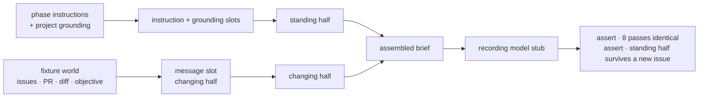

# LAB-136: Fixture proof — one phase's context recipe, byte-identical across eight passes — Implementation Spec

## Part I — The Case *(for the human)*

### 1. Problem — why it matters, why now

Conductor's product claim is that a phase of work gets exactly the context it needs, assembled
the same way on every pass. Nothing tests that today. If the assembly quietly varies between
passes — a timestamp here, a differently-ordered list there — then round eight does not behave
like round one, and the reliability the whole system is being built for is not there.

**Why now.** The two layers that would make the assembly observable — the world model and event
intake — are deliberately last in the epic's build order. On the current plan the claim stays
untested until everything sits on top of it. Proving it here costs a test file. Discovering it
after the substrate is built costs the substrate.

### 2. Solution in plain terms

Hand-build a small world as literal fixtures — a few issues, a pull request, its diff, the
objective they sit under — with no database and no event feed. Build **one** phase's context
recipe against it, then check two things: a person reads the resulting brief once and agrees it
is what that phase needs, and the machine runs the recipe eight times and gets the same bytes
every time.

The phase is **review**: the fixture list the issue names is exactly a reviewer's input set, its
inputs are the most volatile of any phase, and we already have a written standard for what a
review must cover — so the human read has something to check against rather than a feeling.

The brief is shaped as **a standing half and a small changing half**: the phase's instructions
and the project's grounding never vary, and only "this issue, this pull request" moves. That
shape is what makes byte-identity reachable at all, and cheap caching follows from it rather
than the other way round. The test and the design are the same thing.

**Why the second half of the proof is not optional.** The epic's context-assembly claim *is*
that split — a standing prefix identical on every run by construction, plus a small changing
tail. Eight passes over one issue cannot test it: nothing moved, so they pass by construction
whatever the recipe put where. Only assembling a *second* issue and finding the standing half
unmoved tests the shape rather than the plumbing. So this is not a product invariant borrowed
into a determinism proof — it is the determinism claim stated at the altitude where it can
actually fail.

**Nothing else ships.** No assembly framework, no recipe format, no store, no second phase.
If this grows a layer it has failed its own purpose.

**Philosophy** — tenet 2: a recipe is an ordered selection of what already goes into a
generator's instruction, grounding and message slots, not a new subsystem beside them. Tenet 7:
the passes run through the framework's own assembly, and the check is proved able to fail
before it is trusted. Tenet 3: nothing is added to the framework's public surface, and ending
with a written finding and no code kept is a legitimate outcome.

### 6. Decisions & rules — the sign-off surface

1. **The eight passes measure the brief the framework itself would hand a model, not a stand-in
   written for the test.**
   *Rejected:* a plain function over the fixtures returning a string — a dozen lines, proving
   only that our own test helper is deterministic.
   *Locks in:* what we learn transfers to anything built on the framework's assembly, and only
   to that. The proof lives in the framework's own test suite, so a red result is a framework
   finding by construction — which is why decision 3 sends it up rather than fixing it here.

2. **The proof also assembles two *different* issues and requires the standing half to be
   byte-identical between them.**
   *Rejected:* eight passes over one issue only — they pass by construction and would let us
   report a green that tested nothing (see §2, "Why the second half of the proof is not
   optional").
   *Locks in:* every phase recipe from here on must keep issue-specific material out of its
   standing half. The framework makes that self-enforcing rather than a rule to remember —
   the split is derived from *which slot* a value arrived in, not from reading its content, so
   misclassified material cannot be silently absorbed; it fails the moment a second issue is
   assembled. What stays genuinely open is whether some future phase legitimately needs an
   issue-specific standing instruction. We are not deciding that here, and whoever hits it will
   hit it as a test failure rather than as a latent bug.

3. **If the brief drifts, this issue reports it and stops. It does not fix it.**
   *Rejected:* find the drift, fix it, re-run until green.
   *Locks in:* the issue cannot balloon into unscoped repair work. The cost is a triage cycle —
   drift lands as a written finding and a new issue, so the epic pauses on it deliberately
   instead of absorbing unknown work inside this one.

**Non-goals** — shared assembly machinery, a recipe format, reading the world from a store,
event intake, a second phase, a new package, and any change to shipped code. *Keeping* the code
is also a non-goal: throwaway is an acceptable outcome and the written finding is the
deliverable.

**Size:** Small — 2 test files · 3 automated behaviours + 1 written artifact · 0 doc surfaces · 1 PR.

---

### 3. Tradeoffs & alternatives

**Alternative: prove it with a real model run.** Send the brief to a real reviewer model and
judge the review it produces. Rejected — that answers a different question (was the review any
good?) and puts a nondeterministic model inside a determinism proof.

**The simpler approach: a pure function over fixtures, called eight times.** Genuinely
tempting, and it satisfies the literal wording of the issue. Insufficient because the drift
risk is not in the fixture-reading code we would write. It is in the assembly around it — how
grounding from several sources gets ordered and merged into one instruction block. A pure
function proves determinism of the one part nobody doubted.

**Where the complexity is:** making the check able to fail. Eight identical passes over
deterministic inputs pass by construction, so the proof is worth nothing until the same harness
has been shown to go red on a recipe deliberately built to drift.

### 4. Focus practices (1–5)

1. **Tenet 7 — a check that cannot fire is not a check.** The drifting variant is a required
   deliverable. Without it the eight-pass assertion is decoration.
2. **Tenet 3 — earn every addition.** No shipped file changes and no package is created; the
   change is two files under an existing test folder. If the implementation finds itself writing
   a helper a second phase would reuse, stop — that is the layer this issue exists in order
   *not* to build, and feeling the pull is itself a finding to write down.
3. **Tenet 2 — composition over features.** The recipe uses a generator's existing instruction
   / grounding / message slots. If it cannot, **that is the result**: write it up rather than
   routing around it with new machinery.
4. **BP-003 — verification evidence.** "Byte-identical" is executed rather than asserted in
   prose, and the canary proves the comparison can fail before any green from it is believed.

### 5. What using it looks like (1–5 examples)

The brief the review phase is handed, in outline, with the boundary marked. The top half is
fixed by construction; only the bottom moves between runs.

```
─ standing half ─────────────────────────────
  You are reviewing a pull request. …            ← the phase's instructions
  <project>    how we build and what we value    ← the project's grounding
  <standards>  what a review must cover
  <objective>  the epic this work sits under
─ changing half ─────────────────────────────
  Issue ISSUE-1 — reported token usage drops …   ← this issue
  PR #101 — 3 files, +47 −12                     ← this pull request
  <diff> …                                       ← this diff
```

Fixture identifiers are invented (`ISSUE-1`, `#101`), never real tracker ids — BP-006 keeps
tracking labels out of tests, and a fixture naming a live issue invites someone to go look it up.

**What the assertions see:**

```
eight passes, same issue    → all eight briefs identical, byte for byte
two passes, issue A vs B    → the standing half identical; only the changing half differs
the drifting variant        → the eight-pass check goes red   (proves the check can fire)
```

---

## Part II — The Build Plan *(for the implementing agent)*

### 7. Technical design

The recipe is a generator definition. Its instruction and grounding slots become the standing
half; its message slot becomes the changing half. A model stub that does nothing but record
what it was handed makes the assembled brief observable without a real call.



- **`packages/core/test/blocks/`** — the whole change, beside `message-assembly.test.ts`, which
  tests the very seam this exercises. Nothing ships: `packages/*/test` is not published and is
  already a knip entry, so there is no package to create, no scaffolding, and no config row.
- **`packages/core/src/**`** — read, **never modified.** The assembly seam is `assembleMessages`
  (`packages/core/src/blocks/internal/message-assembly.ts`), reached the ordinary way, by
  executing a generator. The test imports nothing internal.
- **Untouched:** every published surface, `apps/docs`, `labs/`, the item taxonomy, the stores.

**The test harness is core's own, and it has to be.** `packages/core` does not depend on
`@flow-state-dev/testing` (and cannot — `testing` depends on `core`), so `testBlock` and
`createMockModelResolver` are unavailable here. Core's existing tests hand-build the context
instead: `createMockContext` from `packages/core/test/helpers.ts`, plus an inline
`resolveModel: () => ({ modelId, async generate(options) { … } })`. The stub's `options.messages`
**is** the assembled brief. That is the capture point, and it costs one closure.

**Where the standing/changing boundary comes from — and why not the obvious route.**
`assembleMessages` computes `systemPrefixCount`, and it is a declared field on the public item
contract (`GeneratorStepItem` in `packages/contracts/src/items/types.ts`), so reading it off an
emitted item looks like the clean answer. **It is not reachable for this recipe.** The only
emitter is `emitGeneratorStep`, and both of its call sites
(`packages/core/src/blocks/generator.ts`, the non-streaming and streaming loops) sit *after* a
guard that breaks first:

```
if (!runTools || (frameworkCalls.length === 0 && isTerminalStep)) { …; break; }
await emitGeneratorStep(…)      // never reached by a tool-free generator
```

The review recipe declares no tools, so step 0 is terminal, the loop breaks, and no
`generator_step` item is emitted at all — no `prelude`, no `systemPrefixCount`.

So **derive the boundary from the captured messages**: the leading run of `role: "system"`
entries. For *this* recipe that is exact rather than a heuristic — `assembleMessages` returns
`[...systemPrefix, ...history, ...user]`, the recipe declares no history slot, and its message
slot yields user-role messages. Because that exactness is a property of the recipe's shape and
not of the framework, **assert the precondition rather than assume it**: exactly one leading
system message, and no system-role message after it. If that assertion ever fails the
derivation is void, which is the correct outcome.

*Rejected:* giving the recipe a tool so the artifact fires. It would change the brief a human is
being asked to judge in order to make telemetry appear — the tail wagging the dog.

**Premise check.** Every claim above was verified by reading the named files, not by running
anything. No POC was built: the proof *is* the deliverable, so a POC of it would be the same
code written twice.

**Sketch — pseudocode. Illustrative, not the contract. React to the shape.**

```
the review phase's recipe is one generator, three slots:

    instructions ← what a reviewer is for            ] never varies →
    grounding    ← how we build; what a review covers] the standing half
    message      ← this issue, this PR, this diff      varies per run → the changing half

one named comparator, used by every check below and by the canary:

    briefsAgree(captures) → all captures render to the same bytes

the proof:

    eight times:
        run the recipe over a FRESH copy of the fixture world
        capture what the model stub was handed
    assert briefsAgree(the eight captures)

    assert exactly one leading system message, and none after it   ← precondition
    run once for issue A and once for issue B
    assert the leading system message is identical between them

    eight times with a variant whose grounding appends a per-call COUNTER
    assert briefsAgree(...) is FALSE                               ← the check can fire
```

What this asks a reviewer: *is deriving the boundary from the leading system run — with the
precondition asserted — sound, given the framework's own count is unreachable here?*

### 8. Implementation sequence

1. **The fixture world and the recipe**, in one test-support module beside the spec file.
   Literal objects — a handful of issues, one pull request, its diff, the objective. Invented
   identifiers (`ISSUE-1`, `#101`), never real tracker ids (BP-006). Each pass reads a fresh
   copy. *Depends on:* nothing.
2. **The capture helper and the comparator** — `createMockContext` plus an inline model stub
   that records `options.messages`, and one named comparator both the real check and the canary
   call. *Depends on:* 1.
3. **Eight passes, byte-identical.** *Test:* behaviour 1 in §10. *Depends on:* 2.
4. **The precondition, then two issues, standing half invariant.** *Test:* behaviour 2.
   *Depends on:* 2.
5. **The drift canary** — a variant whose grounding appends a per-call counter, asserted to make
   step 3's comparator return false. *Test:* behaviour 3. *Depends on:* 3.
6. **Write the finding**: the assembled brief itself, plus what held and what did not, as a
   file-header comment on the spec file and as a closing comment on the Linear issue. The brief
   is quoted **once**, as a record of what a human read and approved — not asserted against.

**Removals:** none — this supersedes no existing path. Recorded explicitly because tenet 3
expects subtraction, and its absence here is a property of a greenfield test rather than an
omission.

*(Each step cites the decision it implements rather than restating it; §6 is the one contract.)*

### 9. Edge cases & error handling

| Case | Expected |
|---|---|
| A grounding contribution reads the clock or a random value | The eight-pass check goes red. That is the instrument working, not a bug — see decision 3 |
| The recipe mutates the fixture world as it reads it | **Partially covered, and only one half.** A mutation that *accumulates across* passes makes pass 8 differ from pass 1, and the check catches it — that is the drift shape it exists for. A deterministic in-place mutation of a fresh copy produces identical output every pass and is invisible here. Do not add an assertion for it; nothing in this proof depends on it |
| Two issues produce different-length changing halves | Fine. Only the standing half is asserted invariant |
| More than one leading system message, or a system message after the first | The precondition assertion fails and behaviour 2 is void — correct, because the derived boundary no longer means what it claims |
| The canary passes | A failure of the canary's own design, not good news. It must use a per-call counter; a clock-stamped canary can land eight assemblies in one tick and pass intermittently |
| Same-process repetition hides machine-level variance (locale, timezone, environment) | Not covered. Named as a gap in §12 rather than papered over with heuristics |

**Taxonomy:** there is no runtime error path — nothing here serves a request. A failing
assertion is the product, and decision 3 governs what happens next.

### 10. Testing strategy

**Goal check: none applies**, and the reason is the design. The outcome is a byte comparison
plus one human read; introducing a real model would add nondeterminism to a determinism proof
and would answer a different question (§3). The model is stubbed *only* as a recorder — it
cannot influence the brief, so the assembly under test is the framework's real one, not a mock
of it (tenet 7).

**CI specs** — the behaviours, in observable terms:

1. **Eight passes agree.** Eight independent assemblies from the same fixture world produce
   identical bytes.
2. **The standing half survives a new issue.** With the precondition asserted first, assembling
   for two different fixture issues leaves the standing half byte-identical; only the changing
   half differs.
3. **The check can fire.** A variant recipe whose grounding appends a per-call counter makes
   behaviour 1's comparator return false. Assert the failure, not a green.

Behaviour 3 is the one that is easy to get wrong twice over. It must exercise the **same named
comparator** behaviour 1 uses — a canary that compares two strings its own way proves nothing
about the real check — and its drift source must be **deterministically different on every
call**. A counter is; a clock is not.

**Not automated, deliberately:** the brief a human reads and approves. It is quoted once in the
finding rather than committed as a fixture to reproduce. Pinning it would make every intentional
wording change a regenerate-and-re-read ritual, which is a poor trade under throwaway posture,
and it would create a second surface that can drift from the byte comparison.

**Discipline:** `tdd`. The seam is a single generator execution against a hand-built context —
no HTTP, no flow server, no store, and no dependency on `@flow-state-dev/testing`. All three
behaviours are tracer bullets in one spec file.

### 11. Documentation plan

**No documentation changes required.** Nothing user-facing changes: no public API, no observable
framework behaviour, no new concept a framework user would search for, and no shipped file. The
change is two files under `packages/core/test/`.

The finding still has a home, and it is not a doc surface: a file-header comment on the spec
file (BP-007 wants one anyway) carrying the assembled brief and what the proof showed, plus a
closing comment on the Linear issue, which is the durable copy the epic reads.

### 12. Dependencies, open questions & follow-ups

**Dependencies: none.** Explicitly **not** blocked on LAB-133, LAB-134, LAB-135 or the harness
wrap — the world is fixtures, so nothing has to exist first. This can start immediately and in
parallel with them.

**Open questions:** none.

**Settled during spec review** — recorded so the next reviewer, who will not have the thread,
cannot reopen them blind:

- **The standing/changing boundary is not readable from an emitted item for this recipe** —
  settled by reading, not by argument. `systemPrefixCount` reaches an item only through
  `emitGeneratorStep`, whose two call sites both sit behind a guard that breaks first when a
  step is terminal with no framework tool calls. A tool-free generator never emits one. The
  boundary is therefore derived from the leading system-role run, with the precondition
  asserted (§7).
- **Behaviour 2 is not a product invariant inside a determinism proof.** The epic's
  context-assembly claim *is* the standing/changing split, and eight passes over one issue pass
  by construction. See §2, "Why the second half of the proof is not optional".

**Known gap (deliberate, not deferred work):** eight in-process passes catch the drift sources
that actually bite a recipe — clock reads, random values, iteration order, mutation that
accumulates across passes. They do **not** catch variance across machines or processes: locale,
timezone, environment. Extending to separate processes was considered and rejected as apparatus
this issue does not need; if the epic later depends on cross-machine identity, that is its own
issue.

**Follow-ups (flagged, not built):**

- **L4's real scope** is downstream of this result. If the standing half holds, the working
  hypothesis becomes "a phase recipe needs no machinery beyond what the framework already
  assembles", and L4 shrinks to writing recipes. That hypothesis is not settled by this issue
  and must not be written up as if it were.
- **Whether a future phase legitimately needs an issue-specific standing instruction** is left
  open on purpose (decision 2). It surfaces as a test failure when someone hits it, which is the
  cheapest possible way to find out.
- **A framework finding, if one appears.** Non-determinism inside the assembly seam is a
  framework bug — per decision 3 it is reported and filed, and per the epic's standing rule the
  fix lands in the framework.

---

## Spec evolution

- **Spec drafted** — framed as a falsifiability problem rather than a feature; chose the review
  phase because the issue's own fixture list is a reviewer's input set; chose to assemble
  through the framework's real message assembly over a purpose-built function, so a red result
  means something; added the two assertions the eight-pass check alone does not make — the
  standing half surviving a change of issue, and the check being proved able to fail.
- **After spec review** — moved the proof out of a new `labs/conductor` package into
  `packages/core/test/blocks/`, because a package whose scaffolding outnumbers its content is
  the layer this issue exists not to build, and `labs/` is defined as real applications with
  durable state. Dropped the committed golden brief, because pinning it taxes every wording
  change and buys nothing the byte comparison does not already prove.
- **After spec review** — derived the standing/changing boundary from the leading system-role
  run instead of reading the framework's `systemPrefixCount`, because that field only reaches an
  emitted item for a tool-calling generator and this recipe has no tools. Put the canary on a
  per-call counter rather than the clock, because eight in-process assemblies can share a tick
  and a flaky canary is worse than none.
