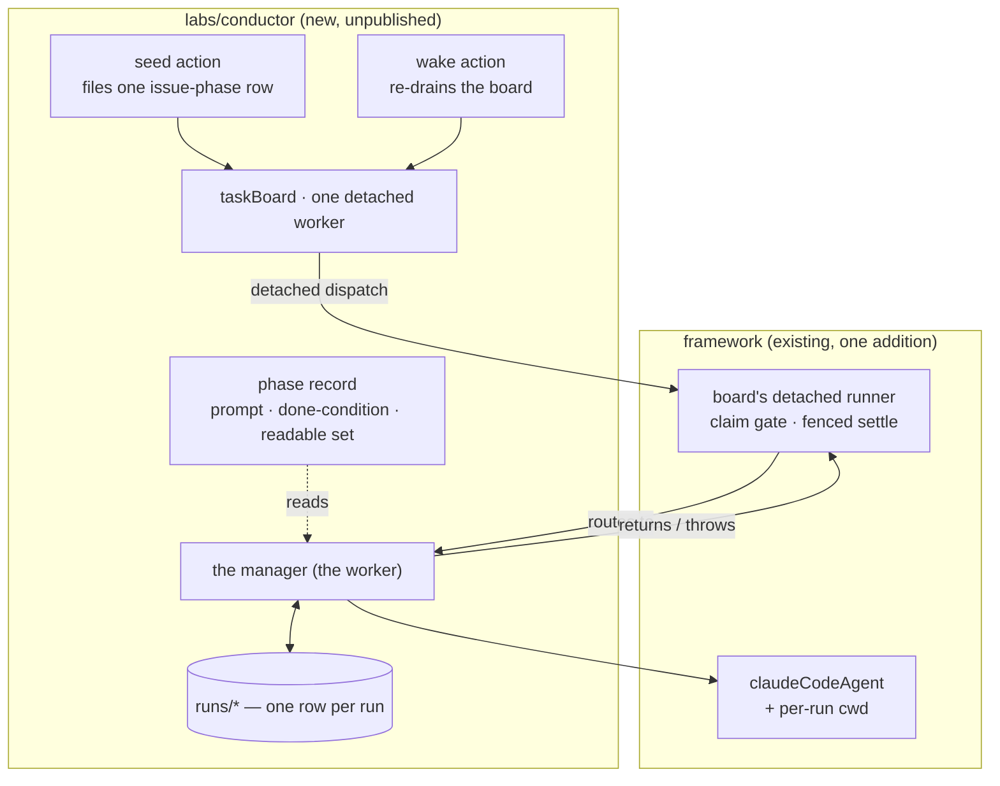

# LAB-138: The harness manager — a task row becomes a watched, settled coding run — Implementation Spec

## Part I — The Case *(for the human)*

### 1. Problem — why it matters, why now

Handing a coding job to Claude Code today is fire-and-forget. Nothing stays with the run while
it works, so a stall and steady progress look identical from outside, and whatever the run
produced has to be read out of a transcript by a person.

The expensive part is the part that looks fine. A run that exhausts its turn budget or its
spend does not fail — it finishes normally and reports the bad news *inside* its result. The
plumbing underneath treats any normal finish as success, so a run that produced nothing is
recorded as completed and is never tried again.

**Why now** — every later Conductor layer assumes a run is watched, judged and written down.
None of them can be built on a dispatch that returns and forgets.

### 2. Solution in plain terms

A row on a board becomes a supervised coding run: something claims the row, gives the run its
own checkout of the repository, starts it, stays with it until it stops, reads what came back,
writes it down, and then closes the row, runs it again, or leaves it for the next wake.

Two things make that supervision real rather than nominal. **The run works in its own
checkout** — today it edits whatever directory the server happens to sit in, which is the
conductor's own, and no option exists to change that. And **one place decides the verdict**,
before the row is settled, so a run that failed can never close as done.

**Philosophy** — tenet 5 (*fix at the owning layer*): the missing working directory is a
framework gap, so it is fixed there once for every caller rather than worked around, and the
verdict gets a single convergence point every exit passes through. Tenet 3 (*earn every
addition*): the only public surface added is that working directory. Tenet 7 (*prove the
goal*): the check is a real issue driven to a real pull request.

### 6. Decisions & rules — the sign-off surface

1. **A run's verdict comes from what the harness reported, and the row is settled only after
   it is read.**
   *Rejected:* settling on "the call came back without throwing" — today's behaviour, which
   reports a run that produced nothing as completed.
   *Locks in:* the board's failure count becomes trustworthy, which is what everything above
   it will budget against. It also means a failed run now costs us a second attempt, where
   before it silently cost nothing and delivered nothing. We are choosing the honest bill.

2. **When a run *fails*, the next attempt re-runs the agent from the beginning, in the
   checkout the first one left behind.**
   *Rejected:* carrying the run's conversation across a failure — continuing a coding session
   is owned elsewhere (FIX-1179 / FIX-1246) and is not built here.
   *Locks in:* a retry costs a full model run rather than a cheap resumption, so the retry
   budget is a real spending decision. In exchange, re-provisioning never resets a checkout,
   so uncommitted work from a previous attempt is never thrown away.
   **This is failure-retry and it is not the continue-after-a-question path.** Answering a run
   that asked a question is a *same-session* continue — a different mechanism for a different
   situation, LAB-139's to build on FIX-1179 / FIX-1246, and one where restarting the agent is
   explicitly not success. Nothing here sanctions restart as the way to resume a run that is
   waiting on a person.

3. **The only thing this adds to the published framework is the run's working directory. The
   swap-a-harness interface stays inside conductor, and the framework change ships first, as
   its own pull request.**
   *Rejected:* publishing a harness interface now. We have one harness and are building no
   second one, so it would be a shape guessed from a sample of one — and owed compatibility
   from the day it ships.
   *Locks in:* replacing the harness later is an internal edit with no release and no
   migration for anyone outside this repo. The working directory is public and we keep it.

**Where conductor lives — decided, not open.** `labs/conductor/`, unpublished, beside
`knowledge-hub` and `trading-desk` (product owner, PR
[#1362](https://github.com/fixpoint-labs/flow-state-dev/pull/1362), 2026-08-24). No
`@flow-state-dev/conductor` package is introduced.

**Non-goals** — the ask-and-answer half (a run that needs a decision, the inbox, the steer):
LAB-139, which depends on this. Continuing a coding session across a wait (consumed, not
built). The spec and review phase records and the gate between phases. Proving a second
harness. More than one issue on the board at a time. Any UI. The file-content projection
FIX-150 brings — the checkout provisioned here is the small placeholder its PR (c) subsumes.

**Size:** Large — 12 production files · 15 test behaviours · 4 doc surfaces · 2 PRs.

---

### 3. Tradeoffs & alternatives

**Alternative: make the framework throw when a run reports failure.** It would fix every caller
at once. Rejected: the framework deliberately hands back a description of what happened, and
other callers want to inspect a failed run rather than have it explode. Turning a reported
failure into a failure of *this row* is a policy, and it belongs to whatever owns the row.

**The simpler approach: let the run keep editing the server's own directory.** It is what
today's end-to-end coding check does, by putting absolute paths in the prompt. Insufficient
here — the point is a run driving *this* repository, so it would be editing the thing that
dispatched it, and prompt discipline is not a boundary.

**Where the complexity is:** not the loop. It is that "a working directory" has two halves.
Handing one to the harness is a line; the record of *which files the run touched* resolves
relative paths against the server's directory independently of it, so doing only the first half
yields a file index that quietly describes a different checkout. Nothing throws. §9 and §10 are
mostly about that.

### 4. Focus practices (1–5)

1. **One convergence point for the verdict** (tenet 5). Every exit from the run — finished,
   reported-failed, threw, hit the deadline — passes through one step that decides settle or
   retry. A second place that decides is a second answer.
2. **Tenet 7 — a check that cannot fire is not a check.** The shipped test for path recording
   computes its expectation the same way the code does, so it passes whatever the code does.
   The new one must run with a directory *different* from the server's, or it certifies nothing.
3. **BP-031 (never decide from caller-controllable input)** — the run's checkout drives where a
   coding agent writes, so it is an option the flow sets, never anything a model can reach.
4. **BP-030 and BP-035 together** — the off state and the second path are the same discipline
   here. No working directory configured must be today's behaviour byte for byte, and the second
   *attempt* is where everything this issue adds actually shows.

### 5. What using it looks like (1–5 examples)

**Giving a coding run its own working directory** *(the new framework option — today the same
block runs in the server's directory and nothing can change that):*

```ts
claudeCodeAgent({
  // What lets a detached board construct at all — no session-state schema on
  // the worker. It is a construction shim and nothing here rests on more.
  detached: true,
  recordWork: true,
  // Resolved per run, not fixed when the flow is built. An option and never an
  // input: this block is also exposed as a model-facing tool, and a working
  // directory on the input would let the model choose where it writes.
  cwd: async (_input, ctx) => (await currentRun(ctx)).workspacePath,
});
```

The run's file tools now address paths inside that checkout, and the record of what it touched
is keyed there too.

**Asking what happened, later, without opening a transcript:**

```
GET /sessions/<conductor session>/resources/runs?topicPrefix=runs/FIX-1219/implement

{ "sdkSessionId": "…", "workspacePath": "/…/worktrees/FIX-1219-implement",
  "branch": "fix/FIX-1219", "attempt": 2, "lastOutcome": "failed:max-turns",
  "costUsd": 1.94 }
```

The session id here is a copy conductor keeps so a reader can say which session a run was.
Nothing resumes from it — see §7.

**What a turn-cap exhaustion does (before / after):**

```
before  run stops at the turn cap → row settles "completed", nothing retried
after   run stops at the turn cap → row settles "failed", attempt 2 claimable,
        same checkout, `lastOutcome` says why
```

---

## Part II — The Build Plan *(for the implementing agent)*

### 7. Technical design

Two layers. The framework gains one capability it is missing; everything else is conductor's
own code in a new unpublished lab.



**What each piece owns.**

- **`@flow-state-dev/claude-code` (the only framework change).** The in-process SDK path gains
  a **per-run working directory**. It is a resolver, not a constant — the same shape the
  existing prompt option has — because one flow build serves every row. It is forwarded to the
  SDK, *and* threaded into the work recorder's path canonicalization, which today resolves
  against the server process's directory with no parameter for anything else
  (`sdk/work-recorder.ts`). Both halves or neither: forwarding without threading yields a file
  index describing a checkout the run never touched, with no error anywhere. This is the only
  surface that can host it — the CLI dispatch path shells out to a fire-and-forget cloud task
  with no way to watch a local run (`cli/dispatch.ts`).

  **It is an option, never a field on the block's input** — and that is a correctness
  constraint, not a style preference. The same block is exposed as a model-facing tool through
  the agent capability, so a working directory reachable from the input is a working directory
  the model can choose (BP-031). The block's input stays the prompt.
- **The board and its detached runner — used, not modified.** The runner already re-reads the
  claimed row, verifies the claim is still current and unexpired, marks the task scope,
  re-mints the claim ticket, and settles the row through ticket-fenced recorders. Conductor
  composes `board.drain` and writes a worker; it does not touch that machinery.
- **`flow.workstream` — entered, not built.** It is already the single action core a
  `source: "workstream"` dispatch resolves to. Starting a run enters it through the board's
  detached dispatch. **No second workstream verb is introduced** (epic theme 8), and none is
  needed: there is exactly one entry point and no caller chooses between two.
- **The manager** is a sequencer composed as that board's one detached worker: provision →
  open the run row → build the prompt → run the harness → read the verdict → decide. It holds
  its per-run values in **sequencer state and in `runs/*`** and declares **no
  `sessionStateSchema`** — a detached board refuses a worker that declares one, because every
  detached worker in a flow becomes a route on one shared workstream flow. **`detached: true`
  on the coding-agent block is what makes that construction succeed** — it is the
  board-construction shim, nothing more, and this spec neither relies on nor asserts anything
  about what else the flag governs.
- **The phase record** is a plain value the manager is constructed with: a prompt builder, a
  done-condition predicate, and the set of collections the phase may read. This issue writes
  the **implement** record and no other. Pointing the manager at a different record must
  require no edit to the manager (epic theme 2).
- **The harness port** is a conductor-local TypeScript interface with one implementation over
  `claudeCodeAgent`. Clause by clause (epic theme 7 — no clause names a Claude Code notion):
  a **prompt**, a **working directory**, and a **cancellation** the caller drives under a
  wall-clock deadline; back come **semantic success or failure**, a **terminal payload**, the
  **session identifier**, and **optionally** usage and cost. A turn cap is an adapter knob,
  not a clause. Nothing reads an exit code — the SDK handle has no process. **No decision may
  be load-bearing on usage or cost**, which the SDK reports as null when it does not know.

**The deadline needs no new surface.** The manager composes the harness step with
`.step(harness, { abortSignal: … })`, which core already supports and which composes into the
block's own signal; the SDK path already forwards that signal into the query's abort
controller. That is the "cancellable under a caller-enforced deadline" clause, satisfied by an
existing primitive.

**Where the run record lives.** `runs/*` is a resource collection at **session scope with one
identity across the session lineage**, so the child workstream that writes it and the
conductor session that reads it see one set. It is not model-writable: it is written by
conductor's blocks only, and the run's checkout path is read from it rather than from any
free-form field (BP-031). One row per issue-phase, carrying the harness session id, the child
session, the request id, the checkout path, the branch, the attempt, the last outcome and its
reason, and cost when reported.

**`runs/*` is conductor's bookkeeping, not the resume association.** The harness session id on
the row is a **copy**, kept so conductor can say which session a run was and so a person can
read it back — LAB-138 starts runs and never resumes one, so nothing here reads that copy back
to continue anything. **The association a resume reads from is a typed top-level field on the
task, owned by FIX-1179 / FIX-1246.** This spec does not design it, name its shape, or stand
anything in for it, and a `runs/*` row is not a substitute for it: it lives in the wrong place
(a conductor-local resource rather than the task) and is written for a different purpose.

**Bookkeeping still has to be fenced, and the board's fence does not reach it.** Two attempts on
one row can be alive at the same time. A lapsed lease does not terminate the older attempt —
nothing tells a worker its claim was taken, and the renewal driver only finds out by being
refused a write, so its abort signal is *"a bounded stop, not a prompt one"* and lags the loss by
up to a third of the lease (`tasks/lease-renewal.ts:137-145`, which also says outright that the
signal *"is not a substitute for the write fence"*). That fence covers **task settlement** — the
ticket-fenced recorders on the detached runner — and `runs/*` is a separate resource collection
that nothing in it reaches. So a superseded attempt can overwrite the live one's session, cost,
attempt or outcome, last-writer-wins, with no refusal. **Status would then lie, and lie most
plausibly exactly when something has already gone wrong.**

**Obligation: a write to the run record must be fenced against a superseded attempt.** The
mechanism is the implementer's — attempt-aware fencing on the write, or a monotonic update
discipline that only moves the row forward are both viable and this spec picks neither. The pass
criterion is not negotiable: **a superseded attempt's write is refused or ignored, never
applied.** §10 gives it a test that can fail.

**The attempt count is the board's, not a second counter.** The manager reads it from the row
it is running and never keeps its own — two places counting attempts is two answers that drift
(tenet 5).

**Solution sketch — pseudocode. Illustrative, not the contract. React to the shape.**

```
the manager, one detached worker on the board:

  provision:
      if this issue-phase already has a checkout   → use it, untouched
      else                                          → make one on its own branch
      never reset, never force, never discard uncommitted work

  open the run row:
      upsert runs/<issue>/<phase> with the attempt the board is running,
      the checkout path and the branch

  build the prompt:
      the phase record's builder, over the readable set
      re-evaluated NOW — not a value computed when the row was filed

  run:
      the harness port, given the prompt + the checkout,
      under a wall-clock deadline the manager sets

  read the verdict:                              ← the whole correctness point
      ask the run what happened; do not infer it from "the call returned"
      write outcome, session id, cost to the run row

  decide:
      failed                        → throw   (board fails the row; re-pends
                                               while the retry budget allows)
      finished but not done yet     → throw, with the reason recorded as
                                      "waiting" on the run row
      finished and the done-condition holds
                                    → return  (board completes the row)

the board's own runner does the settling: return → complete, throw → fail.
conductor adds no settlement path of its own.
```

What this asks a reviewer: *is "not done yet" honestly a failed attempt on today's substrate,
or does it need a status of its own?* It is deliberately the former here — a distinct
human-wait status is LAB-139's, and this issue has nothing that waits on a person. The
distinction that survives is the **recorded reason**, not a third exit.

**No proof-of-concept was built.** Every premise this rests on is either verified in source
(cited above) or already settled on the epic. The composition is an assembly of shipped
primitives, so a sketch conveys the shape and running code would add nothing a reviewer could
not read here.

### 8. Implementation sequence

**PR plan** (decision 3). Two nodes, sequential — the framework change is separately
reviewable and separately shippable, and burying it inside a new lab package is how a change
to a documented contract gets skimmed.

| sub-PR | deliverables | depends_on |
|---|---|---|
| a | the per-run working directory on the coding-agent path, both halves, with its docs | — |
| b | `labs/conductor` — the flow, the board, the manager, the run record, the implement record, the goal check | a |

**Sub-PR (a) — the framework capability.**

1. **Accept a per-run working directory** on the coding-agent block's options, as a resolver
   over the block's input and context, and forward it to the SDK query options. *Test:* it
   reaches the query; absent means today's call, unchanged. *Depends on:* nothing.
2. **Thread it into path canonicalization** so a relative path the run addressed resolves
   against the run's directory rather than the server's. **Keep the traversal-collapsing
   property** — the collection key normalizer rejects `..` segments and the recorder swallows
   the rejection, so an encoding that emits one drops entries silently. That rules out the
   obvious fix of joining against a root. *Test:* §10's directory-substitution behaviour.
   *Depends on:* 1.
3. **Correct the docblock that the change falsifies.** `canonicalFilePathKey`'s own
   documentation states the premise being removed — that the block forwards no working
   directory — and nothing tests a comment. *Depends on:* 2.
4. **Changeset** (BP-022, minor) and the doc surfaces in §11.

**Sub-PR (b) — conductor.**

5. **Scaffold `labs/conductor/`** — private package in the workspace, matching the shape
   `knowledge-hub` uses; a row in `labs/README.md`'s table. *Depends on:* nothing in (b).
6. **The run record** — the `runs/*` collection, its schema, and **the fence that refuses a
   superseded attempt's write** (§7's obligation). *Test:* a row round-trips and is readable from
   the conductor session while written from a child; and §10's two-attempt behaviour, which is
   the one that can actually fail. *Depends on:* 5.
7. **Workspace provisioning** — idempotent per issue-phase, on its own branch, never
   resetting. *Test:* §10's re-provisioning behaviours. *Depends on:* 5.
8. **The harness port and its Claude Code adapter** — the interface, and the one
   implementation that maps a run handle onto it, including the failure promotion. *Test:*
   §10's verdict behaviours, against a fake adapter. *Depends on:* 5, and on (a) for the
   working directory.
9. **The manager** — the sequencer, its decide step, the deadline. *Test:* §10's decide
   behaviours. *Depends on:* 6, 7, 8.
10. **The implement phase record** — prompt builder, done-condition, readable set.
    *Depends on:* 9.
11. **The conductor flow** — `kind: "conductor"`, the board with one detached worker, and the
    `seed` / `wake` / `status` actions. The seed action stamps a **retry budget** on the row;
    without one the substrate's default is single-attempt and decision 1's retry never
    happens. *Depends on:* 9, 10.
12. **The goal check** (§10) and the lab README. *Depends on:* 11.

**Removals.** None in the framework. In the goal check that currently drives a coding run
(`goals/harness-workstream/…`), the absolute-path workaround in its prompt is *not* removed —
that check is asserting something else and is left alone. Note it in §12 as a follow-up rather
than touching it here.

**Two cautions, both about things easy to break by accident.**

- **Do not relax the refusal of a detached worker that declares session state**, and do not
  give the manager one. The refusal's own message names the fix: keep the worker's state on
  the task. Here it is on the task's row and in `runs/*`.
- **Do not reorder the board's own drain composition.** The park-exit verdict travels by step
  adjacency — the completion block must sit directly after the per-task loop — and nothing
  catches a break at the type level. Conductor composes `board.drain` as a whole and has no
  reason to go inside it.

### 9. Edge cases & error handling

| Case | Expected |
|---|---|
| No working directory configured | Exactly today's behaviour on every path, including path recording (BP-030) |
| A relative path the run addressed | Keyed inside the run's checkout, with `..` still collapsed |
| A path the run addressed *outside* its checkout | Still recorded, still traversal-free — the recorder is a log, not a sandbox |
| Re-provisioning a checkout with uncommitted work | No-op. Never reset, never forced, never deleted |
| Re-provisioning after the branch was deleted underneath | Fail loudly and settle the attempt failed; do not silently create a divergent branch |
| The deadline fires mid-run | The run aborts, the attempt throws, the row fails and stays retryable within budget |
| The host dies mid-run | The lease lapses; the next wake's drain reclaims the row and re-dispatches. Recovery has its own budget, separate from the retry budget, so a crash does not spend a retry |
| The host shuts down mid-run | The detached-drain grace period defaults to a serverless shutdown window, which is far shorter than a coding run — a conductor host must raise it past its longest expected run or accept that a shutdown kills one. Configuration, not code, but it silently truncates every run if it is missed |
| A stale dispatch reaches the runner | Refused by the runner's existing claim gate; the manager never runs and writes nothing |
| The retry budget is exhausted | The row settles terminal; the run row's last outcome says why |
| Two wakes overlap | The board's claim is the only authority. The manager never decides from a liveness probe — there is none |
| **Two attempts alive at once on one row** | Only one settles the task — the board's fence refuses the superseded one. **The run record must refuse it too**: a lapsed lease does not stop the older attempt, and its abort lags the loss by about a third of the lease, so both are genuinely running and both would otherwise write. See §7's obligation |
| The harness reports no usage or cost | Recorded as unknown; no decision reads it |

**Taxonomy.** Everything the run itself produces — a turn cap, a spend cap, an execution error,
a deadline — is **retryable** and routes through the failure path with a recorded reason. A
stale or lost claim is **neither**: the attempt writes nothing and leaves the row to be
recovered. A malformed phase record or an unresolvable checkout is **fatal** to the attempt and
settles it failed; the retry budget then decides whether it is fatal to the row.

**Second path (BP-035).** The off-state of the new option is the common case for every existing
caller and is tested explicitly. The second attempt is the second path for the manager, and it
is where the interesting behaviour lives: the checkout survives, the conversation does not, and
the prompt is rebuilt from current state rather than replayed.

### 10. Testing strategy

**Goal.** A real Linear issue's implement phase, filed onto a conductor board, ends with a pull
request open and the row settled as completed — with the run's row carrying the harness session
id, the checkout path, the attempt and the cost. Real model, real run, no unit test standing in
for it. Lives at `goals/conductor/implement-phase-opens-a-pr/` with its own `goal.md`.

**Proposed issue: [FIX-1219](https://linear.app/fixpoint-labs/issue/FIX-1219)** — *the scheduled
dispatch header comment states the wrong auth/idempotency order.* **Pending the product owner's
confirmation.** The criteria it satisfies: comment-only in one file, no behaviour change, no
decision to make, and it lives in `packages/scheduled` — outside every package this epic touches,
so nothing about the fix can explain a failure of the join. Alternate if it is taken:
[FIX-1165](https://linear.app/fixpoint-labs/issue/FIX-1165), a one-template reordering, slightly
weaker isolation because where the metadata lands is a judgment call.

**Explicitly not FIX-1166**, which is LAB-139's Proof and must stay unspent.

Two things the goal check must do that a naive one would not: **read the outcome back through
the system's own routes** rather than from the block's return value, and **run in a checkout
that is not the server's**, so the working directory is actually exercised.

**CI specs** (mocked, deterministic — the behaviours, not the test names):

- **One behaviour per decision in §6**: a reported failure settles the row failed and leaves it
  claimable; a second attempt finds its checkout as the first left it; the framework surface is
  the working directory and nothing else public is added.
- **The verdict, at each exit**: finished-and-done, reported-failed, threw, deadline. Stated as
  what the board's row shows afterwards, not as what the manager returned.
- **The recording half of the working directory, with a directory that is not the process's.**
  This is the one that needs spelling out, because the shipped test cannot catch the regression:
  `work-recorder.spec.ts` asserts the recorded key equals the same expression the implementation
  computes, so it passes whether or not the directory is honoured. The new behaviour is: given a
  working directory different from the process's, a relative path the run addressed is keyed
  **inside that directory**. Prove it can fire — remove the threading and confirm it goes red.
- **What must not change**: with no working directory configured, every existing behaviour of
  the coding-agent block and its recorder is byte-for-byte as today.
- **Idempotent provisioning**: provisioning twice returns the same checkout, and the second call
  leaves uncommitted work untouched. Assert on the work still being there, not on a call count.
- **A superseded attempt cannot overwrite a live one's run record.** Stage two attempts against
  the same `runs/<issue>/<phase>` row — the older one writing *after* the replacement has already
  written — and assert the stale write **is refused or ignored, never applied**: the row still
  reads the replacement's attempt, session, outcome and cost. A test that only runs one attempt
  does not cover this, and neither does one that writes the two in order. Prove it can fire by
  removing the fence and confirming it goes red.
- **The manager is not implement-shaped**: pointed at a second, trivial phase record, it runs it
  without any edit to the manager (epic theme 2). This is a constraint check, not evidence for
  the phase-machine claim, and it should not be cited as one.
- **No session state is declared**: constructing the board with this manager succeeds. A
  regression here is a construction-time throw, so the assertion is that the board builds.

**Discipline.** `tdd`. Two seams, both reachable from vitest with no HTTP server: the recorder's
canonicalization for the framework half, and the manager sequencer over a fake harness port for
the decide half. Every behaviour above is a tracer bullet at one of them.

### 11. Documentation plan

- **EXTEND** `packages/claude-code/README.md` — a new subsection after *Running as detached
  background work*, covering the run's working directory: what it changes for the run's tools,
  and that the record of what the run touched follows it. One minimal example (the resolver form
  from §5, which is the shape that matters — a constant would teach the wrong thing for a block
  built once and run many times).
  *Voice risk:* do not explain why it was missing, or reference the issue. Describe what it does.
- **EXTEND** `apps/docs/docs/tools/claude-code-sdk.md` — a section in the same position, plus a
  read-through of *Limitations*: neither page says anything about a working directory today
  (checked), so this is an addition rather than a correction, and the job is to leave the two
  pages saying the same thing. Cross-link → from *Recording what the run did*, since the two
  interact and getting only half of it is the bug in §3.
  *Voice risk:* "sandbox" and "isolated" are both wrong — this is a working directory, not a
  boundary, and the file record is a log rather than a fence. Say so plainly.
- **CREATE** `labs/conductor/README.md` — what the lab is, what it does today (one phase, one
  issue at a time), what it does not do yet, and how to run it. Labs carry their own README and
  document their known gaps; that is the convention `labs/README.md` states.
- **EXTEND** `labs/README.md` — one row in the directory table.
- **No new page on the docs site, and no architecture-doc change.** Conductor is an unpublished
  lab, so it is not site documentation. The working directory is one section under an existing
  concept, not a term a user will search for on its own, and it alters no locked contract.

### 12. Dependencies, open questions & follow-ups

**Dependencies.** None blocking. Everything this composes ships today: the task board and its
detached runner, the workstream action core, the coding-agent block, resource collections
shared across a session lineage.

**Deliberately not dependencies, stated so the distinction is not lost:**

- **FIX-150** (workspaces) runs on its own track. The checkout provisioned here is a small
  placeholder its PR (c) subsumes, at which point the manager adopts that projection with no
  reshaping. Nothing here waits on it (epic theme 4).
- **Continuing a coding session** across a wait is **FIX-1179 / FIX-1246**'s, consumed by the
  epic and not built here. LAB-138 starts runs; it does not resume them, and decision 2 prices
  what a *failure* retry costs. The epic's own limit on this remains open and is not touched by
  this spec. **The association a resume reads from is a typed top-level field on the task and is
  FIX-1179's to design** — never `metadata` (BP-031), and never `runs/*`, whose copy of the id is
  conductor's bookkeeping (§7). Nothing here stands in for that field or makes it unnecessary.
- **LAB-139** depends on this one, not the other way round.

**Open questions:** none.

**Follow-ups (flagged, not built):**

- The existing coding-run goal check works around the missing working directory by putting
  absolute paths in its prompt. Once (a) lands, that workaround can go — but that check is
  asserting something else and is deliberately left alone here.
- Whether the board should be session-scoped-and-lineage-shared or user-scoped is settled in
  §7 for one conductor session and one board. A conductor that later runs several issues at
  once should re-examine it rather than inherit it.

---

## Spec evolution *(the change story, not an audit log)*

- **Spec drafted** — framed as *a run that is watched and honestly settled*, not as *a run that
  is dispatched*; located the one genuine framework gap (a per-run working directory, in both
  its halves) and kept everything else inside `labs/conductor`; made the verdict a single
  convergence point ahead of settlement, and priced a retry as a fresh run in a surviving
  checkout.
- **After the owner's review** — said in the document what `runs/*` is and is not: bookkeeping
  conductor reads, never the association a resume reads from, which stays FIX-1179's typed
  top-level task field. Split decision 2's failure-retry from the continue-after-a-question path
  so LAB-139 cannot inherit "restart is the way back in", and reframed `detached: true` as the
  board-construction shim rather than a statement about resume.
- **After spec review** — added the fence on the run record's writes, because a lapsed lease
  does not stop the attempt that held it and the board's settlement fence does not reach a
  separate resource collection, so a superseded attempt could overwrite a live one's session,
  cost or outcome and make status lie.
- **Named a goal-check issue** — FIX-1219, proposed rather than adopted, because FIX-1166 is
  LAB-139's Proof and must stay unspent.
