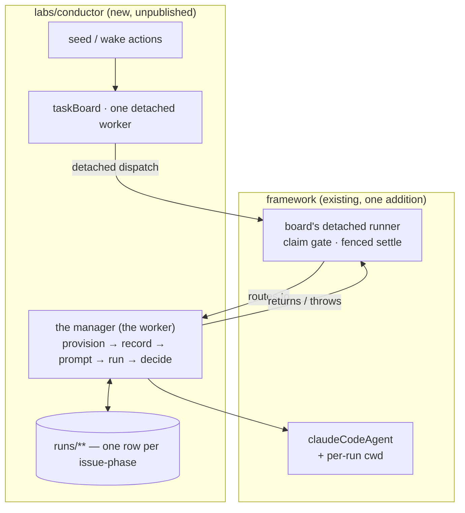

# LAB-138: The harness manager — a task row becomes a watched, settled coding run — Implementation Spec

## Part I — The Case *(for the human)*

### 1. Problem — why it matters, why now

Handing a coding job to Claude Code today is fire-and-forget. Nothing stays with the run while
it works, so a stall and steady progress look identical from outside, and whatever the run
produced has to be read out of a transcript by a person.

The expensive part is the part that looks fine. A run that exhausts its turn budget or its
spend does not fail — it finishes normally and reports the bad news *inside* its result. The
plumbing underneath treats any normal finish as success, so a run that produced nothing is
recorded as completed and is never tried again.

**Why now** — every later Conductor layer assumes a run is watched, judged and written down.
None of them can be built on a dispatch that returns and forgets.

### 2. Solution in plain terms

A row on a board becomes a supervised coding run: something claims the row, gives the run its
own checkout of the repository, starts it, stays with it until it stops, reads what came back,
writes it down, and then closes the row or lets it run again.

Two things make that supervision real rather than nominal. **The run works in its own
checkout** — today it edits whatever directory the server happens to sit in, which is the
conductor's own, and no option exists to change that. And **one place decides the verdict**,
before the row is settled, so a run that failed can never close as done.

**Philosophy** — tenet 5 (*fix at the owning layer*): the missing working directory is a
framework gap, so it is fixed there once for every caller rather than worked around, and the
verdict gets a single convergence point every exit passes through. Tenet 3 (*earn every
addition*): the only surface this adds anywhere is that working directory. Tenet 7 (*prove the
goal*): the check is a real issue driven to a real pull request.

### 6. Decisions & rules — the sign-off surface

1. **A run's verdict comes from what the harness reported, and the row is settled only after
   it is read. There are exactly two outcomes: the phase is done, or the attempt failed.**
   *Rejected:* settling on "the call came back without throwing" — today's behaviour, which
   reports a run that produced nothing as completed. Also rejected: a third "made progress but
   isn't finished" outcome, which would close a row for unfinished work.
   *Locks in:* the board's failure count becomes trustworthy, which is what everything above
   it will budget against. It also means a run that stops short now costs us a second attempt,
   where before it silently cost nothing and delivered nothing. We are choosing the honest bill.

2. **When an attempt fails, the next one re-runs the agent from the beginning, in the checkout
   the last one left behind — and is told why the last one stopped.**
   *Rejected:* carrying the run's conversation across a failure — continuing a coding session
   is owned elsewhere (FIX-1179 / FIX-1246) and is not built here.
   *Locks in:* a retry costs a full model run rather than a cheap resumption, so the retry
   budget is a real spending decision. It pays off only because two things carry forward: the
   work already on disk, which re-provisioning never resets, and the reason the last attempt
   stopped. Without the second, a deterministic failure is replayed once and the budget burns
   for nothing.
   **This is failure-retry and it is not the continue-after-a-question path.** Answering a run
   that asked a question is a *same-session* continue — a different mechanism for a different
   situation, LAB-139's to build on FIX-1179 / FIX-1246, and one where restarting the agent is
   explicitly not success. Nothing here sanctions restart as the way back into a run that is
   waiting on a person.

3. **A per-run working directory is the only thing this adds to the published framework, and no
   harness-swapping interface is built anywhere — published or conductor-local.**
   *Rejected:* a named harness port with an adapter behind it. We have one harness and are
   building no second one, so its shape would be guessed from a sample of one — and that
   argument does not turn on whether the file is exported. What ships instead is a small
   mapping at the point of decision, from what the run reported to done-or-failed.
   *Locks in:* the working directory is public from the day it ships and we keep it. Everything
   else about how a harness is driven stays changeable at will, with no release, no migration,
   and nothing for anyone outside this repo to depend on.

**Where conductor lives — decided, not open.** `labs/conductor/`, unpublished, beside
`knowledge-hub` and `trading-desk` (product owner, PR
[#1362](https://github.com/fixpoint-labs/flow-state-dev/pull/1362), 2026-08-24). No
`@flow-state-dev/conductor` package is introduced.

**Non-goals** — the ask-and-answer half (a run that needs a decision, the inbox, the steer):
LAB-139, which depends on this. Continuing a coding session across a wait (consumed, not
built). A third outcome for a run that is part-way — deferred to LAB-139 with the seam named
(§7). Per-attempt failure history beyond the last one (§7). The spec and review phases and the
gate between them. Proving a second harness. More than one issue on the board at a time. Any
UI. The file-content projection FIX-150 brings — the checkout provisioned here is the small
placeholder its later work replaces.

**Size:** Large — 9 production files · 16 test behaviours · 4 doc surfaces · 2 PRs.

---

### 3. Tradeoffs & alternatives

**Alternative: make the framework throw when a run reports failure.** It would fix every caller
at once. Rejected: the framework deliberately hands back a description of what happened, and
other callers want to inspect a failed run rather than have it explode. Turning a reported
failure into a failure of *this row* is a policy, and it belongs to whatever owns the row.

**The simpler approach: let the run keep editing the server's own directory.** It is what
today's end-to-end coding check does, by putting absolute paths in the prompt. Insufficient
here — the point is a run driving *this* repository, so it would be editing the thing that
dispatched it, and prompt discipline is not a boundary.

**Where the complexity is:** not the loop. It is **two attempts being alive at once**. A lease
can lapse while the attempt holding it is still running, and nothing tells that attempt it has
been superseded, so a replacement can start beside it. The board's own fence keeps them from
both settling the row — but it reaches neither the run record nor the working tree, and both of
those are things this issue introduces. §7 carries the two obligations that follow and §9 and
§10 are largely about them.

### 4. Focus practices (1–4)

1. **One convergence point for the verdict** (tenet 5). Every exit from the run — finished,
   reported-failed, threw, hit the deadline — passes through one step that decides settle or
   fail. A second place that decides is a second answer.
2. **Tenet 7 — a check that cannot fire is not a check.** The shipped test for path recording
   computes its expectation the same way the code does, so it passes whatever the code does.
   The new one must run with a directory *different* from the server's, or it certifies nothing.
   The same test applies to both fences in §7: stage the losing writer, or the test proves only
   the happy path.
3. **BP-031 (never decide from caller-controllable input)** — the run's checkout drives where a
   coding agent writes, so it is an option the flow sets, never anything a model can reach.
4. **BP-030 and BP-035 together** — the off state and the second path are the same discipline
   here. No working directory configured must be today's behaviour byte for byte, and the second
   *attempt* is where everything this issue adds actually shows.

### 5. What using it looks like (1–5 examples)

**Giving a coding run its own working directory** *(the new framework option — today the same
block runs in the server's directory and nothing can change that):*

```ts
claudeCodeAgent({
  // What lets a detached board construct at all — no session-state schema on
  // the worker. It is a construction shim and nothing here rests on more.
  detached: true,
  recordWork: true,
  // Resolved per run, not fixed when the flow is built. An option and never an
  // input: this block is also exposed as a model-facing tool, and a working
  // directory on the input would let the model choose where it writes.
  cwd: async (_input, ctx) => (await currentRun(ctx)).workspacePath,
});
```

The run's file tools now address paths inside that checkout, and the record of what it touched
is keyed there too.

**Asking what happened, later, without opening a transcript** — over the resource route that
already ships, so conductor adds no read action of its own. *(Illustrative of the information,
not of the wire shape — see §13 note (a).)*

```
GET /sessions/<conductor session>/resources/runs?topicPrefix=runs/FIX-1219/

{ "sdkSessionId": "…", "workspacePath": "/…/worktrees/FIX-1219-implement",
  "lastOutcome": "failed", "lastReason": "max-turns", "costUsd": 1.94 }
```

The session id is a copy conductor keeps so a reader can say which session a run was. Nothing
resumes from it — see §7.

**What a turn-cap exhaustion does (before / after):**

```
before  run stops at the turn cap → row settles "completed", nothing retried
after   run stops at the turn cap → row goes back to "pending" with the reason
        on it, attempt 2 claimable, same checkout, told why attempt 1 stopped
        (and "errored" instead, once the retry budget is spent)
```

---

## Part II — The Build Plan *(for the implementing agent)*

### 7. Technical design

Two layers. The framework gains one capability it is missing; everything else is conductor's
own code in a new unpublished lab.



**What each piece owns.**

- **`@flow-state-dev/claude-code` (the only framework change).** The in-process SDK path gains
  a **per-run working directory**. It is a resolver, not a constant — the same shape the
  existing prompt option has — because one flow build serves every row. **It has two halves and
  only doing one is the trap.** Forwarding it to the SDK is a line; the work recorder's path
  canonicalization resolves relative paths against the *server process's* directory with no
  parameter for anything else (`sdk/work-recorder.ts:109-125`, whose docblock states the premise
  this change removes). Forward without threading and the file index describes a checkout the run
  never touched — no throw, nothing empty, just wrong. **This is the one statement of that
  invariant; §8, §10 and §11 refer back here rather than restating it.** Whatever replaces the
  resolve must still collapse `..` segments, because the collection key normalizer rejects them
  and the recorder swallows the rejection, so entries would vanish silently.

  This is also the only surface that can host it: the CLI dispatch path shells out to a
  fire-and-forget cloud task with no way to watch a local run (`cli/dispatch.ts:1-11`).

  **It is an option, never a field on the block's input** — a correctness constraint, not a
  style preference. The same block is exposed as a model-facing tool through the agent
  capability, so a working directory reachable from the input is one the model can choose
  (BP-031). The block's input stays the prompt.

- **The board and its detached runner — used, not modified.** The runner already re-reads the
  claimed row, verifies the claim is still current and unexpired, marks the task scope, re-mints
  the claim ticket, and settles the row through ticket-fenced recorders. Conductor composes
  `board.drain` and writes a worker; it does not touch that machinery, and does not go inside the
  drain's own composition.

  **The board's own ledger is a deliverable, not a default — a detached board refuses three
  things at construction** (`task-board/detached.ts:355-408`), and a flow that leaves any of them
  implicit throws before `seed` can run:

  - an explicit, stable **`boardId`**, because it is hashed into the derived workstream session
    id and renaming it re-keys live workstreams;
  - a **durable ledger** — `defineTaskCollection()`, the only backing that outlives the request
    that claimed the row. The default request backing throws by name;
  - **`sharedToWorkstream: true`** if that ledger is session-scoped, or `user` / `org` scope
    instead, because a workstream runs in its own session and would otherwise resolve an empty
    ledger and loop.

  **Scope it to the session, with `sharedToWorkstream: true`**, deliberately rather than by
  default: one conductor session then owns one board and one set of run rows, which is the same
  lineage the run record uses (below) and keeps two conductor sessions from pooling their rows
  under the user. The cost is that the ledger's identity is the lineage root's; a conductor that
  later runs several issues at once should re-examine it (§12) rather than inherit it.

- **`flow.workstream` — entered, not built.** It is already the single action core a
  `source: "workstream"` dispatch resolves to. Starting a run enters it through the board's
  detached dispatch. **No second workstream verb is introduced** (epic theme 8), and none is
  needed: there is one entry point and no caller chooses between two.

- **The manager** is a sequencer composed as that board's one detached worker: provision → open
  the run row → build the prompt → run the harness → read the verdict → settle or fail. It holds
  its per-run values in **sequencer state and in `runs/**`** and declares **no
  `sessionStateSchema`** — a detached board refuses a worker that declares one, because every
  detached worker in a flow becomes a route on one shared workstream flow. **`detached: true` on
  the coding-agent block is what makes that construction succeed**; it is the board-construction
  shim and nothing here rests on more.

- **The phase surface is the manager's own options, not a record type.** The manager is
  constructed with a **prompt builder**, a **done-condition predicate** re-evaluated on each
  wake, and the **set of collections the phase may read**. `implement.ts` supplies the one set
  this issue ships. Epic theme 2 binds as it is written — *a manager that cannot be pointed at a
  different record without editing the manager has broken it* — and passing three values
  satisfies that literally. **A record type, a registry, or a second phase module would be
  abstraction for a set of one** and is deliberately not built; it can be introduced when the
  spec and review phases arrive and there is a second shape to generalise from.

**No harness port, and this is decision 3 applied consistently.** The manager reads the handle
`claudeCodeAgent` returns and maps it, at the decide step, to a verdict. **The verdict is the
contract, and it is stated here rather than in an interface file:** *the phase is done*, or
*this attempt failed and here is why* — plus, when the run got far enough to report them, the
session identifier, the terminal text, and usage and cost. Epic theme 7 is satisfied by what
that shape says, not by there being a named port: **no clause names a Claude Code notion.** A
turn cap is a reason a run stopped, not a field; nothing reads an exit code, because the handle
carries no process; and **no decision may be load-bearing on usage or cost**, which are null
whenever the SDK did not report them.

**One exit carries none of the optional half, and the spec says so rather than promising
otherwise.** When the SDK throws mid-stream, the block wraps and rethrows *before* any handle is
constructed, and the detached path persists no session id (`sdk/agent.ts`, the catch inside the
query loop). So on a thrown exit **there is no session id and no terminal text** — the manager
records the failure from the throw's message alone. That is accepted rather than fixed: closing
it would mean adding a failure-output surface to the framework, which is exactly the widening
past `cwd` that decision 3 rules out. The verdict itself is never ambiguous — a throw is a
failed attempt.

**The deadline needs no new surface.** The manager composes the harness step with
`.step(harness, { abortSignal: … })`, which core already supports and which composes into the
block's own signal; the SDK path already forwards that signal into the query's abort controller
(`sdk/agent.ts:434`). That is the cancellable-under-a-caller's-deadline obligation, met by an
existing primitive.

#### The run record

`runs/**` is a resource collection at **session scope with one identity across the session
lineage**, so the child workstream that writes it and the conductor session that reads it see
one set. It is not model-writable: conductor's blocks are its only writers, and the run's
checkout path is read from it rather than from any free-form field (BP-031).

**The deep wildcard is deliberate and a single `*` would not work.** A single-wildcard pattern
matches exactly one segment — `matchesPattern` rejects a key whose remainder contains a `/`
(`core/src/types/collection-patterns.ts:124-129`) — so a `runs/*` collection could never hold a
`<issue>/<phase>` key, and the upsert, the read and the goal check would all resolve nothing.
The two-segment key earns its keep over an encoded single segment because it makes
`runs/<issue>/` a real prefix query: *every phase of this issue* is the read a status view
wants, and an encoded key would need string surgery to answer it. It also means conductor needs
**no status action at all** — the shipped resource route serves that read (§5). **What the deep
wildcard costs** is that a prefix listing returns everything below the prefix at any depth, so
the key grammar has to stay exactly two segments by construction. That holds because conductor's
own blocks are the only writers; it is a rule the implementer keeps, not one the pattern
enforces.

**What the row carries, and which half is authoritative.** Authoritative — nothing else holds
it: the **harness session id**, the **checkout path and branch**, and the **last outcome and its
reason**. Denormalized — read from it for convenience, owned elsewhere: the child session and
request id (the runtime's), and **the attempt count, which is the board row's**. The manager
reads the attempt from the row it is running and never keeps its own; two places counting
attempts is two answers that drift (tenet 5). Cost is recorded when the run reported it and is
absent otherwise.

**The row keeps the last outcome only, and that is a stated call rather than an oversight.**
Attempt 1's reason is overwritten when attempt 2 starts. It is sufficient because **the prompt
builder's readable set includes the run's own row**, so every attempt is told why its
predecessor stopped — which is the one step back a retry needs, and what makes decision 2's
economics work at all. Anything deeper is the child session's own item stream and its
`observed-*` collections, addressable by the session id the row carries. If the implementer
finds one step back is not enough, the fix is a short per-attempt array on this row, and that is
a spec blind spot to surface rather than a silent addition.

**`runs/**` is conductor's bookkeeping, not the resume association.** The session id on the row
is a **copy**, kept so conductor can say which session a run was; LAB-138 starts runs and never
resumes one, so nothing here reads that copy back to continue anything. **The association a
resume reads from is a typed top-level field on the task, owned by FIX-1179 / FIX-1246.** This
spec does not design it, name its shape, or stand anything in for it, and a `runs/**` row is not
a substitute: it lives in the wrong place — a conductor-local resource rather than the task —
and is written for a different purpose.

#### Two attempts alive at once — the two fences this issue owes

A lapsed lease does not terminate the attempt that held it. Nothing tells a worker its claim was
taken; the renewal driver only learns by being refused a write, so its abort signal is *"a
bounded stop, not a prompt one"* and lags the loss by up to about a third of the lease
(`tasks/lease-renewal.ts:137-145`, which also says outright that the signal *"is not a
substitute for the write fence"*). The board's write fence covers **task settlement** — the
ticket-fenced recorders on the detached runner — and reaches neither of the two things below.

**Obligation A — a write to the run record must be fenced against a superseded attempt.**
Otherwise the older attempt overwrites the live one's session, outcome or cost, last-writer-wins,
with no refusal, and **status lies exactly when something has already gone wrong**. Mechanism is
the implementer's: attempt-aware fencing on the write, or a monotonic update discipline that only
moves the row forward. **Pass criterion: a superseded attempt's write is refused or ignored,
never applied.**

**Obligation B — two live attempts never share a working tree.** This is the worse half: a stale
row misreports, but two coding agents in one checkout **corrupt the artifact the run exists to
produce**. The two shapes are not equivalent and the spec says why rather than picking. **An
on-disk ownership fence** — a reclaimed attempt takes ownership before touching a checkout and
refuses if it cannot — keeps decision 2 intact, because the tree and its uncommitted work still
carry forward. **A per-attempt checkout directory** satisfies the criterion trivially but gives
up decision 2's carry-forward unless the previous attempt had committed, so it is not the free
option it looks like. Whichever is chosen must satisfy both this criterion and decision 2; if it
cannot, that is a spec blind spot to surface.

*The distinction decision 2 rests on: a **settled** failed attempt handing its tree to the next
one is intended and safe, because only one attempt is alive. The hazard is exclusively
**concurrent** attempts, which a lapsed lease produces without announcing it.*

**Solution sketch — pseudocode. Illustrative, not the contract. React to the shape.**

```
the manager, one detached worker on the board:

  provision:
      if this issue-phase already has a checkout   → take ownership, use it
      else                                          → make one on its own branch
      never reset, never force, never discard uncommitted work
      refuse rather than share a tree with a live attempt      (obligation B)

  open the run row:
      upsert runs/<issue>/<phase>, fenced against a superseded
      attempt, with the checkout path and branch                (obligation A)

  build the prompt:
      the manager's prompt builder, over its readable set —
      which includes this row, so the attempt is told why the
      last one stopped
      re-evaluated NOW, not computed when the row was filed

  run:
      the coding agent, given the prompt + the checkout,
      under a wall-clock deadline the manager sets

  read the verdict:                              ← the whole correctness point
      ask the run what happened; never infer it from "the call returned"
      write outcome + reason (+ session, cost when reported) to the row

  decide — two outcomes, no third:
      the done-condition holds   → return   (board completes the row)
      anything else              → throw    (board fails the row: back to
                                             pending with the reason, or
                                             errored once the budget is spent)

the board's own runner does the settling. conductor adds no settlement path.
```

**Why there is no third outcome, and what LAB-139 inherits.** "It made progress but is not
finished" would have to settle the row either done (dishonest — decision 1 exists to kill that)
or waiting (a status this issue has no use for, since nothing here waits on a person). So v1's
done-condition for implement is exactly *a pull request exists for this issue-phase*, and
anything else is a failed attempt. **This is a deliberate deferral, and what LAB-139 inherits is
a two-outcome manager with the seam for a third named here — not a half-built state machine.**
Adding a parked-on-a-person outcome is LAB-139's to define, on the substrate it consumes.

### 8. Implementation sequence

**PR plan** (decision 3). Two nodes, sequential — the framework change is separately reviewable
and separately shippable, and burying a change to a documented contract inside a new lab package
is how it gets skimmed.

| sub-PR | deliverables | depends_on |
|---|---|---|
| a | the per-run working directory on the coding-agent path, both halves, with its docs | — |
| b | `labs/conductor` — the flow, the board, the manager, the run record, the goal check | a |

**Sub-PR (a) — the framework capability.**

1. **Accept a per-run working directory** on the coding-agent block's options, as a resolver over
   the block's input and context, and forward it to the SDK query options. *Test:* it reaches the
   query; absent means today's call, unchanged. *Depends on:* nothing.
2. **Thread it into path canonicalization**, per §7's invariant — including the `..`-collapsing
   property, which rules out joining against a root. *Test:* §10's directory-substitution
   behaviour. *Depends on:* 1.
3. **Correct the docblock the change falsifies** (§7 names it). Nothing tests a comment.
   *Depends on:* 2.
4. **Changeset** (BP-022, minor) and the doc surfaces in §11.

**Sub-PR (b) — conductor.** Nine production files across both PRs; (b) is six.

5. **Scaffold `labs/conductor/`** — private package in the workspace, matching the shape
   `knowledge-hub` uses, plus a row in `labs/README.md`'s table. **Do not scaffold the flow from
   blank:** `goals/harness-workstream/mirrors-a-coding-run-as-workstream-items/run.mts` already
   wires a task board, a detached `claudeCodeAgent` and HTTP readback end to end. Start from its
   shape; what LAB-138 adds on top is the working directory, the verdict convergence, the retry
   budget, provisioning and the run record.
6. **The run record** — the `runs/**` collection, its schema, and **obligation A's fence**.
   *Test:* a row round-trips and is readable from the conductor session while written from a
   child; and §10's two-attempt behaviour, which is the one that can fail. *Depends on:* 5.
7. **Workspace provisioning** — idempotent per issue-phase, on its own branch, never resetting,
   plus **obligation B's fence**. **Evaluate the Agent SDK's own working-directory settings and a
   minimal worktree helper before writing a general git layer**; this is meant to be small.
   *Test:* §10's provisioning behaviours. *Depends on:* 5.
8. **The manager** — the sequencer, its verdict mapping, its decide step, the deadline, and the
   implement prompt builder / done-condition / readable set it is constructed with. *Test:* §10's
   verdict and decide behaviours, against a stubbed agent resolver. *Depends on:* 6, 7, and on
   (a) for the working directory.
9. **The conductor flow** — `kind: "conductor"`, **the board's own durable ledger with its
   explicit `boardId` and lineage-shared scope** (§7 — a detached board refuses all three at
   construction, so this is the first thing to get right, not the last), the board with one
   detached worker, and the `seed` and `wake` actions. No `status` action: the shipped resource
   route is intended to serve that read (§7), subject to note (a) in §13. The seed action stamps
   a **retry budget** on the row; without one the substrate's default is single-attempt and
   decision 1's retry never happens. *Depends on:* 8.
10. **The goal check** (§10) and the lab README. *Depends on:* 9.

**Removals.** None in the framework. The absolute-path workaround in the existing coding goal
check is *not* removed — that check asserts something else and is left alone; noted in §12.

**Two cautions, both easy to break by accident.**

- **Do not relax the refusal of a detached worker that declares session state**, and do not give
  the manager one. The refusal's own message names the fix: keep the worker's state on the task.
  Here it is on the task's row and in `runs/**`.
- **Do not reorder the board's own drain composition.** The park-exit verdict travels by step
  adjacency — the completion block must sit directly after the per-task loop — and nothing catches
  a break at the type level. Conductor composes `board.drain` whole and has no reason to go inside.

### 9. Edge cases & error handling

The substrate's vocabulary, since it decides what these rows mean: a failed attempt goes back to
**`pending`** with the error captured as `feedback` while the retry budget allows, and to
terminal **`errored`** once it is spent. There is no `failed` status.

| Case | Expected |
|---|---|
| No working directory configured | Exactly today's behaviour on every path, including path recording (BP-030) |
| A relative path the run addressed | Keyed inside the run's checkout, with `..` still collapsed |
| A path the run addressed *outside* its checkout | Still recorded, still traversal-free — the recorder is a log, not a sandbox |
| Re-provisioning a checkout with uncommitted work | No-op on the tree. Never reset, never forced, never deleted |
| Re-provisioning after the branch was deleted underneath | Fail loudly and fail the attempt; never silently create a divergent branch |
| The run threw mid-stream | No session id and no terminal text exist on that path (§7). The attempt fails on the throw's message |
| The deadline fires mid-run | The run aborts, the attempt throws, the row re-pends within budget |
| The host dies mid-run | The lease lapses; the next wake's drain reclaims and re-dispatches. Recovery has its own budget, separate from the retry budget, so a crash does not spend a retry |
| The host shuts down mid-run | The detached-drain grace period defaults to a serverless shutdown window, far shorter than a coding run. An in-process conductor host must raise it past its longest expected run or accept that a shutdown kills one — configuration, not code, and silently truncating if missed. **On a queue-consuming topology that setting does not apply at all**; see §13 note (b) |
| **Two attempts alive at once** | Only one settles the task — the board's fence refuses the other. The run record refuses it too (obligation A), and neither one shares the other's working tree (obligation B) |
| A stale dispatch reaches the runner | Refused by the runner's existing claim gate; the manager never runs and writes nothing |
| The retry budget is exhausted | The row settles `errored`; the run row's last outcome and reason say why |
| Two wakes overlap | The board's claim is the only authority. The manager never decides from a liveness probe — there is none |
| The harness reports no usage or cost | Recorded as unknown; no decision reads it |

**Taxonomy.** Everything the run produces — a turn cap, a spend cap, an execution error, a
deadline, a done-condition that does not hold — is **retryable** and routes through the failure
path with a recorded reason. A stale or lost claim is **neither**: the attempt writes nothing and
leaves the row to be recovered. A malformed configuration or an unresolvable checkout is **fatal
to the attempt**; the retry budget then decides whether it is fatal to the row.

**Second path (BP-035).** The off state of the new option is the common case for every existing
caller and is tested explicitly. The second *attempt* is the second path for the manager, and it
is where the interesting behaviour lives: the checkout survives, the conversation does not, and
the prompt is rebuilt from current state — which includes why the last attempt stopped.

### 10. Testing strategy

**Goal.** A real Linear issue's implement phase, filed onto a conductor board, ends with a pull
request open and the row settled as completed — with the run's row carrying the harness session
id, the checkout path and the cost. Real model, real run, no unit test standing in for it. Lives
at `goals/conductor/implement-phase-opens-a-pr/` with its own `goal.md`.

**What the subject must be, and the proposal — the subject is not yet chosen.** The criteria come
first, so they survive if a different issue is named: **an existing, real, small Linear issue**;
**self-contained**, with no decision to make while it runs, since none of the ask-and-wait
dependencies have landed; and **outside every package this epic touches**, so nothing about the
fix can explain a failure of the join. **Explicitly not FIX-1166**, which is LAB-139's Proof and
stays unspent.

**Proposed, awaiting the product owner's confirmation:**
[FIX-1219](https://linear.app/fixpoint-labs/issue/FIX-1219) — *the scheduled dispatch header
comment states the wrong auth/idempotency order.* Comment-only in one file, no behaviour change,
and it lives in `packages/scheduled`. Nothing downstream may assume it: the goal check names its
subject once the owner has picked one.

Two things the goal check must do that a naive one would not: **read the outcome back through the
system's own routes** rather than from a block's return value, and **run in a checkout that is not
the server's**, so the working directory is actually exercised.

**CI specs** (16 behaviours, in observable terms — not test names):

1. A **reported failure** puts the board row back to `pending` with the reason on it, and to
   `errored` once the budget is spent (decision 1).
2. A **second attempt finds its checkout as the first left it**, uncommitted work included
   (decision 2).
3–6. **The verdict at each exit**: done-condition holds · the run reported failure · the run threw
   · the deadline fired. Stated as what the board row and the run row show afterwards, not as what
   the manager returned.
7. **The recording half of the working directory, with a directory that is not the process's.**
   The one that needs spelling out, because the shipped test cannot catch the regression:
   `work-recorder.spec.ts:386-389` asserts the recorded key equals the same expression the
   implementation computes, so it passes either way. The new behaviour: given a working directory
   different from the process's, a relative path the run addressed is keyed **inside that
   directory**. Prove it can fire — remove the threading and confirm it goes red.
8. **What must not change**: with no working directory configured, the coding-agent block and its
   recorder behave byte for byte as today.
9. **Idempotent provisioning**: twice returns the same checkout and the second call leaves
   uncommitted work untouched. Assert on the work still being there, not on a call count.
10. **Obligation A**: stage two attempts against one `runs/<issue>/<phase>` row, the older one
    writing *after* the replacement already wrote, and assert the stale write **is refused or
    ignored, never applied** — the row still reads the replacement's session, outcome and reason.
    A single-attempt test does not cover this, and neither does writing the two in order.
11. **Obligation B**: a second attempt cannot begin work in a tree a live attempt holds. Assert
    the losing attempt is refused or given its own tree — never that it proceeds.
12. **The prompt sees the last failure**: the builder's readable set reaches the run's own row, so
    attempt 2's prompt carries attempt 1's reason.
13. **The manager is not implement-shaped**: pointed at a second, trivial set of phase values, it
    runs it with no edit to the manager (epic theme 2). A constraint check, not evidence for the
    phase-machine claim, and not to be cited as one.
14. **No session state is declared**: constructing the board with this manager succeeds. The
    regression is a construction-time throw, so the assertion is that the board builds.
15. **The `runs/**` pattern resolves the keys it is written with** — an upsert at
    `runs/<issue>/<phase>` is readable, and a `runs/<issue>/` prefix read returns it.
16. **The cross-layer path, deterministically.** A `testFlow` / `runAction` scenario with a stubbed
    agent resolver that exercises detached dispatch into a child session, the claim gate, the
    lineage-shared board, and fenced settlement — asserting **the board row** after the run. This
    is what makes 1, 3–6 and 11 falsifiable end to end rather than aspirational; the unit seams
    cannot reach any of it, and the real-model goal only walks the happy path.

**Discipline.** `tdd`. Three seams, none needing an HTTP server: the recorder's canonicalization
(framework half), the manager sequencer over a stubbed `resolveClaudeAgent` (verdict half), and
`testFlow` / `runAction` for behaviour 16.

### 11. Documentation plan

- **EXTEND** `packages/claude-code/README.md` — a new subsection after *Running as detached
  background work*, covering the run's working directory: what it changes for the run's tools, and
  that the record of what the run touched follows it (§7 carries the reasoning; the docs carry the
  behaviour). One minimal example, the resolver form from §5 — a constant would teach the wrong
  thing for a block built once and run many times.
  *Voice risk:* do not explain why it was missing or reference the issue. Describe what it does.
- **EXTEND** `apps/docs/docs/tools/claude-code-sdk.md` — a section in the same position, plus a
  read-through of *Limitations*. Neither page says anything about a working directory today
  (checked), so this is an addition rather than a correction, and the job is to leave the two pages
  saying the same thing. Cross-link → from *Recording what the run did*, since the two interact.
  *Voice risk:* "sandbox" and "isolated" are both wrong — this is a working directory, not a
  boundary, and the file record is a log rather than a fence.
- **CREATE** `labs/conductor/README.md` — what the lab is, what it does today (one phase, one issue
  at a time, two outcomes), what it does not do yet, and how to run it. Labs carry their own README
  and document their known gaps.
- **EXTEND** `labs/README.md` — one row in the directory table.
- **No new page on the docs site, and no architecture-doc change.** Conductor is an unpublished
  lab, so it is not site documentation. The working directory is one section under an existing
  concept, not a term users search for on its own, and it alters no locked contract.

### 12. Dependencies, open questions & follow-ups

**Dependencies.** None blocking. Everything this composes ships today: the task board and its
detached runner, the workstream action core, the coding-agent block, resource collections shared
across a session lineage.

**Deliberately not dependencies, stated so the distinction is not lost:**

- **FIX-150** (workspaces) runs on its own track. The checkout provisioned here is a small
  placeholder its later work replaces — and it replaces **the provisioning module**, not the
  manager's shape, which is what keeps it a swap rather than a reshaping. Nothing here waits on it
  (epic theme 4).
- **Continuing a coding session** across a wait is **FIX-1179 / FIX-1246**'s. Ownership is
  settled, the epic's Proof requires it, and this spec **consumes it and does not build it**.
  LAB-138 starts runs; it does not resume them, and decision 2 prices what a *failure* retry
  costs. **The association a resume reads from is a typed top-level field on the task and is
  FIX-1179's to design** — never `metadata` (BP-031), and never `runs/**`, whose copy of the id is
  conductor's bookkeeping (§7). Nothing here stands in for that field or makes it unnecessary, and
  nothing here re-asks the question.
- **LAB-139** depends on this one, not the other way round.

**Open questions:** none.

**Follow-ups (flagged, not built):**

- The existing coding-run goal check works around the missing working directory with absolute
  paths in its prompt. Once (a) lands the workaround can go, but that check asserts something else
  and is deliberately left alone here.
- Whether the board is session-scoped-and-lineage-shared or user-scoped is settled in §7 for one
  conductor session and one board. A conductor that later runs several issues at once should
  re-examine it rather than inherit it.
- A short per-attempt history on the run row, if one-step-back diagnosis proves insufficient (§7).

### 13. Review notes for the implementer

**Two to confirm against the code before you rely on them.** Both are things review found that a
competent implementer meets with the source open; neither changes the design, and both would
change how a step is built.

- **(a) The collection read route is gated, and its response shape is not the flat row §5 shows.**
  A collection's state read returns **403** unless the collection declares `client.state.read:
  true` (`handleListCollectionState()` enforces it), the readable fields need an explicit
  `client.expose` projection, and the route answers with a **collection envelope carrying
  `items[].clientData`**, not a bare object. §5's example is illustrative of the *information*, not
  the wire shape. **This is load-bearing for one decision:** §7 defers a `status` action *because*
  the run record is readable over the shipped route. Confirm that read works, with the declarations
  it needs, before treating the deferral as free — if it does not, a small read action comes back.
- **(b) The shutdown budget depends on the deployment topology.** §9's advice to raise the
  detached-drain grace period governs **in-process detached children only**. For a queued
  `colocated` or `worker-only` deployment, `dispose()` waits for the worker separately and without
  that timeout, so the platform's kill timeout is the real ceiling
  (`docs/architecture/detached-work.md:45-74`). Name the intended topology in the lab's README, and
  say that a queue-consuming host needs the platform's shutdown budget — otherwise an operator
  follows the guidance and still truncates every long run.

**From review, recorded rather than designed against:**

- "Blocking supervision: the manager awaits the whole run, so one worker slot is held for the run's
  full duration." — cursor. *(Weigh it against the board's concurrency setting; the design is
  deliberately one issue at a time.)*
- "The prompt is rebuilt on every wake from the readable set, which can be an N+1 read." — cursor.
- "Resolve the checkout path once per attempt rather than per step that needs it." — cursor.

**For the implementer:** these are *inputs, not instructions.* Each is one reviewer's guess at code
they have not read. Adopt, adapt, or discard — you owe no justification for discarding one (§6's
Decisions bind you; these do not). The exception: a note that turns out to reveal a genuine design
problem is a spec blind spot — surface it and fold it back.

---

## Spec evolution *(the change story, not an audit log)*

- **Spec drafted** — framed as *a run that is watched and honestly settled*, not as *a run that is
  dispatched*; located the one genuine framework gap (a per-run working directory, in both its
  halves) and kept everything else inside `labs/conductor`; made the verdict a single convergence
  point ahead of settlement, and priced a retry as a fresh run in a surviving checkout.
- **After the owner's review** — said in the document what `runs/**` is and is not: bookkeeping
  conductor reads, never the association a resume reads from, which stays FIX-1179's typed
  top-level task field. Split decision 2's failure-retry from the continue-after-a-question path so
  LAB-139 cannot inherit "restart is the way back in", and reframed `detached: true` as the
  board-construction shim rather than a statement about resume.
- **After spec review** — **dropped the harness port**, because decision 3's own argument against
  publishing an interface shaped from a sample of one does not turn on whether the file is
  exported; the verdict shape is now the contract and the mapping happens at the decide step.
  Dropped the phase-record type and the status action for the same reason, taking the build from
  twelve production files to nine. Added the two concurrency fences a lapsed lease makes necessary
  — the run record's and the working tree's — since the board's own fence reaches neither. Settled
  *"finished but not done yet"* as a failed attempt, so v1 has two outcomes and LAB-139 inherits a
  seam rather than half a state machine. Corrected `runs/*` to `runs/**` (a single wildcard cannot
  match a two-segment key) and the failure vocabulary to the substrate's `pending` / `errored`.
  Stated the thrown-exit gap rather than widening the framework to close it, and made the prompt's
  sight of the previous attempt's reason explicit, since decision 2's economics depend on it.
- **Named a goal-check subject** — stated the criteria a subject must meet, and proposed FIX-1219
  against them. The subject itself is the owner's to pick and is not yet chosen; FIX-1166 is
  ruled out either way, being LAB-139's Proof.
- **After spec review, round 3** — added the board's own ledger to the flow deliverable: an
  explicit `boardId`, a durable `defineTaskCollection()` backing, and lineage-shared session
  scope, because a detached board refuses all three at construction and the flow as written threw
  before it could seed anything. Two further findings were recorded as implementer notes rather
  than folded — the read route's gating and envelope shape, and the fact that the shutdown budget
  only governs in-process detached children.
