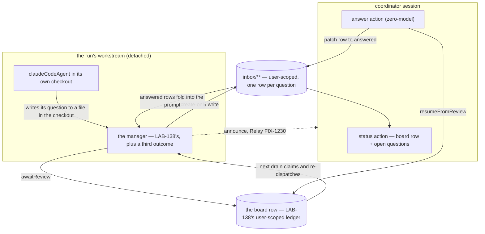

# LAB-139: A run that needs a decision can ask for one, and be answered — Implementation Spec

## Part I — The Case *(for the human)*

### 1. Problem — why it matters, why now

A background coding run that hits a real ambiguity has two options: guess, or stop. It
cannot ask anybody. The framework's durable pause holds the *asking* request open, and for a
background run that request is the run's own — so a run that pauses to ask pauses only
itself, and nobody is told a person is needed.

The common case is not a run that fails. It is a run that finishes a turn with a question.

**Why now** — this is the epic's Proof, and nothing else in the set tests it.

### 2. Solution in plain terms

When the run needs a decision it writes the question into an **inbox** — a shared list of
open questions — and puts its own job on hold. The board lets go and the run's request ends,
so nothing is held open while a person thinks. The operator answers the row and takes the
job off hold, which starts the run again on that answer.

Two things make it work. **The question is a durable row, not a paused request**, so an
answer arriving tomorrow morning still has somewhere to land. And **holding for a person is
an outcome of the run**, beside *done* and *that attempt failed*.

**Philosophy** — tenet 5 (*fix at the owning layer*): the hold, the board's exit and the
restart are the substrate's, consumed rather than rebuilt. Tenet 3 (*earn every addition*):
this adds nothing to the published framework — the inbox is an ordinary shared list and the
operator gets one verb.

### 6. Decisions & rules — the sign-off surface

1. **The answer travels on the question's own row, never on the channel that already carries
   why the last attempt failed.**
   *Rejected:* handing it back through the job's existing feedback field — the cheapest
   wiring, and the one that already means something else.
   *Locks in:* a run can never be told *"your last attempt stopped because: take the second
   option."* The manager reads two places on every start instead of one, forever.

2. **Answering a question costs the run one of its retries, and we ship that this cycle.**
   *Rejected:* conductor counting which restarts were answers — a second counter beside the
   board's, which is how two counts drift.
   *Locks in:* ask three questions of a run budgeted for three retries and it has none left
   for a real failure. Until the substrate discounts an answered restart (FIX-1244), whoever
   files the job budgets for questions *plus* failures.

3. **The operator gets one verb: answer a question. Redirecting a run mid-flight, sending it
   on an errand, and cancelling it are not built.**
   *Rejected:* the four steering verbs this issue originally scoped in.
   *Locks in:* the only thing a person can do to a live run is answer what it asked; anything
   else waits for a later issue. Cancelling already exists on the board.

**Non-goals** — building the message channel (FIX-1230), the restart onto the same coding
session (FIX-1246), the board's hold and wake verbs (FIX-1234, landed; FIX-1244), the
`awaiting_review → parked` rename (FIX-1245). Working out which question a free-form reply
addresses — an answer names its row. Any inbox UI. More than one run at a time.

**Size:** Medium — 6 production files · 14 test behaviours · 1 doc surface · 1 PR. **No
framework change**: LAB-138 spent this epic's one on the run's working directory.

---

### 3. Tradeoffs & alternatives

**Alternative: pause the run's request and resume it when the answer arrives.** The shape
this issue was drafted against, closed by the product owner (D-1). What is new is that the
chosen path is no longer merely the safer one — it now runs end to end on today's `main` (§7).

**The simpler approach: let the operator read what the run said and file a new job with more
context.** It needs nothing built, and it is a restart — which the epic says is not the
Proof. It also throws away everything the run had worked out.

**Where the complexity is:** not the round trip — that was the unknown, and it runs. It is
the two ends: getting the run to *ask* on a harness with no seam for a question to leave
through, and getting the answer back into the **same** coding conversation.

### 4. Focus practices (1–4)

1. **BP-031** — which run, which issue and which attempt a question belongs to is derived
   server-side. Only the question's words and the answer's words come from outside.
2. **One create-only convergence point for the ask** (tenet 5). That step commits no output,
   so it re-executes on recovery; one create-only path, or a replay erases an answer.
3. **BP-030** — build against the shipped hold status. `parked` is FIX-1245's rename to
   consume, not to anticipate.
4. **Tenet 7 — a check that cannot fire is not a check.** Answering a row nobody parked
   passes trivially, so §10 asserts on the board row and the inbox row after a real park.

### 5. What using it looks like

**The inherited board gains one option** *(the rest is LAB-138's, unchanged)*:

```ts
taskBoard({
  // …LAB-138's board: durable user-scoped ledger, explicit boardId, one detached worker
  onReview: "exit",  // a drain that meets a held row reports it and returns
});
```

**Answering, from the coordinator session** *(zero-model)*:

```ts
await conductor.answer({
  question: "FIX-1166/implement/1/a3f19c",   // the row, named explicitly
  answer: "Correct the path only. Leave the symlink alone.",
});
```

**What a run that needs a decision does (before / after):**

```
before  run hits an ambiguity → guesses, or stops and reports nothing useful
after   question row appears, job goes on hold, the drain returns
        "parked-for-review", the run's request ends
        → operator answers → job leaves hold → the run starts again
          holding the answer
```

---

## Part II — The Build Plan *(for the implementing agent)*

### 7. Technical design

Everything here is conductor's own code in `labs/conductor/`. Nothing is added to the
published framework.



#### What the POC settled, and why it changes the plan

Two throwaway scripts on this branch (`spec-poc/LAB-139-ask-and-answer/`, §12) ran the round
trip on the shape this issue actually inherits — a **detached** worker over a **user-scoped
durable** ledger. Both were written to be informative rather than green.

**The epic-spec's first measured park result is stale on `main`, and that is the finding that
matters.** Its theme 5 table reads *"`awaitReview` + normal return → row stomped to
`completed` in the same request — the question is lost"*, and the whole design was drawn
around routing past it. **FIX-1234 landed on 2026-08-25** (PR #1422) and made both result
recorders read the row's status before they settle, refusing a settlement on a parked row
inside the atomic write (`refuseWhenParked`). Measured here on the detached path: the worker
called `awaitReview` on its own row, returned normally, and the row was still
`awaiting_review` afterwards. **A worker can now park itself and walk away.** Anything in this
document that would have been a workaround for that row is simply absent.

The rest, in one line each:

- A later drain over a held row returns `terminationReason: "parked-for-review"` and
  dispatches nothing — with `onReview: "exit"`. **Without it** the same drain spent its
  iteration budget and reported `blocked-by-failures` on a board with no failures, which is a
  lying status, not merely a slow one.
- A coordinator request **holding no claim ticket** resumed the row (`recorded`). Ownership is
  not asked of a caller that never claimed.
- The resumed row was claimed and re-dispatched, and the manager ran again in a **new**
  workstream request.
- `resumeFromReview(id)` with no feedback **clears** whatever feedback was on the row, so a
  previous failure's reason cannot leak into an answered attempt's prompt.
- The **inbox is reachable across the boundary that matters**: a `user`-scoped collection
  written from inside the workstream was read back by the coordinator session, with no
  `sharedToWorkstream` anywhere (that option is session-scope only).
- **`upsert(key, {}, createOnly)` is genuinely create-only** — replayed over a row a person
  had already answered, it left the answer intact.

#### The inbox

A plain `defineResourceCollection`, modelled on `labs/knowledge-hub/src/inbox.ts` — **not a
new capability** (LAB-68's standing rule; FIX-1075 gets the evidence).

- `pattern: "inbox/**"`, `scope: "user"`, `flowIsolation: false` (BP-027),
  `prefetchMode: "lazy"` so posting a question is a point lookup rather than a scan of every
  question the user has ever been asked (BP-033).
- **Not model-writable.** Conductor's own blocks are the only writers; the question's *words*
  come from the run, its *identity* does not (BP-031).
- State: the question, who asked, when, `status` (`open` / `answered` / `withdrawn`), and the
  answer — the last `.nullable().default(null)` (BP-023).

**The key, and the one segment that has to be explained.** Bare topic
`<issue>/<phase>/<attempt>/<fingerprint>`, where the fingerprint is a hash of the question's
text. Issue-first so `list("<issue>/<phase>/")` filters at the source. **Hash-keyed rather
than counted**, because a counter needs committed state and the ask step has none — a replay
would number the same question twice. **The attempt segment is what keeps the hash safe:**
without it, a later attempt asking the identical question would land on the already-answered
row, and the manager would fold a stale answer into the prompt instead of asking. It also
makes *which attempt asked this* readable off the key.

**No epic discriminator, and LAB-138 raised that question rather than settling it** (its §12:
*"if its inbox is likewise a single user-wide pool, the epic belongs in the key as a
discriminator, not in the scope"*). The board needs one because a shared claim pool means one
epic can **claim or settle** another's row — a mutation. Neither half applies here: nothing
claims an inbox row, conductor's blocks are its only writers, and the issue id leading the
key is globally unique, so two epics cannot collide. What remains is that an unfiltered
`inbox/` listing spans epics — which is what a *person's* inbox should do. Every read this
issue performs is prefixed by issue and phase.

**Key vocabulary is LAB-138's rule, inherited and not restated**: a string handed *to* the
collection carries no `inbox/` prefix, a string that came *out* of it does, and the accessor
is `ref.path`. Same failure mode, same discipline (LAB-138 §7, "Two vocabularies").

#### The replay-safe write — this issue's own obligation

The step that posts a question commits no output, so it **re-executes on recovery**. An
unguarded write recreates the row or resets it, and the answer then lands on a row nobody is
reading — or is wiped by a replay of the step that created it.

**The rule: the ask is a create-only write, and nothing else ever writes an `open` row.**
`upsert(bareTopic, {}, { question, askedBy, askedAt, status: "open", answer: null })` — the
patch branch has nothing to apply, so a second execution is a read. Verified against an
already-answered row (§12).

The two other writers are narrow and neither can reopen a row: the **answer** patches
`status: "answered"` plus the body, and the **withdraw** patches `status: "withdrawn"`.
Status only ever moves forward. There is no `open` write outside the create branch, and that
is the whole of the mechanism — one convergence point rather than a guard on each writer
(tenet 5).

#### How the run surfaces a question

**The harness offers no seam for one, and this was checked rather than assumed.**
`claudeCodeAgent`'s options are `model`, `systemPrompt`, `allowedTools`, `disallowedTools`,
`permissionMode`, `agents`, `maxTurns`, `includePartialMessages`, `onToolApproval`,
`detached`, `recordWork` — plus the per-run working directory LAB-138 adds. There is **no
MCP-server option and no way to hand the run an FSD tool**, so a conductor-owned "ask" tool
the model calls does not exist and cannot be built without widening the framework, which
decision 3 of LAB-138 rules out.

**So the question travels as a file in the run's own checkout.** The implement prompt requires
the run to write its question to an agreed path before it opens the PR; the manager reads that
path after the run returns. This is why the ask is **forced** rather than spontaneous — stated
in the epic-spec as a limit on what the Proof shows, and it is a property of the harness
surface, not a shortcut.

*The alternative is the run's final message, parsed for a marker.* It is available
(`SdkAgentHandle.finalMessage`) and is not chosen: a final message is absent on a thrown exit
and is the one field a summarising model most likes to reword. The file is durable, re-readable
and already inside the directory LAB-138 provisions. Where the run wrote no file and the
done-condition is unmet, that is an ordinary failed attempt — not a question.

#### The park, and the manager's third outcome

LAB-138 leaves a two-outcome decide step and names the seam: *"Adding a parked-on-a-person
outcome is LAB-139's to define, on the substrate it consumes."* This is that definition.
**Three outcomes, in this order, and the order is the design:**

1. **Verdict succeeded AND the done-condition holds → return.** Unchanged. If a question is
   still open, the run answered it itself: **withdraw the row** and complete. This is the
   withdrawn case, and it is where it belongs — a withdrawn row is never deleted, so a late
   answer against it is reported back rather than applied.
2. **A question was posted this attempt → park.** `awaitReview(taskId, <the question>)`, then
   **return normally**. The recorders leave the row alone, the workstream request ends, and
   the run costs nothing while a person thinks.
3. **Anything else → throw.** Unchanged. **Withdraw any open row first** — the attempt failed,
   so its question is moot, and leaving it open means an answer later lands against a row no
   attempt is waiting on.

**Why the park arm sits after completion and before failure.** A run that finished the job
should not be held for a question it no longer needs an answer to; a run that failed should not
hold the board for one either. Only the middle case is a genuine wait on a person.

#### The board delta

One option on the board LAB-138 builds: **`onReview: "exit"`.** Its three construction
refusals are all satisfied by LAB-138's board as specified, and the implementer should confirm
each rather than assume it: the ledger is a `defineTaskCollection()` (resource-backed — a
request-backed one is refused); `onIdle` is left at its default `complete-or-blocked` (both
`wait` and `complete` are refused, with reasons in `park-exit.ts`); and `initialTasks` must
carry stable ids — LAB-138 seeds through a `seed` action rather than `initialTasks`, so the
refusal does not fire, which is a fact to check, not to rely on.

Nothing else about the board changes. Its scope, its partition and its lifetime are LAB-138's
D-4 lock, settled there precisely because this issue inherits them.

#### The wake — composed from two shipped verbs, and the epic should hear this

The `answer` action does two writes: patch the inbox row to `answered`, then
`resumeFromReview(taskId)` **with no feedback** (which clears any stale failure reason, §12).
The row returns to `pending` and LAB-138's existing `wake` drain claims and re-dispatches it.

**This is not a wake primitive and this issue must not build one.** The epic-spec is emphatic
that FIX-1244 owns "resume a parked row with a payload as a new request", and that an issue
finding itself inventing one has hit a limit and should raise it rather than solve it locally.
So, raising it rather than solving it: **that verb's effect is reachable today by composing
two shipped verbs**, which is what the committed
`packages/integration-tests/src/scenarios/task-board-park-exit-across-requests.test.ts` does
across four real requests, and what §12's POC reproduces on the detached path. What FIX-1244
adds is one honest primitive with one verdict in place of two calls whose declines a caller
must read separately — and the retry-budget discount decision 2 names. **LAB-139 stays its
first consumer**: when it lands, the `answer` action's two calls collapse into one and nothing
else in this design moves. **The schedule consequence belongs to the epic**, not to this spec:
of the four consumed pieces, FIX-1234 has landed, FIX-1244's effect is composable today, and
the Proof's one hard blocker is FIX-1246.

#### Relay carries the announcement; the row carries the question

D-1: the ask travels Relay. Precisely: **the inbox row is the durable carrier** — the
epic-spec says so in the same breath — and Relay's fire-and-forget send is the
**announcement**, so the coordinator session learns a question exists without polling for it.
The manager sends it after the park, naming the row's key and nothing else.

`FIX-1230` is In Development and nothing of it is in tree, so the send sits behind one seam
whose default is a no-op. **What that costs while it is absent:** the operator finds the
question by reading, not by being told — the `status` action below, and the `resource_change`
events a collection mutation already streams to a watching client. Everything else in this
issue is testable and shippable without it.

**The answer's route in is never the public caller-addressed one** (epic theme 6). The
`answer` action is an ordinary action on the conductor flow, running in the coordinator's own
session; it resumes a *board row*, and never re-enters the detached dispatch.
`WORKSTREAM_SOURCE` stays in `NEVER_PUBLIC_REENTRY_SOURCES`, untouched. **An implementation
that reaches for that allow-list has taken a wrong turn**, not found a bug.

#### Reading the answer back, and the same coding session

**The manager folds every `answered` row under `<issue>/<phase>/` into the prompt, oldest
first.** No "consumed" flag and no fourth status: folding is idempotent, so a replay produces
the same prompt, and it is correct whether the coding session resumed or started cold.

**Continuing the same coding session is FIX-1246's, and this issue builds none of it.**
`claudeCodeAgent({ detached: true })` consults no session provider at all today, so it passes
no `resume` to the SDK and a re-dispatched attempt is a cold start — which is why **restart is
not Proof** and why the Proof waits on that work. What this issue does is have the id ready:
LAB-138's `runs/**` row already carries the harness session id as bookkeeping, and the manager
hands it to whatever FIX-1246 ships. **This spec designs no field on the task**, names no
shape, and stands nothing in for the typed top-level task field that is FIX-1179's.

#### The read surface

LAB-138's zero-model `status` action gains the open inbox rows for the issue-phase beside the
board row it already reports. That is how an operator sees a question with no UI built, and it
is what §10's behaviours assert against. **The board row stays the authority on the job's
state and the inbox row on the question's** — neither is inferred from the other.

**Solution sketch — pseudocode. Illustrative, not the contract. React to the shape.**

```
the manager (LAB-138's), with the ask folded in:

  on entry:
      read the board's `feedback`      → why the LAST ATTEMPT FAILED (LAB-138's)
      list inbox `<issue>/<phase>/`    → every ANSWERED row, oldest first
      build the prompt from both, plus the phase's readable set
      → two channels, two meanings, and they never carry each other

  run the coding agent, in its checkout, under a wall-clock deadline

  read the verdict (LAB-138's), then decide — THREE outcomes:

      verdict succeeded AND done-condition holds
          → withdraw any open row (the run answered itself)
          → return                                   (row completes)

      the run left a question in its checkout
          → create-only write of the inbox row       (replay-safe)
          → announce over relay                      (no-op until FIX-1230)
          → awaitReview(taskId, the question)
          → return normally                          (row STAYS parked —
                                                      the recorders refuse it)

      anything else
          → withdraw any open row (the attempt failed; its question is moot)
          → throw                                    (row re-pends, or errors
                                                      once the budget is spent)

the answer action, in the coordinator's own session, zero-model:

      patch the named inbox row → answered, with the body
      resumeFromReview(taskId)  → NO feedback: clears the last failure's reason
      read BOTH verdicts and report a decline rather than swallowing it
          (row not parked · row terminal · row already resumed)
      the existing `wake` drain does the rest
```

### 8. Implementation sequence

**One PR.** Every deliverable is conductor-local and none of it is separately shippable —
there is no framework change to review on its own, which is what made LAB-138 two.

1. **The inbox collection** — `labs/conductor/src/inbox.ts`: the definition, the key grammar
   and its helpers, and **the create-only write as the single ask path**. *Test:* §10's
   replay behaviours, which are the ones that can fail. *Depends on:* nothing.
2. **The ask** — reading the run's question file out of the checkout, and the withdraw.
   *Test:* §10's file-absent and withdraw behaviours. *Depends on:* 1.
3. **The manager's third outcome** — the decide step's three arms in the order §7 gives, the
   park, and the fold of answered rows into the prompt. *Test:* §10's three-arm behaviours
   against a stubbed agent resolver. *Depends on:* 2, and on LAB-138's manager.
4. **`onReview: "exit"` on the board**, having confirmed all three construction refusals are
   satisfied (§7). *Test:* the board builds, and a drain over a held row reports
   `parked-for-review`. **Do this early** — it is a construction-time throw, so getting it
   wrong fails before anything else can run. *Depends on:* LAB-138's flow.
5. **The `answer` action**, zero-model, plus the `status` action's inbox half. *Test:* §10's
   answer and decline behaviours. *Depends on:* 1, 4.
6. **The relay announcement seam**, defaulting to a no-op, and the implement prompt's forced
   ask. *Depends on:* 3.
7. **The goal check** (§10) — **written now, gated on FIX-1246.** Do not run it as a
   completion criterion for this PR.

**Removals.** None.

**Two cautions.**

- **Do not pass the answer as `resumeFromReview`'s feedback**, however convenient. That field
  is LAB-138's failure-reason carrier and decision 1 turns on the two staying separate.
- **Do not add a "consumed" status to the inbox.** The fold is idempotent by construction;
  a consumed flag reintroduces exactly the write-a-row-that-a-replay-can-reset problem this
  issue exists to close.

### 9. Edge cases & error handling

| Case | Expected |
|---|---|
| The ask step re-executes on recovery | Create-only write; the second execution is a read. An answered row keeps its answer (§12) |
| The same question is asked twice in one attempt | One row — the hash keys them together, which is correct: it is the same question |
| The same question is asked again in a **later** attempt | A **new** row. The attempt segment keeps it off the answered one, so it is asked rather than answered from history |
| An answer names a row that was never parked | `resumeFromReview` declines. The action **reports** the decline; it never reads silence as success |
| An answer arrives for a **withdrawn** row | The row is not deleted, so the answer is reported back and not applied. The task is untouched |
| An answer arrives for a row whose task is terminal | Declines `terminal`. Reported, not applied |
| Two answers race the same row | The first resumes; the second declines (the row is no longer parked) and is reported |
| The run wrote no question and did not finish the job | An ordinary **failed attempt**. Absence of a question is never a park |
| The run opened the PR **and** left a question | Completed, and the row is **withdrawn** — the run answered itself |
| The attempt throws with a question open | The row is withdrawn before the throw; the row re-pends within budget |
| The board is drained while a row is held | Returns `parked-for-review`, dispatches nothing. **Without `onReview: "exit"`** it burns its iteration budget and reports `blocked-by-failures` — a lying status (§12) |
| A question is answered, so the run restarts | `attempts` advances and **one retry is spent** (decision 2). No abandonment discount applies |
| The answered run starts cold rather than resuming | Today's behaviour — `detached: true` passes no `resume`. Correct for this issue, and **not the Proof** until FIX-1246 lands |
| Relay is absent | The announcement is a no-op. The question is still readable through `status` and still streams as a `resource_change` |
| The hold status is renamed (`awaiting_review → parked`) | FIX-1245's. Nothing here anticipates the new name; the verbs `awaitReview` / `resumeFromReview` are unchanged by it |

**Second path (BP-035).** The second path here is **the attempt that starts holding an
answer**, and it is where everything interesting lives: the prompt is built from two channels
instead of one, the retry budget has already been charged, and the coding session is (for now)
a cold start. A suite that only exercises a first attempt asking a question proves nothing.

### 10. Testing strategy

**Goal — the epic's Proof.** One real Linear issue —
**[FIX-1166](https://linear.app/fixpoint-labs/issue/FIX-1166)**, one wrong path in `CLAUDE.md`
— driven from a conductor task row to an open PR, with the run posting a question to the
inbox, a person answering it without opening a terminal, and the run finishing on that answer.
Evidence: the inbox row and its answer, the `runs/*` row, the board row, and the PR. Lives at
`goals/conductor/asks-and-is-answered/`.

**It cannot run yet, and the blocker is one thing, not four.** FIX-1234 has landed. FIX-1244's
effect is composable today (§7). FIX-1230's absence costs the announcement, not the round trip.
**FIX-1246 is the hard blocker**: without it the answered run is a cold start, and restart is
not Proof. Write the goal check now; run it when FIX-1246 lands.

**CI specs** (14 behaviours, in observable terms — not test names):

1. **The park survives a normal return.** A detached worker calls `awaitReview` on its own row
   and returns; the row reads `awaiting_review` afterwards, not `completed`. *(Graduated from
   the POC — §12. This is the premise everything rests on and it moved once already.)*
2. **A drain over a held row reports it and dispatches nothing** — `parked-for-review`, zero
   new dispatches.
3. **The negative arm of 2**: the same board without `onReview: "exit"` does **not** report
   `parked-for-review`. Without this, 2 passes on a board that never had the option set.
4. **The ask is replay-safe.** Run the ask step twice in one attempt: one row, identical
   state.
5. **A replay cannot erase an answer.** Answer the row, then re-run the ask step; the row
   still reads `answered` with the body intact. *(Graduated from the POC.)* **A test that only
   replays an `open` row passes with the bug in place.**
6. **The inbox crosses the session boundary.** A row written from inside the workstream is
   read by the coordinator session, with no `sharedToWorkstream` declared anywhere.
7. **The answer reaches the next attempt.** After an answer, the manager's prompt carries the
   answer's body. Assert on the prompt the harness received.
8. **The two channels never carry each other.** Stage a failed attempt (feedback = the error)
   *then* a question and an answer; assert the resumed prompt carries the answer as an answer
   and **not** the stale failure as this attempt's reason. This is decision 1, and it is the
   behaviour that fails silently.
9. **The three decide arms**, each asserted on the board row *and* the inbox row afterwards:
   done → row `completed`, question row `withdrawn`; question → row `awaiting_review`, row
   `open`; failure with a question open → row `pending`, question row `withdrawn`.
10. **A completed run withdraws rather than deletes**, and a late answer against a withdrawn
    row is reported and not applied.
11. **A decline is reported, never swallowed.** Answer a row that was never parked; the action
    surfaces the decline. *(A silent decline is the same defect class LAB-138 exists to remove,
    relocated.)*
12. **The retry budget is charged by an answer.** After one question and one answer,
    `attempts` has advanced and no abandonment discount applied. **Pinning decision 2's cost so
    it cannot regress into a surprise.**
13. **The same question in a later attempt is asked again**, not answered from the earlier
    attempt's row. This is what the attempt segment of the key buys, and a key without it
    passes every other behaviour here.
14. **The board still constructs.** `onReview: "exit"` alongside LAB-138's ledger, `onIdle`
    and seeding — the regression is a construction-time throw, so the assertion is that the
    board builds.

**Discipline.** `tdd`. Two seams, neither needing an HTTP server: the inbox write and key
grammar as plain unit tests, and `runAction` over a detached board with a stubbed agent
resolver for everything from 1, 2, 3, 6, 7, 8, 9 and 12 — the shape §12's POC already
demonstrates, which is why those two scripts are the cheapest possible starting point.

### 11. Documentation plan

- **EXTEND** `labs/conductor/README.md` — a section on asking and answering: what an operator
  sees, how they answer, that one question at a time is the shape today, and the two live
  limits (an answer spends a retry; the answered run restarts rather than resuming until
  FIX-1246 lands). Labs carry their own README and document their known gaps.
- **No site documentation and no architecture-doc change.** Conductor is an unpublished lab
  and this issue changes no published surface, no locked contract and no framework behaviour.
- *Voice risk:* do not write this as *"the framework now supports human-in-the-loop."* It does
  not — the substrate's hold and exit verbs are shipped and documented elsewhere, and what this
  lab adds is one product built on them.

### 12. Dependencies, open questions & follow-ups

**Settled by POC on this branch — resolved, please don't reopen.**
`spec-poc/LAB-139-ask-and-answer/` (throwaway; the PR never merges). Run:

```
pnpm tsx spec-poc/LAB-139-ask-and-answer/round-trip.mts    # the board round trip
pnpm tsx spec-poc/LAB-139-ask-and-answer/inbox-write.mts   # the inbox write
```

- **A detached worker's own park survives its normal return** — `awaiting_review`, not
  `completed`. **This refutes the epic-spec's theme 5 table, row 1**, which FIX-1234 (merged
  2026-08-25) made stale. Raised to the epic PR rather than edited there.
- **`onReview: "exit"` is load-bearing, and its absence is worse than a hang** — the drain
  reported `blocked-by-failures` on a board with no failures.
- **An unclaimed coordinator request can resume a held row**, and the answered row is claimed
  and re-dispatched into a new workstream request.
- **`resumeFromReview(id)` with no feedback clears the row's feedback.**
- **A `user`-scoped collection written inside a workstream is read by the coordinator
  session**, with no `sharedToWorkstream`.
- **`upsert(key, {}, createOnly)` is create-only over an answered row.**
- **An answer spends one of the run's retries** — `attempts` advances at claim time and only
  abandonments are discounted. This is decision 2, measured rather than reasoned.

**Consumed, never built. Four pieces, and they are not one dependency:**

- **The ask channel — [FIX-1230](https://linear.app/fixpoint-labs/issue/FIX-1230)** (Relay, In
  Development). Carries the **announcement**, not the question. Absent, the operator reads
  rather than being told, and everything here still ships and tests.
- **Park-exit — [FIX-1234](https://linear.app/fixpoint-labs/issue/FIX-1234)** — **landed**
  (PR #1422, 2026-08-25). The epic-spec and this issue's dispatch both had it In Review.
- **The wake — [FIX-1244](https://linear.app/fixpoint-labs/issue/FIX-1244)** (Backlog).
  **LAB-139 is its first consumer and never its owner.** Its effect is composable today from
  two shipped verbs (§7); what it adds is one verdict instead of two and the retry discount
  decision 2 names. Nothing here proposes a wake.
- **Same-session resume — [FIX-1246](https://linear.app/fixpoint-labs/issue/FIX-1246)** under
  FIX-1179 (Backlog). **The Proof's one hard blocker.** This epic builds no resume machinery.
- *(Also consumed: **FIX-1245**, the `awaiting_review → parked` rename.)*

**Depends on LAB-138** — the manager, the board and its D-4 lock, the run record, the per-run
checkout, and the `seed` / `wake` / `status` actions. This issue adds an outcome to that
manager and an option to that board; it re-specifies neither.

**Open questions:** none.

**Follow-ups (flagged, not built):**

- The three steering verbs decision 3 cuts (`instruct`, `tangent`, `cancel`), if an operator
  turns out to want them.
- An inbox UI, once there is more than one run on the board.

### 13. Review notes for the implementer

- **Two POC scripts are on this branch and they are the cheapest starting point you have.**
  Neither ships. Behaviours 1–3, 6 and 12 of §10 are them, tidied — graduate rather than
  rewrite.
- **The board's construction refusals fire before anything runs.** `onReview: "exit"` is
  refused on a request-backed collection, on `onIdle: "wait"`, on `onIdle: "complete"`, and on
  `initialTasks` without ids. Each message carries its own fix. Get this right first, not last.
- **A named limit, not a task: nothing here bounds how long a question can stay open.** A held
  row is deliberately outside the lease's governance, so a question nobody answers holds its
  row forever. That is correct for a human wait and wrong for an abandoned one, and closing it
  needs a policy nobody has chosen. Do not invent one.
- **A second named limit: one run at a time is a property of the board, not of this design.**
  Nothing here assumes it, but nothing here is tested against two runs asking at once either.
  The keys are already disjoint by issue; the untested part is the operator's read.

---

## Spec evolution *(the change story, not an audit log)*

- **Spec drafted** — framed as *a question that outlives the run that asked it*, rather than as
  a pause. Built two throwaway POCs before drawing the design, which changed it: the epic-spec's
  measured claim that a worker's own park is stomped by its normal return is **stale on `main`**
  since FIX-1234 landed, so the park is simply `awaitReview` and a normal return, with no
  workaround anywhere in this document. Separated the two carriers — the board's `feedback` for
  why an attempt failed, the inbox row for an answer — after measuring that a resume clears
  feedback. Made the ask a create-only write with a hash-derived key, and verified it cannot
  erase an answer. Cut the four steering verbs to one. Named the retry a question costs, rather
  than hiding it, since the substrate offers no discount and conductor must not grow a second
  counter. Recorded that the wake's effect is composable from shipped verbs today, and raised
  that to the epic rather than acting on it.
