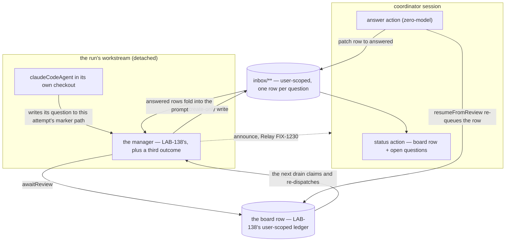

# LAB-139: A run that needs a decision can ask for one, and be answered — Implementation Spec

## Part I — The Case *(for the human)*

### 1. Problem — why it matters, why now

A background coding run that hits a real ambiguity has two options: guess, or stop. It cannot
ask anybody. The framework's durable pause holds the *asking* request open, and for a
background run that request is the run's own — so a run that pauses to ask pauses only
itself, and nobody is told a person is needed.

The common case is not a run that fails. It is a run that finishes a turn with a question.

**Why now** — this is the epic's Proof, and nothing else in the set tests it.

### 2. Solution in plain terms

When the run needs a decision it writes the question into an **inbox** — a shared list of open
questions — and puts its own job on hold. The board lets go and the run's request ends, so
nothing is held open while a person thinks. The operator answers the row and takes the job off
hold, which starts the run again on that answer.

Two things make it work. **The question is a durable row, not a paused request**, so an answer
arriving tomorrow morning still has somewhere to land. And **holding for a person is an
outcome of the run**, beside *done* and *that attempt failed*.

**Philosophy** — tenet 5 (*fix at the owning layer*): the hold, the board's exit and the
re-queue are the substrate's, consumed rather than rebuilt. Tenet 3 (*earn every addition*):
this adds nothing to the published framework.

### 6. Decisions & rules — the sign-off surface

1. **The answer travels on the question's own row, never on the channel that already carries
   why the last attempt failed.**
   *Rejected:* handing it back through the job's existing feedback field — the cheapest
   wiring, and the one that already means something else.
   *Locks in:* a run can never be told *"your last attempt stopped because: take the second
   option."* The manager reads two places on every start instead of one, forever.

2. **Answering a question costs the run one of its retries, and we ship that this cycle.**
   *Rejected:* conductor counting which restarts were answers — a second counter beside the
   board's, which is how two counts drift.
   *Locks in:* ask three questions of a run budgeted for three retries and it has none left
   for a real failure. Whoever files the job budgets for questions *plus* failures until the
   discount lands in the substrate, where it rides on FIX-1244.

3. **Ratify the scope cut: the operator gets one verb, *answer*.** Redirecting a run
   mid-flight and sending it on a side errand are not built, and cancelling needs one small
   piece: the board cancels the job, conductor withdraws the question (§7).
   *Rejected:* the four steering verbs this issue originally scoped in.
   *Locks in:* the only thing a person can do to a live run is answer what it asked; anything
   else waits for the run to finish or for a later issue. Not an engineering fork — the
   engineering is the same either way, and this is the over-scope call to keep or overturn.

**Non-goals** — the four consumed pieces (§12), the `awaiting_review → parked` rename, working
out which question a free-form reply addresses (an answer names its row), any inbox UI, and
more than one run at a time.

**Size:** Medium — 6 production files · 18 test behaviours · 1 doc surface · 1 PR. **No
framework change**: LAB-138 spent this epic's one on the run's working directory.

---

### 3. Tradeoffs & alternatives

**Alternative: pause the run's request and resume it when the answer arrives.** Closed by the
product owner (D-1). What is new is that the chosen path is no longer merely the safer one — it
now runs end to end on today's `main` (§12).

**The simpler approach: let the operator read what the run said and file a new job with more
context.** It needs nothing built, and it is a restart — which the epic says is not the Proof.
It also throws away everything the run had worked out.

**Where the complexity is:** not the round trip; that was the unknown, and it runs. It is the
two ends — getting the run to *ask* on a harness with no seam for a question to leave through,
and getting the answer back into the **same** coding conversation.

### 4. Focus practices (1–4)

1. **BP-031** — which run, which issue and which attempt a question belongs to is derived
   server-side. Only the question's words and the answer's words come from outside.
2. **One create-only convergence point for the ask** (tenet 5). That step commits no output
   and re-executes on recovery; one create-only path, or a replay erases an answer.
3. **Nothing carried between attempts is stale by default** (tenet 5). The checkout survives a
   retry, so bind what the last attempt left there to the attempt — §7.
4. **Tenet 7 — a check that cannot fire is not a check.** Answering a row nobody parked passes
   trivially, so §10 asserts after a real park.

### 5. What using it looks like

The inherited board gains one option — `onReview: "exit"` — and the operator gets one
zero-model action:

```ts
await conductor.answer({
  question: "FIX-1166/implement/1/a3f19c",   // the row, named explicitly
  answer: "Correct the path only. Leave the symlink alone.",
});
```

The observable change: a run that hit an ambiguity used to guess or stop with nothing useful
to show. Now a question row appears, the drain returns `parked-for-review`, and an answer
starts the run again holding it.

---

## Part II — The Build Plan *(for the implementing agent)*

### 7. Technical design

Everything here is conductor's own code in `labs/conductor/`. Nothing is added to the
published framework.



**Two POCs on this branch measured the round trip before this design was drawn, and changed
it. Their measurements live in §12 and are not repeated here.** The one that reshaped the
document: since FIX-1234 landed, a detached worker's own park **survives** its normal return,
so nothing below is a workaround for the epic-spec's contrary table row.

#### The inbox

A plain `defineResourceCollection`, modelled on `labs/knowledge-hub/src/inbox.ts` — **not a
new capability** (LAB-68's standing rule; FIX-1075 gets the evidence).

- `pattern: "inbox/**"`, `scope: "user"`, `flowIsolation: false` (BP-027),
  `prefetchMode: "lazy"` so posting a question is a point lookup rather than a scan of every
  question the user has ever been asked (BP-033).
- `llmWritable: false`, and `llmReadable` only if a phase's readable set needs it. Conductor's
  own blocks are the only writers: the question's *words* come from the run, its *identity*
  does not (BP-031).
- State: the question, who asked, when, `status` (`open` / `answered` / `withdrawn`), and the
  answer — the last `.nullable().default(null)` (BP-023).

**The key: bare topic `<issue>/<phase>/<attempt>/<fingerprint>`**, the fingerprint a hash of
the question's text. Issue-first so `list("<issue>/<phase>/")` filters at the source.
**Hash-keyed rather than counted**, because a counter needs committed state and the ask step
has none — a replay would number the same question twice. **The attempt segment keeps the hash
safe:** without it a later attempt asking the identical question would land on the
already-answered row, and the manager would fold a stale answer into the prompt instead of
asking.

**No epic segment — locked here, not deferred.** D-4 partitioned the *board* because a board is
a **claim pool**, where sharing storage lets one epic claim or settle another's row. **An inbox
row is never claimed.** Issue ids are globally unique, so two epics cannot collide on a key,
and an unfiltered `inbox/` listing spanning epics is *a person's inbox*, not a boundary
crossed. Every read this issue performs is prefixed by issue and phase. **The discriminator
would buy nothing and cost a segment** — that reason is what should stop anyone re-adding it.

**Key vocabulary is LAB-138's rule, inherited and not restated**: a string handed *to* the
collection carries no `inbox/` prefix, one that came *out* of it does, and the accessor is
`ref.path` (LAB-138 §7, "Two vocabularies").

#### The replay-safe write — this issue's own obligation

The step that posts a question commits no output, so it **re-executes on recovery**. An
unguarded write recreates the row or resets it, and the answer then lands on a row nobody is
reading — or is wiped by a replay of the step that created it.

**The rule: the ask is a create-only write, and nothing else ever writes an `open` row.**
`upsert(bareTopic, {}, { question, askedBy, askedAt, status: "open", answer: null })` — the
patch branch has nothing to apply, so a second execution is a read. Verified against an
already-answered row (§12).

The two other writers are narrow and neither can reopen a row: the **answer** patches
`status: "answered"` plus the body, and the **withdraw** patches `status: "withdrawn"`. Status
only ever moves forward. There is no `open` write outside the create branch — one convergence
point rather than a guard on each writer (tenet 5).

#### How the run surfaces a question, and why the marker is per-attempt

**The harness offers no seam for one, and this was checked rather than assumed.**
`claudeCodeAgent`'s options are `model`, `systemPrompt`, `allowedTools`, `disallowedTools`,
`permissionMode`, `agents`, `maxTurns`, `includePartialMessages`, `onToolApproval`, `detached`,
`recordWork` — plus the per-run working directory LAB-138 adds. There is **no MCP-server option
and no way to hand the run an FSD tool**, so a conductor-owned "ask" tool the model calls
cannot be built without widening the framework, which LAB-138's decision 3 rules out.

**So the question travels as a file the run writes**, at a path the implement prompt names
absolutely, written before the run opens the PR. This is why the ask is **forced** rather than
spontaneous — a property of the harness surface, not a shortcut, and the epic-spec already
states it as a limit on what the Proof shows.

**The marker path carries the attempt, and that is load-bearing rather than tidy.** A retry
inherits the previous attempt's checkout, and the run directory beside it — that is decision
2's whole economics — so last attempt's question file is still sitting there when the next
attempt starts. A single fixed
path means an attempt that quietly did nothing looks exactly like an attempt that asked: the
manager reads the stale file, writes a **new** row under the new attempt's key, and parks
instead of taking the no-question failure path. The run stalls on a question nobody asked.

**So the path is derived from `attempts` on the worker input, and it sits OUTSIDE the run's
checkout** — a conductor-owned directory beside the worktree, `<run dir>/ask/<attempt>.md` or
equivalent, and the manager reads only the current attempt's path. **Inside the tree the marker
is committed by any agent that stages wholesale**, putting the question text into the product PR
and the diff a reviewer reads. *Rejected: a per-worktree `.git/info/exclude` entry* — and
*rejected: clearing or archiving the marker before each invocation.* Both work, and both are a
step that can be skipped, fail, be missing on a fresh checkout, or be defeated by a crash between
the step and the run. A path that cannot be wrong needs no step at all (tenet 5): outside the
tree and carrying the attempt, the marker is neither committable nor stale by construction. The
attempt number is already server-derived, so nothing the model writes decides which file is read
(BP-031). **One thing to confirm rather than assume: the run must be permitted to write there** —
an out-of-tree path its tool permissions refuse produces no marker, and a run that asked then
looks exactly like a run that failed.

**The general shape, swept as asked: the key's attempt segment protects a *row* from
collision; it does not make anything else *fresh*.** Two other things cross attempts and both
were checked. The prompt fold reads `answered` rows across *all* attempts — deliberate, that is
the question history, not a freshness assumption. And LAB-138's `runs/**` row is keyed
`<issue>/<phase>` with no attempt segment at all, which is exactly why that spec makes the
opening upsert clear every attempt-scoped field explicitly. Nothing else leans on uniqueness to
imply freshness.

*The alternative channel is the run's final message* (`SdkAgentHandle.finalMessage`), parsed
for a marker. Not chosen: it is absent on a thrown exit and is the one field a summarising
model most likes to reword. Where the run wrote no marker for this attempt and the
done-condition is unmet, that is an ordinary failed attempt — not a question.

#### The park, and the manager's third outcome

LAB-138 leaves a two-outcome decide step and names the seam: *"Adding a parked-on-a-person
outcome is LAB-139's to define, on the substrate it consumes."* This is that definition.
**Three outcomes, in this order, and the order is the design:**

1. **The verdict succeeded AND the done-condition holds → return.** Unchanged. If a question
   is still open, the run answered it itself: **withdraw the row** and complete. A withdrawn
   row is never deleted, so a late answer against it is reported back rather than applied.
2. **The verdict did NOT fail AND this attempt's marker holds a question → park.**
   `awaitReview(taskId, <the question>)`, then **return normally**. The recorders leave the row
   alone, the workstream request ends, and the run costs nothing while a person thinks.
3. **Anything else → throw.** Unchanged. **Withdraw any open row first** — the attempt failed,
   so its question is moot, and leaving it open means an answer later lands against a row no
   attempt is waiting on.

**All three arms are conjunctions, and arm 2's second half is the one easy to drop.** A
question is only worth holding the board for if the run is still in a position to use the
answer. **A run that asked and then failed is not** — and the SDK reports its most common
failures by *returning*, not by throwing: a turn cap or an exhausted budget comes back as an
errored handle (LAB-138 decision 1's whole premise). So an arm gated on the marker alone
matches that run, parks it, and waits on a person for an attempt that is already dead. The row
never re-pends, the retry budget is never spent, and nothing reports it — a silent stall, which
is the mirror of the silent success LAB-138 exists to kill. **The failed-with-a-question run
must fall through to arm 3**, which withdraws the open row and throws.

**Why the park arm sits after completion and before failure.** A run that finished the job
should not be held for a question it no longer needs answered; a run that failed should not
hold the board for one either. Only the middle case is a genuine wait on a person — and with
arm 2 gated on the verdict, the arms now say that rather than only the prose beneath them.

*This is the second instance of one shape in this epic: **two signals matter, the prose states
both, the encoded condition names one.*** LAB-138 caught it at completion — the done-condition
alone would have completed a run that opened the PR and then exhausted its budget. Here it was
the park. Both re-admit the pathology the neighbouring decision exists to close, from the other
side.

#### The board delta

One option on the board LAB-138 builds: **`onReview: "exit"`.** Its three construction refusals
are all satisfied by LAB-138's board as specified, and the implementer should confirm each
rather than assume it: the ledger is a `defineTaskCollection()` (resource-backed — a
request-backed one is refused); `onIdle` is left at its default `complete-or-blocked` (both
`wait` and `complete` are refused, with reasons in `park-exit.ts`); and `initialTasks` must
carry stable ids — LAB-138 seeds through a `seed` action rather than `initialTasks`, so the
refusal does not fire, which is a fact to check rather than rely on.

**The drain that wakes a parked row must name the session.** `createExecutionContext` defaults
an absent `sessionId` to a fresh `ephemeral_…` value, which becomes the scope id for
session-scoped state — so a drain that omits it resolves a different ledger, finds an empty
board, and reports success having reached nothing. That is documented and tested upstream
(`task-board-park-exit-across-requests.test.ts`, the negative arm). LAB-138's board is
`user`-scoped so its ledger is not the exposure, but its `runs/**` record is session-scoped
with lineage sharing, and the failure looks like nothing happened either way. **State it as a
requirement on the `wake` action, not an assumption:** every drain conductor runs names the
coordinator session.

Nothing else about the board changes. Its scope, partition and lifetime are LAB-138's D-4 lock,
settled there precisely because this issue inherits them.

#### The wake — shipped verbs composed, and the seam where they collapse into one

**The `answer` action reads the board row first, and refuses unless the row is parked.**
Parked is the shipped `awaiting_review` — what D-1 calls `needs_input` in product terms, the
enum being what the guard compares against (BP-030). **Parked is the only proceed path, and
every other status refuses locally**: `pending` (a LAB-138 retry, and the *second* answer of a
duplicate pair, because the first already re-queued the row), `in_progress` (a claim — a live
run is not waiting on anybody), `completed`, `errored`, `cancelled`. *Held* would be exactly
the wrong word here: on this board a row is held when it is **claimed**, which is the one state
the answer path must not proceed from.

**And the guard is a pair, not a single check: the task parked AND the named inbox row still
`open`.** The task is shared across attempts; the row is per-attempt (the key's attempt segment).
Attempt 1 asks and fails, so its row is withdrawn; attempt 2 later parks on a question of its
own. An answer naming **attempt 1's** row finds the shared task at `awaiting_review`, passes a
task-only guard, flips a withdrawn row to `answered` and re-queues the run — **while attempt 2's
actual question is still open.** The run resumes holding an answer to a question nobody asked,
and the real one is never answered. So the row write is a **conditional `open → answered`
transition**, the same forward-only discipline the ask and the withdraw already use, and a row
that is not `open` refuses the whole action before anything is written. **That is also the
mechanism §9's withdrawn-row outcome always needed** — the outcome was specified, the path to it
was not.

The substrate will not refuse for it: `resumeFromReview` passes no `requireFrom`, and every
remaining guard is behind `ifAllowed`, which this design does not adopt — so a row that was
never parked reports `recorded` and the answer lands on a run nobody is waiting on (§12). The
guard is **product-level, in conductor's own action**: no second primitive, no counter, no
status and no verb, and nothing in the substrate changes. It is what makes §10's behaviour 12 a
completion criterion rather than a wish, and it covers §9's terminal row and the racing-answers
row **on the common path** — read-then-refuse is not atomic, and §13 names the window it leaves.

On a parked task with an open row the action then does three things, and the third is the one
easy to leave out:
patch the inbox row to `answered`; `resumeFromReview(taskId)` **with no feedback** (which also
clears any stale failure reason, §12); and **run LAB-138's `wake` drain itself, naming the
coordinator session.**

**The drain belongs to the action, not to the operator's next step.** `resumeFromReview` only
leaves the row `pending`, and with `onReview: "exit"` the drain that observed the question has
already ended — so an `answer` that stops after two calls leaves the row waiting for whatever
happens to drain next, and §5's *"an answer starts the run again holding it"* is a promise the
design does not keep. The POC's re-dispatch came from a **separate** `drain` invocation after
the answer (`round-trip.mts`, M4), which is precisely the step §5 never shows the operator
making. **Third instance of one shape in this epic — the prose promises the whole round trip
and the encoded path stops one step short** (the park arm named one signal of two; §9's
completion row did the same). Worth naming as the recurring defect, not only fixing.

**Between the second call and the third there is a window, and the two locks together are what
open it.** If the request dies after `resumeFromReview` commits — a crash, a transient drain
error — the row is `pending` and the answer is recorded, but no drain is in flight: `onReview:
"exit"` ended the one that observed the question, and the parked-only guard now refuses the
retry. The answered run sits dormant until some unrelated wake. Each lock is right on its own;
together they leave a hole between them.

**So the guard admits a second pair, and it is a recovery rather than an answer: a row already
`answered` whose task is `pending` is drainable.** Re-running `answer` on that pair writes
nothing — the row is at its terminal status and `resumeFromReview` is skipped — and runs the
drain. Idempotent by construction: a repeat is a drain that finds nothing to claim. **A
consumer-side stopgap, not a rival primitive.** FIX-1244's atomic verb closes the window by
making the recorded answer and the new request one write, and when it lands this path leaves
with the two calls it exists to recover.

**Fourth instance of one shape in this epic, and the reason to name it rather than fix it
quietly:** *the prose promises the whole round trip and the encoded path has a hole in it* —
LAB-138's completion arm, this issue's park arm, the drain nobody owned, and now the gap between
two writes that each looked complete. **Three of the four were opened by a lock that was correct
in isolation**, which is the part worth carrying to `distill-lessons` at epic wrap: the defect
does not arrive in the sloppy paragraph, it arrives where two careful ones meet.

**The distinction that makes this a consumer rather than a second primitive:
`resumeFromReview` *re-queues* the row. It does not start a request.** The next drain — the one
`answer` runs — is what claims and dispatches, and that dispatch is a new workstream request. So
the shipped verbs composed are **today's effect of FIX-1244**, not a local wake — nothing here invents one, and nothing
here proposes a change to who owns it.

**FIX-1244 stays the owner of the honest primitive** — one verdict, a payload in, a new request
out. **The collapse seam is the `answer` action's three calls**: when FIX-1244 lands they
become one parked-only verb, and nothing else in this design moves. The retry-discount decision 2 names is a rider on
that same work, which is why **conductor grows no counter of its own**.

#### Relay carries the announcement; the row carries the question

D-1: the ask travels Relay. Precisely: **the inbox row is the durable carrier** — the epic-spec
says so in the same breath — and Relay's fire-and-forget send is the **announcement**, so the
coordinator session learns a question exists without polling. The manager sends it after the
park, naming the row's key and nothing else.

Nothing of FIX-1230 is in tree, so the send sits behind one seam whose default is a no-op.
**What that costs while it is absent:** the operator finds the question by reading rather than
being told — the `status` action below, and the `resource_change` events a collection mutation
already streams to a watching client. Everything else here is testable and shippable without
it.

**The answer's route in is never the public caller-addressed one** (epic theme 6). The `answer`
action is an ordinary action on the conductor flow, running in the coordinator's own session;
it re-queues a *board row* and never re-enters the detached dispatch. `WORKSTREAM_SOURCE` stays
in `NEVER_PUBLIC_REENTRY_SOURCES`, untouched. **An implementation that reaches for that
allow-list has taken a wrong turn**, not found a bug.

#### Reading the answer back, and the same coding session

**The manager folds every `answered` row under `<issue>/<phase>/` into the prompt, oldest
first.** No "consumed" flag and no fourth status: folding is idempotent, so a replay produces
the same prompt, and it is correct whether the coding session resumed or started cold.

**Continuing the same coding session is FIX-1246's, and this issue builds none of it.**
`claudeCodeAgent({ detached: true })` consults no session provider, so it passes no `resume` to
the SDK and a re-dispatched attempt is a cold start — which is why restart is not Proof. What
this issue does is have the id ready: LAB-138's `runs/**` row already carries the harness
session id as bookkeeping, and the manager hands it to whatever FIX-1246 ships. **This spec
designs no field on the task**, names no shape, and stands nothing in for the typed top-level
task field that is FIX-1179's.

#### The read surface

LAB-138's zero-model `status` action gains the open inbox rows for the issue-phase beside the
board row it already reports. That is how an operator sees a question with no UI built, and it
is what §10's behaviours assert against. **The board row stays the authority on the job's state
and the inbox row on the question's** — neither is inferred from the other.

**And `status` reconciles what it reads: an `open` row whose task is terminal is withdrawn
there.** The board's `cancel` writes the task row and nothing else — the manager never runs
again, so neither withdrawal arm fires — and the question is then unanswerable by construction,
because the guard above refuses a terminal task. Left alone it shows in `status` forever as a
question nobody can act on. **Reconciling at the read rather than wrapping the cancel verb is
deliberate:** an operator can cancel through the board's own verb, so a conductor `cancel`
wrapper is a step that can be bypassed, while the only surface that can *display* a stranded row
is the one that clears it. The `answer` guard's terminal refusal withdraws it on the same
terms. Both writes are the ordinary forward-only withdraw, so running either twice is a read.

**Solution sketch — pseudocode. Illustrative, not the contract. React to the shape.**

```
the manager (LAB-138's), with the ask folded in:

  on entry:
      read the board's `feedback`      → why the LAST ATTEMPT FAILED (LAB-138's)
      list inbox `<issue>/<phase>/`    → every ANSWERED row, oldest first
      build the prompt from both, plus the phase's readable set
      → two channels, two meanings, and they never carry each other

  run the coding agent, in its checkout, under a wall-clock deadline,
  told to write any question to THIS ATTEMPT's marker path

  read the verdict (LAB-138's), then decide — THREE outcomes:

      verdict succeeded AND done-condition holds
          → withdraw any open row (the run answered itself)
          → return                                   (row completes)

      the verdict did NOT fail AND this attempt's marker holds a question
          → create-only write of the inbox row       (replay-safe)
          → announce over relay                      (no-op until FIX-1230)
          → awaitReview(taskId, the question)
          → return normally                          (row STAYS parked —
                                                      the recorders refuse it)
          ↑ BOTH halves. A run that asked and then reported failure is
            NOT parked — the SDK returns its turn-cap and budget failures
            rather than throwing, so the marker alone would hold the board
            for an attempt that is already dead.

      anything else — INCLUDING a failed verdict with a question open
          → withdraw any open row (the attempt failed; its question is moot)
          → throw                                    (row re-pends, or errors
                                                      once the budget is spent)

the answer action, in the coordinator's own session, zero-model:

      read the board row AND the named inbox row → proceed only on
      (task parked AND row `open`); anything else refuses, writing nothing
          ↑ the row half is NOT redundant. The task is shared across attempts,
            the row is per-attempt: a late answer naming attempt 1's WITHDRAWN
            row would pass a task-only guard and re-queue the run while
            attempt 2's real question is still open.
          ↑ ONE other pair proceeds — (row already `answered` AND task
            `pending`) — the recovery for a request that died between
            resumeFromReview and the drain. It writes nothing and drains.
          ↑ parked is `awaiting_review` (product name: needs_input). PENDING,
            in_progress, completed, errored, cancelled ALL refuse — pending is
            the duplicate answer, in_progress is a live run. NOT "not held":
            held means CLAIMED on this board, which is the one status the
            answer path must never proceed from.
          ↑ the substrate will not do this for us: resumeFromReview passes no
            requireFrom and every other guard is behind ifAllowed, so a
            never-parked row reports `recorded`. A guard in this action, NOT a
            change to the verb. Not atomic — see §13.

      patch the named inbox row → conditional `open` → answered, with the body
      resumeFromReview(taskId)  → NO feedback: clears the last failure's reason
      run the `wake` drain, naming the coordinator session
          ↑ THE ACTION runs it, not the operator. resumeFromReview only
            re-queues, and onReview: "exit" already ended the drain that saw
            the question — without this the answered run never restarts.
      report a decline rather than swallowing it
```

### 8. Implementation sequence

**One PR.** Every deliverable is conductor-local and none is separately shippable — there is no
framework change to review on its own, which is what made LAB-138 two.

1. **The inbox collection** — `labs/conductor/src/inbox.ts`: the definition, the key grammar
   and its helpers, and **the create-only write as the single ask path**. *Test:* §10's replay
   behaviours. *Depends on:* nothing.
2. **The ask** — the per-attempt marker path, reading it out of the checkout, and the withdraw.
   *Test:* §10's stale-marker and withdraw behaviours. *Depends on:* 1.
3. **The manager's third outcome** — the decide step's three arms in §7's order, the park, and
   the fold of answered rows into the prompt. *Test:* §10's three-arm and fold behaviours
   against a stubbed agent resolver. *Depends on:* 2, and LAB-138's manager.
4. **`onReview: "exit"` on the board**, having confirmed all three construction refusals, and
   the `wake` action naming the session. **Do this early** — a construction-time throw fails
   before anything else can run. *Depends on:* LAB-138's flow.
5. **The `answer` action**, zero-model: the **paired guard** (task `awaiting_review` **and**
   row `open`, plus the one recovery pair — row `answered`, task `pending` — that drains and
   writes nothing), the conditional `open → answered` row patch, `resumeFromReview` with no feedback, and **the
   `wake` drain the action runs itself**, naming the coordinator session. Plus the `status`
   action's inbox half **and its terminal-task reconciliation**. *Test:* §10's behaviours 12 and
   15–17 for the guard, the recovery and the cancel, and behaviour 7 **driven through `answer`
   alone** — a test that drains by hand passes with the missing drain in place.
   *Depends on:* 1, 4.
6. **The relay announcement seam**, defaulting to a no-op, and the implement prompt's forced
   ask against the per-attempt path. *Depends on:* 3.
7. **The goal check** (§10) — **written now, gated on FIX-1246.** Not a completion criterion
   for this PR.

**Removals.** None.

**Two cautions.**

- **Do not pass the answer as `resumeFromReview`'s feedback**, however convenient. That field
  is LAB-138's failure-reason carrier and decision 1 turns on the two staying separate.
- **Do not add a "consumed" status to the inbox.** The fold is idempotent by construction; a
  consumed flag reintroduces exactly the write-a-row-that-a-replay-can-reset problem this issue
  exists to close.

### 9. Edge cases & error handling

**Only the cases §10 does not already cover as a behaviour.** Everything else — the park, the
drain over a parked row, the replay, the fold, the three decide arms, the retry cost — is a
numbered behaviour there, and keeping two enumerations is where drift starts.

| Case | Expected |
|---|---|
| The same question is asked twice in one attempt | One row — the hash keys them together, which is correct: it is the same question |
| The run **succeeded**, opened the PR **and** left a question | Completed, and the row is **withdrawn** — the run answered itself. Both halves of arm 1: a run that opened the PR and *then* reported failure is a failed attempt (LAB-138 decision 1), and its question is withdrawn on the way out rather than parked |
| An answer arrives for a **withdrawn** row | The row is not deleted, so the answer is reported back and not applied. The task is untouched — **including when the task is parked on a later attempt's question**, which is what the guard's row half exists for (§7) |
| A **parked task is cancelled** while its question is open | The board's cancel writes the task row only, so the row survives it. `status` withdraws an `open` row whose task is terminal, and the `answer` guard does the same on its way to refusing (§7). The question is never answerable after the cancel, and never displayed as though it were |
| The request dies **after** `resumeFromReview`, before the drain | The answer is recorded and the row is `pending`, so nothing is lost and nothing runs. Re-running `answer` on that pair re-drains (§7); FIX-1244's atomic verb removes the window |
| An answer arrives for a row whose task is terminal | The write is refused and the refusal is **reported**, never read as success |
| Two answers race the same row | One takes effect; the other is reported rather than silently applied |
| Relay is absent | The announcement is a no-op. The question is still readable through `status` and still streams as a `resource_change` |
| A drain omits the coordinator session | Resolves an empty ledger and reports success having reached nothing (§7). Every drain conductor runs names the session |
| The hold status is renamed (`awaiting_review → parked`) | FIX-1245's. Nothing here anticipates the new name; the verbs `awaitReview` / `resumeFromReview` are unchanged by it |

> **Three of these rows — the terminal task, the racing answers, and how a refused answer is
> reported — describe the *outcome this design owes*, and the exact mechanism that delivers
> them is with the product owner.** Review found that today's `resumeFromReview` carries no
> parked-only contract; §12 records what that measures as. **The rows stand as written** — they
> are not weakened to match the verb, and nothing is redesigned around them, until that
> returns.

**Second path (BP-035).** The second path here is **the attempt that starts holding an
answer**: the prompt is built from two channels instead of one, the retry budget has already
been charged, the checkout carries the last attempt's leavings, and the coding session is (for
now) a cold start. A suite that only exercises a first attempt asking a question proves
nothing.

### 10. Testing strategy

**Goal — the epic's Proof.** One real Linear issue —
**[FIX-1166](https://linear.app/fixpoint-labs/issue/FIX-1166)**, one wrong path in `CLAUDE.md`
— driven from a conductor task row to an open PR, with the run posting a question to the inbox,
a person answering it without opening a terminal, and the run finishing on that answer.
Evidence: the inbox row and its answer, the `runs/*` row, the board row, and the PR. Lives at
`goals/conductor/asks-and-is-answered/`. **Write it now; it runs when FIX-1246 lands** (§12).

**What is actually net-new here, because it decides where the effort goes.** The park, the
drain's exit and the cross-request resume are pinned upstream for the **inline, session-scoped**
path by `packages/orchestration/test/task-board/task-board-park-exit-drain.test.ts` and
`packages/integration-tests/src/scenarios/task-board-park-exit-across-requests.test.ts`. The
surface nothing covers is **detached + user-scoped + cross-request**, and conductor's own
behaviour on top. So behaviours 1–3 and 6 **extend those existing tests** rather than starting
green-field, and the POC graduates into **one integration scenario plus conductor unit tests**
— not two permanent `pnpm tsx` scripts.

**CI specs** (18 behaviours, in observable terms — not test names):

1. **The park survives a normal return** — *detached* worker, *user*-scoped ledger. Calls
   `awaitReview` on its own row and returns; the row reads `awaiting_review`, not `completed`.
   *Extends the park-exit drain tests onto the detached path.*
2. **A drain over a parked row reports it and dispatches nothing** — `parked-for-review`, zero
   new dispatches. *Extends.*
3. **The negative arm of 2**: the same board without `onReview: "exit"` does **not** report
   `parked-for-review`. Without this, 2 passes on a board that never had the option set.
4. **The ask is replay-safe.** Run the ask step twice in one attempt: one row, identical state.
5. **A replay cannot erase an answer.** Answer the row, then re-run the ask step; it still
   reads `answered` with the body intact. **A test that only replays an `open` row passes with
   the bug in place.**
6. **The inbox crosses the session boundary.** A row written inside the workstream is read by
   the coordinator session, with no `sharedToWorkstream` declared anywhere. *Extends.*
7. **The answer reaches the next attempt.** After an answer, the manager's prompt carries the
   answer's body. Assert on the prompt the harness received. **No POC coverage — green-field.**
8. **The two channels never carry each other.** Stage a failed attempt (feedback = the error)
   *then* a question and an answer; assert the resumed prompt carries the answer as an answer
   and **not** the stale failure as this attempt's reason. Decision 1, and the behaviour that
   fails silently. **No POC coverage — green-field.**
9. **The three decide arms, and the fourth combination that is the actual trap.** Each
   asserted on the board row *and* the inbox row afterwards. Three are the arms as written:
   succeeded-and-done → row `completed`, question row `withdrawn`; not-failed-with-a-marker →
   row `awaiting_review`, question row `open`; no marker and not done → row `pending`, no
   question row. **The fourth is the one that can fail: a run that writes a marker AND returns
   an errored verdict** — a turn cap or an exhausted budget, which the SDK reports by returning
   rather than throwing — **must take the failure path**: row back to `pending` (or `errored`
   once the budget is spent), the question row **withdrawn**, and **the row never
   `awaiting_review`.** Assert on all four, not three. **A suite that pairs marker-with-success
   and no-marker-with-failure passes with the bug in place**, because neither of those two
   combinations ever puts a marker and a failure on the same attempt — which is exactly the
   combination arm 2's verdict half exists to exclude. **No POC coverage — green-field.**
10. **A stale marker cannot fake a question.** A **second attempt in the same checkout** that
    writes no new marker takes the **no-question failure path**, and **no second open row
    appears**. The first attempt's marker file is still on disk, which is the point — a fixed
    path passes every other behaviour here and fails this one. **And the derived path is not
    inside the checkout**: assert it escapes the worktree root, because a marker in the tree is
    committed by a run that stages wholesale and the question text ships in the product PR.
11. **A completed run withdraws rather than deletes**, and a late answer against a withdrawn
    row is reported and not applied.
12. **A decline is reported, never swallowed.** Answer a row that was never parked; the action
    surfaces the refusal. *(A silent decline is the defect class LAB-138 exists to remove,
    relocated.)*
13. **The retry budget is charged by an answer.** After one question and one answer, `attempts`
    has advanced and no abandonment discount applied. Pinning decision 2's cost so it cannot
    regress into a surprise.
14. **The same question in a later attempt is asked again**, not answered from the earlier
    attempt's row — what the key's attempt segment buys, and a key without it passes every
    other behaviour here.
15. **An answer against a stale row refuses, with the task parked.** Withdraw attempt 1's row,
    park the task on attempt 2's question, then answer **attempt 1's** row: refused, attempt 1's
    row still `withdrawn`, attempt 2's row still `open`, and **the task still
    `awaiting_review`** — not re-queued. A task-only guard passes this and strands the real
    question.
16. **The half-finished answer recovers.** Leave the pair the interrupted request leaves — row
    `answered`, task `pending` — and re-run `answer`: it writes nothing, drains, and the run is
    re-dispatched. Then run it once more: still one dispatch, nothing rewritten.
17. **A cancelled task does not strand its question.** Cancel a parked task with an open row,
    then call `status`: the row reads `withdrawn`, and a later answer against it is refused.
18. **The board still constructs** with `onReview: "exit"` alongside LAB-138's ledger, `onIdle`
    and seeding. The regression is a construction-time throw, so the assertion is that the
    board builds.

**Discipline.** `tdd`. Two seams, neither needing an HTTP server: the inbox write, key grammar
and marker path as plain unit tests, and one `runAction` scenario over a detached board with a
stubbed agent resolver for 1, 2, 3, 6, 7, 8, 9, 10, 13 and 15–17.

### 11. Documentation plan

- **EXTEND** `labs/conductor/README.md` — a section on asking and answering: what an operator
  sees, how they answer, that one question at a time is the shape today, and the two live
  limits (an answer spends a retry; the answered run restarts rather than resuming until
  FIX-1246 lands). Labs carry their own README and document their known gaps.
- **No site documentation and no architecture-doc change.** Conductor is an unpublished lab and
  this issue changes no published surface, no locked contract and no framework behaviour.
- *Voice risk:* do not write this as *"the framework now supports human-in-the-loop."* It does
  not — the substrate's hold and exit verbs are shipped and documented elsewhere, and what this
  lab adds is one product built on them.

### 12. Dependencies, open questions & follow-ups

**This section is the canonical record of what was measured and what is consumed.** Part I and
§7 point here rather than repeating it.

#### Settled by POC on this branch — resolved, please don't reopen

`spec-poc/LAB-139-ask-and-answer/` (throwaway; the PR never merges). Run:

```
pnpm tsx spec-poc/LAB-139-ask-and-answer/round-trip.mts    # the board round trip
pnpm tsx spec-poc/LAB-139-ask-and-answer/inbox-write.mts   # the inbox write
```

Both ran on the shape this issue inherits — a **detached** worker over a **user-scoped durable**
ledger — which nothing committed exercises.

- **A detached worker's own park survives its normal return** — `awaiting_review`, not
  `completed`. **This refutes the epic-spec's theme 5 table, row 1**, which FIX-1234 (merged
  2026-08-25) made stale.
- **`onReview: "exit"` is load-bearing, and its absence is worse than a hang** — the drain
  reported `blocked-by-failures` on a board with no failures.
- **An unclaimed coordinator request can re-queue a parked row**, and the re-queued row is
  claimed and re-dispatched into a new workstream request.
- **`resumeFromReview(id)` with no feedback clears the row's feedback.**
- **A `user`-scoped collection written inside a workstream is read by the coordinator
  session**, with no `sharedToWorkstream`.
- **`upsert(key, {}, createOnly)` is create-only over an answered row.**
- **An answer spends one of the run's retries** — `attempts` advances at claim time and only
  abandonments are discounted. Decision 2, measured rather than reasoned.

#### Measured, and with the product owner — not acted on here

Review raised that `resumeFromReview` carries **no parked-only contract**. Three POC arms
measured what that means. They are recorded because §9's rows describe the outcome this design
owes while the mechanism is the owner's to rule on — and **they are two findings, not one**,
which is the part that changes what a reader should conclude.

**The terminal arm has a shipped answer.**

- **A bare `resumeFromReview` against a cancelled task throws** — *"illegal status transition…
  cancelled → pending"* — rather than declining.
- **The same cancelled task, called with `ifAllowed: true`, declines `terminal`** and leaves
  the row untouched. The terminal check is simply gated on that flag
  (`tasks/collection/internal.ts:464`), so this is a one-argument fix rather than a missing
  capability.

**The duplicate-answer arm does not — and that is why the guard is conductor's own.**

- **A second answer over an already re-queued row reports `recorded`** and overwrites the row's
  feedback. `resumeFromReview` passes no `requireFrom`, so that arm never fires
  (`internal.ts:466-472`), and `pending → pending` is legal, so the general legality arm never
  fires either (`:473`). **`ifAllowed` buys nothing here**, and no shipped option prevents it.
  The measurement stands; what a reader should conclude from it has changed. Because no shipped
  option refuses this, **§7's `answer` reads the board row and proceeds only when it is parked**
  — the duplicate (whose row is already back to `pending`), the terminal row and the
  never-parked row are all declined in conductor's own action, on the common path. So §9's rows
  ship this cycle rather than being owed to a Backlog issue.
- **That does not shrink FIX-1244 to the race, and the local guard is not a stand-in for it.**
  FIX-1244 owns three things: **collapsing `answer`'s three shipped calls into one parked-only
  verb**; **the retry discount** decision 2 names, which is why conductor grows no counter of
  its own; and **atomicity** — the guard reads and then calls, and only the verb itself can
  refuse a non-parked row without a window in between (§13). The behaviour ships now; those
  three are what landing FIX-1244 buys, and none of them rewrites §7's wake compose.

**Park-exit is unaffected by either.** It made the verb work *after the launching request
ended*, which is what §7's cross-request composition rests on. It did not make the verb
parked-only or atomic; those are different properties.

**Nothing in §7's wake composition or §9's rows was changed on the strength of these, and
`ifAllowed` is not adopted anywhere in this design.** They are evidence for a decision in
flight, not a design change made under review.

#### Consumed, never built — four pieces, and not one dependency

- **[FIX-1230](https://linear.app/fixpoint-labs/issue/FIX-1230)** — Relay. Carries the
  announcement, not the question. Absent, the operator reads rather than being told.
- **[FIX-1234](https://linear.app/fixpoint-labs/issue/FIX-1234)** — park-exit. Landed.
- **[FIX-1244](https://linear.app/fixpoint-labs/issue/FIX-1244)** — unblock-with-input. Owns
  the honest primitive and the retry discount; LAB-139 is its first consumer, never its owner.
- **[FIX-1246](https://linear.app/fixpoint-labs/issue/FIX-1246)** — same-session resume, under
  FIX-1179. The Proof's blocker: restart is not Proof.
- *(Also consumed: **[FIX-1245](https://linear.app/fixpoint-labs/issue/FIX-1245)**, the
  `awaiting_review → parked` rename.)*

**Depends on LAB-138** — the manager, the board and its D-4 lock, the run record, the per-run
checkout, and the `seed` / `wake` / `status` actions. This issue adds an outcome to that
manager and an option to that board; it re-specifies neither.

**Open questions:** none of this spec's own. One mechanism question is with the product owner,
above.

**Follow-ups (flagged, not built):** the three steering verbs decision 3 cuts, if an operator
turns out to want them; an inbox UI, once there is more than one run on the board.

### 13. Review notes for the implementer

- **The POC scripts on this branch are a starting point, with one trap.** Their answer path is
  **not** the product seam: they deliver the answer through `resumeFromReview`'s feedback and
  the stub manager reads `input.feedback`, because that was the cheapest way to prove the board
  round trip. Production is inbox patch → prompt fold → `resumeFromReview` with **no** feedback
  (decision 1). Graduate the *substrate* measurements, never the answer path — and note that
  behaviours 7, 8 and 9 have no POC coverage at all.
- **The board's construction refusals fire before anything runs.** `onReview: "exit"` is
  refused on a request-backed collection, on `onIdle: "wait"`, on `onIdle: "complete"`, and on
  `initialTasks` without ids. Each message carries its own fix. Get this right first, not last.
- **A named limit, not a task: nothing bounds how long a question may stay open.** A parked row is
  deliberately outside the lease's governance, so a question nobody answers holds its row
  forever. Correct for a human wait, wrong for an abandoned one, and closing it needs a policy
  nobody has chosen. Do not invent one.
- **A named limit, not a task: `answer`'s refusal is right on the common path, not on the
  race.** The action reads the board row and then calls `resumeFromReview`, and the row can move
  between those two — a run settles, a sibling answer lands — so a refusal that should fire can
  be overtaken. Closing that window means the verb itself refuses a row that is not parked,
  atomically, which is the property FIX-1244 owns. Do not invent a lock, a compare-and-set or a
  conductor-side status to close it here.
- **Answered rows are never deleted and nothing prunes them.** Expected volume this cycle is
  small — one run, one issue at a time, a handful of questions each — so no retention policy is
  specified. If conductor ever drives many issues, an unfiltered `inbox/` read is the surface
  that grows; every read this issue performs is prefixed by issue and phase, which is what keeps
  the growth off the hot path. Watch it rather than pre-solving it.
- **One run at a time is a property of the board, not of this design.** Nothing here assumes
  it, and nothing here is tested against two runs asking at once. The keys are already disjoint
  by issue; the untested part is the operator's read.

---

## Spec evolution *(the change story, not an audit log)*

- **Spec drafted** — framed as *a question that outlives the run that asked it*, rather than as
  a pause. Two throwaway POCs preceded the design and changed it: since FIX-1234 landed, a
  worker's own park survives its normal return, so no workaround for the epic-spec's contrary
  measurement appears anywhere here. Separated the two carriers — the board's `feedback` for
  why an attempt failed, the inbox row for an answer — after measuring that a re-queue clears
  feedback. Made the ask a create-only write with a hash-derived key, and verified it cannot
  erase an answer. Cut the four steering verbs to one. Named the retry a question costs rather
  than hiding it.
- **After review — two locks, one fold, and a trim.** Locked the inbox key with **no epic
  segment** and the reason that keeps it that way: D-4 partitioned the board because a board is
  a claim pool, and an inbox row is never claimed, so a discriminator buys nothing and costs a
  segment. Locked §7's wake as **settled rather than raised** — `resumeFromReview` re-queues and
  the drain dispatches, which is what makes this a consumer rather than a second primitive —
  with the collapse seam named and no schedule claim attached. Folded a defect the
  attempt-scoped key had hidden: the checkout survives a retry, so a **fixed** marker path lets
  last attempt's question file park a run that quietly did nothing; the path now carries the
  attempt, §4 gained the practice that generalises it, and §10 gained the behaviour that can
  fail. Reframed decision 3 as the scope call to ratify rather than an engineering fork. Trimmed
  the duplicated dependency and POC prose to one canonical §12, deduped §9 against §10, and
  right-sized §10 onto the genuinely net-new surface — detached, user-scoped, cross-request.
- **Correction fold — the park arm named one signal where the prose named two.** Not a review
  round. §7's arm 2 read *"this attempt's marker holds a question → park"*, while the rationale
  directly beneath it said a run that failed must not hold the board either. A run that writes a
  marker and then returns an **errored** verdict — a turn cap or an exhausted budget, which the
  SDK reports by returning rather than throwing — matched the marker alone and parked. The
  attempt was already dead, so the row never re-pended, the retry budget was never spent and
  nothing reported it: a silent stall, and the mirror of the silent success LAB-138's decision 1
  exists to kill. Arm 2 is now a conjunction like the other two, the sketch carries the same
  fix, and §10's decide behaviour asserts the **fourth** combination — marker plus errored
  verdict — because a suite pairing marker-with-success and no-marker-with-failure passes with
  the bug in place.
  **The sweep it triggered found one more, and the shape is worth keeping:** *two signals matter,
  the prose states both, the encoded condition names one.* §9's completion row said *"the run
  opened the PR and left a question → Completed"*, naming the done-condition without the verdict
  — the same defect LAB-138 fixed at its own completion arm, re-appearing one surface over. That
  row now names both halves. The other conditions checked out: the create-only write, the
  per-attempt marker path, the answered-row fold and the board's three construction refusals all
  encode every condition their prose states.
- **After review — three places where the prose promised a round trip the encoded path stopped
  one step short of, and an Architect lock on the word that names the wait.** §10's behaviour 12
  (*answer a row that was never parked; the action surfaces the refusal*) sat under CI specs,
  while §12's own measurement showed no shipped verb produces that refusal: `resumeFromReview`
  passes no `requireFrom` and every remaining guard is behind `ifAllowed`, which this design
  does not adopt, so a never-parked row reports `recorded`. §9 was honest that the mechanism was
  with the product owner; §10 was not, and had turned one of those rows into green CI. The fix
  is conductor's, not the owner's: `answer` now **reads the board row and proceeds only when it
  is parked** — the shipped `awaiting_review`, `needs_input` in product terms — with `pending`,
  `in_progress` and every terminal status refusing locally. **Locked wording, because the first
  draft of this fold had it backwards:** *held* on this board means **claimed**, so a guard
  written as "refuse unless held" would refuse the answer path and admit an answer to a live
  run. The second gap was the drain. §7 said the existing `wake` drain "does the rest" without
  ever saying who runs it — and with `onReview: "exit"` the drain that saw the question has
  ended, so `resumeFromReview` alone leaves the row `pending` and §5's *"an answer starts the
  run again"* was false as written; the POC's re-dispatch came from a separate drain call nobody
  had specified. The action now runs the drain itself, naming the coordinator session, and the
  collapse seam is three calls rather than two. **Third instance of one shape in this epic** —
  after the park arm and §9's completion row — which is why it is named here and not just fixed.
  The third gap was physical: the marker lived at `.conductor/ask/<attempt>.md` **inside the run's
  checkout**, where an agent that stages wholesale commits the question text into the product PR.
  It moved outside the worktree, keeping the attempt segment; a `.git/info/exclude` entry was
  rejected for the reason the spec already gives against clearing the marker — a path that
  cannot be wrong needs no step at all. §13 gained the read-then-refuse window as a named limit,
  and §12's duplicate-answer measurement stands with its conclusion rewritten rather than
  retracted: the guard ships §9's rows now, and **FIX-1244 still owns three things** — the
  collapse into one parked-only verb, the retry discount, and the atomicity the local read
  cannot have.
- **Second review round — the same shape twice more, and both times a lock I had just asked for
  was what opened the hole.** The parked-only guard checked the **task** alone, and the task is
  shared across attempts while the row is per-attempt: a late answer naming attempt 1's
  *withdrawn* row passed the guard, flipped that row to `answered` and re-queued the run while
  attempt 2's real question stayed open — the run resuming on an answer to a question nobody
  asked. The guard is now a **pair** (task parked **and** row `open`), the row write a
  conditional `open → answered`, which is also the mechanism §9's withdrawn-row outcome had
  always been specified without. Then the two locks together: a request that dies after
  `resumeFromReview` commits leaves the row `pending` with the answer recorded and no drain in
  flight, and the parked-only guard refuses the retry — so the guard admits one recovery pair
  (row `answered`, task `pending`) that writes nothing and drains, explicitly a consumer-side
  stopgap that leaves when FIX-1244's atomic verb makes the two writes one. **Fourth instance of
  the epic's recurring defect** — the prose promises the whole round trip, the encoded path has a
  hole in it — and three of the four were opened by a lock that was correct in isolation, which
  is the observation going to `distill-lessons`: the defect arrives where two careful paragraphs
  meet, not in the sloppy one. Third, decision 3's *"cancelling needs nothing built"* was false:
  the board's cancel writes the task row only, so the manager never runs, neither withdrawal arm
  fires, and the question is stranded open **and** unanswerable, because the guard refuses a
  terminal task. `status` now reconciles what it reads — reconciling at the read rather than
  wrapping a verb an operator can bypass — and §6 says what cancelling actually needs.
