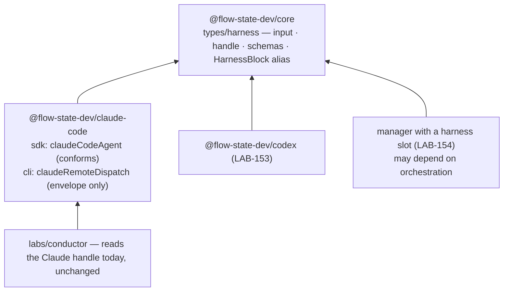

# LAB-152: The harness contract lives in a neutral home, and claudeCodeAgent conforms to it — Implementation Spec

## Part I — The Case *(for the human)*

### 1. Problem — why it matters, why now

The only definition of what a coding harness is handed and what it hands back lives inside
the Claude Code package. The run manager reads six things off that handle, and four of them
exist only on Claude Code's own extension of the shape. The field that says where a run came
from lists exactly Claude's two doors. A second harness cannot build against a contract
without installing Claude Code, and a manager meant to drive any harness is programming
against one package's internals.

**Why now** — the Codex harness (LAB-153) and the manager's harness slot (LAB-154) both build
on this shape and cannot land before it does.

### 2. Solution in plain terms

Move the contract into the framework's core package, which every harness already depends
on. Open the "where did this come from" field to any harness. Give the shared handle the four
fields the manager already reads, plus one honest bit: whether the cost was reported or
estimated. Give the shared input an optional *session to resume*, honoured by the Claude Code
harness on the background path — where the manager runs it. Claude Code's own types become
the neutral ones plus Claude's extras; every caller and every saved handle keeps working.

**Philosophy** — tenet 4 (*infrastructure, not knowledge*): the contract names capabilities —
dispatch, hand back, resume by id, abort — never a vendor's notion. Tenet 5 (*fix at the
owning layer*): one shape where the harnesses and the manager converge. Tenet 3 (*earn every
addition*): no new package; one type module.

### 6. Decisions & rules — the sign-off surface

1. **The contract lives in `@flow-state-dev/core`.**
   *Rejected:* a new `@flow-state-dev/harness` package — one more published package to version
   for two types; and `@flow-state-dev/contracts` — zero-dependency by rule, so it cannot carry
   the runtime validator a block declares as its output.
   *Locks in:* every harness package depends on core, which all of them already do. Moving the
   types later is a breaking import change for any third-party harness we don't know about.

2. **The session to resume is part of the input contract now, and the Claude Code harness
   honours it on the background path in this issue.**
   *Rejected:* leaving the input at "a prompt" and having LAB-154 add resume when it wires the
   manager.
   *Locks in:* resume has exactly one expression — a field on the input — so no harness ever
   grows a second "continue" entry point beside "start". LAB-154 makes the manager send it and
   owns the end-to-end proof. The in-session path is untouched: its continuity still comes from
   session state, and an explicit resume id there is refused loudly rather than raced.

3. **Cost says whether it was reported or estimated, and the result classification is a
   neutral three-way — finished, stopped at a limit, failed — with the vendor's own reason
   kept on the vendor's extension.**
   *Rejected:* a bare cost number and Claude's SDK result enum as the contract.
   *Locks in:* no dashboard or report can show a cost precision the harness didn't give
   (Codex reports no cost; we derive one). Vendor strings never become framework branching.

**Non-goals** — a second harness (LAB-153); any change to the manager's run logic, whose read
of the handle keeps working untouched until LAB-154 switches it to the neutral fields; the
`claude --remote` door, which is fire-and-forget with no resume and no result, keeps the shared
envelope but is not claimed as a manager-drivable harness; a typed resume field on the task
(FIX-1179).

**Size:** Small — 5 production files · 10 test behaviours · 3 doc surfaces · 1 PR.

---

### 3. Tradeoffs & alternatives

**Alternative: leave the contract in Claude Code and let Codex import it from there.** Rejected
— the Codex package would install the Anthropic package for two types, and the dependency
direction would say Codex is built on Claude Code. Wrong story, and it invites the next
Claude-shaped clause.

**The simpler approach: a type-only contract, no runtime schema.** Insufficient — a block's
output schema is what the framework validates at the boundary and what the manager declares as
its own input. A type alone cannot be parsed, so the conformance claim would rest on nothing
that runs.

**Where the complexity is:** not the types. It is three compatibilities held at once: handles
already persisted in session state must keep parsing (BP-030); the manager's existing read of
the Claude handle must keep type-checking with no edit; and the new resume input must not
reopen the hole `detached` was built to close — a saved session silently resumed into a
directory it never worked in. §9 is about that third one.

### 4. Focus practices (1–4)

1. **BP-030 (tolerate the old shape)** — the source field is *widened* to any harness name,
   never renamed. A handle saved last week with `source: "sdk"` still parses.
2. **BP-031 (never decide from caller input)** — the working directory stays a factory
   resolver, not a per-call input. The block is exposed to models as a tool through its
   capability; an input-level directory would let a model choose where a run writes.
3. **BP-004 (public boundary first)** — define the neutral types and their exports before
   touching Claude Code. The conformance test is the first red.
4. **Epic theme 7's tell** — a clause in the neutral types that names a Claude Code notion (a
   turn cap, an SDK subtype, `detached`) is a defect, not a detail.

### 5. What using it looks like

**A harness block in any package declares the neutral shapes** *(names illustrative — the
implementer settles them)*:

```ts
import { harnessRunInputSchema, harnessRunHandleSchema } from "@flow-state-dev/core";

export const codexRun = handler({
  name: "codex-run",
  inputSchema: harnessRunInputSchema,   // { prompt, resumeSessionId? }
  outputSchema: harnessRunHandleSchema, // status · sessionId · url · dispatchedAt · outcome · finalMessage · usage · cost
  execute: async (input, ctx) => { /* … */ },
});
```

**Resuming a background run by id** — what this spec proposes; today the same step starts a
fresh conversation:

```ts
// seq.step(claudeCodeAgent({ detached: true, cwd: … })) with input
{ prompt: "Apply the answer: keep the symlink.", resumeSessionId: "sess_a1b2" }
// → the SDK is handed resume: "sess_a1b2"; the returned handle continues that conversation.
```

**Existing readers, before and after** — identical. The manager's current read of
`{ status, sessionId, resultSubtype, finalMessage, usage, costUsd }` off the Claude handle
type-checks and runs unchanged.

---

## Part II — The Build Plan *(for the implementing agent)*

### 7. Technical design

The contract is a leaf type module in core. Both Claude Code doors extend it; the Codex
harness (LAB-153) and the manager's slot (LAB-154) import it from there. Nothing in core
imports a harness.



**The input** — what a manager hands a harness per run: the prompt, and optionally the
session to continue. Nothing else. The working directory, model, tool policy, sandbox and
abort forwarding are harness *configuration* (factory options, resolver-shaped where they
vary per run), which is what keeps them off a surface a model tool could reach.

**The handle** — what a harness hands back, every field of which any harness can honestly
fill:

| Field | Meaning | Today |
|---|---|---|
| source | which harness, and which door, produced it — any string, convention `<package>/<door>` | enum of Claude's two doors → widened |
| status | dispatched · running · completed · errored | exists |
| sessionId · url · dispatchedAt | as today | exist |
| outcome | how the run ended: finished · stopped at a limit · failed — `null` until known | new; derived from Claude's `resultSubtype` |
| finalMessage | last assistant text, `null` if none | Claude-only → shared |
| usage | input/output tokens, `null` when unreported | Claude-only → shared |
| cost | USD plus whether it was *reported* or *estimated*; `null` when neither | Claude-only `costUsd` → shared, with provenance |

Claude's extension keeps what is Claude's: `resultSubtype` (the SDK's own enum, which existing
readers use) and `toolsObserved`. The CLI door's extension keeps `instructions` and `raw`.

**Conformance** is stated once, as a type alias in core — a block whose input and output are
the neutral schemas — and proved twice for Claude Code: at the type level (`claudeCodeAgent()`
is assignable to the alias) and at runtime (its returned handle parses against the neutral
schema). The alias is a type, not an installation point (epic theme 9).

**Abort** is not a field. A conforming harness forwards the block's own signal into whatever
cancels its run — Claude Code already does — and a cancelled run surfaces as a throw, not a
handle status. The contract's doc comment says so; no code enforces it.

**Sketch — pseudocode. Illustrative, not the contract. React to the shape.**

```
in core/types/harness:
    input   = { prompt, resumeSessionId? }
    handle  = envelope ∪ { outcome, finalMessage, usage, cost{usd, basis} }
    HarnessBlock = a block definition over exactly those two schemas

in claude-code/sdk, at the point the SDK query is built:
    if detached:
        resume ← input.resumeSessionId            ← the whole of decision 2
    else if input.resumeSessionId is set:
        throw: continuity is session state's here  ← loud, not raced
    else:
        resume ← the session provider's saved id   (unchanged)

    handle ← { ...neutral fields, outcome ← classify(resultSubtype), resultSubtype, toolsObserved }
```

What this asks a reviewer: *is one resume field on the input, honoured only where the caller
owns continuity, the right seam — or should resume stay a factory concern?* That is the
question. Whether the field is called `resumeSessionId` or `resume` is not.

### 8. Implementation sequence

1. **Define the contract in core** — the input and handle types, their schemas, the block
   alias; exported from the `types` subpath (types) and the root (schemas). *Test:* the schemas
   accept a minimal neutral handle and reject a vendor-shaped one; a persisted-style handle
   with `source: "sdk"` still parses (decision 1, BP-030). *Depends on:* nothing.
2. **Claude Code conforms** — the shared envelope in `claude-code` becomes a re-export of
   core's; the SDK handle extends the neutral handle (adding `outcome`, deriving it from the
   subtype, and cost provenance `reported`); the CLI handle extends the envelope. Delete the
   package-local envelope module rather than keeping two. *Test:* type-level assignability to
   the alias; the existing agent suite green; `outcome` for each SDK subtype. *Depends on:* 1.
3. **Resume on the background path** — the input schema gains the optional field; the query
   options take it when `detached`; the in-session path refuses it (decision 2). *Test:* the
   scripted-SDK harness the suite already has records the `resume` handed over. *Depends on:* 2.
4. **Docs and exports** per §11; `.changeset` entries for `core` (minor) and `claude-code`
   (patch). *Depends on:* 3.

*(No PR plan — one PR.)*

### 9. Edge cases & error handling

| Case | Expected |
|---|---|
| Handle persisted before this change, `source: "sdk"` or `"cli-remote"` | Parses; the field is a string now |
| Handle persisted before this change, no `outcome` / `cost` keys | Parses on the Claude extension's dual-read; the new nullable fields read `null` (BP-030) |
| `resumeSessionId` passed while conversation state is **on** | Throw before the query runs — two owners of continuity is the bug `detached` exists to prevent; refusing beats picking one silently |
| `resumeSessionId` passed while `detached`, but the SDK reports a different session id | Handle carries what the SDK reported; the caller compares if it cares |
| `resumeSessionId` empty string | Treated as absent |
| Run aborted by the block's signal | Throws as today; no handle, no `outcome` |
| SDK result omits usage and cost | `usage: null`, `cost: null` — never invented |
| The manager's `decide` still reads `resultSubtype` | Unchanged and still present on the Claude extension; LAB-154 moves it to `outcome` |

**Taxonomy:** the one new throw (resume id on the in-session path) is a caller error, fatal for
that run, thrown before any SDK call. Everything else degrades to `null` fields.

### 10. Testing strategy

**Goal & goal check:** none applies. The deliverable is a contract and a conformance, both
proved in CI; a real-model resume on the background path is LAB-154's proof, run against the
manager that sends the id.

**CI specs** (behaviours, not test names):
- the neutral schemas accept a minimal handle from a hypothetical second harness, and reject
  a Claude-shaped field on the neutral type (decision 1)
- a handle saved under the old shape parses (BP-030) — both doors
- `claudeCodeAgent()` is assignable to the harness block alias (type-level, `satisfies`)
- the handle the SDK block returns parses against the neutral schema — the runtime half of
  conformance
- `outcome` maps every SDK subtype, and is `null` when no result arrived
- cost provenance is `reported` on the SDK path, and the field is `null` when the SDK sent
  none
- `detached` + `resumeSessionId` → the SDK is handed that `resume` (decision 2)
- conversation state on + `resumeSessionId` → throws before the query (decision 2)
- `detached` + no `resumeSessionId` → the SDK is handed no `resume`, exactly as today
- the CLI door's handle still parses against the envelope; nothing else about it changes

**Discipline:** `tdd`. The seam is the existing scripted-SDK harness in
`packages/claude-code/test/sdk/agent.spec.ts`, which already records the `resume` handed to
`query` — every resume behaviour above is a tracer bullet there. Schema and type tests live
in core's suite.

### 11. Documentation plan

- **EXTEND** `packages/core/README.md` → "Types (`@flow-state-dev/core/types`)": one paragraph
  naming the harness contract — what a harness is handed, what it returns, and that any
  harness package declares these shapes. Cross-link → the Claude Code SDK page.
- **EXTEND** `apps/docs/docs/tools/claude-code-sdk.md` → "As a sequencer step" (the handle
  description) and "Turning it off for background work": say the handle is the framework's
  neutral harness handle plus Claude's extras, and add the resume-by-id input to the
  background-work section with the two-line example from §5. *Voice risk:* "seamless"
  resume; and explain "harness" on first use — a coding agent driven as a block.
- **EXTEND** `packages/claude-code/README.md` → "Session state" and "Running as detached
  background work": the same two points, terser.
- **No new page.** The contract is a type a harness author reads; the page that teaches
  it is the one that will ship the Codex harness (LAB-153), not this issue.
- **`docs/architecture/overview.md`** — no change: the dependency rules already say core is
  the shared layer; a harness package is one more consumer of it.

### 12. Dependencies, open questions & follow-ups

**Dependencies:** none. FIX-1291 (#1523, open) edits the manager in `labs/conductor`, which
this spec does not touch; it reads the Claude handle's existing fields, all of which stay.

**Open questions:** none.

**Cross-cutting, for LAB-154 (noted on the epic PR):** the working directory stays harness
configuration, not input (§7). A manager with a block slot therefore needs a way to hand the
slot's harness its checkout path that is not the input — a slot that takes a factory, or a
known state the resolver reads. That is LAB-154's to pick; this contract precludes neither.
Decision 2 also moves the harness half of resume here, so LAB-154 owns only the manager half
and the proof.

**Follow-ups (flagged, not built):**
- **Deepening:** `resultSubtype` on the Claude extension and `outcome` on the neutral handle
  carry one fact twice for one release; remove the vendor field once LAB-154's manager reads
  `outcome`. Track in LAB-154's spec.

---

## Spec evolution *(the change story, not an audit log)*

- **Spec drafted** — framed as "the contract is trapped in one vendor's package"; chose core
  as the home over a new package or the zero-dependency layer; put resume-by-id on the input
  and honoured it on the background path here rather than in LAB-154; kept the working
  directory as configuration so the model-tool surface stays closed.
