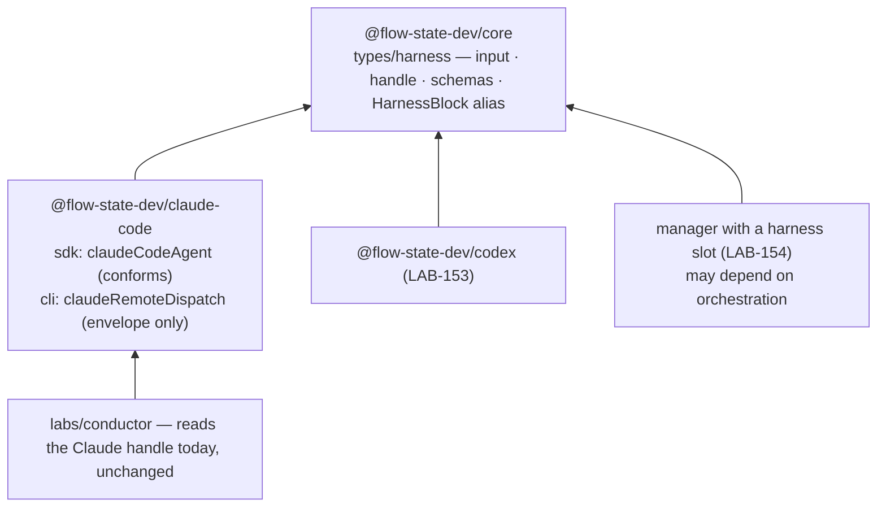

# LAB-152: The harness contract lives in a neutral home, and claudeCodeAgent conforms to it — Implementation Spec

## Part I — The Case *(for the human)*

### 1. Problem — why it matters, why now

The only definition of what a coding harness is handed and what it hands back lives inside
the Claude Code package. The run manager reads six things off that handle, and four of them
exist only on Claude Code's own extension of the shape. The field that says where a run came
from lists exactly Claude's two doors. A second harness cannot build against a contract
without installing Claude Code, and a manager meant to drive any harness is programming
against one package's internals.

**Why now** — the Codex harness (LAB-153) and the manager's harness slot (LAB-154) both build
on this shape and cannot land before it does.

### 2. Solution in plain terms

Move the contract into the framework's core package, which every harness already depends
on. Open the "where did this come from" field to any harness. Give the shared handle the four
fields the manager already reads, plus one honest bit: whether the cost was reported or
estimated. Decide where resuming a session belongs — with the caller that owns continuity,
through a channel a model tool cannot reach — and let the manager work (LAB-154) land the
mechanism. Claude Code's own types become the neutral ones plus Claude's extras; every caller
and every saved handle keeps working.

**Philosophy** — tenet 4 (*infrastructure, not knowledge*): the contract names capabilities —
dispatch, hand back, abort — never a vendor's notion. Tenet 5 (*fix at the owning layer*):
one shape where the harnesses and the manager converge. Tenet 3 (*earn every addition*): no
new package; one type module; no behaviour nothing in this issue exercises.

### 6. Decisions & rules — the sign-off surface

1. **The contract lives in `@flow-state-dev/core`.**
   *Rejected:* a new `@flow-state-dev/harness` package — one more published package to version
   for two types; and `@flow-state-dev/contracts` — zero-dependency by rule, so it cannot carry
   the runtime validator a block declares as its output.
   *Locks in:* every harness package depends on core, which all of them already do. Moving the
   types later is a breaking import change for any third-party harness we don't know about.

2. **Resume-by-id is decided here and lands with LAB-154 — as trusted state the manager
   resolves, never as a field on the block's input.**
   *Rejected:* an optional resume id on the input contract, honoured by the Claude Code harness
   in this issue. A block's input schema is model-facing through its capability's tool preset,
   so a model could name any known session id and resume it into the current checkout — the
   cross-workspace hole `detached` was built to close, and a BP-031 shape (an identity decision
   from caller-controllable input). And nothing in this issue would exercise it: the manager
   sends no id until LAB-154. *Also rejected:* leaving the question open for LAB-154 to
   re-debate.
   *Locks in:* resume has exactly one expression. The caller that owns continuity — the
   manager, on the background path — supplies the id through a trusted channel the harness
   reads, and the in-session path keeps its continuity in session state and refuses an explicit
   id loudly rather than racing two owners. The input contract in this issue is the prompt
   alone. LAB-154 lands the mechanism and owns the end-to-end proof.

3. **Cost says whether it was reported or estimated, and the result classification is a
   neutral three-way — finished, stopped at a limit, failed — with the vendor's own reason
   kept on the vendor's extension.**
   *Rejected:* a bare cost number and Claude's SDK result enum as the contract.
   *Locks in:* no dashboard or report can show a cost precision the harness didn't give
   (Codex reports no cost; we derive one). Vendor strings never become framework branching.
   Until LAB-154 switches the manager to the neutral fields, the Claude extension carries
   `costUsd` and `resultSubtype` alongside `cost` and `outcome` — a dual-read period, not a
   second contract.

**Non-goals** — a second harness (LAB-153); any change to the manager's run logic, whose read
of the handle keeps working untouched until LAB-154 switches it to the neutral fields; the
resume mechanism itself (LAB-154); the `claude --remote` door, which is fire-and-forget with no
resume and no result, keeps the shared envelope but is not claimed as a manager-drivable
harness; a typed resume field on the task (FIX-1179).

**Size:** Small — 5 production files · 8 test behaviours · 2 doc surfaces · 1 PR.

---

### 3. Tradeoffs & alternatives

**Alternative: leave the contract in Claude Code and let Codex import it from there.** Rejected
— the Codex package would install the Anthropic package for two types, and the dependency
direction would say Codex is built on Claude Code. Wrong story, and it invites the next
Claude-shaped clause.

**The simpler approach: a type-only contract, no runtime schema.** Insufficient — a block's
output schema is what the framework validates at the boundary and what the manager declares as
its own input. A type alone cannot be parsed, so the conformance claim would rest on nothing
that runs.

**Alternative: ship the resume field here, since the seam is decided.** Rejected in review —
a field on the block's input is a field on the model-facing tool schema, and no caller in this
issue would exercise it. The seam is recorded (decision 2); the mechanism lands with its only
consumer.

**Where the complexity is:** not the types. It is two compatibilities held at once: handles
already persisted in session state must keep parsing (BP-030), and the manager's existing read
of the Claude handle — `costUsd` and `resultSubtype` included — must keep type-checking with
no edit. §7 and §9 name the shim.

### 4. Focus practices (1–4)

1. **BP-030 (tolerate the old shape)** — the source field is *widened* to any harness name,
   never renamed. A handle saved last week with `source: "sdk"` still parses.
2. **BP-031 (never decide from caller input)** — the working directory stays a factory
   resolver, and the session to resume stays off the input entirely. The block is exposed to
   models as a tool through its capability; either field on the input would let a model choose
   where a run writes or which conversation it continues.
3. **BP-004 (public boundary first)** — define the neutral types and their exports before
   touching Claude Code. The conformance test is the first red.
4. **Epic theme 7's tell** — a clause in the neutral types that names a Claude Code notion (a
   turn cap, an SDK subtype, `detached`) is a defect, not a detail.

### 5. What using it looks like

**A harness block in any package declares the neutral shapes** *(names illustrative — the
implementer settles them)*:

```ts
import { harnessRunInputSchema, harnessRunHandleSchema } from "@flow-state-dev/core";

export const codexRun = handler({
  name: "codex-run",
  inputSchema: harnessRunInputSchema,   // { prompt }
  outputSchema: harnessRunHandleSchema, // status · sessionId · url · dispatchedAt · outcome · finalMessage · usage · cost
  execute: async (input, ctx) => { /* … */ },
});
```

**Existing readers, before and after** — identical. The manager's current read of
`{ status, sessionId, resultSubtype, finalMessage, usage, costUsd }` off the Claude handle
type-checks and runs unchanged, because the Claude extension keeps `resultSubtype` and
`costUsd` beside the neutral `outcome` and `cost` until LAB-154 moves the manager over.

---

## Part II — The Build Plan *(for the implementing agent)*

### 7. Technical design

The contract is a leaf type module in core. Both Claude Code doors extend it; the Codex
harness (LAB-153) and the manager's slot (LAB-154) import it from there. Nothing in core
imports a harness.



**The input** — what a manager hands a harness per run: the prompt. Nothing else. The
working directory, model, tool policy, sandbox and abort forwarding are harness
*configuration* (factory options, resolver-shaped where they vary per run), which is what
keeps them off a surface a model tool could reach. The session to resume is the same kind of
thing — trusted state the caller that owns continuity resolves — and LAB-154 lands it that
way (decision 2). This contract's input schema must leave room for that without ever carrying
the id itself.

**The handle** — what a harness hands back, every field of which any harness can honestly
fill:

| Field | Meaning | Today |
|---|---|---|
| source | which harness, and which door, produced it — any string, convention `<package>/<door>` | enum of Claude's two doors → widened |
| status | dispatched · running · completed · errored | exists |
| sessionId · url · dispatchedAt | as today | exist |
| outcome | how the run ended: finished · stopped at a limit · failed — `null` until known | new; derived from Claude's `resultSubtype` |
| finalMessage | last assistant text, `null` if none | Claude-only → shared |
| usage | input/output tokens, `null` when unreported | Claude-only → shared |
| cost | USD plus whether it was *reported* or *estimated*; `null` when neither | Claude-only `costUsd` → shared, with provenance |

**Claude's extension keeps what is Claude's, and what the manager reads today:**
`resultSubtype` (the SDK's own enum) and `toolsObserved`; and — for the dual-read period
only — `costUsd`, carried equal to `cost.usd` (or `null`) so the manager's existing read
type-checks and runs with no edit. `costUsd` is never on the neutral handle. LAB-154 switches
the manager to `outcome` and `cost` and removes both duals from the Claude extension. The CLI
door's extension keeps `instructions` and `raw`.

**Conformance** is stated once, as a type alias in core — a block whose input and output are
the neutral schemas — and proved twice for Claude Code: at the type level (`claudeCodeAgent()`
is assignable to the alias) and at runtime (its returned handle parses against the neutral
schema). The alias is a type, not an installation point (epic theme 9). The neutral schema's
*declared* shape carries no vendor field; an extended handle still parses against it — vendor
fields are absent from the contract, not rejected by it at runtime (see §13).

**Abort** is not a field. A conforming harness forwards the block's own signal into whatever
cancels its run — Claude Code already does — and a cancelled run surfaces as a throw, not a
handle status. The contract's doc comment says so; no code enforces it.

**Sketch — pseudocode. Illustrative, not the contract. React to the shape.**

```
in core/types/harness:
    input   = { prompt }
    handle  = envelope ∪ { outcome, finalMessage, usage, cost{usd, basis} }
    HarnessBlock = a block definition over exactly those two schemas

in claude-code/sdk, where the handle is assembled:
    handle ← { ...neutral fields,
               outcome    ← classify(resultSubtype),
               cost       ← { usd, basis: "reported" } | null,
               costUsd    ← cost?.usd ?? null,           ← the dual, until LAB-154
               resultSubtype, toolsObserved }
```

What this asks a reviewer: *is the neutral field set something a second harness can fill
honestly, with no bespoke handling on the manager side?* That is the question. Whether a
field is called `outcome` or `result` is not.

### 8. Implementation sequence

1. **Define the contract in core** — the input and handle types, their schemas, the block
   alias; exported from the `types` subpath (types) and the root (schemas). *Test:* the schemas
   accept a minimal neutral handle; a persisted-style handle with `source: "sdk"` still parses
   (decision 1, BP-030). *Depends on:* nothing.
2. **Claude Code conforms** — the shared envelope in `claude-code` becomes a re-export of
   core's; the SDK handle extends the neutral handle (adding `outcome`, deriving it from the
   subtype; cost provenance `reported`; `costUsd` kept as the dual); the CLI handle extends the
   envelope. Delete the package-local envelope module rather than keeping two. *Test:*
   type-level assignability to the alias; the existing agent suite green; `outcome` for each SDK
   subtype; `costUsd` equals `cost.usd`. *Depends on:* 1.
3. **Docs and exports** per §11; `.changeset` entries for `core` (minor) and `claude-code`
   (patch). *Depends on:* 2.

*(No PR plan — one PR.)*

### 9. Edge cases & error handling

| Case | Expected |
|---|---|
| Handle persisted before this change, `source: "sdk"` or `"cli-remote"` | Parses; the field is a string now |
| Handle persisted before this change, no `outcome` / `cost` keys | Parses on the Claude extension's dual-read; the new nullable fields read `null` (BP-030) |
| Run aborted by the block's signal | Throws as today; no handle, no `outcome` |
| SDK result omits usage and cost | `usage: null`, `cost: null`, `costUsd: null` — never invented |
| The manager's `decide` still reads `resultSubtype` and `costUsd` | Unchanged and still present on the Claude extension; LAB-154 moves it to `outcome` and `cost` |
| A caller passes an unknown field (a resume id, say) on the input | Whatever the block's input validation does today for an unknown key; this contract adds no handling for it |

**Taxonomy:** no new throw. Everything new degrades to `null` fields.

### 10. Testing strategy

**Goal & goal check:** none applies. The deliverable is a contract and a conformance, both
proved in CI; the real-model proof that a harness driven through this contract completes a
run belongs to LAB-154, run against the manager that drives it.

**CI specs** (behaviours, not test names):
- the neutral schemas accept a minimal handle from a hypothetical second harness, and the
  neutral *type* carries no Claude-shaped field (decision 1)
- a handle saved under the old shape parses (BP-030) — both doors
- `claudeCodeAgent()` is assignable to the harness block alias (type-level, `satisfies`)
- the handle the SDK block returns parses against the neutral schema — the runtime half of
  conformance
- `outcome` maps every SDK subtype, and is `null` when no result arrived
- cost provenance is `reported` on the SDK path, and the field is `null` when the SDK sent
  none
- the Claude handle still carries `costUsd`, equal to `cost.usd`, and `resultSubtype` — the
  dual the manager reads (decision 3)
- the CLI door's handle still parses against the envelope; nothing else about it changes

**Discipline:** `tdd`. Schema and type tests live in core's suite; the SDK-side behaviours
ride the existing scripted-SDK harness in `packages/claude-code/test/sdk/agent.spec.ts`.

### 11. Documentation plan

- **EXTEND** `packages/core/README.md` → "Types (`@flow-state-dev/core/types`)": one paragraph
  naming the harness contract — what a harness is handed, what it returns, and that any
  harness package declares these shapes. Cross-link → the Claude Code SDK page.
- **EXTEND** `apps/docs/docs/tools/claude-code-sdk.md` → "As a sequencer step" (the handle
  description): say the handle is the framework's neutral harness handle plus Claude's extras,
  and name the neutral fields a reader can rely on. *Voice risk:* explain "harness" on first
  use — a coding agent driven as a block.
- **No new page.** The contract is a type a harness author reads; the page that teaches
  it is the one that will ship the Codex harness (LAB-153), not this issue.
- **`packages/claude-code/README.md`** — no change beyond what the handle rename touches;
  nothing a Claude Code user does differently.
- **`docs/architecture/overview.md`** — no change: the dependency rules already say core is
  the shared layer; a harness package is one more consumer of it.

### 12. Dependencies, open questions & follow-ups

**Dependencies:** none. FIX-1291 (#1523, open) edits the manager in `labs/conductor`, which
this spec does not touch; it reads the Claude handle's existing fields, all of which stay.

**Open questions:** none.

**Cross-cutting, for LAB-154 (noted on the epic PR):**
- The working directory stays harness configuration, not input (§7). A manager with a block
  slot therefore needs a way to hand the slot's harness its checkout path that is not the
  input — a slot that takes a factory, or a known state the resolver reads. That is LAB-154's
  to pick; this contract precludes neither.
- The session to resume takes the same route (decision 2): LAB-154 lands it as trusted state
  the manager resolves, honoured on the background path and refused in-session, never as a
  field on the block's input schema. LAB-154 owns the mechanism and the end-to-end proof.
- **Hard acceptance criteria for LAB-154, not nice-to-haves:** the manager reads `outcome`
  and `cost` instead of `resultSubtype` and `costUsd`, and the two duals come off the Claude
  extension in the same change. Otherwise two classifiers live across packages for releases.

### 13. Review notes for the implementer

Below-the-bar feedback from spec review, recorded verbatim. Weigh each against real code; none
changes the design.

- **Codex, §10 CI behaviours** ([thread](https://github.com/fixpoint-labs/flow-state-dev/pull/1534#discussion_r3909404702)):
  > These CI requirements cannot both hold for the handle defined in §7: rejecting
  > Claude-specific fields requires a strict neutral schema, but the returned Claude handle
  > necessarily contains `resultSubtype` and `toolsObserved`, so parsing that same handle
  > against the neutral schema would fail. A non-strict Zod object makes conformance pass but
  > does not reject those fields. Require vendor fields to be absent from the neutral
  > contract's declared shape while allowing extended handles to parse, rather than requiring
  > runtime rejection of extension fields.

  §7 and §10 now say "absent from the declared shape", not "rejected at runtime"; the schema
  strictness that gets you there is yours.
- **Cursor, cost provenance** ([thread](https://github.com/fixpoint-labs/flow-state-dev/pull/1534#discussion_r3909412066)):
  > **Possible deferral:** `outcome` feels load-bearing now (manager branching must not key
  > off Claude subtypes). The `cost { usd, basis }` object may be premature — conductor already
  > models `costUsd: number | null` on run rows and nothing reads provenance today. Consider
  > neutral `costUsd` in LAB-152 and introducing `basis` only when LAB-153 actually estimates
  > cost. Not a blocker if you want the honest shape locked before Codex lands.

  Decision 3 stands — the estimated case is Codex's, not hypothetical — but keep the shape
  exactly as small as the decision needs.
- **Cursor, the `HarnessBlock` alias** ([thread](https://github.com/fixpoint-labs/flow-state-dev/pull/1534#discussion_r3909412081)):
  > **Simplify candidate:** Unless LAB-154's harness slot is literally typed as
  > `HarnessBlock`, consider dropping the alias and documenting conformance as "block with
  > `harnessRunInputSchema` / `harnessRunHandleSchema`". Keep one runtime parse test;
  > `satisfies` is nice but optional if it duplicates the parse test.

  Keep the alias only if LAB-154's slot types against it; the epic-spec expects it to, but
  check before adding ceremony.
- **Cursor, review body, item 1** — smallest-extraction fallback:
  > Lift today's envelope + SDK fields into core with minimal renaming, keep `costUsd` and let
  > the manager keep reading `resultSubtype`. Add `outcome`, `cost { usd, basis }`, and
  > `resumeSessionId` when LAB-153/154 actually need them.

  Half taken (resume deferred); `outcome` and `cost` stay per decision 3.

---

## Spec evolution *(the change story, not an audit log)*

- **Spec drafted** — framed as "the contract is trapped in one vendor's package"; chose core
  as the home over a new package or the zero-dependency layer; put resume-by-id on the input
  and honoured it on the background path here rather than in LAB-154; kept the working
  directory as configuration so the model-tool surface stays closed.
- **After spec review** — resume-by-id came off the input contract and defers to LAB-154 as
  trusted manager-resolved state, because a block's input schema is model-facing through its
  capability's tool preset (a model could resume any known session into the current checkout —
  the hole `detached` closes) and nothing in this issue exercised it; and the Claude extension
  explicitly keeps `costUsd` as a dual beside neutral `cost`, because §5 promised the manager's
  read unchanged while §7 had dropped the field.
