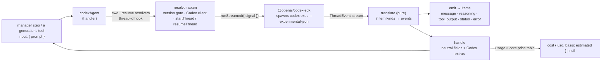

# LAB-153: `@flow-state-dev/codex` — a Codex harness block that dispatches, resumes and aborts a run — Implementation Spec

## Part I — The Case *(for the human)*

### 1. Problem — why it matters, why now

The harness manager can drive exactly one coding agent. With one, nobody can tell whether
the contract it depends on is a real seam a second agent plugs into, or a shape that
happens to fit Claude Code because Claude Code is all that ever used it. Anyone who wants
coding work done by a different vendor has no choice.

**Why now** — the contract has just been written down in a neutral home (LAB-152). This
issue is its falsifier: a second harness with no special handling on the manager's side.
The epic's proof (LAB-141) needs it landed.

### 2. Solution in plain terms

A second package, for OpenAI's Codex, that does the four things the contract asks of a
harness: start a run in a working directory and hand back a handle; continue a previous
run when told which one; stop when its caller's deadline fires; report what the run said,
used and cost. It drives Codex through OpenAI's own SDK, pinned to the exact version we
tested — it refuses to build against any other — and mirrors the run's messages,
reasoning, commands and file changes into the item stream as the Claude Code run's are.

Two things it does the way Claude Code does, because the contract says so: the directory
a run works in and the conversation it continues are **configuration the host resolves**,
never something the block's caller can pick. One thing it does differently, honestly:
Codex reports usage but no price, so the cost on the handle is an **estimate** from the
framework's own price table, and the handle says so.

**Philosophy** — tenet 4 (*infrastructure, not knowledge*): everything Codex-specific
stays inside this package; the manager sees only the contract. Tenet 1 (*coherence*): the
package mirrors the Claude Code adapter's shape — a resolver seam, a pure translate layer,
a capability — rather than a second adapter style. Tenet 7 (*prove the goal, not the
mock*): the proof is one real dispatch and one real resume against a live checkout.

### 6. Decisions & rules — the sign-off surface

1. **Codex runs through `@openai/codex-sdk`, pinned to the exact version we tested, which
   the host installs as an optional peer.**
   *Rejected:* Cursor — no package to pin, no usage or cost in its output, no headless
   cancel contract (epic theme 11); and spawning `codex exec` ourselves — the SDK already
   is that spawn.
   *Locks in:* the JSONL wire sits behind an `--experimental-json` flag and can change in
   a lockstep CLI+SDK release, so every Codex upgrade is a deliberate, tested bump of ours
   — a host cannot take a newer Codex than we have checked without a release from us, and
   the block enforces that: built against any other installed version it refuses, naming
   the installed and the tested version and the release as the upgrade path. There is no
   override option; the escape is the release. On the tested wire, an event or item kind
   we don't recognise becomes a note, not a failure, so drift degrades a run's record
   before it breaks a run (BP-030). An untested wire never runs.

2. **What a run touches is configuration, never input: the working directory and the
   conversation to continue come from resolvers the host writes; the block's input is
   the prompt.**
   *Rejected:* a session id on the block's input — the block is exposed to models as a
   tool, so a model could resume any conversation it had seen into the current checkout
   (BP-031; the hole LAB-152's review closed).
   *Locks in:* a model holding the block as a tool can choose neither where a run writes
   nor what it continues. The manager (LAB-154) hands both down its harness slot; a chat
   host wanting thread continuity writes a two-line resolver over its own state. This
   package keeps no session state — so the thread id a run produces goes back out the
   same way, through a hook the host configures, the moment the run names it: a run the
   deadline killed is still resumable from the host's own state, which is the one case
   the resolver exists for (LAB-152: an abort is a throw, never a handle).

3. **Cost is an estimate from the framework's one price table, present only when the
   block knows which model ran, and absent — never zero — otherwise.**
   *Rejected:* a Codex-only price table in this package; reporting `0`; requiring a model.
   *Locks in:* every Codex run's cost reads `estimated`. Codex's wire never names the model
   it ran, so a run left on Codex's default shows no cost. A new Codex model shows no cost
   until core's table learns it — one patch release corrects every adapter. OpenAI's
   prices move (a promotion runs through November 2026); a wrong number is a stale table,
   visible in one place.

**Non-goals** — choosing which harness runs a task (LAB-141); the manager's harness slot
(LAB-154); a full issue through Codex (LAB-141's proof); a `codex` CLI door of our own;
thread continuity kept in session state (§12); the Claude adapter's `recordWork`
equivalent (§12); answering Codex's approval prompts — a headless run is configured not
to ask; images and structured output.

**Size:** Medium — 12 production files · 18 test behaviours · 5 doc surfaces · 1 PR.

---

### 3. Tradeoffs & alternatives

**Alternative: fold Codex into the Claude Code package as a third door.** Rejected — the
package would carry two vendors' SDKs and their peer dependencies, and the dependency story
would say Codex is built on Claude Code. The neutral contract exists so that harness
packages are siblings under core, each installing only its own vendor.

**The simpler approach: no item mirroring — return the handle and nothing else.** Genuinely
tempting; the manager reads only the handle. Insufficient because the epic's outcome is
*the same watched run either way*: the run journal — the run's own item stream — is how an
operator reads what a run did without opening a vendor transcript (LAB-133's goal), and a
Codex run that leaves the journal empty is not the same run. The mirror is thin — one pure function over
seven item kinds — and stays thin: no work record, no sub-agents, no partial-message
streaming, because Codex's wire carries whole items.

**The necessity check, honestly.** A host could wrap the SDK in a forty-line handler
today. What the package adds is the strongest kind of delta: a second vendor normalised
under one contract, plus the mirror and the abort/deadline composition no user-space
wrapper gets from the framework. Everything Codex-only stays behind the package boundary,
so nothing single-vendor reaches the framework's public surface.

**Where the complexity is:** not the happy path — dispatch and resume are each one SDK
call. It is the endings. Codex has three ways to stop that are not "finished" — the model
fails the turn, the CLI exits non-zero, the caller's deadline fires — and each has to map
to the contract's *outcome* or to a throw without inventing a fourth. §9 is mostly that,
and the POC (§7) found one wrinkle in the third.

### 4. Focus practices (1–4)

1. **BP-031 (never decide from caller input)** — the two resolvers are the whole fence.
   A forwarded option bag that could carry a working directory is refused at build time,
   so the directory has exactly one owner.
2. **Epic theme 7's tell** — a clause the manager needs that only this package can satisfy
   is a clause that was Claude-shaped. The conformance test (the block is assignable to
   core's harness alias; its handle parses against the neutral schema) is the first red.
3. **Tenet 7 (prove the goal, not the mock)** — the resume leg cannot be proved with a
   scripted SDK. The goal check resumes a real thread and asks it something only the first
   turn knows.
4. **BP-030 (tolerate drift) — on the tested wire only.** The wire is experimental:
   unknown event and item kinds become status notes, never throws, and the fake-wire spec
   pins the version we tested. Tolerance stops at the version boundary — a different
   installed SDK is refused, not tolerated (decision 1).

### 5. What using it looks like

**As a manager-driven step** *(names illustrative; the shape is the point)*:

```ts
import { codexAgent } from "@flow-state-dev/codex";

seq.step(
  codexAgent({
    // Both are configuration the host resolves — never the block's input.
    cwd: (_input, ctx) => managerState(ctx).workspacePath,
    resume: (_input, ctx) => managerState(ctx).previousSessionId, // null → fresh thread
    // The write side of `resume`: called once, as soon as the run names its thread.
    onSession: (id, ctx) => managerState(ctx).rememberSession(id),
    thread: { sandboxMode: "workspace-write", approvalPolicy: "never" },
  }),
  { abortSignal: () => AbortSignal.timeout(runTimeoutMs) },
);
// input: { prompt: "Apply the answer: keep the symlink." }
// → a handle the manager already knows how to read:
//   { source: "codex/sdk", status: "completed", sessionId: "thr_…", outcome: "finished",
//     finalMessage: "…", usage: { inputTokens, outputTokens }, cost: { usd: 0.0123, basis: "estimated" } }
```

**As a model-facing tool**, same option set:

```ts
generator({ name: "planner", model: "openai/gpt-5.4-mini",
  uses: [createCodexAgentCapability({ cwd: async () => checkoutForThisRun() })] });
```

**What the manager sees, Claude Code vs Codex** — identical fields, one honest difference:

```
claudeCodeAgent  → cost: { usd: 0.0123, basis: "reported" }
codexAgent       → cost: { usd: 0.0119, basis: "estimated" }   // model configured
codexAgent       → cost: null                                    // model left to Codex's default
```

**Cancelling** — nothing to write; the block forwards its own signal. A fired deadline
throws the moment it fires, and the thread id has already reached the host's hook, so the
run is resumable from the manager's own state. (Claude Code's cancel waits on the vendor's
stream today; FIX-1301 brings it to the same semantics.)

---

## Part II — The Build Plan *(for the implementing agent)*

### 7. Technical design

A leaf package beside `claude-code`, depending on `core` and `zod` only (epic theme 10),
with the vendor SDK as an exact-versioned optional peer. Nothing in it imports the task
substrate or the other harness.



- **`@flow-state-dev/codex`** (new) — the handler factory, its capability, the resolver
  seam (a lazy `import()` of the SDK by default; a scripted client in tests, exactly as
  `claude-code/sdk/sdk-client` does), the version gate (the installed SDK's version read
  when the block is built and compared to the tested pin — any other version is a
  build-time refusal, decision 1), the pure translate layer, the cost derivation,
  typed errors. One entry point — no `cli`/`sdk` split, because the SDK *is* the CLI
  spawn and a door of our own is a non-goal.
- **`@flow-state-dev/core`** — the neutral input/handle schemas, the harness block alias
  and the two feed signatures (one resolver type serving both `cwd` and `resume`, plus the
  `onSession` hook type) all come from LAB-152, which owns and declares them beside the
  contract; this package imports them and declares none of its own. The price table gains
  rows for the Codex models (one patch changeset).
- **Untouched:** `claude-code`, `orchestration`, `labs/conductor`. The manager reads the
  same neutral handle from both harnesses once LAB-154 switches it to the neutral fields.

**The input** is the contract's: the prompt. **The handle** is the neutral handle —
`source: "codex/sdk"` — the `<package>/<door>` form `source` is required to read, a rule
LAB-152 owns and every conforming harness follows, so the suffix here is that convention and
not a second door — status, `sessionId` (Codex's thread id), `url: null`,
`dispatchedAt`, `outcome`, `finalMessage`, `usage`, `cost` — plus a Codex extension for
what only Codex reports: the full usage breakdown (cached input, reasoning output) and the
turn failure message. `outcome` is *finished* on a completed turn and *failed* on a failed
one; Codex reports no turn or budget limit, so *stopped at a limit* is never produced here
and the doc says so.

**Options** are three things the block owns and two groups it forwards. Owned: the `cwd`
resolver and the `resume` resolver (both the resolver signature `(input, ctx) → value`,
called once per invocation before anything is spawned — decision 2), and the write side of
`resume`: `onSession`, a hook the host configures that the block calls once, with the thread
id, the moment the stream names it and before any turn work is consumed — the manager's slot
feeds all three from state the caller never touches (LAB-154). All three are typed by the two
feed signatures core declares beside the contract (LAB-152 decision 4) and imported from
there; this package declares no feed types of its own. Forwarded verbatim, typed locally so
the optional peer is never imported for its types: the SDK's *thread* options (model,
sandbox mode, approval policy, reasoning effort, network and web-search settings, the
git-repo check, additional directories) and its *client* options (API key, environment,
config overrides, a binary path override). Two things in those groups are refused at build
time, not forwarded: a working directory (the resolver owns it) and a turn signal (the
block's own signal owns it). Everything else keeps the SDK's defaults; a run that sets
nothing behaves as `codex exec` does.

**Streaming, not buffering.** The block consumes `runStreamed`, for two reasons the POC
confirmed: the thread id arrives on the first event, so an aborted or failed run still
leaves a resumable id behind; and the items arrive as the run works, which is what the
mirror needs.

**The thread id reaches durable state before any throw.** A throw returns no handle
(LAB-152 §9: an abort is a throw, never a handle — this package does not amend that with a
terminal `stopped` handle of its own), and a status item is transient by contract
(`docs/architecture/streaming.md`), so neither can be the carrier the manager's resume
resolver reads from in exactly the case it exists for. The constraint: once the stream
names the thread, the id is handed to the host's hook — manager-owned durable state —
*before* the block consumes anything that could end in a throw. The status note stays as
an operator convenience, not the record. The write shape behind the hook is the
implementer's call with the code open. The hook fires on an actual `thread.started` stream
event and on nothing else, which is why a refused resume never reaches it: the CLI names no
thread at all in that case (§9; POC `poc/LAB-153-codex-thread-naming`, PR #1573), so the
block never writes a dead id into the host's state — the run ends without naming a session,
which is what LAB-154's rule expects.

**Abort** is the block's signal forwarded into the turn — and the block stops waiting the
moment that signal fires, rather than when the SDK's stream closes (§9, the POC's
finding). A cancelled run throws; it never returns a handle. Why the race and not Claude
Code's forward-and-wait: the deadline is the caller's contract — the manager's deadline is
the forcing function — and a deadline that waits on the vendor's stdout no longer bounds
what it promises to. The divergence from Claude Code is deliberate and temporary:
FIX-1301 brings the Claude adapter to the same semantics (§12).

**Cost** is derived once, at the end: Codex's usage (input less cached at the prompt rate,
cached at the cache-read rate, output at the completion rate) against core's model lookup
for the model the block was configured with. No configured model, no lookup entry, or no
usage → `cost: null` (decision 3). The Codex extension carries the raw breakdown so a
consumer can price it differently.

**Sketch — pseudocode. Illustrative, not the contract. React to the shape.**

```
codexAgent(options):
    handler over the neutral input and handle schemas (conformance = the alias)

    execute(input, ctx):
        prompt        ← input.prompt (empty → throw before anything spawns)
        directory     ← cwd resolver(input, ctx)          ← decision 2
        continue-id   ← resume resolver(input, ctx)       ← decision 2, null = fresh
        client        ← the resolver seam (lazy SDK import, or the test's script)
                        (the installed SDK's version was checked against the pin when the
                         block was built; any other version never reaches here — decision 1)
        thread        ← continue-id ? client.resume(continue-id, opts) : client.start(opts)
                        where opts = forwarded thread options + { workingDirectory: directory }

        first event names the thread id →
            hand it to the host's hook (durable, manager-owned) — before anything else
            note it as a status item for the operator
        for each event, racing against ctx.signal:
            translate → emit items; remember final message, usage, failure
        signal fired  → emit error item, throw (no handle)
        stream threw  → wrap, emit error item, throw
        turn failed   → handle { status: errored, outcome: failed, usage: null }
        turn done     → handle { status: completed, outcome: finished, usage, cost ← estimate }
```

What this asks a reviewer: *is a resolver pair the right way for a harness to receive
"where" and "which conversation", given the manager will feed both from state the caller
never touches?* — and *is throwing on abort, without waiting for the vendor process to
drain, the behaviour the manager's deadline wants?* Whether the resolver is called `resume`
or `continueThread` is not the question.

**POC.** `spec-poc/LAB-153-codex-sdk-shape/` on the spec PR runs the real SDK (0.152.1,
no API key) against a fake `codex` that speaks its JSONL wire: 22 premises checked,
**all held** — dispatch → handle, thread id on the first event, `resume <id>` on the argv,
usage with no cost field and no model name on the wire, abort as an `AbortError` throw,
the three failure endings. One **finding**, folded into §9: the SDK's abort rejects only
once the CLI's stdout closes, so a subprocess the CLI spawned can hold the block open past
the deadline unless the block races the signal itself. `node spec-poc/LAB-153-codex-sdk-shape/run.mjs`.

### 8. Implementation sequence

1. **Scaffold the package and prove conformance.** Package files mirroring `claude-code`
   (exports, tsconfig, vitest aliases, exact optional peer + exact devDependency on the
   SDK), the handle type and schema as core's neutral handle plus the Codex extension,
   the block factory returning a handler over the neutral input and handle, and the
   version gate on the installed SDK. *Test:* the factory's block is assignable to core's
   harness block alias; a minimal handle parses against the neutral schema and against the
   extension (decision 2's shape, theme 7); an installed SDK at any version but the pin is
   refused when the block is built, with an error naming both versions.
   *Depends on:* LAB-152's implementation merged.
2. **The translate layer**, pure, over the SDK's event union (declared locally): each of
   the seven item kinds to an event the emitter understands; thread and turn lifecycle to
   status; `turn.failed` and the `error` item to error events; anything unrecognised to a
   status note. *Test:* one behaviour per item kind, `item.started` → `item.completed`
   correlation for commands, and an unknown kind degrading to a note (BP-030). *Depends
   on:* 1.
3. **The block.** Resolver seam with the lazy default import; the two owned resolvers and
   the thread-id hook; the forwarded option groups with the two build-time refusals;
   `runStreamed` consumed under a race against the block's signal, the hook called before
   anything else once the stream names the thread; the handle assembled from what the
   stream said. *Test:* the scripted-client behaviours in §10 — dispatch, resume, abort,
   the three endings, the refusals, the hook ordering. *Depends on:* 2.
4. **Cost.** Derivation from usage against core's lookup; Codex model rows added to core's
   table with a `core` patch changeset. *Test:* estimated when configured and priced,
   `null` for each absence (decision 3); cached tokens priced at the cache-read rate.
   *Depends on:* 3.
5. **The capability**, mirroring `createClaudeCodeAgentCapability` minus the session-state
   half (this package declares none — decision 2). *Test:* a generator built with it
   carries the block as a tool. *Depends on:* 3.
6. **Graduate the POC** into a CI spec that runs the *installed* SDK against the fake
   `codex` binary — the wire-pinning half of decision 1. *Test:* argv shape, `resume <id>`,
   thread id on the first event, abort rejects, exit code → throw. *Depends on:* 3.
7. **The goal check** (§10). *Depends on:* 4.
8. **Docs, README, package map, changesets** (§11). *Depends on:* 7.

*(No PR plan — one PR.)*

### 9. Edge cases & error handling

| Case | Expected |
|---|---|
| Empty prompt | Throw before anything is spawned — caller error, fatal for the run |
| SDK not installed | Throw at first run, not at import, with an install hint (as the Claude adapter's not-installed error) |
| Installed SDK version ≠ the version we tested | Refused when the block is built — a configuration error naming the installed and the tested version, and that a framework release is the upgrade path. No override option; an untested wire never runs (decision 1). A missing SDK has no version to check, so that case stays the first-run install hint above |
| Working directory is not a git repository | Codex refuses unless the forwarded git-check skip is set; the CLI's non-zero exit becomes a thrown run error carrying its stderr — configuration, fatal |
| A working directory or a turn signal in the forwarded option groups | Refused at build time (BP-031; one owner each) |
| `resume` resolves to an id this host has never seen (Codex keeps sessions under its own home directory) | The CLI exits non-zero; the block throws. The manager's retry policy decides whether the next attempt starts fresh — not this block's call. The stream names no thread on this path, so the session hook never fires and no dead id is written back: the run ends without ever naming a session, and LAB-154's row stays `null` — the self-heal it designed for, needing no guard here (POC, PR #1573) |
| `resume` resolves to `""` | Treated as `null` — a fresh thread |
| `resume` set and the working directory differs from the one the thread started in | Forwarded as given; Codex's behaviour is its own. The manager reuses the checkout, so this is the odd path; documented, not guarded |
| Caller's signal fires mid-run | The block throws an abort error **when the signal fires**, emits an error item, and does not wait for the SDK's stream to close. The thread id, if the stream named it, already reached the host's hook — durable, manager-owned — before any turn work was consumed, so the manager's resume resolver can continue the run; the status note is for the operator, not the record. No handle, no terminal `stopped` outcome — LAB-152's abort contract stands |
| The CLI's own subprocess outlives the kill (POC finding) | Nothing the block can bound: its deadline bounds Codex, not what Codex ran. Documented as a limitation; the sandbox is the fence for runaway commands |
| Model fails the turn (`turn.failed`) | A handle with `status: "errored"`, `outcome: "failed"`, the failure message on the extension, `finalMessage` from any message seen, `usage: null` (no `turn.completed` arrives) — an outcome, not a throw, as the Claude adapter treats a terminal error subtype |
| The `error` item (non-fatal, mid-turn) | An error item in the stream; the run continues and settles on its own turn event |
| CLI exits non-zero, or the stream throws | Wrapped in a typed run error carrying stderr, an error item emitted, rethrown — no handle; the thread id, if the stream had named it, already reached the host's hook |
| No `turn.completed` | `usage: null`, `cost: null` — never invented |
| Model left to Codex's default | `cost: null`; the wire never names the model (POC), so there is nothing to price |
| Reasoning tokens | Counted inside output tokens, as OpenAI's usage does; not priced twice. The raw breakdown rides the extension |
| Unrecognised event or item kind | A status note; the run continues (BP-030 — the wire is experimental) |
| The forwarded environment option | Replaces the CLI's environment rather than adding to it — the SDK's own rule; spread `process.env` to add, exactly as the Claude adapter documents |
| No API key in the environment and none configured | Codex's own auth failure: non-zero exit → thrown run error. Not detected up front — the CLI also accepts a logged-in ChatGPT account, so absence of the key is not absence of auth |

**Taxonomy:** every throw is fatal for that run — a configuration error (empty prompt,
missing SDK, refused option), the vendor process ending abnormally, or a cancel. A failed
*turn* is an outcome on the handle, not a throw. Nothing here retries; retry is the
manager's.

### 10. Testing strategy

**Goal:** hand Codex a real checkout and a held-out task; get a handle back through the
contract; then hand it a follow-up that makes sense only if the conversation continued,
with nothing but the first handle's session id — and read the result off the working
tree and the two handles. `goals/codex-harness/dispatches-and-resumes-through-the-contract/run.mts`,
real Codex, `CODEX_API_KEY`, a configured (priced) model. *Signal:* the file from the
fixture holds both held-out lines; both handles parse against the neutral schema; the
second handle's session id equals the first's; both report `finished`, non-null usage, and
an `estimated` cost. A third leg fires a two-second deadline on a long-running prompt and
requires a throw within a bounded time, with the thread id already in the hook's state. *Anti-game:* the follow-up prompt never names the
file; nothing reads Codex's own session store or transcript; nothing asserts on the
model's prose.

**CI specs** (behaviours, not test names):
- the block is assignable to core's harness block alias, and its returned handle parses
  against the neutral schema — conformance, both halves (theme 7)
- a fresh run calls the client's *start* with the resolved directory and the forwarded
  thread options, and hands the turn the block's own signal
- a resolver returning an id calls *resume* with that id and the same directory;
  `null` and `""` start fresh (decision 2)
- a working directory or a signal inside the forwarded groups is refused at build time
- the handle's session id is the thread id the stream named, even when the run then fails
- the thread id reaches the host's hook once the stream names it, before any item is
  consumed — and therefore before an abort throw or a stream-failure rethrow
- the negative counterpart to that behaviour: on a resume of a thread the CLI no longer
  has, the run fails with the host's hook never called at all — the session id the host
  already holds is left exactly as it was, neither overwritten nor cleared to a dead
  value (§9; the expected shape fixed empirically by `poc/LAB-153-codex-thread-naming`,
  PR #1573, on which LAB-154's null-stays-null self-heal rests)
- an installed SDK at a version other than the pin is refused when the block is built,
  with both versions in the error (decision 1)
- items: each Codex item kind produces its item, commands correlate start to completion
  with exit code and error flag, unknown kinds degrade to a status note
- `turn.failed` → errored handle with `outcome: "failed"` and `usage: null`; a non-zero
  exit → throw; the stream throwing → typed throw, error item emitted
- the signal firing → throw at the moment it fires, with the stream still open; the hook
  already called with the thread id before it
- cost: estimated when model + lookup entry + usage are present, `null` on each absence,
  cached tokens at the cache-read rate (decision 3)
- the capability carries the block as a tool and declares no session state
- the installed SDK against the fake wire: argv shape, `resume <id>`, thread id on the
  first event, abort rejects, exit code → throw (decision 1's pin; graduated POC)

**Discipline:** `tdd`. The seam is a scripted Codex client handed through the resolver —
the shape `claude-code/test/sdk/agent.spec.ts` already uses for `query` — so every
behaviour above is a tracer bullet with no subprocess; the one exception is the graduated
POC spec, which runs the installed SDK against the fake binary.

### 11. Documentation plan

- **CREATE** `apps/docs/docs/tools/codex.md` — *sidebar:* `Tools`, after
  `tools/claude-code-sdk` and before `tools/workspace`, label `Codex (SDK agent)`, so the
  two in-process harnesses sit together. *Audience:* someone who has read the Claude Code
  SDK page or the background-work page. *Lead:* run OpenAI's Codex agent as a block —
  same handle, same way of being pointed at a directory and cancelled, driven through
  OpenAI's SDK. *Sections:* When to use it (a second harness under the same contract; the
  manager can pick either) · Installation (the exact peer version and why, and that any
  other version is refused; `CODEX_API_KEY` or a logged-in Codex; a git repository is
  expected) · Quick start (capability) · As a
  sequencer step · What it emits (a table like the Claude page's) · Where the run works
  (the resolver; a two-line pointer to the Claude page's derivation of a safe path — do
  not repeat it) · Continuing a thread (the resolver and its write-side hook; that the
  block keeps no session state) · Cancelling (a deadline throws; the thread id is already
  in the host's state; the limitation from §9) · Usage and cost (an
  estimate; the three cases that read `null`) · Errors · Limitations. *Example:* the §5
  step. *Cross-links:* → `claude-code-sdk.md` (the companion), → `server/background-work.md`;
  ← `claude-code-sdk.md` intro, ← `server/background-work.md`'s list. *Voice risks:*
  "drop-in", "seamless"; define *harness* on first use (a coding agent driven as a block);
  no "vendor-neutral" as a selling point — say what is the same.
- **CREATE** `packages/codex/README.md` — the terse package-level version: install (and
  the version gate), the two resolvers and the thread hook, the option groups, the handle,
  cost, running tests.
- **EXTEND** `apps/docs/docs/tools/claude-code-sdk.md` — one sentence in the intro naming
  the Codex page as the other harness on the same contract. Nothing else moves.
- **EXTEND** `apps/docs/docs/server/background-work.md` — one bullet beside the Claude
  Code one, pointing at the Codex page's continuing-a-thread section.
- **EXTEND** `CLAUDE.md` package map — one row for `@flow-state-dev/codex`.
- **Changesets:** `@flow-state-dev/codex` minor (new package); `@flow-state-dev/core`
  patch (price-table rows).
- `docs/architecture/overview.md` — no change: it lists no harness package today, and a
  harness is one more consumer of core.

### 12. Dependencies, open questions & follow-ups

**Dependencies:** **LAB-152's implementation merged** — the neutral input and handle
schemas and the block alias this package declares against. Nothing else: FIX-1291
(#1523) and LAB-154 edit the manager and its home, which this package never imports.
LAB-141 depends on this.

**Open questions:** none.

**Settled by the POC** (`spec-poc/LAB-153-codex-sdk-shape/`, 2026-09-02; resolved, don't
reopen):
- **Settled:** the SDK is `startThread` / `resumeThread` → `run` / `runStreamed`, spawning
  `codex exec --experimental-json … [resume <id>]` with the prompt on stdin — **CONFIRMED**
  against 0.152.1's shipped runtime.
- **Settled:** the thread id is known from the first streamed event, before the turn
  ends — **CONFIRMED**.
- **Settled:** cancelling is the turn's `signal`, and a cancel rejects with an
  `AbortError` — **CONFIRMED**, with the §9 finding that the rejection waits for the
  CLI's stdout to close.
- **Settled:** usage carries no cost field and the wire never names the model that ran —
  **CONFIRMED**; decision 3 rests on both.

**Settled by a second POC** (`poc/LAB-153-codex-thread-naming`, PR #1573, 2026-09-05;
resolved, don't reopen):
- **Settled:** a resume against a thread the CLI no longer has names no thread at all —
  **CONFIRMED** on the real `codex exec … resume <id>` (`@openai/codex` 0.152.1): no
  thread-naming event, 0 bytes on stdout, a plain-text
  `thread/resume failed: no rollout found for thread id <uuid> (code -32600)` on stderr,
  exit 1 — while a positive control resuming a live id in the same run does fire
  `thread.started` with the matching id. Because the hook fires only on that event, a
  refused resume never writes a dead id back, so LAB-154's session-id rule needs no
  fallback and this block needs no guard (§7, §9). This closes the cross-spec conflict with
  LAB-154's session-id rule; don't re-add the fallback it rejected.

**Cross-cutting, noted on the epic PR:** the deadline a manager puts on a harness step
bounds the vendor *process*, not the commands that process runs — a runaway command inside
Codex's sandbox can outlive the kill. The same is true in kind for the Claude Code adapter.
LAB-154's deadline design should say so rather than promise a hard bound; the sandbox
setting is the fence for that class.

**Cross-cutting, for LAB-154's slot (noted on the epic PR, 2026-09-02):** the harness
slot feeds three things from state the caller never touches — the directory, the id to
resume, and the *write side* of that id (the hook this block calls when a run names its
thread). A slot that feeds only the first two leaves the resume resolver nothing to read
after exactly the deadline it exists for.

**Follow-ups (flagged, not built):**
- **In-session thread continuity** — a host wanting a chat-style Codex that continues
  across requests writes a resolver over session state today. If that recipe recurs, a
  session-state provider like the Claude adapter's is the shape; track it when a second
  caller wants it.
- **The work record for Codex** — Codex's file-change items are a ready feed for the
  `observed-file-ops` record, but the collections and recorder live in the Claude Code
  package. Moving them to a neutral home is a deepening opportunity (`improve-codebase-architecture`),
  not this issue's.
- **Tracked — FIX-1301:** the Claude adapter's abort waits on the SDK's own controller;
  this package throws when its own signal fires. Two harnesses under one contract must not
  disagree on what a deadline means, so the alignment is a filed issue, not an
  opportunistic note: once this package's race has run in the goal check, `claude-code`
  moves to the same semantics.

### 13. Review notes for the implementer

Below-the-bar feedback from spec review, recorded verbatim (source · date). Weigh each
against the real code; none changes a decision.

- **Cursor (review, 2026-09-02) — file count:** "Benchmark: `claude-code`'s SDK subtree
  is ~11 modules before work-recorder/workspace/session. Codex (no session, no work
  record, no partial streaming) should land closer to ~8–9. Treat 12 as an upper bound,
  not a target — merge translate/emit if the whole-item wire allows a single module."
- **Cursor — the mirror's minimum:** "One lighter alternative if scope pressure hits
  during implementation: ship command + file_change + final message mirroring first (what
  operators actually read in a workstream) and add reasoning/status kinds in a follow-up.
  I am not sure that's better than the spec's 'seven kinds, one pure function'." *(The
  Architect's ruling on the PR: keep it thin at seven kinds, no `recordWork`, no
  sub-agents. The fallback is recorded, not chosen.)*
- **Cursor — the graduated POC:** "Graduating the POC to CI is the right call for
  decision 1's pin, but it does add maintenance surface. Softer alternative (if CI time
  becomes an issue): run the fake-wire spec only on SDK version bumps via a
  manual/scheduled job. I would still default to CI as written."
- **Cursor — emit duplication:** "Both harnesses will carry a similar emit layer. Not this
  issue's job, but now that a second harness is spec'd, consider extracting a shared emit
  helper when implementation starts (same class of follow-up as work-record
  neutralization in §12)."
- **Cursor — cost v1:** "Logic is small, but the wire often gives nothing to price
  (default model → `cost: null`). If schedule is tight, a v1 that always returns
  `cost: null` with usage on the extension would shrink core changes and tests; estimation
  could follow when a caller actually configures a priced model. Soft suggestion only —
  the current decision is coherent." *(Decision 3 stands as scoped.)*
- **second-look (2026-09-02) — where the price table is:**
  "`packages/core/src/adapters/model-lookup.ts` (`DEFAULT_MODEL_LOOKUP`, `findModelEntry`,
  `modelPricingEstimator`) already carries `promptPer1M`/`completionPer1M`/`cacheReadPer1M`/`cacheCreationPer1M`
  and cache-tier fallback math for exactly the shape §9's 'cached tokens at the cache-read
  rate' test line needs. One thing to flag for the implementer, not a spec defect:
  `modelPricingEstimator().estimate()` returns `0` for an unpriced model, the opposite of
  decision 3's 'absent, never zero.' The plan should call `findModelEntry` directly and
  treat a missing entry/pricing as `null` itself, not reuse `estimate()` as-is."
- **Codex (P2, second half) — field drift inside a known event:** "Because the adapter
  locally declares and directly reads known event shapes, a vendor change to fields inside
  an existing `turn.completed` or `item.completed` event can still crash translation or
  silently produce an incorrect handle or cost without reaching that fallback." *(The
  version gate is the answer at the boundary. Within the pinned wire, guard the fields the
  handle and the cost read from rather than trusting the declared shape blindly.)*

---

## Spec evolution *(the change story, not an audit log)*

- **Spec drafted** — framed as the contract's falsifier: a second vendor with no special
  handling on the manager's side; chose OpenAI's SDK pinned exactly over a spawn of our
  own; put the directory and the thread to continue behind resolvers to match LAB-152's
  fold; made cost an estimate from core's one table rather than a second table here.
  POC on the SDK's shape: every premise held; its one finding (abort waits on the vendor's
  stdout) became a §9 row and the race in §7, not a design change.
- **After spec review (round 1, 2026-09-02)** — decision 1 now *enforces* the pin: a
  block built against any installed SDK version but the tested one refuses, with no
  override, because a status note kept none of the promise that a host cannot run an
  untested wire without a release from us (Greptile P1, Codex P2). Decision 2 gained the
  write side of `resume`: the thread id reaches host-owned durable state through a
  configured hook before any throw, because a status item is transient and a throw
  returns no handle, so the manager's resume resolver had nothing to read in exactly the
  deadline case it exists for (Codex P1) — without amending LAB-152's abort-is-a-throw
  contract. Abort stays race-and-throw; the Claude Code alignment is tracked as FIX-1301
  rather than left as a note.
- **After the epic's cross-spec pass (2026-09-05)** — the session hook is `onSession`, the
  name the epic settled and LAB-154 already calls; core, not this package, declares the two
  feed signatures both harnesses use (LAB-152 decision 4), so §7 no longer calls core
  unchanged in shape; and `source: "codex/sdk"` reads as LAB-152's required
  `<package>/<door>` rule rather than as a door split this package does not have. A
  real-CLI POC (PR #1573) closed the resume conflict with LAB-154: a refused resume names
  no thread, so the hook never fires and no dead id is written back — recorded in §7, §9
  and §12, with no change to what the block does.
- **Refused-resume behaviour pinned (2026-09-05)** — §10 gained the negative counterpart to
  the hook behaviour: a resume of a thread the CLI no longer has must leave the host's
  stored session id untouched. The verdict was already prose in §7 and §9, but nothing in
  CI held it, and LAB-154's null-stays-null self-heal is designed on top of it — a
  cross-spec invariant rather than an internal detail here, so an unpinned truth proven
  once could regress silently and break a sibling spec. One behaviour on the size line is
  the right price; nothing about the block changes.
