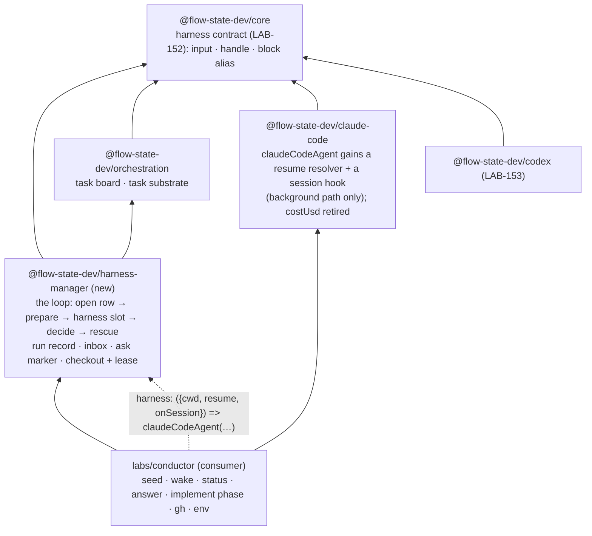

# LAB-154: The harness manager is a framework block with a harness slot, and leaves labs/ — Implementation Spec

## Part I — The Case *(for the human)*

### 1. Problem — why it matters, why now

The harness manager — the thing that turns a task row into a supervised coding run, in its
own checkout, watched to a verdict, able to ask a question and be answered — works. It is
also a prototype in three ways a user would feel. It can only run Claude Code, because the
Claude Code block is written into it by name. It lives in an unpublished lab, so nothing
outside this repository can use it. And an answered question does not continue the run
that asked it: the next attempt starts the coding agent over, told what was answered, in a
tree it has never seen.

Underneath, three pieces of structural debt would ride along into any published copy: a
process-wide table of checkout locks that exists only because a completion hook cannot
reach the run that took the lock; a configuration slot on a "phase" that nothing reads; and
a manager that classifies a run's result off one vendor's own status strings.

**Why now** — the harness contract now has a neutral home (LAB-152) and a second harness is
being built against it (LAB-153). Neither is worth much until the manager can be pointed at
either one. LAB-141's proof — one real issue through both harnesses — needs this landed.

### 2. Solution in plain terms

Move the generic loop out of the lab into a published package, and give it a **slot** for
the harness instead of a hard-wired block: the host hands the manager a harness the way it
hands any block a capability, and the manager hands the harness three things per run — where
to work, which conversation to continue, and where to record the conversation it is in the
moment it names one — through one typed channel: two resolvers the harness reads and one
hook it calls. The manager reads a run's result off the neutral contract's fields, so a
Codex run and a Claude Code run settle the same way. The repository-specific layer (seeding
a Linear issue, waking the board, reading status, the GitHub completion probe) stays in the
lab as the package's first consumer.

Two of the three debts dissolve rather than move. The lock table goes away because a lease
becomes a *value* — the lock's path plus a token written into the lock file — that lives in
the run's own state and can release itself from there, so no live handle needs a home. The
unused phase slot is replaced by the framework's standard way of handing a block its
collections. The third debt is closed as the contract prescribes: the manager reads the
neutral result classification and cost, and the Claude Code handle stops carrying its
compatibility duplicates.

And resume lands end to end: the previous attempt's session id travels down the slot with
the checkout path, the id a run names travels back up the slot into the run record before
the run can end in a throw — so a run the deadline killed is still the one the next attempt
continues — Claude Code honours the id on the background path (and refuses one in-session,
where session state already owns continuity), and a real run proves that an answered
question continues the conversation that asked it.

**Philosophy** — tenet 2 (*composition over features*): the harness is a block in a slot,
the phase's collections arrive as a capability, and the lease is state — every one of the
three replaces a bespoke mechanism with a primitive that already exists. Tenet 4
(*infrastructure, not knowledge*): the published manager imports no harness and reads no
vendor field. Tenet 5 (*fix at the owning layer*): the loop leaves the lab so every host
gets it, and the lab keeps only what is this repository's.

> **§2 then §6 lead, and the rest is derivation.**

### 6. Decisions & rules — the sign-off surface

1. **The generic loop ships as a new published package, `@flow-state-dev/harness-manager`,
   with the harness as a slot; `labs/conductor` stays as this repository's consumer.**
   *Rejected:* one manager per harness package — it duplicates the loop (lease, verdict,
   question channel, retry) in every harness, which is the reinvention the objective names;
   a subpath of `@flow-state-dev/orchestration` — the loop provisions git worktrees and
   holds file locks, which the task substrate has no business carrying, and the substrate's
   `tasks` entry is published browser-safe; folding it into `@flow-state-dev/patterns` —
   those are model-coordination shapes, and this one drives a vendor process in a checkout.
   *Locks in:* a package name and a public option surface we version from here on. A host
   that adopts it is promised the manager runs any harness conforming to the contract with
   no manager edit; a future harness that cannot fit the slot is a breaking change to that
   promise, not a local fix. The lab is no longer where the manager is; a reader who goes
   looking there finds a consumer.

2. **An answered run continues its session, and that is proved on the real path, not
   accepted as "restart works."** The manager hands its harness the previous attempt's
   session id down the same channel as the checkout path, and takes the id a run names back
   up that channel — written to the run record the moment the harness names it, before any
   turn work that could end in a throw — so a deadline kill leaves a resumable run, and an
   id the harness never named back is never resumed. Claude Code honours the id only on the
   background path and throws at construction if given one in-session.
   *Rejected:* keeping restart-with-context as the shipped behaviour and leaving resume to
   the substrate's typed task field (FIX-1179) — the epic's proof requires continuation,
   and the field on the task is a different thing from the id reaching the harness.
   *Locks in:* "answered" means continued. A harness that cannot resume by id, or does not
   report the id it is in the moment it has one, cannot be this manager's harness — the
   contract's resume clause becomes load-bearing on both sides, read and write, rather
   than advisory. The typed resume association *on the task* stays FIX-1179's; this spec reads
   the id off the manager's own run record, as today.

3. **Ships as two PRs, harness side first, and waits on nothing outside the epic.** The
   first PR gives Claude Code its background-path resume and moves the manager's verdict
   onto the neutral fields; the second moves the loop, adds the slot, dissolves the lock
   table, and carries the proof. FIX-1289 (a framework home for non-serialisable handles)
   is **not** a dependency: the lease becomes a value, so the manager has nothing
   non-serialisable left to house.
   *Rejected:* one PR — a published package's public option change and a package move
   reviewed together buries the option change; blocking on FIX-1289 — it is unspecced, and
   the case here never needed it.
   *Locks in:* the harness-side change reaches `main` before the package does, so for a
   short window Claude Code honours a resume resolver nothing in the repo calls. FIX-1289
   stays open for the callers that genuinely hold a live handle (a timer, a subscription);
   this manager is no longer one of them.

**Non-goals** — a second harness (LAB-153); choosing a harness per task, and the
two-harness proof (LAB-141); the typed resume association on the task (FIX-1179 /
FIX-1246); moving the ask marker out of the tree (LAB-150, sequenced behind this); an
announcement channel for questions (Relay, FIX-1230 — the seam stays a no-op default);
retention for run records or inbox rows; any change to the task board's rules for work that
runs elsewhere. The guard this board actually meets is `assertHandOffBlockSupported`: the
`harness` seat is a `dispatcher({ type: "task" })`, so the board's claim gate applies that
refusal to the flow's task entry at `defineFlow`, walking the entry block's composed
children and its capabilities' own top-level schemas for a `sessionStateSchema`. That guard
is not relaxed, and `detached: true`'s schema-off behaviour is not deleted.

**Size:** Large — ~22 production files · 17 test behaviours + 1 goal check · 7 doc surfaces · 2 PRs.

---

### 3. Tradeoffs & alternatives

**Alternative: leave the manager in the lab and publish only a "runner contract."** Then
every host writes its own loop against the contract. Rejected — the loop is where the hard
parts live (the verdict conjunction, the fenced run record, the question channel, the
lease arithmetic), and a contract without the loop hands each host the defects the lab
already paid to find.

**The simpler approach: keep `claudeCodeAgent` in the step and make it swappable by an
option flag.** Insufficient — a flag names harnesses, so every new one edits the manager,
which is the exact test theme 2 of the epic-spec says a slot must pass.

**The channel: a factory-shaped slot, or a well-known state key the harness reads?** The
slot takes a **factory**: the manager calls it once at construction with two resolvers —
`cwd` and `resume`, each `(input, ctx) → value` reading the manager's own run state — and
one hook — `onSession` *(name illustrative)*, `(id, ctx) → void`, writing to it — and the
harness package closes over all three. Today's code is the other shape (the harness's `cwd`
callback reaches into the manager's sequencer state by cast), and it works because the
harness step runs inside the manager's sequencer; but it couples the harness to a state
shape it never declared, and a harness used outside a manager would carry a dead default.
The factory keeps the contract explicit and typed, and all three arrive in one call — the
constraint LAB-153 added. The epic-spec (§5) says this pick is not an owner ask; it is
recorded here so nobody re-derives it.

**Why the slot feeds three, not two.** A harness that throws on the manager's deadline
returns no handle (LAB-152: an abort is a throw, never a handle), and a status item is
transient by contract — so neither can carry the session id to the next attempt in exactly
the case resume exists for. Unless the harness hands the id to manager-owned durable state
the moment the run names it, the resume resolver reads nothing after a deadline kill. LAB-153
specs that write side as a host-configured hook the block calls before consuming any turn
work (its §7); this slot feeds it, so the fix is one shape across harnesses rather than a
per-harness convention. A slot feeding only the first two would silently lose resumability
on every deadline kill (the Architect's comment-up on #1362 / #1535).

**Where the complexity is:** not the move. It is the two places where "the same thing" has
to stay one thing across the split — the lease that must release on every exit with no
live object to release, and the session id that must reach the harness on attempt two but
never on attempt one, never in-session, and never after a failed resume left a dead id
behind. §7 and §9 are mostly those two.

### 4. Focus practices (1–4)

1. **BP-031 (never decide from caller input)** — the checkout path and the session id
   reach the harness only through the manager's resolvers, and the id a run names comes
   back only through the manager's hook; all three read or write server-derived state.
   Nothing on the harness block's input, so a model holding the block as a tool can choose
   neither where a run writes nor what it continues.
2. **BP-030 (tolerate the old shape)** — run rows written before this change still parse;
   `previousSessionId` and the lease token are `.nullable().default(null)` on the manager's
   state; the Claude handle drops `costUsd` only after the manager stops reading it, in the
   same PR.
3. **Tenet 5's convergence point** — the lease is released from exactly one function that
   reads `(lock path, token)` off state, called from both exits (the harness step's
   settle hook and the rescue). A second release path that reads anything else is the
   defect this spec removes coming back.
4. **Tenet 7 (prove the goal, not the mock)** — the resume leg cannot be proved with a
   scripted SDK; the goal check resumes a real session and asks it something only the first
   attempt knew.

### 5. What using it looks like

**A host builds a manager and hands it a harness** *(names illustrative — the implementer
settles them)*:

```ts
import { harnessManager } from "@flow-state-dev/harness-manager";
import { claudeCodeAgent } from "@flow-state-dev/claude-code/sdk";

const manager = harnessManager({
  board: { collectionId, collection: tasks },
  tenant,
  phase: implementPhase(),          // prompt builder + done-condition; its collections ride `uses`
  workspace: { root, sourceRepo, baseRef },
  runTimeoutMs: 30 * 60_000,
  // The slot. Called once; the two resolvers read the run's own state per attempt,
  // the hook writes the session the run names into it (the sole writer of that field).
  harness: ({ cwd, resume, onSession }) =>
    claudeCodeAgent({ cwd, resume, onSession, detached: true, recordWork: true, model: "…" }),
});
```

**The same manager, pointed at Codex** — the only line that changes:

```ts
  harness: ({ cwd, resume, onSession }) =>
    codexAgent({ cwd, resume, onSession, thread: { sandboxMode: "workspace-write" } }),
```

**Before / after, from the run's point of view:**

```
before  attempt 1 asks a question → parks → answered → attempt 2 starts a NEW session,
        told the answer in its prompt, in the tree attempt 1 left
after   attempt 1 asks a question → parks → answered → attempt 2 CONTINUES attempt 1's
        session (same session id), told the answer, in the same tree
        attempt 1 names its session → the deadline kills it → attempt 2 CONTINUES it
        attempt 2 is sent an id the vendor no longer has → it fails without naming
        one → attempt 3 starts FRESH
```

**Claude Code on its own, on the background path:**

```ts
claudeCodeAgent({
  detached: true,
  resume: (_input, ctx) => previousIdFor(ctx),   // → null or ""  ⇒ a fresh session, as today
  onSession: (id, ctx) => recordIdFor(ctx, id),  // called on the SDK's first message, before
});                                              // any turn work that could end in a throw
claudeCodeAgent({ resume: … });   // in-session: throws at construction — session state
                                  // already owns continuity there, and two owners race
                                  // (the same for `onSession`)
```

---

## Part II — The Build Plan *(for the implementing agent)*

### 7. Technical design

Three packages change and one lab shrinks. Nothing in the new package imports a harness;
nothing in a harness imports the substrate (epic theme 10).



**What moves and what stays.** The test is *who needs it to run*: everything the worker
needs to execute a claimed row moves (the manager sequencer and its four blocks; the run
record, the inbox and the ask-marker reader; checkout derivation, provisioning and the
lease; the identity grammar and the bounded exec helper; the repository-identity and
base-ref guards `conductorFlow` re-checks at its own door). Everything a *host* needs to
stand up a board stays in the lab (the flow with its four actions, the implement phase
with its GitHub probe, environment parsing, the fsdev config). `PhaseSpec` is exported
from the package; `implementPhase()` is the lab's implementation of it. The flow's **task
entry** is where that split meets: the `harness` seat is a `dispatcher({ type: "task" })`,
so `task: { actions: { harness: { block: manager } } }` on `conductorFlow` is what names
the manager, and after the move that entry imports `harnessManager` from
`@flow-state-dev/harness-manager` rather than from `./manager`.

**The run record carries a dual read with it.** `run-record.ts` gained one when
`awaiting_review` was renamed to `parked` (#1513): `readClaim()` maps the legacy value
forward before `ATTEMPT_OWNED_STATUSES` — now `{in_progress, parked}` — is consulted, so a
row persisted before the rename is still recognised as attempt-owned. It moves with the
file; dropping it in the move breaks those rows on read (BP-030).

**The slot.** One option, `harness`, typed against core's harness block alias (LAB-152's §13
asked whether the alias earns its place — this slot is the answer: yes). It is a factory
called once at construction with `{ cwd, resume, onSession }`; the manager builds the two
resolvers and the hook over its own sequencer state, so the harness never learns the
state's shape. The step that
today reads `claudeCodeAgent({ …, cwd })` by name reads the factory's result instead. What
was Claude-specific on that call — `detached: true`, `recordWork: true` — is the host's to
write inside the factory, where it belongs. `detached: true` is not decoration there: the
harness the factory returns becomes a child block of the flow's gated task entry, and the
claim gate refuses an entry that authors session state anywhere beneath it — which
`claudeCodeAgent` does whenever `detached` is false. So a host that writes a non-detached
harness fails at `defineFlow`, naming the entry, not at `taskBoard()`.

**Resume, three feeds.** *Manager side:* `previousSessionId` is already captured before
the opening write clears it and carried on the manager's state; the `resume` resolver
returns it. The `onSession` hook writes the id the harness names onto the run row — the
durable, manager-owned state — the moment it is called. *Harness side:* `claudeCodeAgent`
gains a `resume` resolver and an `onSession` hook. On the background path (`detached:
true`) the resolved id — and only that; the session provider stays unconsulted — becomes
the SDK's `resume`, and the hook is called when the SDK's first message names the session
(the `init` system message carries `session_id`; the block already reads it there), before
any turn work that could end in a throw is consumed. In-session (`detached: false`) both
options are refused at construction: session state owns continuity there, and an explicit
id or a second writer would be a second owner. `null` or `""` from the resolver means a
fresh session. The Codex block takes the same triple (LAB-153, decision 2).

**The session id is a fact about the vendor, stated over state.** The run row's
`sessionId` means one thing: *the session the harness confirmed it was in*. It is written by
the hook and by nothing else, and every attempt's opening write clears it. In particular
the manager never writes back the id it *sent* — not from the handle at `decide`, not on
failure. The consequences fall out rather than being enumerated: a resume the vendor
refuses ends without the harness ever naming a session — whether that ending is a throw
before the first event, an errored handle, or a handle naming some other id — so the hook
never writes, the row stays `null` from the opening clear, and the next attempt starts
fresh. A run the deadline killed *after* naming its session has the id on the row, and the
next attempt continues it — the case the write side exists for. A run that named its
session and then ended `errored` or `stopped-at-limit` keeps it too: the session exists and
the failure was not a resume failure, so the re-pended attempt continues where it ran out,
bounded by the attempt budget as every retry is. This is the reviewers' rule ("an id
survives only if the run that carried it confirmed it") stated one level lower — over what
the row records rather than over which exits keep it — so the §9 self-heal claim holds by
construction for every shape a harness failure can take, and there is deliberately no
"if the row is empty, take the handle's id" fallback: that is the enumeration the rule
replaces, and it is the path that re-persisted a dead id.

**The verdict reads the contract.** `decide`'s input becomes the neutral handle's fields:
`status`, `sessionId`, `outcome`, `finalMessage`, `usage`, `cost`, `source`. Success is
`status: "completed"` as today; the failure reason names `outcome` (and `finalMessage` when
there is one) instead of the SDK subtype. `cost.usd` lands on the run row where `costUsd`
did; the row may also record `cost.basis` so a report can say *estimated*. The row's
`sessionId` is the hook's (above) — `decide` reads the handle's for the verdict and writes
it nowhere. The row also records the handle's **`source`** beside the id: when LAB-141
chooses a harness per task, the previous attempt's session can belong to a different
harness, and "hand the id down only when the source matches" is the rule that makes a
per-task switch start fresh instead of resuming a foreign session. This spec records the
field (one nullable column now, versus a run-record migration before LAB-141 can select);
the *check* is LAB-141's, because only it knows which harness a row is bound to. `costUsd` comes off the
Claude handle in the same PR (LAB-152's dual-read period ends here); `resultSubtype` stays
on the Claude extension as the vendor's own reason, read by nothing in the manager.

**The lease becomes a value.** Today `acquireCheckout` returns a closure whose release
checks the lock file's inode and owner, and a module-level map holds that closure for
the settle hook. Instead: the acquire writes a per-acquisition **token** into the lock
file beside the owner, and returns `{ lockPath, token }`; the manager patches both onto
its sequencer state; release is a function of state — re-read the lock, remove it only if
the token matches. The token does the inode's job (a same-owner re-delivery creating a
new lock with the same bytes must not be released by the old process) and survives
serialisation, which the inode did not. What the token does *not* add: compare-then-unlink
is no more atomic for a token than for an inode, so the stale-lock window `workspace.ts`
already documents is unchanged — the token replaces the inode for serialisation and
same-owner re-delivery, not for stronger cross-process exclusion, and the README says so.
The settle hook stays synchronous — the reads and the unlink are sync — and both exits
(`onSettled` on the harness step, the rescue) call the one release. No module-level state
remains, so two managers in one process cannot touch each other's lock by construction
rather than by keying.

**A phase's collections ride `uses`.** `PhaseSpec.readable` is removed. A phase that reads
its own collections ships them as a capability the host puts on the manager's standard
`uses` option; the manager spreads that onto the blocks whose contexts a phase sees (the
prompt builder's, the done-condition's). The reserved-accessor guard stays — a capability
claiming `runs`, `inbox`, or the board's accessor is refused at construction with the
same message — and its target is now the merged capability set rather than a record.

**The deadline, stated honestly.** `runTimeoutMs` bounds **the harness step**: the manager
composes it into the step's abort signal and the harness stops waiting when that signal
fires. It does not bound what the harness *ran* — a command the vendor's process spawned
can outlive the kill (LAB-153's POC, and the same in kind for Claude Code, whose abort
waits on the SDK's controller). The sandbox the host configures on the harness is the
fence for a runaway command. The option's doc and the package README say exactly that and
promise no more.

**Sketch — pseudocode. Illustrative, not the contract. React to the shape.**

```
harnessManager(options):
    harness ← options.harness({
        cwd:       (_, ctx) → the checkout path on this run's state    ← BP-031: state, not input
        resume:    (_, ctx) → the previous attempt's session id, or null
        onSession: (id, ctx) → write id onto this run's row            ← the sole writer of it
    })
    sequencer over the manager's state
      .tap(open the row; capture previousSessionId; the opening write clears the row's sessionId)
      .step(prepare: build the prompt — no session id in it; acquire the checkout → { lockPath, token } onto state)
      .step(harness, { abortSignal: deadline, onSettled: ctx → releaseFromState(ctx) })
      .step(decide: read { status, outcome, cost, source, … }; record source; ask / done / fail, as today)
      .rescue(recordFailure: releaseFromState(ctx); write the row (sessionId untouched); rethrow)

releaseFromState(ctx):                                        ← the one convergence point
    { lockPath, token } ← state; if neither, nothing to do
    if the lock file's token == token: unlink it            ← a replacement's lock is untouched

in claude-code, where query options are assembled:
    if detached and resume resolver given: resume ← resolver(input, ctx) or nothing
    if not detached and either option given: throw at construction
    first SDK message names session_id → onSession(id, ctx), before the next message is consumed
```

What this asks a reviewer: *is a factory that hands the harness two resolvers and one hook
the right shape for "continue this run in this checkout, and tell me which run you are" to
arrive as one instruction* — and *is a token in the lock file an honest replacement for the
inode check?* Whether the option is called `harness` or `runner`, or the hook `onSession`,
is not the question.

**No POC.** Every premise here is exercised by shipped code: a harness step inside the
manager's sequencer sees the manager's state (the current `cwd` callback and its tests);
the SDK resumes by id from a `resume` option (the in-session path) and names the session on
its first message (the block already reads `session_id` there); the lock file already
carries an owner string and is already compared before unlink.

### 8. Implementation sequence

**PR a — the harness side, in place.** Everything still under `labs/conductor`; no move.

1. **`claudeCodeAgent` honours a `resume` resolver and calls an `onSession` hook on the
   background path** — the hook the moment the SDK's first message names the session,
   before any later message is consumed — and refuses both in-session (decision 2). Forward
   them into the capability's options like every other agent option. *Test:* the
   scripted-SDK behaviours in §10 for resume and the hook. *Depends on:* nothing.
2. **The manager's verdict reads the neutral fields** — `decide`'s input schema, the
   failure reason, the run-row write — and the lab's manager passes `resume` and `onSession`
   beside `cwd` so an answered run continues (decision 2, manager half): the hook is the
   row's sole `sessionId` writer and the opening write clears it (§7). **Retire the
   prompt-based carry-forward in the same step** — `implement.ts` today injects
   `previousSessionId` into the prompt, and `labs/conductor/README.md` says answered runs
   "restart rather than resume"; both go, because two mechanisms for "continue" in one
   window is dual semantics and the goal check must prove resume, not prompt injection.
   Retire `costUsd` from the Claude handle and its schema. *Test:* the verdict behaviours in
   §10; the existing conductor suite green; a repo-wide typecheck shows no reader of
   `costUsd`; no prompt fixture contains a session id. *Depends on:* 1, and LAB-152's
   implementation on `main` (the neutral schemas).
3. **The goal check** (§10), run here so the resume leg is proved before the move
   changes anything else. *Depends on:* 2.

**PR b — the package.** Stacked on a.

4. **Scaffold `packages/harness-manager`** (package files mirroring `workspace`'s;
   dependencies: `core`, `orchestration`, `zod`; no harness package) and **move** the
   loop and its modules with their tests (§7, "what moves"). The lab imports them from
   the package; `labs/conductor/src/index.ts` and `package.json` shrink accordingly.
   *Test:* the moved suite green under the package's own vitest root, driven by a small
   fixture board the package's tests own (the lab's harness helper stays with the lab);
   the lab suite green as the consumer. *Depends on:* PR a merged (or stacked).
5. **The slot** (decision 1): the `harness` factory option typed against core's alias,
   handing `{ cwd, resume, onSession }` in one call; the step reads its result; the lab's
   `conductorFlow` writes the factory. The run row gains `source` beside `sessionId`,
   recorded from the handle at `decide` (§7; the check is LAB-141's). *Test:* §10's slot
   behaviours, including a fake harness with no Claude Code import that calls the hook.
   *Depends on:* 4.
6. **The lease as a value** — token in the lock file, `{ lockPath, token }` on state, the
   one release, the settle hook and the rescue both calling it; **remove** the
   module-level map, `leaseKey`, and the closure-returning shape. *Test:* §10's lease
   behaviours. *Depends on:* 4.
7. **Remove `PhaseSpec.readable`**; the manager takes `uses`; the guard re-targets the
   capability set. *Test:* §10's phase behaviours. *Depends on:* 4.
8. **The deadline's doc** (§7) on the option, the README and the docs page; **docs,
   READMEs, package map, changesets** per §11. *Depends on:* 5–7.
9. **Re-run the goal check** against the package. *Depends on:* 8.

**PR plan.**

| sub-PR | deliverables | depends_on |
|---|---|---|
| a | Claude Code's background-path `resume` resolver and `onSession` hook; the manager's verdict on the neutral fields; the prompt-based carry-forward retired; `costUsd` retired; the goal check | — |
| b | `@flow-state-dev/harness-manager` with the three-feed slot, the lease as a value, `readable` removed, `source` on the run row; `labs/conductor` as consumer; docs | a |

### 9. Edge cases & error handling

| Case | Expected |
|---|---|
| `resume` given and `detached: false` | Throw at construction naming both owners; never a runtime race |
| `resume` resolves `null` / `""` on the background path | Fresh session — byte for byte today's detached behaviour |
| The previous attempt ended before any session existed | The hook was never called, so the row's `sessionId` is `null` from the opening clear; the next attempt starts fresh |
| The id exists but the vendor cannot resume it (session gone, another machine) | The harness ends without naming a session — a throw before the first event, an errored handle, or a handle naming some other id; the hook writes nothing (or the other id), never the sent one; the row's `sessionId` stays as the opening clear left it, so the next attempt starts fresh. Self-healing on retry by construction (§7), whichever shape the failure takes; documented |
| The harness names its session, then the deadline kills it | The hook already wrote the id; the attempt fails with the deadline reason; the next attempt continues that session — the case the write side exists for |
| The harness names its session, then ends `errored` / `stopped-at-limit` | The id is on the row — the session exists and this was not a resume failure — so the re-pended attempt continues it, bounded by the attempt budget |
| The harness never calls the hook (a non-conforming harness) | No session is ever recorded, so "answered" restarts instead of continuing; the goal check catches it, and decision 2 says such a harness cannot be this manager's. No fallback to the handle's id — that fallback is the path that re-persisted a dead id |
| The previous attempt ran under a different harness | Not reachable here: one harness per manager, and the row's assignee is frozen — a board with a hand-off seat freezes its ledger's assignee, because the assignee is the seat the row is dispatched by. The row records `source` beside the id (§7); the check — hand the id down only when it matches — is LAB-141's |
| Crash between acquiring the lock and persisting the token | The lock is orphaned until the stale window, exactly as the map was lost today; the retry waits it out or steals it |
| The old process's release fires after a same-owner re-delivery replaced its lock | The token differs, so nothing is removed — the inode guard's case, now serialisable |
| `onSettled` fires on `"returned"` / `"threw"` | Release on every exit, as today: only the harness writes the tree, so releasing the moment it stops is tighter than holding through the verdict; the rescue's release is idempotent |
| A capability on `uses` claims `runs`, `inbox` or the board's accessor | Refused at construction, same message as today's `readable` guard |
| `outcome: "stopped-at-limit"` (Claude's turn or budget cap) | Not succeeded → arm 3, reason from `outcome` and `finalMessage`; cost recorded when reported |
| `cost: null` (Codex with no configured model; an SDK that sent none) | Run row `costUsd: null`, basis `null` — never invented |
| Run rows persisted before this change | Parse unchanged; the new state fields default `null` (BP-030) |
| The harness step is cancelled by the deadline | Throws into the rescue as today; the row re-pends with the reason and keeps the session the hook named, if any; a vendor subprocess may outlive it — the sandbox is the fence, and the doc says so |
| The harness block's resolvers or hook run outside a manager | The `cwd` resolver throws (no checkout on state), as `managerState` does today; the hook throws the same way rather than writing nowhere |
| Two managers on two boards in one process | Each releases only what its own state names; no shared table to key |

**Taxonomy:** unchanged. A construction-time refusal is a host error and fatal at startup;
everything after the row is claimed is a failed attempt (re-pend with the reason, `errored`
at the budget) or a superseded attempt (write nothing). Nothing new retries on its own.

### 10. Testing strategy

**Goal:** a run that asked a question and was answered continues the same coding session.
Attempt 1, on a real checkout with a real Claude Code, is told one held-out fact in its
prompt and instructed to ask a question before doing anything else; it parks. The `answer`
action answers it. Attempt 2 is instructed to write the fact to a named file — and its
prompt does not restate the fact. *Signal:* attempt 2's run row carries the **same session
id** as attempt 1's; the file in the checkout holds the fact; the board row settles.
*Anti-game:* the second prompt never contains the fact **or the session id** (the
prompt-based carry-forward is retired in PR a); nothing reads the vendor's session store or
transcript; a fresh-session pass would have no way to know the fact.
`goals/harness-manager/answered-run-continues-its-session/run.mts`, real model
(Claude Code's own), `GOAL_CONDUCTOR_REPO` as the existing conductor goal uses.

**CI specs** (behaviours, not test names):
- `claudeCodeAgent({ detached: true, resume })` hands the resolved id to the SDK as
  `resume`, and hands nothing when the resolver returns `null` or `""`; the session
  provider is still not consulted (decision 2)
- `claudeCodeAgent({ detached: true, onSession })` calls the hook with the id from the
  SDK's first message before the next message is consumed — including on a run the signal
  then aborts, and on a run whose result is errored
- `claudeCodeAgent({ resume })` or `claudeCodeAgent({ onSession })` without `detached`
  throws at construction
- the capability forwards `resume` and `onSession` like every other option
- the manager's `resume` resolver returns `null` on attempt 1 and the previous attempt's
  session id on attempt 2, and both resolvers and the hook are handed to the factory in
  one call
- the manager's hook writes the named id onto the run row, the next attempt's opening write
  clears it, and an attempt whose harness named no session leaves the row `null` — a fake
  harness that is sent an id and returns an errored handle without naming one is followed
  by a fresh attempt (the Greptile P1 case)
- the run row records the handle's `source` beside `sessionId`
- the lab's implement prompt carries no session id
- the manager runs a fake harness handed through the slot that conforms to core's neutral
  schemas, with no Claude Code import anywhere in the package (decision 1)
- a harness handed through the slot that declares session state — its own, a composed
  child's, or a capability's — is refused at flow-definition time, naming the task entry
- `decide` proceeds on `outcome: "finished"`, re-pends on `"stopped-at-limit"` and
  `"failed"` with a reason that names the outcome, and writes `cost.usd` to the row
- nothing in the repository reads `costUsd` off the Claude handle (typecheck is the test)
- a failed attempt releases the checkout from state alone, whether the failure was before
  or after the harness step
- a release whose token no longer matches the lock file removes nothing
- two managers in one process release only their own lock
- a phase's capability on `uses` is readable from the prompt builder's context;
  `readable` is gone; a capability naming a reserved accessor is refused at construction
- the whole conductor suite passes against the lab as consumer, unchanged in behaviour
- the moved suite passes under the package's own root with its own fixture board

**Discipline:** `tdd`. The seams are the ones the lab's suite already drives — a real
`createFlowState`, the real board and its hand-off path (the seat's hand-off block and the
child-side claim gate), a scripted SDK `query` — plus a scripted *harness block* for the
slot behaviours. PR a's behaviours live in `packages/claude-code/test/sdk/agent.spec.ts`
and the lab's `manager.spec.ts`; PR b's in the package's own suite.

### 11. Documentation plan

- **CREATE** `apps/docs/docs/orchestration/harness-manager.md` — *sidebar:* `Orchestration`,
  after `orchestration/agents` and before `Skills`, label `Harness manager`. *Audience:*
  someone who has read the task-board page and one harness page. *Lead:* a task-board
  worker that turns a row into a supervised coding run — its own checkout, a verdict read
  before the row settles, a question channel, and a harness you choose. *Sections:* What
  it does (the loop, one diagram) · Choosing the harness (the slot; Claude Code and Codex
  in five lines each; what the manager hands a harness and what it never does) · What a
  phase is (prompt builder, done-condition, collections via `uses`) · Asking and being
  answered (the inbox row, parking, the answer continuing the session) · The checkout
  (derived, provisioned once, held by a lease) · The deadline (bounds the harness step; the
  sandbox fences commands) · What stays with the host (seeding, waking, status, the
  completion probe) · Limits (one host's storage; retention). *Example:* the §5 one.
  *Cross-links:* → `orchestration/task-board`, → `server/background-work`, →
  `tools/claude-code-sdk`, → the Codex page once LAB-153 lands; ← `orchestration/overview`
  (layers), ← `tools/claude-code-sdk` (background work). *Voice risks:* define *harness*
  on first use (a coding agent driven as a block); no "production-ready" as an adjective;
  do not describe what the lab used to be.
- **CREATE** `packages/harness-manager/README.md` — install, the option surface, the slot
  with both harnesses, the deadline's honest wording, what a phase supplies, running
  tests.
- **EXTEND** `apps/docs/docs/orchestration/overview.md` → "The layers": one line placing
  the manager beside patterns (a worker built on the board, for coding harnesses), and a
  "Related pages" entry.
- **EXTEND** `apps/docs/docs/tools/claude-code-sdk.md` → "Turning it off for background
  work": a short "Continuing a run on the background path" subsection — the `resume`
  resolver, the `onSession` hook and when it fires, that `null` means fresh, that in-session
  both are refused. Drop `costUsd` from the handle description LAB-152 extended.
- **EXTEND** `packages/claude-code/README.md` → "Running as detached background work":
  the same, terser.
- **EXTEND** `CLAUDE.md` package map — one row for `@flow-state-dev/harness-manager`.
- **EXTEND** `labs/conductor/README.md` — in PR a, drop "answered runs restart rather than
  resume" (they continue); in PR b, it is now the consumer: what lives here, what is
  imported, the two lines that pick the harness.
- **Changesets:** `@flow-state-dev/harness-manager` minor (new package);
  `@flow-state-dev/claude-code` minor (new `resume` option; `costUsd` removed from the SDK
  handle — pre-1.0, so minor). `docs/architecture/overview.md` — no change; a harness
  manager is one more consumer of the substrate, and the dependency rule that matters
  (no harness package depends on orchestration) is stated on the package's README.

### 12. Dependencies, open questions & follow-ups

**Dependencies:** **LAB-152's implementation merged** — the neutral input and handle
schemas and the block alias the slot types against and `decide` reads. **FIX-1291
(#1523) merged** — the manager that moves is the one using the framework's capability and
state declarations, so this spec relocates no casts. LAB-153 is *not* a dependency: Codex
plugs into the slot in LAB-141. LAB-150 and LAB-141 depend on this.

**Open questions:** none.

**Related, not blocking:** FIX-1179 / FIX-1246 — the typed resume association on the task.
This spec proves the resume leg through the manager's own run record; the task-side field
remains theirs, and nothing here stands in for it. FIX-1289 — stays open for callers that
hold a genuinely non-serialisable handle; this manager stops being one (decision 3).

**Cross-cutting, for LAB-141 (noted on the epic PR):**
- When a harness is chosen per task, the previous attempt's session id can belong to a
  different harness. This spec records the handle's `source` beside `sessionId` on the run
  row (§7, PR b); LAB-141 adds the *check* — hand the id down only when it matches the
  harness now dispatched, otherwise start fresh — because only it knows which harness a
  row is bound to.

**Follow-ups (flagged, not built):**
- **Deepening:** the Claude adapter's abort waits on the SDK's controller; LAB-153 races
  the signal itself. Once both have run under one manager, consider the same race in
  `claude-code` so the deadline means one thing across harnesses.
- **Deepening:** `provisionCheckout` and the lease are git-worktree-specific. A second
  checkout strategy (a fresh clone per run; a projected workspace) would want them behind
  a seam. Not this issue's; note it for `improve-codebase-architecture`.
- **Retention:** run rows and inbox rows still grow without bound at user scope — the
  lab's named limit, now the package's. A published manager will want a policy.

### 13. Review notes for the implementer

Recorded verbatim from spec-PR review (#1542, round 1). Below the spec-review bar — weigh
each against real code; none changes the design.

- **Cursor (§7, lease):** "**Honest lease semantics:** `workspace.ts` already documents that
  compare-then-unlink is not atomic for inode checks. Token replaces inode for
  *serialization* and same-owner re-delivery — not stronger cross-process mutual exclusion.
  Worth one explicit sentence here so implementers don't treat token as fixing a race the
  current code names but doesn't solve." *(The sentence is in §7; the README wording is
  yours.)*
- **Cursor (§7, `uses`):** "**`uses` wiring:** FIX-1291 today merges `phase.readable` into
  handler `resources` with the reserved-accessor guard. This spec removes `readable` but
  doesn't say *how* host `uses` reaches phase hooks (forward to `openRun`/`prepare`/`decide`
  handlers? spread onto prompt builder + `isDone` contexts only?). One concrete wiring rule
  would prevent PR (b) from re-deriving the merge ad hoc."
- **Cursor (§7, export surface):** "**Public export surface:** the move carries git-worktree
  provisioning (`workspace.ts` ~1.5k lines), not just the loop. Consider naming what is
  supported host API vs git-specific internals in §7 or the package README — hosts adopting
  `harnessManager({ harness })` shouldn't inherit checkout assumptions they can't see."
- **Cursor (§8, FIX-1291 porting):** "**FIX-1291 porting:** §12 lists this as a dependency
  but §8 doesn't say to *carry* `sequencerStateSchema`, `TaskWorker` + `.validate()`, and
  evolve the capability factory for host `uses`. Worth one §8 step so PR (b) doesn't drop
  the framework wiring FIX-1291 already landed. Prior art for the slot shape:
  `createWorkspaceAgentCapability`'s `root: (input, ctx) => path` resolver factory in
  `packages/claude-code/src/sdk/workspace.ts`."
- **second-look (§7, `cost.basis`):** "`cost.basis` has no named consumer anywhere in this
  spec — 'so a report can say *estimated*' doesn't point at a report this issue (or any open
  one I could find) builds. It's genuinely speculative by the YAGNI lens, but it's a single
  nullable field (`.nullable().default(null)`, one line on the write) — too small to clear
  second-look's own bar. […] drop it and add it back when a reader of the run row actually
  wants 'estimated,' or keep it now since it costs nothing beyond the field itself. Either
  is fine."

**Stale comment on `main`, to correct while implementing.** *Not a review note — found
refreshing this spec against the dispatch recut (PR #1555), and still wrong after PR #1563
rewrote the neighbouring ones. Outside this spec's design, inside a file it moves.*

- `labs/conductor/src/flow.ts:11` — the module header says a board that hands off "refuses
  three things at construction" and lists an explicit stable `boardId`, a durable
  `defineTaskCollection()` backing, and a ledger the child session can reach.
  `assertHandOffBoardSupported` refuses four: it also refuses an unnamed seat, because a
  hand-off is addressed by the seat name the row is routed by. Correct the count and name
  the fourth as the code it annotates moves into the package.

---

## Spec evolution *(the change story, not an audit log)*

- **Spec drafted** — framed as "the manager is a prototype in three user-visible ways
  and carries three debts"; chose a new published package with a factory-shaped harness
  slot over a per-harness manager or a subpath of the substrate; landed resume end to end
  as trusted state down the slot, with Claude Code honouring it on the background path
  only; dissolved the lock table by making the lease a serialisable value with a token in
  the lock file, so FIX-1289 is not a dependency; replaced the unused phase slot with the
  standard `uses` channel; split the work into a harness-side PR and a package PR.
- **After spec review (round 1, 2026-09-02)** — the slot feeds **three**, not two: beside
  `cwd` and the resume resolver it hands the harness a session hook, because a harness
  that throws on the deadline returns no handle and a status item is transient, so a
  two-feed slot lost resumability on exactly the kill resume exists for (the Architect's
  comment-up from LAB-153; LAB-153 §7 specs the harness side). The session-id rule was
  restated over durable state — the hook is the row's sole writer, the opening write clears
  it, the manager never writes back the id it sent — so an errored handle from a dead
  resume cannot be re-resumed whichever shape the failure takes (Greptile P1; the
  Coordinator's framing). Two scope calls folded on the Coordinator's ruling: PR a retires
  the prompt-based carry-forward (two "continue" mechanisms in one window is dual
  semantics), and PR b records the handle's `source` beside `sessionId` (one nullable field
  now versus a migration before LAB-141 selects per task; the check stays LAB-141's).
  Decisions 1–3 unchanged in direction.
- **Refreshed against `main` (2026-09-04)** — PR #1555 recut the conductor's `harness` seat
  from a detached board worker to a `dispatcher({ type: "task" })` hand-off. Wording only:
  the guard that forces a detached harness is the claim gate's `assertHandOffBlockSupported`
  at `defineFlow`, not `assertDetachedBoardSupported` at board construction; the assignee is
  frozen for a hand-off reason rather than a detached one; §7 names the task entry; and
  §10's seams name the hand-off path. Decisions 1–3, the PR split, and the resume and lease
  mechanisms are unchanged.
- **Refreshed against `main` (2026-09-05)** — PR #1563 removed the Workstream surface, and
  `assertDetachedBoardSupported` with it, and rewrote the conductor's own comments to the
  hand-off wording. Wording only: the non-goals no longer reason about a deleted export, the
  package diagram drops the detached runner, and §13 keeps only the one stale comment still
  wrong on `main` — `flow.ts`'s header undercounts the board's construction refusals at three
  where `assertHandOffBoardSupported` refuses four. Decisions 1–3, the PR split, and the
  resume and lease mechanisms are unchanged.
- **Refreshed against `main` (2026-09-05)** — PR #1513 renamed the task status
  `awaiting_review` to `parked` and dual-read the rows persisted before it. Wording only:
  §7's move inventory now says the run record carries that dual read, so the move cannot
  quietly drop it (BP-030), and §9 no longer explains a frozen assignee by comparing it to
  the detached board #1563 deleted. Decisions 1–3, the PR split, and the resume and lease
  mechanisms are unchanged.
