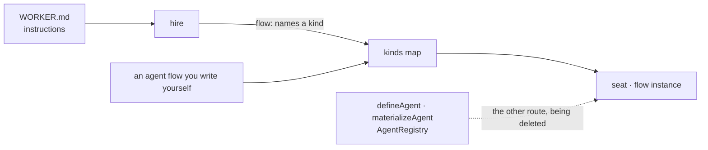
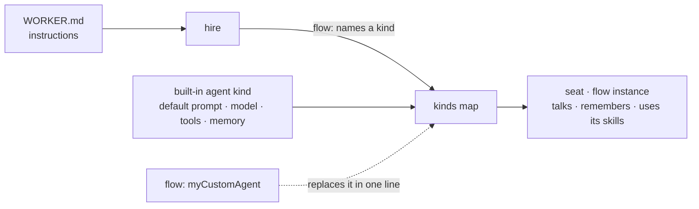
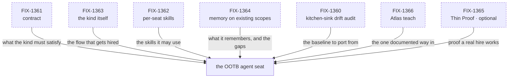
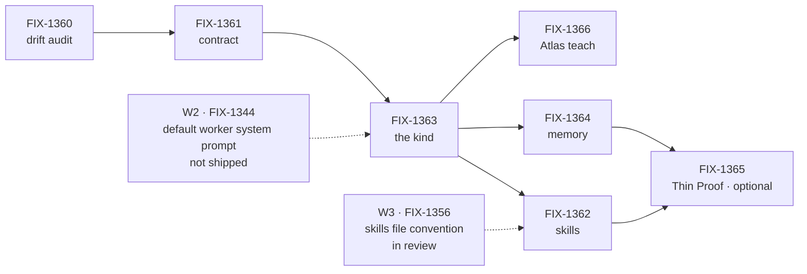

# FIX-1359 — Default Workforce agent flow (explainer)

Companion to [`default-agent-kind.md`](./default-agent-kind.md). Diagrams and captions only: it
decides nothing and asks nothing.

**The four words.** A **seat** is a roster slot resolving to one flow instance, declared as
`WORKER.md`. A **kind** is a flow factory on hire's `kinds` map; a seat's `flow:` only names one.
A **worker** is a generator or flow. The **agent kind** is the opinionated default this epic adds.

## 1. Today

Hire already resolves a seat's `flow:` against the kinds map — but every kind is the app's own. A
working agent means hand-writing the flow, or leaning on a second factory cluster we have already
decided to delete.

## 2. After (proposed)

The kinds map ships with an agent kind. Instructions alone yield a seat that talks, remembers on
the scopes we already have, and uses the skills registered to it. Naming your own kind still wins.
This is the shape being gated, not built code.

## 3. The set (proposed)

The four on top are the substance — drop any and the seat is missing something a real app needs on
day one. All seven are not started as of the FIX-1359 objective gate; the spec's §4 index is the
live status.

## 4. The path (proposed)

A chain, not a fan-out: only FIX-1360 and FIX-1361 can start today, and the only real parallelism
is FIX-1362 beside FIX-1364. The dashed nodes are inputs from adjacent epics, not children.

From that same W2 issue, the `instructions` key in panels 1–2 is already merged; its deletion of
the `defineAgent` cluster is still an open draft, which is why panel 1 shows that route still live.
Dependency states verified 2026-09-11.
