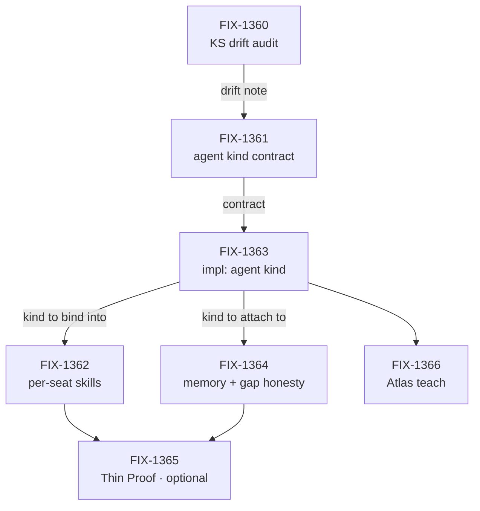

# FIX-1359 — Default Workforce agent flow: OOTB replaceable `agent` flow kind

*The vocabulary, the POC spine, the prompt/skills/memory direction, the replaceability contract
and the child cut were locked by the Architect and owner on 2026-09-11 in
[FIX-1359](https://linear.app/fixpoint-labs/issue/FIX-1359)'s description. This document turns
that record into an epic-spec; it does not re-decide it. Where the record does not settle
something, §5 says so and names who decides.*

## 1. Purpose & objective *(the gated sign-off surface)*

**Objective.** Someone building on Workforce today can hire a roster, but they cannot hire a
working agent. Every app that wants one either writes its own agent flow from scratch or leans
on a second agent factory (`defineAgent` / `AgentRegistry` / `materializeAgent`) that we have
already decided to delete. When this epic lands, a `WORKER.md` with nothing but instructions
produces a seat that talks, remembers within the scopes we already ship, and can use the skills
registered to it — and a team that wants something different names their own kind on one line.

**Which objective, and how much of its gap it closes.** [`docs/objectives.md`](../../docs/objectives.md)
**Goal 1 — Validate through real usage**; the published objective on FIX-1359 is *"Workforce
multi-seat real usage (OOTB agent seat)."*

The honest answer is **not much of it, as currently cut.** The project's lead measure is *goals
passing over goals defined*, and six of this epic's seven issues add **surface** — a kind, a
skill bind, a memory attach, docs. Only FIX-1365 (Thin Proof: hire the OOTB agent kind) is
shaped to produce a goal check, and it is marked *optional / last*. So on today's cut this epic
can complete in full and move the lead measure by zero. That is the single most important thing
to weigh at this gate, and §5 carries it as a question rather than quietly resolving it.

**Holistic necessity.** Seven issues, and the composition question is whether it's really six.

- **The substance is four**: FIX-1361 (the kind's contract), FIX-1363 (the kind itself),
  FIX-1362 (per-seat skills into it), FIX-1364 (memory onto existing scopes). Drop any and the
  OOTB seat is missing something a real app needs on day one.
- **FIX-1360 (kitchen-sink drift audit) is cheap reconnaissance that pays for itself.** The
  Architect's own framing is that kitchen-sink may be behind the Workforce hire surface, so
  without the audit FIX-1361 specs a contract against a baseline nobody has checked.
- **FIX-1366 (Atlas teach) is not optional** despite being docs. The teach path is what
  currently points people at `defineAgent`; a kind that ships while the Atlas still teaches the
  killed surface leaves two documented ways to build an agent.
- **FIX-1361 is the one I'd challenge.** A standalone "Spec:" issue sits awkwardly next to our
  own routing, where FIX-1363 writes and gates its own spec anyway
  ([`orchestration.md`](../../docs/contributing/orchestration.md) → "Which issues get a spec").
  Kept as locked, but if FIX-1361's document turns out to *be* FIX-1363's spec, that is the
  signal the set was six.

**Not doing.** No second Agent L1 type and no growing `AgentRegistry` into a product Agent. No
new memory-isolation primitive — existing scopes only, and a gap gets named rather than faked.
No persona builder (the hire body key is `instructions`). No Collab or channel roster — that
stays on W3 / FIX-1341. No MCP door. This epic is **parallel to** W3 (FIX-1351), not under it.

## 2. Themes & long-horizon direction

1. **Vocabulary is locked, and thin/fat is dead.** A **seat** is a roster slot resolving to one
   **flow instance**, declared as `WORKER.md`. A **kind** is a flow factory on hire's `kinds`
   map; a seat's `flow:` only *names* a registered kind. A **worker** is a generator or flow
   with whatever that kind needs. The **agent kind** is the opinionated default: instructions
   plus shared default prompt, model, tools, memory, skill register/activate. A sequencer or
   intake seat is not a degraded agent — it is a different kind. No child spec revives "thin" or
   "fat", and no child introduces a fifth term for any of these four.

2. **The agent kind consumes prompt composition; it never invents one.** Generator slots stay
   `prompt` / `context` / `history` / `user`. The hire and `WORKER.md` body key is
   `instructions`. The default worker system prompt is one shared config composed as
   `prompt: [default, instructions]`. That composition is FIX-1344's to ship (see theme 6); an
   issue here that finds itself defining a second prompt system has hit a cross-cutting question
   and comments up on this PR rather than deciding locally.

3. **No second registry, and no child waits on the first one dying.** `defineAgent`,
   `materializeAgent` and `AgentRegistry` are kill targets owned by FIX-1344 / PR #1713 — all
   three are still live in `packages/workforce/src/`. No issue here extends them, imports them,
   or mirrors their shape. Equally, **no issue here blocks on their deletion**: the new kind is
   built beside them and the invent-kill lands on its own schedule.

4. **Memory attaches to existing scopes, and a gap is named rather than filled.** `session`,
   `user`, `org` and any already-shipped member patterns. Identity and durable member memory
   belong on agent/member scope, never on the seat object. If durable per-member isolation is
   still an L1 gap when FIX-1364 gets there, the deliverable is a named gap on Atlas and a
   ticket — **not** seat-local memory that looks durable and isn't.

5. **Replaceability is one line in `WORKER.md`.** The built-in kind carries an id (`agent` or
   near it — the exact string is an engineering call in FIX-1361). `flow: myCustomAgent` wins
   whenever that kind is on the hire `kinds` map, and custom kinds register exactly as other
   flow factories do. No `worker.ts` as a `WorkerManifest` seat door — that fence is W3's
   (FIX-1342) and this epic does not reopen it.

6. **The two soft deps live in other epics, and one of them is only half shipped.** Neither is a
   parent. This is the sequencing fact most likely to be read wrong, so it is stated in parts:

   | Dep | Epic | State (verified 2026-09-11) | What this epic needs from it |
   |---|---|---|---|
   | **FIX-1344** part 1 — `instructions` key | W2 / FIX-1332 | **Merged** (PR #1701). `INSTRUCTIONS_KEY` live at `packages/workforce/src/manifest.ts:38`, handled in `hire.ts` | Nothing further — the body key is settled |
   | **FIX-1344** part 2 — configurable default worker system prompt | W2 / FIX-1332 | **Not shipped.** No default-prompt config exists in `packages/workforce/src` | This is the `default` half of theme 2's `prompt: [default, instructions]`. FIX-1363 composes it |
   | **FIX-1344** part 3 — invent-kill of the `defineAgent` cluster | W2 / FIX-1332 | **Not merged.** PR #1713 (`fix/remove-define-agent-cluster`) is an open draft; all three symbols still live | Nothing — theme 3 says no child waits on it |
   | **FIX-1356** — skills file convention | W3 / FIX-1351 | **In Review.** Impl PR #1728 open | The load rules FIX-1362's per-seat register consumes |

   **FIX-1344 is not "done".** Its Linear state is `In Development` and only part 1 has landed.
   Sequencing FIX-1363 as if the default prompt already exists is the specific mistake this row
   exists to prevent; §5 carries the open question of what FIX-1363 does about it.

7. **Skills isolate at per-seat registration, not at the skill name.** The earlier
   "globally unique skill names across teams" direction on FIX-1356 is **withdrawn**. A seat's
   flow registers `org/skills` ∪ `teams/<thatTeam>/skills` ∪ `workers/<thatSeat>/skills`, with
   bare `SKILL.md` names kept. Skills beside the worker are auto-available with no `skills:`
   list. The same bare name on two teams is fine — collections never merge across teams — but
   the same name twice in **one** seat's view still needs refuse-or-precedence, and that exact
   merge rule is FIX-1362's decision to make. FIX-1356 owns the convention and the load rules;
   **the runtime bind of the registered set into the agent kind is FIX-1362's**, here.

8. **Kitchen-sink is characterization, not the product API.** `apps/kitchen-sink` (especially
   `chat-agent` and the skill activator) is the closest working composition of the agent shape
   we have, and it is the baseline to port from. It is also probably behind the current hire /
   `WORKER.md` surface. So: do not redesign skill activation from zero while a working activator
   exists, and do not treat anything in kitchen-sink as a shipping contract. FIX-1360 produces
   the drift note — what KS still proves, what must be re-homed — and every later issue cites it
   instead of re-reading the app.

## 3. Shape of the whole

**No end-state POC was built for this epic.** The end state the Architect locked is narrow —
one built-in kind, on an existing hire surface, with three known attachments — and the division
question is about *sequencing*, not about a surface two issues might both want to own. If the
gate surfaces real disagreement about whether the agent kind and the skill bind are one issue or
two, that is when a POC earns its cost.

What the division should be judged on instead is that **this epic is a chain, not a fan-out**:

Only **FIX-1360 and FIX-1361 are startable today**, and FIX-1361 largely wants FIX-1360's drift
note first. Everything after FIX-1361 sequences behind it; the only genuine parallelism in the
set is FIX-1362 and FIX-1364 once the kind exists. Seven issues under one epic will therefore
not run seven-wide, and expecting that throughput is how this epic gets read as stalled when it
is merely serial.

## 4. Running index

| Issue | What it delivers | Route | Spec PR | Impl PR | State |
|---|---|---|---|---|---|
| [FIX-1360](https://linear.app/fixpoint-labs/issue/FIX-1360) | Kitchen-sink drift audit (chat-agent + skill activator) | spec | — | — | Backlog |
| [FIX-1361](https://linear.app/fixpoint-labs/issue/FIX-1361) | Contract for the default `agent` kind | spec | — | — | Backlog |
| [FIX-1363](https://linear.app/fixpoint-labs/issue/FIX-1363) | Built-in `agent` flow kind | spec | — | — | Backlog |
| [FIX-1362](https://linear.app/fixpoint-labs/issue/FIX-1362) | Per-seat skill register + activate in the agent kind | spec | — | — | Backlog |
| [FIX-1364](https://linear.app/fixpoint-labs/issue/FIX-1364) | Memory attach on existing scopes + named gaps | spec | — | — | Backlog |
| [FIX-1366](https://linear.app/fixpoint-labs/issue/FIX-1366) | Atlas teach: OOTB agent kind | spec | — | — | Backlog |
| [FIX-1365](https://linear.app/fixpoint-labs/issue/FIX-1365) | Thin Proof: hire the OOTB agent kind *(optional / last)* | spec | — | — | Backlog |

*No child carries a Linear category label yet, so every route reads **spec** by the fail-closed
default ([`orchestration.md`](../../docs/contributing/orchestration.md) → "Which issues get a
spec"). Labelling one **Bug** re-routes it, and an empty Spec PR cell would then be correct.*

**Not children, deliberately:** FIX-1344 (W2 soft dep), FIX-1356 (W3 convention), FIX-1355 (W3
lab), persona builder, Collab. They are linked from theme 6 and must not be re-parented here —
Linear allows one parent, and both already have theirs.

## 5. Open cross-cutting questions

- **Does `persona` survive as a reserved future concept, or is it deleted with the `defineAgent`
  cluster in #1713?** The epic body reserves `persona` for a later persona-builder opinion,
  while PR #1713 deletes the `defineAgent` / `definePersona` cluster outright — so the reserved
  concept may have no surface left to be reserved on. Raised by the coordinator, asked of the
  Architect on this epic's mailbox handle. **Blocks nothing.** Every theme above is written
  against `instructions` alone and none of them names `persona`, so either answer leaves this
  document standing; the only thing that changes is whether FIX-1366's Atlas page says "persona
  is reserved for later" or says nothing at all.

- **Does FIX-1363 wait for FIX-1344's default worker system prompt, or define it?** Theme 6
  establishes that part 2 has not shipped. FIX-1363 needs a `default` to compose with
  `instructions`, and it can either block on W2 delivering it or ship the agent kind against
  instructions alone and compose the default when it arrives. Neither issue can settle this
  alone, because the answer moves work between two epics. **Blocks nothing today** — FIX-1363 is
  not startable until FIX-1361 lands anyway — but it must be answered before FIX-1363 is specced.

- **Does this epic close any of the lead measure, or only add surface?** §1 says it adds surface:
  the only child shaped to produce a goal check is FIX-1365, and it is optional. The choice is to
  promote FIX-1365 from optional to required (the epic then proves itself against Goal 1), or to
  accept this epic as enabling work measured by the epic that uses it. **This is the owner's
  call, and it is the substance of the objective gate** — it is raised in the epic PR's
  *What's asked of you* rather than left as a list entry here.

---

## Epic evolution

- **Epic drafted (2026-09-11)** — the Architect's locked record turned into five sections. Two
  things added beyond transcription: the verified state of the FIX-1344 / FIX-1356 soft deps
  (theme 6), because "FIX-1344 is done" would mis-sequence FIX-1363; and the honest read that
  the set adds surface rather than goal checks (§1, §5), because the objective gate is where
  that is decidable and nowhere else is.
