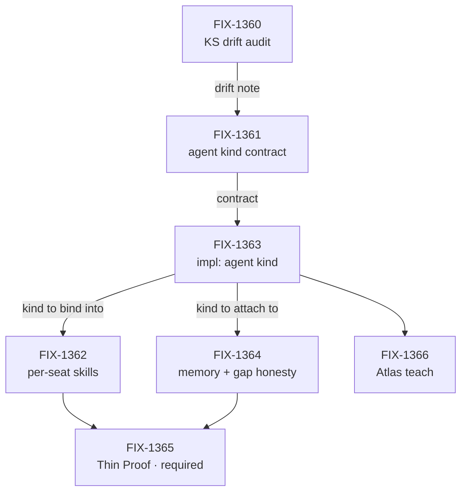

# FIX-1359 — Default Workforce agent flow: OOTB replaceable `agent` flow kind

*The vocabulary, the POC spine, the prompt/skills/memory direction, the replaceability contract
and the child cut were locked by the Architect and owner on 2026-09-11 in
[FIX-1359](https://linear.app/fixpoint-labs/issue/FIX-1359)'s description. This document turns
that record into an epic-spec; it does not re-decide it. Where the record does not settle
something, §5 says so and names who decides.*

## 1. Purpose & objective *(the gated sign-off surface)*

**Objective.** Someone building on Workforce today can hire a roster, but they cannot hire a
working agent. Every app that wants one either writes its own agent flow from scratch or leans
on a second agent factory (`defineAgent` / `AgentRegistry` / `materializeAgent`) that we have
already decided to delete. When this epic lands, a `WORKER.md` with nothing but instructions
produces a seat that talks and can use the skills registered to it, and a team that wants
something different names their own kind on one line. **Memory is not in that box**: it attaches
when a team configures it, within the scopes we already ship.

**"Nothing but instructions" means zero config lines, and that is now decided, not aspirational.**
An omitted `flow:` selects the built-in agent kind, and the built-in reaches the `kinds` map
without the app naming it (Architect stamp on [PR #1730](https://github.com/fixpoint-labs/flow-state-dev/pull/1730),
2026-09-11, explicitly *not* a Jake D-n). `hireWorkforce` refuses an absent `flow:` today — that
is the work this epic does, not the behaviour it describes. Theme 5 carries the contract.

**"Remembers" is the kind's reach, not zero-config behaviour.** Talks and skills are out of the
box; memory is attach-when-configured. The default kind and the hire package carry **no memory
import** — `packages/workforce` depends on `core`, `orchestration` and `zod`, and FIX-1361's
decision 2 fences that from changing ("the default never forces memory machinery on a team that
doesn't want any"). So the day FIX-1363 ships talks+skills with no `workforce → memory` edge, this
headline is still true. Ruled by the Architect on
[PR #1750](https://github.com/fixpoint-labs/flow-state-dev/pull/1750), 2026-09-12, and mirrored on
[PR #1730](https://github.com/fixpoint-labs/flow-state-dev/pull/1730); theme 4 carries the scopes
and the named per-member gap (FIX-1364's), theme 9 the composition.

**Which objective, and how it is proven.** [`docs/objectives.md`](../../docs/objectives.md)
**Goal 1 — Validate through real usage**; the published objective on FIX-1359 is *"Workforce
multi-seat real usage (OOTB agent seat)."*

Six of the seven issues add **surface** — a kind, a skill bind, a memory attach, docs. The
seventh, **FIX-1365 (Thin Proof: hire the OOTB agent kind), is required**, and it is the only
child shaped to produce a goal check. The epic cannot finish without it. That decision (D-4,
Architect + Cycle PM on [PR #1730](https://github.com/fixpoint-labs/flow-state-dev/pull/1730),
2026-09-11) is what makes this set answerable against the project's lead measure — goals passing
over goals defined — instead of a set that can complete in full and move that number by zero.
An OOTB agent seat nobody has hired is a claim, not a capability.

**Holistic necessity.** Seven issues, and the composition question is whether it's really six.

- **The substance is four**: FIX-1361 (the kind's contract), FIX-1363 (the kind itself),
  FIX-1362 (per-seat skills into it), FIX-1364 (memory onto existing scopes). Drop any and the
  OOTB seat is missing something a real app needs on day one.
- **FIX-1360 (kitchen-sink drift audit) is cheap reconnaissance that pays for itself.** Review
  asked for it to become a research section inside FIX-1363's spec. Kept as an issue: the drift
  note is cited by FIX-1361, FIX-1362, FIX-1363 and FIX-1364, and one shared artifact beats four
  specs each re-reading the same app.
- **FIX-1366 (Atlas teach) is not optional** despite being docs. The teach path is what
  currently points people at `defineAgent`; a kind that ships while the Atlas still teaches the
  killed surface leaves two documented ways to build an agent.
- **FIX-1361 was challenged at the gate and kept — seven stands.** Three reviewers made the same
  argument: a standalone "Spec:" issue sits awkwardly next to our own routing, where FIX-1363
  writes and gates its own spec anyway
  ([`orchestration.md`](../../docs/contributing/orchestration.md) → "Which issues get a spec").
  The Architect's answer (PR #1730, 2026-09-11) is that the chain needs a contract artifact
  *before* implementation starts, and that collapsing pre-emptively is the wrong direction.
  **The collapse trigger is named and live**: if FIX-1361's deliverable turns out to *be*
  FIX-1363's gated spec — the same document, carrying no decisions of its own — collapse then.
  It is further from that than it was: the admission answer (theme 5) hands FIX-1361 a rule of
  its own to write — absent `flow:` means default, an unregistered name means a loud error.
- **FIX-1362 and FIX-1364 stay two issues, and neither folds into FIX-1363.** Also challenged at
  the gate. They are different scopes with different decisions to make (theme 7's skills merge
  and isolation rule; theme 4's named-gap honesty), not two halves of one change.

**Not doing.** No second Agent L1 type and no growing `AgentRegistry` into a product Agent. No
new memory-isolation primitive — existing scopes only, and a gap gets named rather than faked.
No persona builder (the hire body key is `instructions`). No Collab or channel roster — that
stays on W3 / FIX-1341. No MCP door. This epic is **parallel to** W3 (FIX-1351), not under it.
FIX-1365 being required does not widen it: a thin hire of the OOTB agent kind, nothing more.

## 2. Themes & long-horizon direction

1. **Vocabulary is locked, and thin/fat is dead.** A **seat** is a roster slot resolving to one
   **flow instance**, declared as `WORKER.md`. A **kind** is a flow factory on hire's `kinds`
   map; a seat's `flow:` only *names* a registered kind. A **worker** is a generator or flow
   with whatever that kind needs. The **agent kind** is the opinionated default: instructions
   plus shared default prompt, model, tools, skill register/activate — and memory when a team
   attaches it (theme 9). A sequencer or intake seat is not a degraded agent — it is a different
   kind. No child spec revives "thin" or "fat", and no child introduces a fifth term for any of
   these four.

2. **The agent kind consumes prompt composition; it never invents one.** Generator slots stay
   `prompt` / `context` / `history` / `user`. The hire and `WORKER.md` body key is
   `instructions`. The default worker system prompt is one shared config composed as
   `prompt: [default, instructions]`, and **FIX-1344 owns shipping it** (theme 6).
   **FIX-1363 consumes that composition and defines no second default-prompt config anywhere in
   this epic** — decided by the Architect on PR #1730, 2026-09-11. If FIX-1363 starts before
   FIX-1344 part 2 lands, it ships against `instructions` alone with an **explicit seam** for
   `default` to drop into. FIX-1363 is therefore *unblocked by* W2, not sequenced behind it, and
   an issue here that finds itself defining a second prompt system has hit a cross-cutting
   question and comments up on this PR rather than deciding locally.

3. **No second registry, and no child waits on the first one dying.** `defineAgent`,
   `materializeAgent` and `AgentRegistry` are kill targets owned by FIX-1344 / PR #1713 — all
   three are still live in `packages/workforce/src/`. No issue here extends them, imports them,
   or mirrors their shape. Equally, **no issue here blocks on their deletion**: the new kind is
   built beside them and the invent-kill lands on its own schedule.

4. **Memory attaches to existing scopes, and a gap is named rather than filled.** `session`,
   `user`, `org` and any already-shipped member patterns. Identity and durable member memory
   belong on agent/member scope, never on the seat object. If durable per-member isolation is
   still an L1 gap when FIX-1364 gets there, the deliverable is a named gap on Atlas and a
   ticket — **not** seat-local memory that looks durable and isn't.

5. **Replaceability is one line in `WORKER.md`.** The built-in kind carries an id (`agent` or
   near it — the exact string is an engineering call in FIX-1361). `flow: myCustomAgent` wins
   whenever that kind is on the hire `kinds` map, and custom kinds register exactly as other
   flow factories do. No `worker.ts` as a `WorkerManifest` seat door — that fence is W3's
   (FIX-1342) and this epic does not reopen it.

   **The built-in's own admission is decided: an omitted `flow:` selects it.** `hireWorkforce`
   today refuses a record that declares no `flow:` ("declares no `flow:`, so there is no flow
   kind to hire it into", `packages/workforce/src/hire.ts`) and resolves only factories
   explicitly passed in `options.kinds` — so nothing in the *current* surface makes an
   instructions-only `WORKER.md` hireable. **That gap is this epic's work.** The answer
   (Architect stamp, PR #1730, 2026-09-11): an omitted `flow:` selects the built-in agent kind,
   and the built-in must therefore reach the `kinds` map **without the app naming it**. The
   narrow alternative — `flow: agent` plus explicit registration — was **rejected**, because it
   narrows §1's headline into the same paper cut `defineAgent` already made people pay.
   **FIX-1361 writes the contract, FIX-1363 ships it**, and neither re-opens the choice.

   **The loud-fail rule rides with it, and it is FIX-1361's too.** Implicit selection must not
   turn a *typo'd* kind name into a silent hire of the agent: a seat naming a kind that isn't
   registered fails loudly, exactly as it does today. Absent means default; wrong means error.
   Raised by Codex review on PR #1730, verified against the source, and settled there.

6. **The two soft deps live in other epics, and one of them is only half shipped.** Neither is a
   parent. This is the sequencing fact most likely to be read wrong, so it is stated in parts:

| Dep | Epic | State (verified 2026-09-11) | What this epic needs from it |
|---|---|---|---|
| **FIX-1344** part 1 — `instructions` key | W2 / FIX-1332 | **Merged** (PR #1701). `INSTRUCTIONS_KEY` live at `packages/workforce/src/manifest.ts:38`, handled in `hire.ts` | Nothing further — the body key is settled |
| **FIX-1344** part 2 — configurable default worker system prompt | W2 / FIX-1332 | **Not shipped.** No default-prompt config exists in `packages/workforce/src` | The `default` half of theme 2. **FIX-1363 consumes it and does not define one** — `instructions` alone plus an explicit seam if part 2 has not landed |
| **FIX-1344** part 3 — invent-kill of the `defineAgent` cluster | W2 / FIX-1332 | **Not merged.** PR #1713 (`fix/remove-define-agent-cluster`) is an open draft; all three symbols still live | Nothing — theme 3 says no child waits on it |
| **FIX-1356** — skills file convention | W3 / FIX-1351 | **In Review.** Impl PR #1728 open | The load rules FIX-1362's per-seat register consumes |

**FIX-1344 is not "done".** Its Linear state is `In Development` and only part 1 has landed.
Sequencing FIX-1363 as if the default prompt already exists is the specific mistake this row
exists to prevent — and theme 2 is why that mistake no longer costs anything: the kind is
built against `instructions` with a seam, whenever part 2 arrives.

7. **Skills isolate at per-seat registration, not at the skill name.** The earlier
   "globally unique skill names across teams" direction on FIX-1356 is **withdrawn**. A seat's
   flow registers `org/skills` ∪ `teams/<thatTeam>/skills` ∪ `workers/<thatSeat>/skills`, with
   bare `SKILL.md` names kept. Skills beside the worker are auto-available with no `skills:`
   list. The same bare name on two teams is fine — collections never merge across teams — but
   the same name twice in **one** seat's view still needs refuse-or-precedence, and that exact
   merge rule is FIX-1362's decision to make. FIX-1356 owns the convention and the load rules;
   **the runtime bind of the registered set into the agent kind is FIX-1362's**, here.

   **Registration alone does not isolate storage, and today it doesn't.**
   `createSkillsLibrary` defaults its collection to the key `skills` at **`org` scope**
   (`packages/orchestration/src/skills/library.ts`), so two seats in one org registering the same
   bare `SKILL.md` name resolve to the same collection entry — one team's skill overwrites or
   bleeds into another's. The promise above therefore holds at the *view* level and not yet at
   the *storage* level. **Per-seat isolation has to be a real resource identity** — distinct
   collection key, prefix or scope per team/seat — not a per-seat register over one shared
   collection. FIX-1361 states that isolation contract and FIX-1362 implements it. Raised by
   Codex review on PR #1730 and verified against the source.

8. **Kitchen-sink is characterization, not the product API.** `apps/kitchen-sink` (especially
   `chat-agent` and the skill activator) is the closest working composition of the agent shape
   we have, and it is the baseline to port from. It is also probably behind the current hire /
   `WORKER.md` surface. So: do not redesign skill activation from zero while a working activator
   exists, and do not treat anything in kitchen-sink as a shipping contract. **FIX-1360 has
   produced the drift note and it has landed** at `docs/internal/design/kitchen-sink-agent-drift.md`
   (impl PR [#1739](https://github.com/fixpoint-labs/flow-state-dev/pull/1739), merged
   2026-09-12), warnings first: what must not be copied, the named gaps, what KS still proves,
   what must be re-homed. Every later issue cites that file instead of re-reading the app.

9. **Out of the box is the cheap path — and that default now has a maintained home.** It was
   settled at FIX-1360's spec review on [PR #1736](https://github.com/fixpoint-labs/flow-state-dev/pull/1736),
   which then **closed unmerged**, so FIX-1361's C5 and the merged drift note both cite a closed
   thread and four parallel authors were re-deriving it. Recorded here on the Architect's
   instruction (PR #1750 / PR #1730, 2026-09-12); the drift note is a dated characterization and
   stays unmaintained.

   - **Skills — `createSkillsLibrary` plus per-generator binding is the canonical OOTB path**, not
     `createSkillsCapability`: the library activates per binding, the capability keeps a
     session-global bag. Theme 7's isolation rule rides on top of that choice.
   - **Memory — nothing by default.** **When memory is attached**, the light path is *read-side*;
     the model-classifier tier and the background capture pipeline are **opt-in, one setting
     each**. This is not a required default import, and no child may turn it into one — the fence
     in §1 and theme 4 stands.

   A child re-deriving either default from a closed PR thread should cite this theme instead.

## 3. Shape of the whole

**No end-state POC was built for this epic, and the gate did not change that.** The trigger this
section named — real disagreement about whether the agent kind and the skill bind are one issue
or two — did fire at review. It was settled in prose instead: FIX-1362 and FIX-1364 carry
decisions of their own (the skills merge and isolation rule; named-gap honesty), which is a
different kind of separation from a surface two issues would both want to own. The end state the
Architect locked is still narrow — one built-in kind, on an existing hire surface, with three
known attachments — so a POC would buy sequencing confidence the mermaid below already gives.

What the division should be judged on instead is that **this epic is a chain, not a fan-out**:

**FIX-1360 has since landed** (2026-09-12), so **FIX-1361 is the head of the chain and is now in
flight** (spec PR #1750, Architect-stamped) — it had the drift note it wanted, at the path theme 8
names.
Everything after FIX-1361 sequences behind it; the only genuine parallelism in the
set is FIX-1362 and FIX-1364 once the kind exists. FIX-1365 being required does not move it
earlier — it still waits on FIX-1362 and FIX-1364. Seven issues under one epic will therefore
not run seven-wide, and expecting that throughput is how this epic gets read as stalled when it
is merely serial.

## 4. Running index

| Issue | What it delivers | Route | Spec PR | Impl PR | State |
|---|---|---|---|---|---|
| [FIX-1360](https://linear.app/fixpoint-labs/issue/FIX-1360) | Kitchen-sink drift audit (chat-agent + skill activator) | spec | [#1736](https://github.com/fixpoint-labs/flow-state-dev/pull/1736) · closed unmerged at approval | [#1739](https://github.com/fixpoint-labs/flow-state-dev/pull/1739) · **merged** | **Done** |
| [FIX-1361](https://linear.app/fixpoint-labs/issue/FIX-1361) | Contract for the default `agent` kind — incl. the **omitted-`flow:` admission** (decided: it selects the built-in) and the **loud-fail rule** for an unregistered kind name | spec | [#1750](https://github.com/fixpoint-labs/flow-state-dev/pull/1750) · open | — | **Spec Approved** |
| [FIX-1363](https://linear.app/fixpoint-labs/issue/FIX-1363) | Built-in `agent` flow kind | spec | — | — | Backlog |
| [FIX-1362](https://linear.app/fixpoint-labs/issue/FIX-1362) | Per-seat skill register + activate in the agent kind | spec | — | — | Backlog |
| [FIX-1364](https://linear.app/fixpoint-labs/issue/FIX-1364) | Memory attach on existing scopes + named gaps | spec | — | — | Backlog |
| [FIX-1366](https://linear.app/fixpoint-labs/issue/FIX-1366) | Atlas teach: OOTB agent kind | spec | — | — | Backlog |
| [FIX-1365](https://linear.app/fixpoint-labs/issue/FIX-1365) | Thin Proof: hire the OOTB agent kind — **required**, the epic's Goal 1 check | spec | — | — | Backlog |

*Verified against Linear 2026-09-12. **One issue is done**: FIX-1360's note landed and its
Linear state is mirrored — that mirror is what releases FIX-1361, because the epic wake derives
blocked-by from Linear state. **FIX-1361 has since started**: spec PR #1750 is open and
Architect-stamped, Linear reads `Spec Approved`, and one amendment is in flight on it — C5's
memory clause, which theme 9 above records the settled form of and which is FIX-1361's to fold,
not this doc's. The five issues behind it are still `Backlog` with no PRs yet. No child carries
a Linear category label, so every route still reads **spec** by the fail-closed default ([`orchestration.md`](../../docs/contributing/orchestration.md) → "Which
issues get a spec"). Labelling one **Bug** re-routes it, and an empty Spec PR cell would then be
correct.*

**Not children, deliberately:** FIX-1344 (W2 soft dep), FIX-1356 (W3 convention), FIX-1355 (W3
lab), FIX-1367 (thin `WorkerConfig` — W3 hire admission; the agent kind *consumes* that bag and
does not own its contract), persona builder, Collab. They are linked from theme 6 and must not be
re-parented here — Linear allows one parent, and they already have theirs.

## 5. Open cross-cutting questions

**Nothing is open. Every question this epic raised has an answer below.**

- **~~Does an instructions-only `WORKER.md` select the built-in kind, or must a seat name it?~~**
  *Resolved (Architect stamp, this PR, 2026-09-11 — explicitly "No D-n", so it is settled and
  not waiting on the owner):* **(a)** — an omitted `flow:` **selects** the built-in agent kind,
  and the built-in must reach the `kinds` map **without the app naming it**. A `WORKER.md`
  carrying only `instructions` is a complete seat at **zero config lines**, which is §1's
  headline promise. **(b) was rejected**: `flow: agent` plus explicit registration quietly
  narrows the headline into the same paper cut `defineAgent` already made people pay. The typo
  risk that was the stated mind-changer is **answered rather than traded away** — FIX-1361 owns
  both the contract *and* the loud-fail rule: an unregistered or misspelled kind name fails
  loudly and never silently hires the agent. FIX-1361 writes that contract; it does **not**
  re-open (a) vs (b). No second prompt system and no Agent L1 invention.
  Folded into §1, theme 5 and §4.

- **~~Does `persona` survive as a reserved future concept, or is it deleted with the
  `defineAgent` cluster in #1713?~~** *Resolved (Architect, this PR, 2026-09-11):* `persona`
  stays a **reserved later opinion** — a persona builder that compiles to a prompt — and never a
  hire key. PR #1713 may delete the `definePersona` / `defineAgent` surface outright; the
  reservation is conceptual, not a live symbol, so nothing here depends on it surviving.
  **FIX-1366 teaches `instructions` only and does not document an empty reserved `persona`**
  until there is a product surface to document. Every theme above stands either way.

- **~~Does FIX-1363 wait for FIX-1344's default worker system prompt, or define it?~~**
  *Resolved (Architect, this PR, 2026-09-11):* neither. FIX-1344 owns **shipping** the shared
  default worker system prompt; FIX-1363 **consumes** `prompt: [default, instructions]` and
  defines no second default-prompt config in this epic. Starting before part 2 lands is fine —
  `instructions` alone with an explicit seam for `default`. It does not block on the #1713
  deletion and it does not fork prompt composition. Net: FIX-1363 is unblocked by W2, not
  sequenced behind it. Folded into theme 2 and theme 6's table.

- **~~Does this epic close any of the lead measure, or only add surface?~~** *Resolved (D-4,
  Architect + Cycle PM on this PR, 2026-09-11 — explicitly not a Jake D-n):* **FIX-1365 is
  required**, not optional. It is the epic's Goal 1 check and the epic cannot finish without it.
  Sequencing is unchanged — still after FIX-1362 and FIX-1364; required does not mean
  parallelizable earlier — and it does not expand into Collab or a fat lab. Linear is stamped:
  FIX-1365 retitled "(required)", priority raised P4 → P2. Folded into §1, §3, §4.

- **~~Was FIX-1359's Linear state ever mirrored once the objective gate passed?~~** *Resolved
  (coordinator action, 2026-09-12):* **yes.** FIX-1359 moved `Todo` → **`Spec Approved`**, the
  same epic-level convention the W2 epic (FIX-1332) already uses. The write had been refused
  twice by this session's permission classifier for external writes, which is why it sat
  outstanding after the gate; it went through on the retry. **FIX-1360's mirror was written in
  the same pass** (`In Review` → `Done`, after impl PR #1739 merged), and *that* one was
  load-bearing rather than tidy: the epic wake derives blocked-by from Linear state, so a
  FIX-1360 that still read as open was holding FIX-1361 behind it. The standing rule for every
  later child: **the Linear mirror is the wake's input, not decoration** — a child left in a
  stale state blocks its dependants whatever its PRs say. §4 carries both states.

- **~~Should PR #1730's "What's asked of you" block be rewritten now that the gate has passed?~~**
  *Resolved (coordinator, 2026-09-12):* **no — leave it standing, unedited.** That block is the
  **record of what the owner approved on 2026-09-11**, not a superseded request, and a reader
  arriving at the epic PR is better served seeing what the objective gate actually asked than
  seeing it scrubbed. Rewriting the description to soften it would put two things at risk for a
  cosmetic gain: the reviewer contract that is pasted **verbatim** below the fold, and the
  `Explainer:` entry in the Links line, which `explainer-agent` writes once and never touches
  again and which must therefore survive every future refresh. If a later fold wants to mark the
  block, the only sanctioned edit is a one-line note that the gate passed on 2026-09-11 — **not**
  a rewrite. No future dispatch should re-open this as untidiness.

---

## Epic evolution

- **Epic drafted (2026-09-11)** — the Architect's locked record turned into five sections. Two
  things added beyond transcription: the verified state of the FIX-1344 / FIX-1356 soft deps
  (theme 6), because "FIX-1344 is done" would mis-sequence FIX-1363; and the honest read that
  the set adds surface rather than goal checks (§1, §5), because the objective gate is where
  that is decidable and nowhere else is.
- **After epic-PR review, round 1 (2026-09-11)** — all three §5 questions closed as recorded
  decisions (persona reserved-but-unsurfaced; FIX-1363 consumes FIX-1344's default prompt with a
  seam; **FIX-1365 required**), and the set-composition challenge answered with seven kept plus a
  named collapse trigger on FIX-1361, because a pre-emptive fold trades a real contract gate for
  a guess. Two verified review findings became theme constraints — the built-in kind's admission
  (theme 5) and skills storage isolation (theme 7) — because each is a place a theme promised
  something the shipped surface does not yet do.
- **Admission fork answered, round 2 (2026-09-11)** — the one question left open at round 1 is
  now a recorded decision: an omitted `flow:` **selects** the built-in kind (Architect stamp on
  PR #1730, "No D-n"), so §1's headline is zero config lines rather than a promise conditional on
  a later call. The typo risk that was the stated mind-changer became a second obligation on
  FIX-1361 (loud fail on an unregistered kind name) rather than a reason to take the narrow
  answer. §1, theme 5, §4 and §5 were all re-derived — theme 5 had been the surface still reading
  "Until one is chosen, §1's headline path does not exist", which is exactly the sentence a child
  worker would have built against. §5 now carries no open questions.

- **Objective gate passed; index unchanged (2026-09-11)** — the epic is signed off on both
  channels (`epic approved` label plus an approving comment on PR #1730), so the set's issues are
  released to ramp. The review feedback outstanding after round 2 was an Architect fold-check
  carrying no ask and the approval itself, so **zero rounds** were spent and nothing above the bar
  was found. The running index is unchanged and verified against Linear: all seven children sit in
  Backlog with no spec or impl PR yet, and none carries a category label. One real defect was
  fixed — theme 6's dependency table was indented inside its list item, which Linear's markdown
  round-trip mangled by dropping the first three characters of every cell, so the Linear mirror
  read `| / FIX-1332 | erged** (PR #1701)`. That is the one table whose job is to stop FIX-1344
  being read as done, and Linear is the copy child issues read. Dedented at source; both copies now
  carry it intact.

- **Two coordinator answers recorded; index moved to first-child-done (2026-09-12)** — **zero
  review rounds** and nothing above the bar: both items were answers to questions this epic
  asked, which is not another opinion. The Linear mirrors that had been outstanding are now
  written (FIX-1359 `Spec Approved`, FIX-1360 `Done`), and the second is why the index moved —
  FIX-1360's impl PR #1739 merged, the drift note is live at
  `docs/internal/design/kitchen-sink-agent-drift.md`, and FIX-1361, which the wake had been
  holding behind a FIX-1360 that read as still open, is now the chain's head and the set's only
  startable issue. §3, theme 8 and §4 were all re-derived for that, because each had been
  written while FIX-1360 was *the* startable issue and the note was a future artifact. PR
  #1730's description is deliberately untouched: its "What's asked of you" block is the record
  of the approved objective, and the second answer above rules a rewrite out.

- **Headline honesty + light-vs-heavy provenance folded (2026-09-12)** — **one round**, above the
  bar: an Architect ruling (PR #1750, mirrored on #1730) out of the FIX-1360 × FIX-1361 cross-spec
  call. Two things changed. (1) §1 promised a bare `WORKER.md` seat that *"remembers"*, and that
  word was always **kind reach**, not zero-config behaviour — `packages/workforce` has no
  `@flow-state-dev/memory` dependency and FIX-1361's stamped decision 2 forbids adding one, so the
  headline would have gone false the day FIX-1363 shipped talks+skills. It now reads talks + skills
  out of the box, memory attach-when-configured. (2) A default two artifacts already treat as
  settled — skills library + per-generator binding; read-side vs classifier/capture once memory is
  on — lived only in **closed** PR #1736's thread, with zero hits in this doc. It is now theme 9.
  Theme 1's composition list, the explainer's *after* panel, and PR #1730's "What this does"
  headline all restated the old promise and were re-derived; theme 4, the admission rule, theme 1's
  vocabulary, decision 2 itself and the seven-issue set are untouched. The index moved in the same
  pass: FIX-1361 now carries spec PR #1750 and `Spec Approved`.
