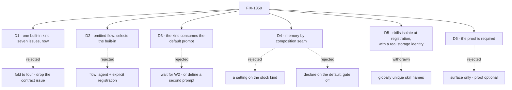

# FIX-1359 · Decisions

The calls that sit above any single issue: what was chosen, what lost, why, and what each locked in for the seven issues under it. Six are the sign-off surface or shape the set. The rest were raised in review, or ruled on the epic PR while the children ran, and are recorded so no child reopens them.

## The tree

## D1 · One built-in `agent` kind, delivered as seven issues, now

| | |
|---|---|
| **Instead of** | Waiting until the old factory is gone · folding FIX-1361 into FIX-1363, or FIX-1360 / FIX-1362 / FIX-1364 into it |
| **Because** | The W2 epic is deleting the factory people use today; the replacement has to land first. The chain needs a contract artifact before implementation, and FIX-1362 and FIX-1364 each carry decisions of their own, which is a different separation from two halves of one change |
| **Locks in** | An epic slot for a mostly serial set. A named collapse trigger on FIX-1361: if its deliverable turns out to be FIX-1363's own gated spec, carrying no decisions of its own, collapse then |

**What would have changed my mind:** a named app already scheduled to build its own agent seat on a different shape. None appeared; the collapse trigger never fired.

## D2 · An omitted `flow:` selects the built-in, and the built-in reaches the kinds map without the app naming it

| | |
|---|---|
| **Instead of** | `flow: agent` plus explicit registration |
| **Because** | The narrow form turns "nothing but instructions" into the same paper cut the old factory already made people pay. The typo risk that argued for it is answered instead: a seat naming an unregistered kind fails loudly, exactly as today |
| **Locks in** | Two obligations on FIX-1361, the contract: absent means default, wrong means error. FIX-1363 builds both. Neither reopens the choice. The exact built-in id is FIX-1361's engineering call; it chose `agent` |

## D3 · The kind consumes the shared default prompt as `[default, instructions]`; it never defines one

| | |
|---|---|
| **Instead of** | Sequencing FIX-1363 behind W2's default prompt · or defining a second default-prompt config in this epic |
| **Because** | FIX-1344 owns shipping the default and has shipped only part of it. Waiting stalls the chain; forking gives the framework two prompt systems |
| **Locks in** | FIX-1363 ships against `instructions` alone with an explicit seam for `default` if part 2 hasn't landed. It is unblocked by W2, not sequenced behind it. An issue that finds itself defining a prompt system has hit a cross-cutting question and comments up |

## D4 · Memory attaches through a named build-time composition seam, on scopes we already ship

| | |
|---|---|
| **Instead of** | A "turn memory on" setting on the stock built-in · memory's resources declared on the default kind and gated off · a new memory-isolation primitive |
| **Because** | Memory's substrate resources must be declared when a flow is built, so no hire-time flag can conjure them. Declare-and-gate puts memory in the graph every team carries, which is what the fence exists to prevent. A gap in durable per-member isolation is named on the Atlas and ticketed, never faked at the seat |
| **Locks in** | Turning memory on is an assembly step an app performs once, into a kind of its own. The built-in and the hire package carry no memory import. FIX-1364 owns the seam, the gap honesty, and the teaching of how you attach; FIX-1366 teaches it honestly; FIX-1363 is not blocked and ships talks plus skills |

Every rule in the set has one owner. The columns are the chain; read a row to see where a decision is made, where it's built, and where it's only consumed. A cell that says *consumes* is a place a child must not re-decide.

## D5 · Skills isolate at per-seat registration, and isolation is a real storage identity

| | |
|---|---|
| **Instead of** | Globally unique skill names across teams · a per-seat register over one shared collection |
| **Because** | The unique-names direction was withdrawn: the same bare name on two teams is fine and should be. But the default skills collection is org-scoped, so registration alone lets one team's skill bleed into another's. Isolation has to be a distinct collection key, prefix or scope per seat |
| **Locks in** | A seat registers org ∪ team ∪ own skills, bare names kept, colocated skills auto-available. The contract for isolation is FIX-1361's; FIX-1362 builds it and owns the one rule left open: the same name twice in one seat's view |

## D6 · The proof is required: the epic cannot finish without hiring the thing it built

| | |
|---|---|
| **Instead of** | Six issues of surface with the proof optional |
| **Because** | The project's lead measure is goals proven over goals defined. Six of seven issues add surface; only FIX-1365 is shaped to produce a goal check. A set that can complete in full and move that number by zero is a claim, not a capability |
| **Locks in** | FIX-1365 is required, retitled and raised to P2. Required does not mean earlier: it still waits on FIX-1362 and FIX-1364. It does not widen into Collab or a fat lab; a thin hire of the built-in and nothing more |

## Decided in review, recorded so no child reopens them

- **Vocabulary is locked.** Seat, kind, worker, agent kind. Thin/fat is dead. No child revives it or adds a fifth term.
- **No second registry.** No child extends, imports or mirrors `defineAgent` / `AgentRegistry` / `materializeAgent`, and no child waits for their deletion.
- **`persona` is a reserved later opinion with no surface.** Not a hire key, not documented as an empty reservation. The body key is `instructions`.
- **The two soft dependencies are not parents.** FIX-1344 (W2) and FIX-1356 (W3) are linked, verified, and consumed. Linear allows one parent and they have theirs.
- **Kitchen-sink is characterization, not the product API.** Port from it, don't copy it. The drift note is the shared artifact; every later issue cites the file, not the app.
- **The out-of-the-box defaults have a maintained home.** Skills: the library plus per-generator binding, not the capability. Memory: nothing by default; once an app has composed it in, the read-side path is on and the classifier and capture tiers are one setting each, inside the app's own kind.
- **The epic PR's sign-off block stays as the record of what was approved.** No rewrite after the gate.

## Ruled on the epic PR while the children ran

- **The `tools:` fence is enforced in core, not rebranded as a convention** (Architect, 2026-09-14). A block that declares `tools:` gets capability-contributed tools filtered to that set; an empty list means none. Consumer opt-outs are not a fence. The enforcement is its own issue with a migration story, FIX-1393, outside this epic; no child was held on it. Until it lands, the children teach the hard fence and name the hole honestly.
- **The composition seam is `uses:` alone** (2026-09-15). D4 was ratified with three doors: `uses`, a separate `resources` option, and per-worker storage. FIX-1364's spec dropped `resources` after a throwaway POC showed a capability's declared resources already bubble through `defineFlow`. A second registration route with no consumer was surface for its own sake. The Architect accepted the narrowing and fixed FIX-1388's written plan to match. Lesson recorded with it: "no consumer" has to mean no committed plan naming the door either, and only the first half is greppable.

## How it got here

- **Drafted (Sep 11)** — the Architect's locked record turned into an epic spec, plus two things the record didn't carry: the verified state of the soft deps, and the honest read that the set adds surface rather than proof.
- **Review round 1 (Sep 11)** — three open questions closed: persona reserved and unsurfaced, the kind consumes the default prompt, the proof is required. Seven kept with a collapse trigger. Two verified findings became rules: the built-in had no admission path, and skill registration didn't isolate storage.
- **Round 2 (Sep 11)** — the admission fork answered: an omitted `flow:` selects the built-in. The typo risk became a second obligation on the contract rather than a reason to take the narrow answer.
- **Gate passed (Sep 11)** — zero further rounds.
- **Headline honesty (Sep 12)** — "remembers" was kind reach, not zero-config behaviour; the headline now says talks plus skills. The defaults that lived only in a closed thread became a recorded decision.
- **Attach mechanism corrected (Sep 13)** — "attach when configured" named a mechanism that can't exist. Memory attaches by composition seam. Every surface that restated the old mechanism was re-derived.
- **Two rulings while the children ran (Sep 14–15)** — the fence goes to core; the seam narrows to `uses:` alone. Recorded above.
- **Wrapped (Sep 16)** — all seven merged. The proof hired two instruction-only workers with no `kinds` argument on a real model and each answered in its own file's voice. Four follow-ups filed under the epic, none blocking; they are in [PLAN.md](PLAN.md#what-the-wrap-left-behind). Two rework classes go to `distill-lessons`: checks that could not fail, six instances across the set, and prose claiming more than the mechanism enforces, which is the fence, corrected nine times in the same direction.

**Open: none.**
