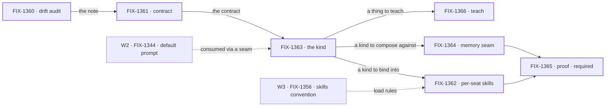
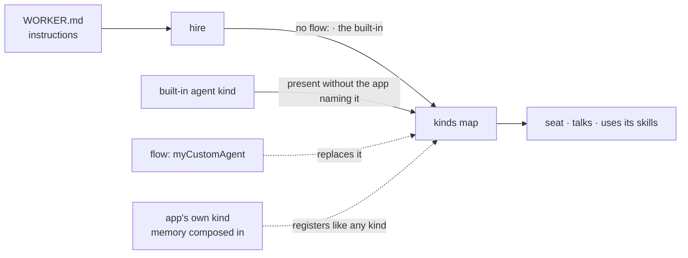

# FIX-1359 · Default Workforce agent flow: a built-in, replaceable `agent` kind

**Spec** · [Decisions](DECISIONS.md) · [Rules](BUSINESS-RULES.md) · [Plan](PLAN.md)

Epic · 7 issues · Workforce, Layer 2 · Goal 1, validate through real usage · **wrapped 2026-09-16**

## Three teams, before and after

| A team that… | Before this epic | After it |
|---|---|---|
| **writes a `WORKER.md` with only instructions** | Hire refuses it: no `flow:`, no seat. They write their own agent flow, or use a factory we're deleting | Hire selects the built-in kind. The seat talks and uses its skills. Zero config lines |
| **wants their own agent shape** | Every kind is theirs anyway | One line, `flow: myCustomAgent`, wins when that kind is registered. A typo fails loudly |
| **wants the agent to remember** | Nothing to attach to | Assembles the shipped memory pieces into a kind of their own. A seam, not a setting. Where durable per-member memory is missing, the gap is named, not faked |
| **reads the docs to learn any of this** | The Atlas teaches the factory we're deleting | One documented way in |

**Why now.** The W2 epic is deleting `defineAgent` / `AgentRegistry` / `materializeAgent`. Removing the old path before a replacement exists leaves the first thing a new team does with Workforce as the thing we just took away.

## What's in the box

Everything inside the box is what a team gets for nothing. The fence is the decision that keeps it cheap: the built-in carries no memory import, and nothing at hire time can add one. Memory is composed in by the app, into a kind of its own, on scopes we already ship ([D4](DECISIONS.md#d4)). The bottom strip is what the set refused to build.

## The set · as of 2026-09-16 · final

This table is the live one. It was refreshed on the epic PR as issues moved; the plan and the figures point here rather than repeating it. This is its last refresh.

| Issue | What it delivers | Why the set needed it | Status |
|---|---|---|---|
| FIX-1360 | Kitchen-sink drift audit | Cheap reconnaissance the next four cite instead of re-reading the app | **Done** · [#1739](https://github.com/fixpoint-labs/flow-state-dev/pull/1739) |
| FIX-1361 | The kind's contract, including admission and loud-fail | A contract artifact before implementation starts | **Done** · [#1751](https://github.com/fixpoint-labs/flow-state-dev/pull/1751) |
| FIX-1363 | The built-in `agent` kind | The substance | **Done** · [#1754](https://github.com/fixpoint-labs/flow-state-dev/pull/1754) |
| FIX-1362 | Per-seat skills, isolated in storage | A seat that can't use its own skills isn't an agent | **Done** · spec [#1766](https://github.com/fixpoint-labs/flow-state-dev/pull/1766) · impl [#1776](https://github.com/fixpoint-labs/flow-state-dev/pull/1776) |
| FIX-1364 | The memory composition seam, and its named gaps | The honest answer to "does it remember" | **Done** · spec [#1768](https://github.com/fixpoint-labs/flow-state-dev/pull/1768) · impl [#1782](https://github.com/fixpoint-labs/flow-state-dev/pull/1782) |
| FIX-1366 | Teach the built-in | A kind that ships while the docs teach the killed factory leaves two ways in | **Done** · spec [#1765](https://github.com/fixpoint-labs/flow-state-dev/pull/1765) · docs [#1785](https://github.com/fixpoint-labs/flow-state-dev/pull/1785) |
| FIX-1365 | Thin proof: hire the built-in for real · **required** | The only child shaped to move Goal 1. Without it the epic adds surface and proves nothing | **Done** · spec [#1789](https://github.com/fixpoint-labs/flow-state-dev/pull/1789) · proof [#1790](https://github.com/fixpoint-labs/flow-state-dev/pull/1790), passed on a real model |

7 done · 0 in flight. Four are substance, one is recon, one is docs, one is the proof. Whether seven was really six was argued at the gate and is [D6](DECISIONS.md#d6); it stayed seven and every one of them shipped.

## How the issues flowed into each other

An edge is what one issue handed the next. Dashed edges are inputs from other epics, not children. Every node carries the heavy border: all seven are done.

## How the pieces reach the seat

## What stayed as it was

- `session` / `user` / `org` scopes and the shipped member patterns. Memory attaches to them; no new isolation primitive.
- The W3 fence: no `worker.ts` as a seat door.
- The old factory cluster's deletion ran on its own schedule. Nothing here waited for it, and nothing here extended it.
- Collab, channel rosters, MCP: not this epic.

## Sign off

Approved at the gate on 2026-09-11. Kept as the record of what was approved; not rewritten after.

1. **[D1](DECISIONS.md#d1) · A stock agent seat is worth seven issues, now.** If wrong: a cycle on a kind nobody hires, which FIX-1365 exists to make impossible to miss.
2. **[D2](DECISIONS.md#d2) · Zero config lines: an omitted `flow:` selects the built-in.** If wrong: the headline narrows to the same paper cut the old factory made people pay.
3. **[D4](DECISIONS.md#d4) · Memory is composed in by the app, never switched on in the stock kind.** If wrong: every team carries memory machinery it didn't ask for, or we promise a mechanism that can't exist.

**Open: none.** Every question the set raised is answered in [DECISIONS.md](DECISIONS.md). The rules every child obeyed are in [BUSINESS-RULES.md](BUSINESS-RULES.md). The order the work ran in, what each issue entailed, and what the wrap left behind is [PLAN.md](PLAN.md).
