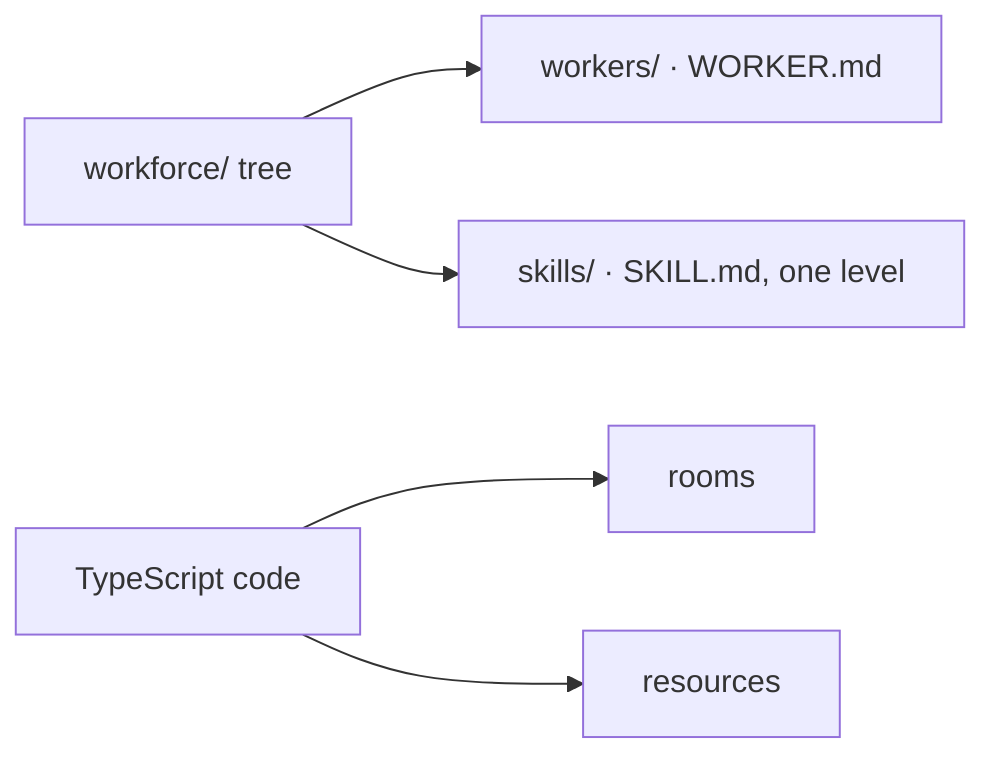
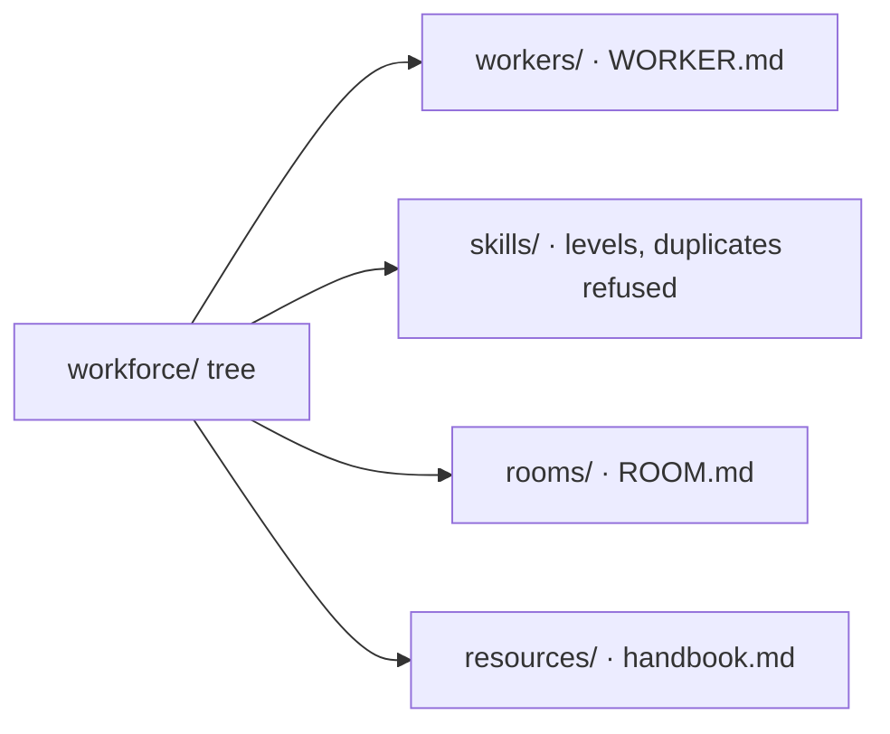
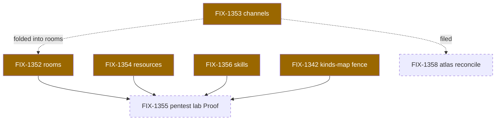
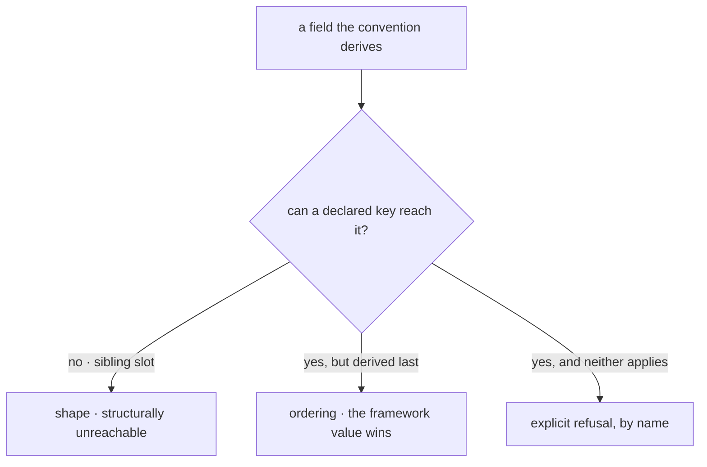

# FIX-1351 — explainer

*Four pictures of one epic. The full case is in
[`file-convention-surface.md`](file-convention-surface.md); the objective gate is on the PR.
Nothing here asks you for anything.*

---

## 1. Today — half the tree is a convention, half is code

W2 shipped the worker loader. An author adds a worker by adding a folder — and adds a room or
a document by editing source and redeploying. Nothing proves the halves hold together under
real multi-seat pressure.

---

## 2. After — the whole team is describable in files

The TypeScript node is gone, and its absence is the epic. Skills keep the convention they
already had — ratified, not aligned — and gain levels plus a duplicate-name refusal.

---

## 3. The set

As of the objective gate. Amber is in flight, dashed is not started, nothing has shipped;
the epic doc's index is the live copy. FIX-1357 (boot scan) is also open and sits off this
path. **The lab is the only consumer, and it is sequenced last** — every convention is built
before the thing that would prove it, which §5 carries as the epic's standing question.

---

## 4. The rule every convention obeys

**A key the convention consumes is stripped. A key it derives is refused.** Reach for the
three mechanisms in that order, and for each derived field name which one protects it.

This replaces two inherited rules that misdescribed the shipped `WORKER.md` precedent.
FIX-1354 hit the consequence live: a passthrough merged into the same object as the derived
fields let a file redirect its own storage row.

*Panel 4 usually walks one request through the new mechanism. Nothing has merged yet, so it
carries the epic's cross-cutting rule instead — the mechanism every convention shares.*
