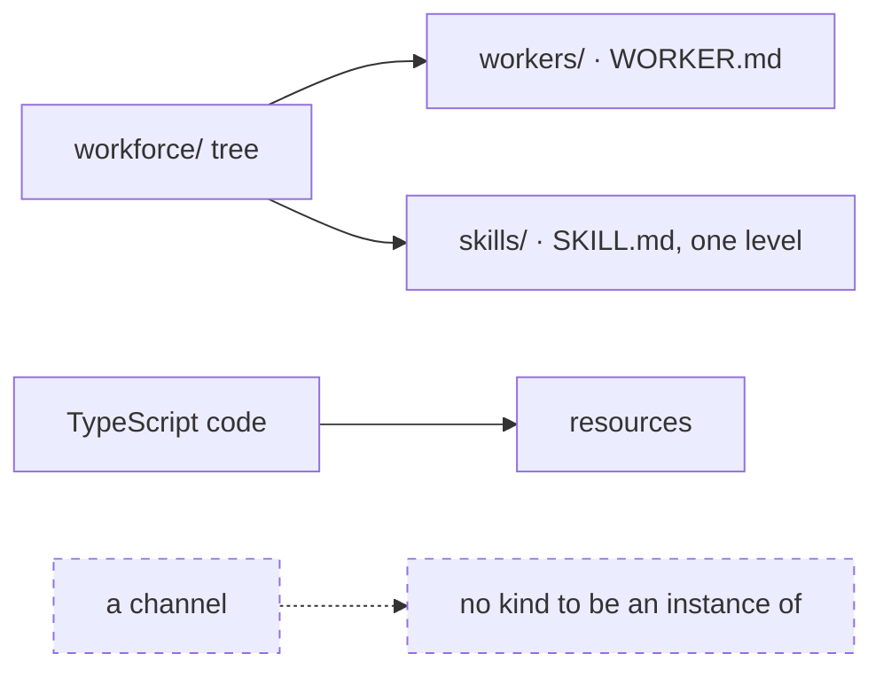
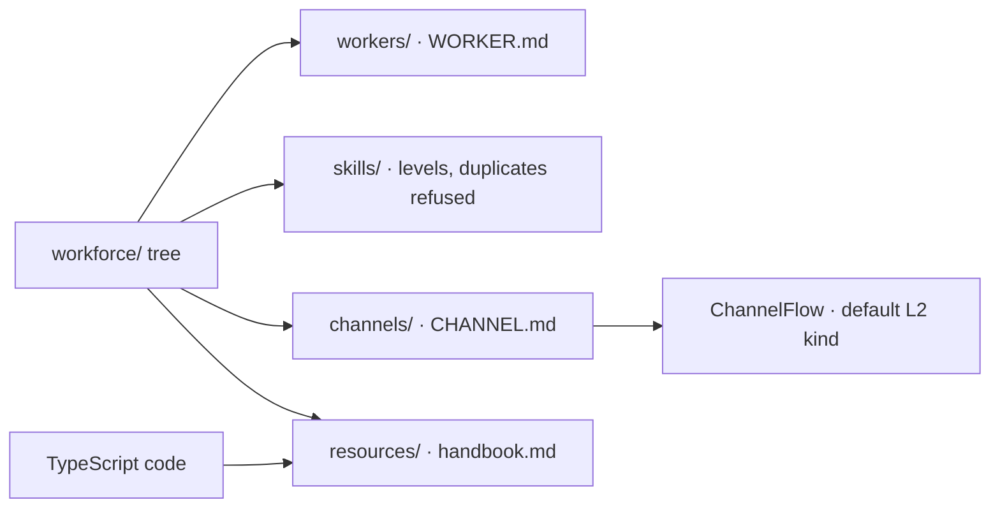
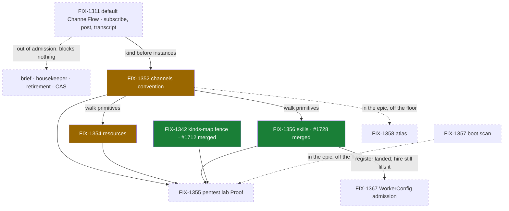
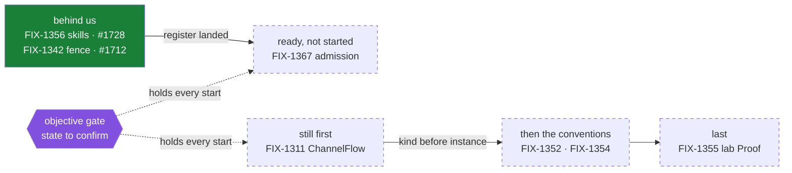

# FIX-1351 — explainer

*Four pictures of one epic. The full case is in
[`file-convention-surface.md`](file-convention-surface.md); the objective gate is on the PR.
Nothing here asks you for anything.*

---

## 1. Today — three pieces, three different states

Workers and skills are already file-declared; a document is declared in code, with
`defineResource`. **A channel has no declaration surface at all** — not code, not files — and no
kind to be an instance of.

---

## 2. After (proposed) — the whole team is describable in files

A team becomes describable in files. A channel goes from nothing to a folder naming a flow kind —
the default ChannelFlow, posted into and read back as one clean transcript. Two sub-specs are
approved; the objective is not.

---

## 3. The set

Green has merged; amber is in flight; dashed is not started. The lab is still last, with every
convention pointing at it; the epic doc's index is the live copy.

---

## 4. The path — where the epic actually is

Two landed, both off the critical path. That path still starts at FIX-1311, unstarted.
FIX-1356's register unblocked FIX-1367, which is ready but unstarted — the gate's own state
needs confirming first (§3).
