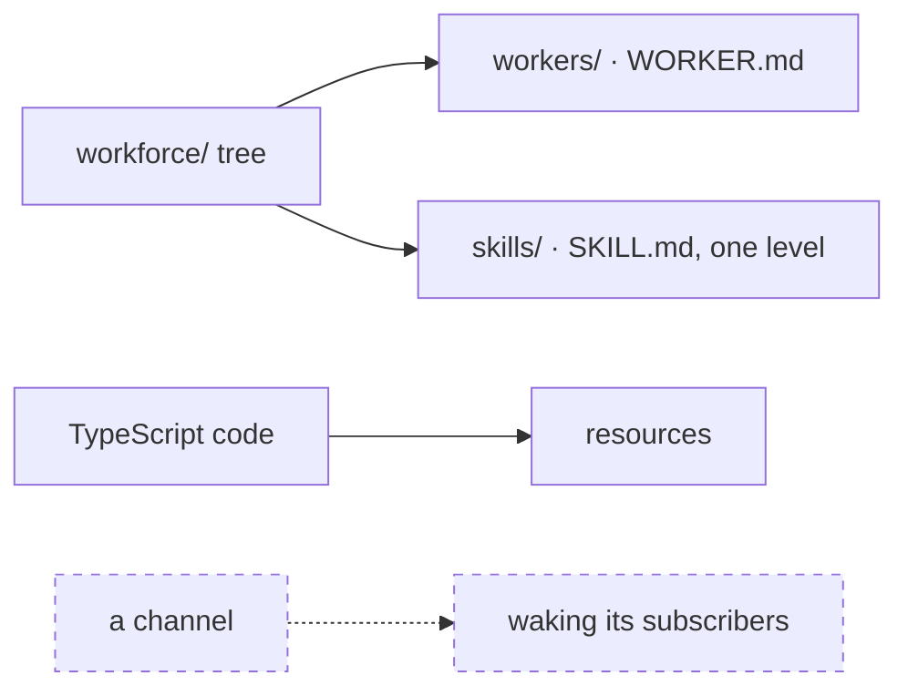
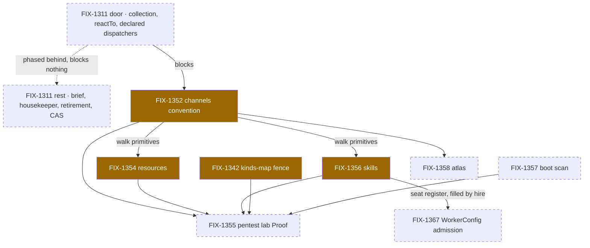

# FIX-1351 — explainer

*Three pictures of one epic. The full case is in
[`file-convention-surface.md`](file-convention-surface.md); the objective gate is on the PR.
Nothing here asks you for anything.*

---

## 1. Today — three pieces, three different states

W2 shipped the worker loader. Workers and skills are already file-declared; a document is
declared in code, with `defineResource`. **A channel has no declaration surface at all** — not
code, not files — and nothing named wakes its subscribers. A throwaway lab ran that notify path
on today's doors and closed; nothing shipped from it.

---

## 2. After (proposed) — the whole team is describable in files

The objective under approval; no sub-spec is approved yet. Every piece of a team becomes
describable in files. A channel goes from nothing to a folder and gains a board that wakes
subscribers — built from the collection and `reactTo` that already exist, not a new package type.
`defineResource` stays and is what the new loader calls.

---

## 3. The set

As of the objective gate. Amber is in flight, dashed is not started, nothing has shipped; the
epic doc's index is the live copy. Two things to read off it. **The one item that blocks anything
is the one nobody has started** — the notify door, sequenced first while three of its dependents
sit in spec review. And **the lab is still the only consumer that declares anything in files** —
last in line, with every convention pointing at it. FIX-1367 is the near miss: hire hands a kind
the skills register, so skills gains a caller early, but it reads records rather than a file. §5
carries both.

---

_Panel 4 lands once the first implementation merges._
