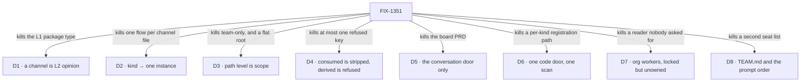

# FIX-1351 · Decisions

[Spec](SPEC.md) · **Decisions** · [Rules](BUSINESS-RULES.md) · [Plan](PLAN.md)

The calls that sit above any single issue: what was chosen, what lost, and what each locks in for
the thirteen issues under it. Two are the sign-off surface. The rest are owner locks taken during
the epic and recorded so no child reopens them.

## The tree

Each edge names what the decision killed. The alternative that lost, and why, is in the card.

## D1 · A channel is L2 opinion — a replaceable flow kind, not an L1 package type

| | |
|---|---|
| **Instead of** | A `MessageBoard` or `Channel` **L1 package type**, a peer of Flow and Session; or a TeamFlow beside it |
| **Because** | It ships at the agent kind's altitude, over collection, `reactTo` and dispatchers that already exist. A substrate type for every social noun is maintained forever; an L2 kind is replaced in one line |
| **Locks in** | *Message Board* retires as an author-facing noun too. Smart resource + `reactTo` survives for non-conversation shared state, activity and topic logs, and teaching — [#1627](https://github.com/fixpoint-labs/flow-state-dev/pull/1627) characterizes **that** path, not the channel API |

**What would change my mind on the objective:** evidence that apps want a conversation substrate
rather than a conversation *default*. Then the kind is the wrong altitude and the epic's shape,
not one issue's design, is wrong.

## D2 · Kind → one instance; channel → a named session on that instance

| | |
|---|---|
| **Instead of** | One ChannelFlow instance per `CHANNEL.md`, the way one seat mints per `WORKER.md` |
| **Because** | N channel files minting N flows is a flow registry per conversation. A singleton flow is already refused unless `flow.id === flow.kind`, and session ids are already caller-supplied on a create-or-get path — so a channel can be a stable named session with nothing invented |
| **Locks in** | Per-channel config — members, charter — lives in that session's state. An org channel and a team channel are two sessions on the same instance, not two instances. A custom kind adds an instance per **kind**, never per channel |

## D3 · Path level is scope, and `org` is a real level

| | |
|---|---|
| **Instead of** | Team-only slots · or org slots at the `workforce/` root with no `org/` segment |
| **Because** | A company-wide conversation home must not invent a fake team in order to exist. And the shipped readers already walk `<root>/org/<slot>` — skills on `main`, resources on its branch — so relocating org scope is a breaking change to two merged conventions, not a notation choice |
| **Locks in** | `org/` and `teams/<teamId>/` carry the same four slots. **Both** channel doors are in scope. Resources is org + team; skills is org ∪ team ∪ worker-local. The code door keeps its own tree beside them, not under `teams/` |

**What shipped, and what didn't.** Resources and skills read `org/`
([#1737](https://github.com/fixpoint-labs/flow-state-dev/pull/1737),
[#1728](https://github.com/fixpoint-labs/flow-state-dev/pull/1728)). Channels does not:
`readChannelsDirectory` walks `teams/<teamId>/channels/` only, so a planted
`org/channels/…/CHANNEL.md` comes back in neither results nor errors — found by the POC on
[#1805](https://github.com/fixpoint-labs/flow-state-dev/pull/1805), and readable in the merged
reader's own header. **The lock is not rewritten to team-only.** The slot stays; the org half is
unbuilt and unowned, and who closes it is [Open 5](#open). An atlas that draws `org/channels/` as
a *named gap* is right; one that deletes the slot contradicts this card.

## D4 · A key the convention *consumes* is stripped; a key it *derives* is refused

| | |
|---|---|
| **Instead of** | The inherited pair — "unknown keys pass through, at most one key refused by name" and "framework-granted status is derived from the declaration path, never declared in the file" |
| **Because** | The shipped `WORKER.md` precedent runs three policies at once, and the inherited wording described none of them. FIX-1354 hit the cost live: with a passthrough merged into the same object as the derived fields, a declared `ref:` redirected the storage row and a string `stateSchema:` constructed successfully, failing only later |
| **Locks in** | It is a **set**, not a key, applied after any allowlisted passthrough. Three mechanisms discharge it, in order — **shape** (the derived field sits in a slot sibling to the bag, so there is nothing to refuse), **ordering** (derive last), **explicit refusal**. Every convention names which one protects each field it derives |

## D5 · The default kind is the conversation door only

| | |
|---|---|
| **Instead of** | The old board PRD as the floor — brief, housekeeper, retirement and CAS inside the default kind |
| **Because** | The floor is the smallest thing that opens a channel, not a product. Admission that grows a second board product is the thing the L2 cut exists to prevent |
| **Locks in** | Subscribe, post by dispatch, fan-out policy and **minimal clean transcript projection**, that last one from day one. Brief, housekeeper and retirement may become ChannelFlow *behaviours* later; none is in admission. The Collab roster ([FIX-1341](https://linear.app/fixpoint-labs/issue/FIX-1341)) does not come into the floor. CAS's later home is [Open](#open) |

## D6 · Custom kinds are flow factories under `workforce/flows/{workers,channels}/`, behind one scan

| | |
|---|---|
| **Instead of** | `kinds/`, a flat filename suffix, or a kind file sitting beside `WORKER.md` / `CHANNEL.md` |
| **Because** | Channel kinds and worker kinds are the same problem, so they get one door invented once. Documents declare; they never define a kind |
| **Locks in** | One scan produces one `{ kinds }` map, with `workforce/blocks/` scanned beside it. `flow:` only ever names an already-registered kind. A hand-passed `{ kinds }` map stays valid until the scan ships, which is why FIX-1357 not having shipped yet holds up nothing |

## D7 · `org/workers/` stays locked open, unowned, and untaught

| | |
|---|---|
| **Instead of** | Minting a W3 issue for it · or widening the already-merged seat reader from this epic |
| **Because** | The lock opened a door no floor item reads. Inventing an issue places scope the owner has not placed; widening a merged reader re-scopes a shipped spec. And a documented door that reports nothing teaches a rule we are about to contradict — the silence class FIX-1342 just fixed |
| **Locks in** | Shared **infrastructure** seats only — intake, harness-manager and their like — never a second roster product. It lands as a hire/loader follow-on (FIX-1335-class). **The tripwire:** if FIX-1355's lab needs one of those seats, that is the moment it has a consumer and a reader goes on the floor. Until then the tree is not a deliverable grant |

## D8 · `TEAM.md` is one optional file, and the prompt stack order is locked

| | |
|---|---|
| **Instead of** | A TeamFlow · a required file · a second seat list · `ORG.md` alongside it |
| **Because** | A team needs shared context, not a layer. Hire already walks the team level and already parses this frontmatter dialect, so the reader is one file at a fixed path — no walk, no index, no identity of its own |
| **Locks in** | `[frameworkDefault?, teamInstructions, workerInstructions]` — the same array slot as the proposed default worker system prompt, not a second mechanism. Seat charter last, so role-specific instructions win an ordinary conflict. Absent means no team layer. **The reopen condition:** team *policy* dominating seat prose is an explicit reopen of this order, not something read into it. `ORG.md` is out, and is not taught as coming |

The placement half of this lock — *fold into hire, no new W3 child* — was stamped, and **FIX-1377
was subsequently filed and parented here**, which is the thin child that pick declined. The
substance above is untouched by that; the placement is [Open](#open).

## Who owns what

Every rule in the set has one owner. Read a row to see where a decision is made, where it is
built, and where it is only consumed; a *consumes* cell is a place a child must not re-decide.
FIX-1355, the lab, consumes every row and owns none — which is what makes it a proof. One cell is
neither: ER-1's channels cell is **half consumed** — the team door is read, the `org/` door is
not, and no issue owns closing it.

## Decided in review, recorded so no child reopens them

- **No parameterised slot reader.** FIX-1352 left it as a follow-up; FIX-1354 §3 answered it *no*.
  Conventions consume the extracted walk primitives — `classify`, `openStructuralDirectory`, the
  symlink and unreadable wordings, `IGNORED_ENTRIES`, the segment validator — not a generalised
  reader. FIX-1389 carries the extract, with the mega reader in its own invent-kill.
- **`ChannelManifest` is declared by FIX-1311, consumed by FIX-1352.** The mint is the first
  runtime consumer and it sequences first, so the reader imports the type and the `system:`
  refusal constant. An implementer note, not a re-gate of an approved spec.
- **The absent-`flow:` rule ships twice on purpose.** `mintChannels` and `hireWorkforce` carry it
  identically while FIX-1361 and FIX-1367 are both editing `hire.ts`; extracting on the second
  caller now would collide three in-flight edits. Sequencing, not a fork — and a tracked follow-up
  once all three merge.
- **Skill names are not globally unique, and never needed to be.** FIX-1356 isolates by narrowing
  what a seat *reads*, and its refusal is keyed on the worker. Two teams can each have a `review`
  skill. The premise was withdrawn at that issue's gate.
- **The blocking edge is in the tracker now, and has been overtaken.** The epic recorded one
  blocking edge while Linear carried only `related` links. Linear now records FIX-1311 **blocks**
  FIX-1352 and both are Done, so whether whole-issue granularity was too coarse is closed by
  events rather than by a ruling.

- **`org/channels/` is a named gap, not a retracted lock.** FIX-1358's POC found the shipped
  channels reader walks `teams/` only, while the epic still taught a company-wide channel as
  something you drop in `org/channels/` today. [D3](#d3) stands as org + team; what changes is the
  claim, not the decision. Correcting the sentence is honesty about today — it does not
  invent-kill org channels, and no child may read it that way.

**No end-state POC was built** — the set's shape was settled by owner stamps on this PR, and five
issues have since shipped, so the division is evidenced by what landed rather than by a throwaway.

## Open

**1. Who owns the helper that opens a DM?** *(Decides: the owner, with the Architect. Blocks:
nothing today; FIX-1355 if it is still unplaced when the lab starts.)* The lab needs one durable
intake DM before any roster exists. Under D2 a DM is a one-participant channel, so declaring one
is a `CHANNEL.md` and posting into one is the default kind's own verb — **both are in
admission**. Unowned is the *opener*: the helper that opens and names that session, the same one
the consumer-reshape question keeps on the Collab side of the fence. **Recommendation:** place it
on FIX-1355 the moment the lab starts, rather than inventing an owner now — it has fallen between
issues twice, and a third home is a third place to fall. **What would change my mind:** a lab that
opens with a group channel and no DM needs no owner at all.

**2. Does `TEAM.md` fold into hire, or is FIX-1377 the child?** *(Decides: the owner, with the
Lifecycle Manager. Blocks: nothing.)* The stamp was *fold into hire, no new W3 child*; FIX-1377
exists as that child, parented here. **Recommendation:** let FIX-1377 stand and treat the fold as
superseded — it is filed, it costs nothing to track, and the composition half lands in hire
either way. **If wrong:** a duplicate of work hire does anyway, found at implementation.

**3. Where does CAS live?** *(Decides: the owner, with the Architect. Blocks: nothing — it is out
of admission on every reading.)* Brief, housekeeper and retirement are each placed by one stamp or
the other; CAS is named only on the exclusion side, and the ChannelFlow floor wants none — a
transcript appends commutatively.

**4. Collection-vs-N-singles row compatibility at the resources ref form.** *(Decides:
unassigned — it needs an owner. Blocks: nothing in W3.)* The atlas's worked shape for team
documents is one parameterised collection; FIX-1354 installs singles at the same ref form, so the
keys agree but the install shapes differ and compatibility is unverified. Whoever moves documents
onto a collection settles it first.

**5. Who closes the `org/` half of the channels reader?** *(Decides: the owner, with the
Architect. Blocks: nothing today; ER-22's docs claim, and any lab intake DM meant to be
company-wide.)* [D3](#d3) locked `org/` and `teams/<teamId>/` as the same slots, and two of the
three conventions shipped that way. Channels shipped the team door only, and the gap belongs to
no issue in the set — FIX-1352 is Done, and widening a merged reader from this epic is what
[D7](#d7) refused for `org/workers/`. **The trade-off:** file a child now and the set grows a
fifth late arrival off the path to the proof, exactly the tail the necessity check is watching;
leave it and the epic's own headline promise — a company-wide channel without inventing a fake
team — stays unbuilt with nobody holding it. **Recommendation:** leave it unfiled and let the lab
decide, the same tripwire shape as D7 — FIX-1355 is the first thing that would want a
company-wide channel, and if it does, that is the moment it has a consumer and a reader goes on
the floor. **What would change my mind:** an author hitting it before the lab does, which makes it
a live defect rather than an unfinished lock. **If wrong:** the proof stalls on a door the epic
said was open, and the atlas teaches a gap that did not need to be one.

## How it got here

- **Stood up late (Sep 11)** — four sub-specs had already converged with no epic document; the
  inherited shape rules got a canonical home and the rule-4/7 correction (D4) was folded.
- **Floor rewritten to the owner's cut (Sep 11)** — FIX-1311 first and the only blocking item;
  **channel replaces room**, folding the rooms / L2-channels dual into one file type.
- **FIX-1367 joins (Sep 11)** — its non-agent Proof becomes the contract gate for "a seat works".
- **Item 0 recut from a board to a kind, narrowed a minute later (Sep 11)** — D1, then D5.
- **Objective approved (Sep 11, 22:52Z)** — owner comment and the `epic approved` label.
- **Identity locked (Sep 12)** — D2, superseding the earlier one-instance-per-file reading.
- **The code door, then the full tree (Sep 12)** — D6, then D3 with D7's unowned half.
- **`TEAM.md` locked (Sep 12)** — D8.
- **Migrated to the four-document set (Sep 16)** — form only. Superseded readings were dropped
  rather than kept beneath their replacements; the branch history holds them.
- **The org half of channels became a named gap (Sep 16)** — FIX-1358's POC showed the shipped
  reader walks `teams/` only. D3 keeps its org + team lock; the set stops claiming `org/channels/`
  opens today, and who closes it is now an open question rather than an assumption.
