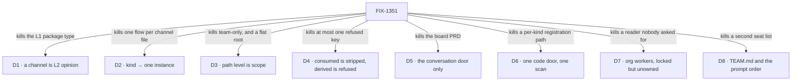

# FIX-1351 · Decisions

[Spec](SPEC.md) · **Decisions** · [Rules](BUSINESS-RULES.md) · [Plan](PLAN.md)

The calls that sit above any single issue: what was chosen, what lost, and what each locks in for
the thirteen committed deliverables under it. Two are the sign-off surface. The rest are owner
locks taken during the epic and recorded so no child reopens them.

## The tree

Each edge names what the decision killed. The alternative that lost, and why, is in the card.

## D1 · A channel is L2 opinion — a replaceable flow kind, not an L1 package type

| | |
|---|---|
| **Instead of** | A `MessageBoard` or `Channel` **L1 package type**, a peer of Flow and Session; or a TeamFlow beside it |
| **Because** | It ships at the agent kind's altitude, over collection, `reactTo` and dispatchers that already exist. A substrate type for every social noun is maintained forever; an L2 kind is replaced in one line |
| **Locks in** | *Message Board* retires as an author-facing noun too. Smart resource + `reactTo` survives for non-conversation shared state, activity and topic logs, and teaching — [#1627](https://github.com/fixpoint-labs/flow-state-dev/pull/1627) characterizes **that** path, not the channel API |

**What would change my mind on the objective:** evidence that apps want a conversation substrate
rather than a conversation *default*. Then the kind is the wrong altitude and the epic's shape,
not one issue's design, is wrong.

## D2 · Kind → one instance; channel → a named session on that instance

| | |
|---|---|
| **Instead of** | One ChannelFlow instance per `CHANNEL.md`, the way one seat mints per `WORKER.md` |
| **Because** | N channel files minting N flows is a flow registry per conversation. A singleton flow is already refused unless `flow.id === flow.kind`, and session ids are already caller-supplied on a create-or-get path — so a channel can be a stable named session with nothing invented |
| **Locks in** | Per-channel config — members, charter — lives in that session's state. An org channel and a team channel are two sessions on the same instance, not two instances. A custom kind adds an instance per **kind**, never per channel |

## D3 · Path level is scope, and `org` is a real level

| | |
|---|---|
| **Instead of** | Team-only slots · or org slots at the `workforce/` root with no `org/` segment |
| **Because** | A company-wide conversation home must not invent a fake team in order to exist. And the shipped readers already walk `<root>/org/<slot>` — skills on `main`, resources on its branch — so relocating org scope is a breaking change to two merged conventions, not a notation choice |
| **Locks in** | `org/` and `teams/<teamId>/` carry the same four slots. **Both** channel doors are in scope. Resources is org + team; skills is org ∪ team ∪ worker-local. The code door keeps its own tree beside them, not under `teams/` |

**What shipped, and what didn't.** Resources and skills read `org/`
([#1737](https://github.com/fixpoint-labs/flow-state-dev/pull/1737),
[#1728](https://github.com/fixpoint-labs/flow-state-dev/pull/1728)). Channels does not:
`readChannelsDirectory` walks `teams/<teamId>/channels/` only, so a planted
`org/channels/…/CHANNEL.md` comes back in neither results nor errors — found by the POC on
[#1805](https://github.com/fixpoint-labs/flow-state-dev/pull/1805), and readable in the merged
reader's own header. **The lock is not rewritten to team-only.** The slot stays; the org half is
unbuilt and unowned, and who closes it is [Open 5](#open). An atlas that draws `org/channels/` as
a *named gap* is right; one that deletes the slot contradicts this card.

## D4 · A key the convention *consumes* is stripped; a key it *derives* is refused

| | |
|---|---|
| **Instead of** | The inherited pair — "unknown keys pass through, at most one key refused by name" and "framework-granted status is derived from the declaration path, never declared in the file" |
| **Because** | The shipped `WORKER.md` precedent runs three policies at once, and the inherited wording described none of them. FIX-1354 hit the cost live: with a passthrough merged into the same object as the derived fields, a declared `ref:` redirected the storage row and a string `stateSchema:` constructed successfully, failing only later |
| **Locks in** | It is a **set**, not a key, applied after any allowlisted passthrough. Three mechanisms discharge it, in order — **shape** (the derived field sits in a slot sibling to the bag, so there is nothing to refuse), **ordering** (derive last), **explicit refusal**. Every convention names which one protects each field it derives |

## D5 · The default kind is the conversation door only

| | |
|---|---|
| **Instead of** | The old board PRD as the floor — brief, housekeeper, retirement and CAS inside the default kind |
| **Because** | The floor is the smallest thing that opens a channel, not a product. Admission that grows a second board product is the thing the L2 cut exists to prevent |
| **Locks in** | Subscribe, post by dispatch, fan-out policy and **minimal clean transcript projection**, that last one from day one. Brief, housekeeper and retirement may become ChannelFlow *behaviours* later; none is in admission. The Collab roster ([FIX-1341](https://linear.app/fixpoint-labs/issue/FIX-1341)) does not come into the floor. CAS's later home is [Open](#open) |

## D6 · Custom kinds are flow factories under `workforce/flows/{workers,channels}/`, behind one scan

| | |
|---|---|
| **Instead of** | `kinds/`, a flat filename suffix, or a kind file sitting beside `WORKER.md` / `CHANNEL.md` |
| **Because** | Channel kinds and worker kinds are the same problem, so they get one door invented once. Documents declare; they never define a kind |
| **Locks in** | One door, **three maps** — worker kinds for `hireWorkforce`, channel kinds for `channelInstances`, and `workforce/blocks/` beside them. One scan, not one map: the two kinds maps are different types on different functions and never merge. `flow:` only ever names an already-registered kind. The hand-passed maps stay valid until the scan ships, which is why FIX-1357 not having shipped yet holds up nothing |

## D7 · `org/workers/` stays locked open, unowned, and untaught

| | |
|---|---|
| **Instead of** | Minting a W3 issue for it · or widening the already-merged seat reader from this epic |
| **Because** | The lock opened a door no floor item reads. Inventing an issue places scope the owner has not placed; widening a merged reader re-scopes a shipped spec. And a documented door that reports nothing teaches a rule we are about to contradict — the silence class FIX-1342 just fixed |
| **Locks in** | Shared **infrastructure** seats only — intake, harness-manager and their like — never a second roster product. It lands as a hire/loader follow-on (FIX-1335-class). **The tripwire:** if FIX-1355's lab needs one of those seats, that is the moment it has a consumer and a reader goes on the floor. Until then the tree is not a deliverable grant |

**The lab does not want one** — FIX-1355's spec names no `org/workers/` seat, so this tripwire is
silent rather than fired. What the door did produce is
[FIX-1414](https://linear.app/fixpoint-labs/issue/FIX-1414): org-level workers declared in the
tree and unhireable, no seat and no id. It is **carried along, not a committed deliverable** — an
unowned gap with two undecided directions — and it is this card's predicted silence class arriving
as a filed defect rather than as a user complaint. D7 stands; the door is still unowned.

## D8 · `TEAM.md` is one optional file, and the prompt stack order is locked

| | |
|---|---|
| **Instead of** | A TeamFlow · a required file · a second seat list · `ORG.md` alongside it |
| **Because** | A team needs shared context, not a layer. Hire already walks the team level and already parses this frontmatter dialect, so the reader is one file at a fixed path — no walk, no index, no identity of its own |
| **Locks in** | `[frameworkDefault?, teamInstructions, workerInstructions]` — the same array slot as the proposed default worker system prompt, not a second mechanism. Seat charter last, so role-specific instructions win an ordinary conflict. Absent means no team layer. **The reopen condition:** team *policy* dominating seat prose is an explicit reopen of this order, not something read into it. `ORG.md` is out, and is not taught as coming |

The placement half of this lock — *fold into hire, no new W3 child* — is **superseded on placement
only**, and by its own test. The stamp carried a wrong-direction condition: *if the reader half
grows a real error contract or slot semantics, split later.* It did — FIX-1377's BR-1 to BR-10 are
a full `TEAM.md` reader contract (absent, empty description, empty body, symlink, unreadable,
directory-where-file-belongs, the derived-key refusal set, and frontmatter passthrough). So
**FIX-1377 stands as the child, and the composition half still lands in hire.** The stamp was not
wrong; its own condition fired. The substance above is untouched.

## Who owns what

Every rule in the set has one owner. Read a row to see where a decision is made, where it is
built, and where it is only consumed; a *consumes* cell is a place a child must not re-decide.
FIX-1355, the lab, consumes every row and owns none — which is what makes it a proof. One cell is
neither: ER-1's channels cell is **half consumed** — the team door is read, the `org/` door is
not, and no issue owns closing it.

**One consumer is deliberately not drawn.** FIX-1377 consumes ER-7 (it adds `teamInstructions` to
the contract) and ER-4 (its derived-key refusal set), but it has no column in the matrix, because
the ER-7 half is **pending an owner re-confirm** and a cell would read as settled. ER-7's *owner*
has not moved — FIX-1367 still defines and builds it. The column goes in when the re-confirm does.

## Decided in review, recorded so no child reopens them

- **No parameterised slot reader.** FIX-1352 left it as a follow-up; FIX-1354 §3 answered it *no*.
  Conventions consume the extracted walk primitives — `classify`, `openStructuralDirectory`, the
  symlink and unreadable wordings, `IGNORED_ENTRIES`, the segment validator — not a generalised
  reader. FIX-1389 carries the extract, with the mega reader in its own invent-kill.
- **`ChannelManifest` is declared by FIX-1311, consumed by FIX-1352.** The mint is the first
  runtime consumer and it sequences first, so the reader imports the type and the `system:`
  refusal constant. An implementer note, not a re-gate of an approved spec.
- **The absent-`flow:` rule ships twice on purpose.** `mintChannels` and `hireWorkforce` carry it
  identically while FIX-1361 and FIX-1367 are both editing `hire.ts`; extracting on the second
  caller now would collide three in-flight edits. Sequencing, not a fork — and a tracked follow-up
  once all three merge.
- **Skill names are not globally unique, and never needed to be.** FIX-1356 isolates by narrowing
  what a seat *reads*, and its refusal is keyed on the worker. Two teams can each have a `review`
  skill. The premise was withdrawn at that issue's gate.
- **The blocking edge is in the tracker now, and has been overtaken.** The epic recorded one
  blocking edge while Linear carried only `related` links. Linear now records FIX-1311 **blocks**
  FIX-1352 and both are Done, so whether whole-issue granularity was too coarse is closed by
  events rather than by a ruling.

- **D6 emits three maps, not one, and that was always what the code required.** The card read
  *one scan produces one `{ kinds }` map*. Verified against merged code: a worker kind goes to
  `hireWorkforce` (`kinds?: Record<string, AnyFlowType>`), a channel kind goes to
  `channelInstances(manifests, { kinds })` — a different map, of a different type
  (`ChannelInstancesOptions.kinds: Record<string, ChannelKind>`), on a different function, which
  is where `read-channels-directory.ts` already tells authors to pass one. With
  `workforce/blocks/` beside them that is three exports, and FIX-1357's spec ships them as
  `kinds`, `channelKinds` and `blocks`. **D6 itself stands** — one door, one scan, no per-kind
  registration path. Only the arithmetic was wrong, and no child may read the correction as
  permission to open a second door.

- **FIX-1367's `params` bag is cut, so ER-7's extension placeholder is not shipping.** The owner's
  rule: `params` is for open-ended dictionary data — a dictionary whose keys a kind cannot name in
  advance — while structurally important or common settings stay at the top level, declared and
  closed. The contract ships as `instructions?` plus `seatSkills`. When a kind does have
  open-ended data, it gets one declared key whose own schema is a **record**, which is already
  what `closeConfigSchema` tells an author when it refuses a catchall. ER-7's substance is
  untouched: hire still invokes the flow with a config the kind admits. **Not yet reflected in the
  child:** FIX-1367's own spec documents on
  [#1807](https://github.com/fixpoint-labs/flow-state-dev/pull/1807) still declare `params` — S1,
  V1, the pinned names and the sketch — so the cut lives here and not there. Flagged, not fixed
  from this branch.

- **ER-7's contract carries a *third* framework-owned key — `teamInstructions` — and that is
  `pending an owner re-confirm`, not settled.** FIX-1367 was approved carrying two keys plus
  `params`; `params` was then cut, and FIX-1377's [D1](https://github.com/fixpoint-labs/flow-state-dev/pull/1819)
  puts the team layer on the same contract as an imposed setting beside `instructions` and
  `seatSkills`, rather than through hire's probe-the-kind-and-stay-silent-if-absent hack — which
  is the exact silence FIX-1367 exists to delete. A block inside a seat's action then reads
  `ctx.flow.config.teamInstructions` and `ctx.flow.config.instructions` as two values, neither
  merged. **This changes a spec the owner already approved**, so ER-7 states three keys and states
  that the third is unconfirmed. No child ships it until the re-confirm lands.

- **`docs/atlas/workforce.html` §19 gap 6 is stale, and it misled this epic.** The entry reads
  *"`flowIsolation` exists and keys per flow kind, not per seat"* (line ~2690) and is stamped
  **NAMED GAP · PROVE flowIsolation FIRST · PER KIND, NOT PER SEAT**. That describes the
  **pre-FIX-1323 bug**, which is fixed: the isolation coordinate is the flow **instance** id
  (`${id}:${flow.id}` in `packages/engine/src/context/createExecutionContext.ts`), and
  `hireWorkforce` already mints one instance id per seat (`id: manifest.id`,
  `packages/workforce/src/hire.ts`). Settled by POC on the production `hireWorkforce` API with an
  anti-game control — isolated, `bob` reads an empty note; flag flipped on the identical two-seat
  setup, `bob` reads `alice-secret` — plus a green committed suite and a landed goal check. **So
  the mechanism the stamp asked to be proved has been proved.** What does *not* exist is the
  file-convention wiring: `read-resources-directory.ts` walks `org/resources/` and
  `teams/<id>/resources/` and has no `workers/<name>/resources/` walk; `resourcesFromDocs`
  hardcodes `scope: "org"` with no isolation option and installs at flow-definition time; hire's
  minter forwards only `{ id, config }`. An authority-level-2 document describing a fixed bug as a
  live gap is a **known-stale surface the epic owes a fix to** ([PLAN](PLAN.md#wrap)), and no
  child may cite that stamp as current architecture.

- **`org/channels/` is a named gap, not a retracted lock.** FIX-1358's POC found the shipped
  channels reader walks `teams/` only, while the epic still taught a company-wide channel as
  something you drop in `org/channels/` today. [D3](#d3) stands as org + team; what changes is the
  claim, not the decision. Correcting the sentence is honesty about today — it does not
  invent-kill org channels, and no child may read it that way.

- **FIX-1412 is a missing *parameter*, not a missing capability — and it is a smaller ask than the
  epic had filed.** The ticket was written on the premise that the **client** cannot carry an
  `orgId`. It can: `CreateSessionOptions` declares `orgId?: string`
  (`packages/client/src/session-client/sessions.ts`) and forwards it. What cannot carry one is
  `openChannels` itself — its options are `{ client, userId }`, and the `createSession` signature
  it *structurally* declares (deliberately narrow, so `workforce` takes no dependency on
  `client`) has no `orgId`, so it cannot thread one through whatever the real client supports.
  **Corrected in round 2 of FIX-1355's spec review**, and run rather than read: a two-half compile
  check on that branch (`spec-poc/FIX-1355-runtime-premises/`, `check-no-org-door.sh`) where
  `no-org-door.probe.ts` must **fail** to compile and `org-door-exists.probe.ts` must **compile**.
  Either half alone misleads — the first draft asserted an `orgId` was refused "at both doors",
  which was an artefact of a redeclared local type. This is what makes FIX-1355's two-line client
  wrap load-bearing rather than cargo: it injects the argument the binder won't pass, so it is a
  workaround for a missing **parameter**, not for absent framework support. The ask narrows to
  *thread the org through `openChannels`*. **Nothing in the set resizes:** FIX-1412 is carried
  along, has no node in the graph and no lane in the path, and gates no deliverable — so the
  correction changes how it is sized when someone picks it up, not the epic's shape.
  **On the name:** FIX-1355's spec and its probes report this up as "ER-14". The epic's
  [ER-14](BUSINESS-RULES.md) is the *comment-up* rule the finding was raised **under**, not a name
  for the finding; no epic rule is numbered for the org thread. The ask lives here and on
  FIX-1412, and no child should cite "ER-14" for it.

**No end-state POC was built** — the set's shape was settled by owner stamps on this PR, and five
issues have since shipped, so the division is evidenced by what landed rather than by a throwaway.

## Open

**1. ~~Who owns the helper that opens a DM?~~** *Dissolved, not answered* — the question stopped
existing rather than getting an owner. FIX-1355's spec
([#1809](https://github.com/fixpoint-labs/flow-state-dev/pull/1809)) settled that **the lab needs
no durable intake DM at all**: under [D2](#d2) a DM is a one-participant channel, and one
participant cannot show a fan-out, which is the thing the lab is there to prove. The lab opens a
**declared team channel**, which `openChannels` already opens and names. That is exactly the
condition this entry recorded as what would change its mind. The *opener* — the helper for an
**undeclared** session — stays unowned, and nothing in the set now wants it.

**2. ~~Does `TEAM.md` fold into hire, or is FIX-1377 the child?~~** *Closed: FIX-1377 stands as the
child; the composition half still lands in hire; the fold is superseded on **placement only**.*
The 2026-09-12 stamp read *fold into hire, no new W3 child* and carried its own wrong-direction
test — *if the reader half grows a real error contract or slot semantics, split later.* It did:
FIX-1377's BR-1 to BR-10 are a full `TEAM.md` reader contract. The stamp was not wrong; its own
condition fired. Recorded at [D8](#d8).

**3. Where does CAS live?** *(Decides: the owner, with the Architect. Blocks: nothing — it is out
of admission on every reading.)* Brief, housekeeper and retirement are each placed by one stamp or
the other; CAS is named only on the exclusion side, and the ChannelFlow floor wants none — a
transcript appends commutatively.

**4. Collection-vs-N-singles row compatibility at the resources ref form.** *(Decides:
unassigned — it needs an owner. Blocks: nothing in W3.)* The atlas's worked shape for team
documents is one parameterised collection; FIX-1354 installs singles at the same ref form, so the
keys agree but the install shapes differ and compatibility is unverified. Whoever moves documents
onto a collection settles it first.

**5. Who closes the `org/` half of the channels reader?** *(Decides: the owner, with the
Architect. Blocks: nothing today; ER-22's docs claim.)* [D3](#d3) locked `org/` and `teams/<teamId>/` as the same slots, and two of the
three conventions shipped that way. Channels shipped the team door only, and the gap belongs to
no issue in the set — FIX-1352 is Done, and widening a merged reader from this epic is what
[D7](#d7) refused for `org/workers/`. **The trade-off:** file a child now and the set grows a
fourth late arrival off the path to the proof (three remain now Door B has left), exactly the tail
the necessity check is watching;
leave it and the epic's own headline promise — a company-wide channel without inventing a fake
team — stays unbuilt with nobody holding it. **The tripwire has fired, and it fired negative.**
The recommendation was to leave it unfiled and let the lab decide, D7's shape — FIX-1355 being the
first thing that would want a company-wide channel. FIX-1355's spec
([#1809](https://github.com/fixpoint-labs/flow-state-dev/pull/1809)) has now answered: it
**declines** a company-wide channel under `org/channels/` by name — *"declarable and unread; the
proof would wait on unbuilt, unowned work"* — and opens a declared **team** channel instead. So
the lab will not put a reader on the floor, and **this gap now has no tripwire left**: it stays
open with nothing scheduled to close it and nothing scheduled to force the question.
**Recommendation, revised:** it still should not be filed off the path to the proof, but it can no
longer be left to an event that will not happen — the honest options are to file it deliberately
after the lab, or to accept it as a standing gap the docs teach (ER-22) and say so out loud.
**What would change my mind:** an author hitting it, which makes it a live defect rather than an
unfinished lock. **If wrong:** the epic wraps with its own headline promise — a company-wide
channel without inventing a fake team — unbuilt and unowned.

**6. After `TEAM.md`, `teams/<id>/` teaches two true-but-different rules. Ship that, or hold until
the folder has one answer?** *(Decides: the owner, with the Architect. Blocks: nothing today; the
docs wording, and whether FIX-1377 is re-spec'd. Raised by FIX-1377 commenting up under
[ER-14](BUSINESS-RULES.md).)*

- **In plain terms.** Team **instructions** really do reach only that team's seats — they ride
  each seat's own configuration. Team **documents** do not: they install on a worker *kind*, so
  every seat of that kind reaches every team's documents. That second half is what the shipped
  page teaches today — *"the team folder is a namespace, not a visibility boundary"*
  (`apps/docs/docs/workforce/documents-on-disk.md`, verified by a reviewer). Both halves are
  accurate, for different reasons, and after FIX-1377 they describe two files in one folder.
- **It is bound to [FIX-1368's D2](https://github.com/fixpoint-labs/flow-state-dev/pull/1814),
  which is UNRESOLVED.** Three arms are live, and each does something different here:

  | If D2 resolves to… | Then |
  |---|---|
  | **Address** — a folder *names* whose something is, and does not limit who reads it | FIX-1377 ships as written, and the atlas owes a paragraph teaching both rules out loud |
  | **Fence** — a team or worker folder really does limit who can read | **FIX-1377 is re-spec'd against one folder rule.** Its cases survive; its teaching and docs plan do not |
  | **Report-only** — the folder is reported rather than loaded, and scoping stays undecided | FIX-1377 ships as written, and the docs obligation still stands: team documents keep behaving as they do today |

- **Where the reviewers stand, stated plainly:** two back the address (the FSD Architect, cursor);
  **one dissents** (codex), on the ground that the stamped atlas keeps the folder a named gap. The
  address arm has **not** won.
- **The dissent's cited authority is stale, and that is not the same as the dissent being wrong.**
  The stamp — *NAMED GAP · PROVE flowIsolation FIRST · PER KIND, NOT PER SEAT* — describes a bug
  FIX-1323 fixed; isolation keys per flow **instance** and hire mints one per seat, proved on the
  real path (see *Decided in review*). What is still true is that **the fence's cost is unpriced**
  in FIX-1368's own spec, and that is an independent reason not to read the address as settled.
- **Recommendation — and it is a recommendation, not a ruling on D2, which is the owner's on
  FIX-1368:** ship FIX-1377 and make the atlas teach the difference explicitly, because the two
  mechanisms genuinely differ and one rule would be a false simplification. Hold only if you
  intend `teams/<id>/` to become a real visibility boundary, in which case FIX-1377 should be
  written against that answer rather than ahead of it.
- **What would change my mind:** a priced fence. The moment somebody costs the isolated landing
  path, holding stops being an open-ended wait.
- **If wrong:** a docs correction, and possibly an author who put a document in a team folder
  expecting it to stay with the team. Nothing on disk moves, no storage ref changes, no config key
  changes. Cheap to reverse.

## How it got here

- **Stood up late (Sep 11)** — four sub-specs had already converged with no epic document; the
  inherited shape rules got a canonical home and the rule-4/7 correction (D4) was folded.
- **Floor rewritten to the owner's cut (Sep 11)** — FIX-1311 first and the only blocking item;
  **channel replaces room**, folding the rooms / L2-channels dual into one file type.
- **FIX-1367 joins (Sep 11)** — its non-agent Proof becomes the contract gate for "a seat works".
- **Item 0 recut from a board to a kind, narrowed a minute later (Sep 11)** — D1, then D5.
- **Objective approved (Sep 11, 22:52Z)** — owner comment and the `epic approved` label.
- **Identity locked (Sep 12)** — D2, superseding the earlier one-instance-per-file reading.
- **The code door, then the full tree (Sep 12)** — D6, then D3 with D7's unowned half.
- **`TEAM.md` locked (Sep 12)** — D8.
- **Migrated to the four-document set (Sep 16)** — form only. Superseded readings were dropped
  rather than kept beneath their replacements; the branch history holds them.
- **Two claims corrected against shipped code (Sep 16)** — D6's map count (one scan emits three
  maps, not one) and ER-7's extension placeholder (cut with FIX-1367's `params`). Both decisions
  stand; only what the set claimed about them moved. FIX-1358 and FIX-1367 had their specs
  approved the same day.
- **The org half of channels became a named gap (Sep 16)** — FIX-1358's POC showed the shipped
  reader walks `teams/` only. D3 keeps its org + team lock; the set stops claiming `org/channels/`
  opens today, and who closes it is now an open question rather than an assumption.
- **Two opens closed and one opened (Sep 17)** — the DM opener **dissolved** (the lab needs no
  DM: one participant cannot show a fan-out), and `TEAM.md`'s placement **closed** by its stamp's
  own wrong-direction test firing. The new open is the one FIX-1377 raised: after a team layer,
  one folder teaches two rules, and which rule wins is bound to FIX-1368's unresolved D2.
- **Door B left the epic, and the tail was re-counted (Sep 17)** — the owner removed FIX-1388.
  Three further sub-issues (FIX-1412, FIX-1414, FIX-1416) are marked **carried along** rather than
  committed, so the child list stops reading as thirteen promises plus three.
- **The atlas stamp behind the fence arm was refuted (Sep 17)** — `flowIsolation` keys per flow
  instance, not per kind, and has since FIX-1323. The stamp stays cited nowhere as live
  architecture, and `docs/atlas/workforce.html` §19 gap 6 becomes a fix the epic owes.
- **Open 5's tripwire fired negative (Sep 17)** — FIX-1355 declines a company-wide channel, so the
  lab will not put an `org/channels/` reader on the floor. The gap is unchanged; what changed is
  that waiting for the lab stopped being a plan.
- **FIX-1412 was narrowed against shipped code (Sep 17)** — it was filed as *the client has no org
  door*; the client has one, and only `openChannels` won't thread an org through. Corrected by
  round 2 of FIX-1355's spec review on a two-half compile check. A smaller ask, sized as a
  parameter; the epic's shape is untouched because the issue is carried along.
