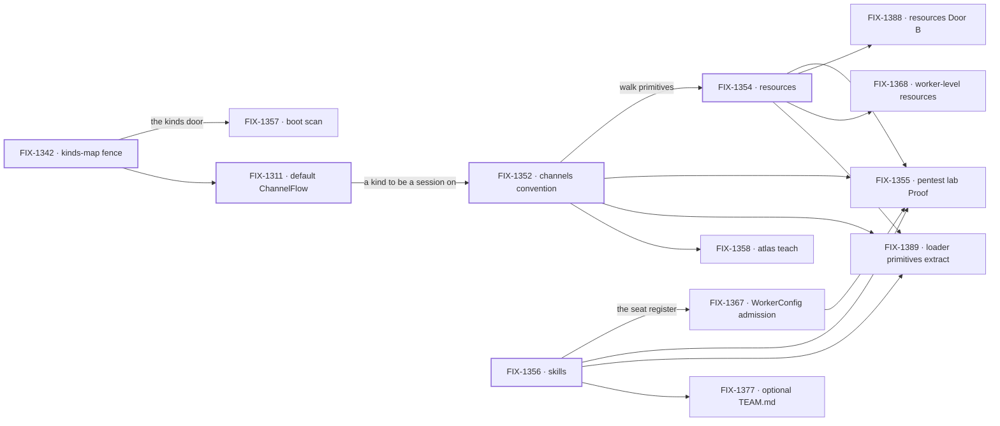

# FIX-1351 · W3: a Workforce is describable in files

**Spec** · [Decisions](DECISIONS.md) · [Rules](BUSINESS-RULES.md) · [Plan](PLAN.md)

Epic · 13 issues · Workforce: Layer 2 Abstraction · Goal 1 — Workforce foundation honesty /
multi-seat real usage

## Four teams, before and after

| A team that… | Today | After this epic |
|---|---|---|
| **describes a team on disk** | Workers and skills are file-declared; a document needs TypeScript, and a channel has no declaration surface at all | Every part of a team — workers, channels, resources, skills — is declared in one tree |
| **wants a company-wide channel** | Invents a fake team to hold it, or writes the flow by hand | Drops a `CHANNEL.md` and it opens as a named session on the shipped kind — at team scope. The `org/` door is locked open and still unread ([open](DECISIONS.md#open)) |
| **hires a seat that declared skills** | The seat mints, and is handed nothing it declared | Hire invokes the flow with a config the kind admits, the seat's skills in it |
| **wants to know any of it holds** | Nothing consumes a single convention | A thin pentest lab declares all three and runs multi-seat on the real path |

**Why now.** W2 landed the worker loader and the seat factory spine, so a seat mints from a
folder. Everything else a Workforce is made of stopped at the code boundary: a channel had no
declaration surface at all, a document needed TypeScript, and none of it had run under real
multi-seat pressure. The three conventions share one shape and one directory walk, which is why
they are one epic rather than three — and the lab is what stops that shape from staying a guess.

## What's in the box

Everything inside the box is what an app gets by declaring files. The fence is what keeps that
cheap: the concepts ship as **L2 opinion**, at the same altitude as the agent kind, so no new L1
package type is invented for a channel, a board or a team ([D1](DECISIONS.md#d1)). The bottom
strip is what the set refuses to build, and every item in it was named out by the owner rather
than forgotten. One line in the box is a promise the set has not kept: `org/channels/` is locked
open and nothing reads it. That is a **gap**, not a refusal — the fence holds what the set won't
build, and this is the one thing it hasn't.

## The set · as of 2026-09-16

This table is the live one. It is refreshed on the epic PR as issues move; the plan and the
figures point here rather than repeating it.

| Issue | What it delivers | Why the set needs it | Status |
|---|---|---|---|
| FIX-1311 | The default **ChannelFlow** kind — subscribe, post by dispatch, clean transcript projection | Nothing else in the set has a kind for a channel to be a session on | **Done** · spec [#1738](https://github.com/fixpoint-labs/flow-state-dev/pull/1738) · impl [#1747](https://github.com/fixpoint-labs/flow-state-dev/pull/1747) |
| FIX-1342 | The kinds-map fence: seats stay `WORKER.md`, custom kinds are flow factories | Without it a "custom worker" is a richer folder, and the file conventions have no door to register against | **Done** · spec [#1702](https://github.com/fixpoint-labs/flow-state-dev/pull/1702) · impl [#1712](https://github.com/fixpoint-labs/flow-state-dev/pull/1712) |
| FIX-1352 | Channels file convention at **team** scope; the shared walk primitives | The one convention with no prior art — a channel could not be declared at all | **Done** · spec [#1711](https://github.com/fixpoint-labs/flow-state-dev/pull/1711) · impl [#1793](https://github.com/fixpoint-labs/flow-state-dev/pull/1793) — the `org/` door [D3](DECISIONS.md#d3) locked is unbuilt and unowned |
| FIX-1354 | Resources file convention — Markdown documents under `resources/` | A document was the one thing an author could only declare in TypeScript | **Done** · spec [#1715](https://github.com/fixpoint-labs/flow-state-dev/pull/1715) · impl [#1737](https://github.com/fixpoint-labs/flow-state-dev/pull/1737) |
| FIX-1356 | Skills file convention — the per-seat skills register over org ∪ team ∪ worker-local | The register FIX-1367 fills; also where path-level-is-scope first shipped | **Done** · spec [#1716](https://github.com/fixpoint-labs/flow-state-dev/pull/1716) · impl [#1728](https://github.com/fixpoint-labs/flow-state-dev/pull/1728) |
| FIX-1367 | Thin `WorkerConfig` admission — hire fills the seat's skills bag on every record | "A seat works" is not honest until hire invokes the flow with a config the kind admits | **Spec approved** · spec [#1807](https://github.com/fixpoint-labs/flow-state-dev/pull/1807) closed unmerged |
| FIX-1355 | Thin pentest lab **Proof** | The only child shaped to move Goal 1, and the first consumer that declares any of it in files | Backlog — waits on nothing that isn't done |
| FIX-1357 | Kinds + blocks boot scan under `workforce/flows/{workers,channels}/` | The one registration door; until it ships the kinds maps are hand-passed, one per call site | **In spec review** · spec [#1804](https://github.com/fixpoint-labs/flow-state-dev/pull/1804) |
| FIX-1358 | Atlas: the ChannelFlow teach and the full tree | The conventions are only real to an author who is taught them | **Spec approved** · spec [#1805](https://github.com/fixpoint-labs/flow-state-dev/pull/1805) closed unmerged · one page landed [#1742](https://github.com/fixpoint-labs/flow-state-dev/pull/1742) |
| FIX-1368 | Worker-level resources — `workers/<name>/resources/` as a third root | FIX-1354 deferred it as a scope cut, not a rejection | Backlog |
| FIX-1377 | Optional `TEAM.md` — description, team instructions, hire's prompt compose | Instructions are duplicated on every `WORKER.md` without it | Backlog |
| FIX-1388 | Resources **Door B** — capability and resource modules (discover, install, select) | Door A ships read-only Markdown; anything with state or behaviour still needs hand-written TypeScript | Backlog |
| FIX-1389 | Workforce loader primitives extract — one shared tree-walk, thin per-slot adapters | Four readers now re-implement the walk, and the contracts have already drifted | Backlog |

5 done · 2 spec approved and waiting to be built · 1 in spec review · 5 in backlog. FIX-1353
(*L2 channels as sessions/boards*) closed as a duplicate of FIX-1352 and is dropped from the set.

**Is thirteen really six?** The floor was seven items; five have landed and the count grew to
thirteen, entirely from follow-ons the conventions' own reviews raised. None of the four late
arrivals sits on the path to the proof: the tail grew while the proof did not start, and while
the `org/` half of a convention the owner had already locked stayed unbuilt and unowned. The set
is kept on the check it was approved on, and that check is now **owed rather than argued**: each
convention earns a non-lab consumer before the lab lands ([ER-15](BUSINESS-RULES.md)), and today
skills has one approved and waiting to be built in FIX-1367, channels has a kind but no reader
of a declaration, and resources has none.

## How the issues flow into each other

An edge is what one issue hands the next; a heavy border is done. Every node is filed, so the set
carries no placeholders. The four nodes on the right — Door B, worker resources, the extract and
`TEAM.md` — were all filed **after** the objective was approved, and none of them sits between
anything and the lab.

## What stays as it is

- **`defineResource` in TypeScript.** The file convention is a second door, not a replacement.
- **The Collab roster ([FIX-1341](https://linear.app/fixpoint-labs/issue/FIX-1341)).** Its
  channels lock feeds this epic's convention; full Collab does not come into the floor. MCP
  ([FIX-1333](https://linear.app/fixpoint-labs/issue/FIX-1333)) is held until the lab.
- **The W2 spine.** Folder → records → mint is proved on
  [#1664](https://github.com/fixpoint-labs/flow-state-dev/pull/1664) and is not reopened. W2
  proves a seat is *minted*; W3 proves it is *configured*.
- **`org/workers/`.** Locked open, deliberately unowned, untaught until a reader exists
  ([D7](DECISIONS.md#d7)).
- **`org/channels/`.** Locked open by [D3](DECISIONS.md#d3) and read by nothing — the shipped
  reader walks `teams/` only. A named gap with no owner, not a refusal
  ([open](DECISIONS.md#open)).

## Sign off

1. **[D1](DECISIONS.md#d1) · A channel is L2 opinion — a replaceable flow kind, not a new L1
   package type.** If wrong: the framework grows a substrate concept for every social noun, and
   each one has to be maintained forever.
2. **[D3](DECISIONS.md#d3) · Path level is scope: `org/` and `teams/<teamId>/` carry the same
   slots.** If wrong: the whole tree relocates, and three shipped readers move with it. **Half
   built:** resources and skills walk `org/`; channels does not, and no issue owns closing it.
3. **Open · [who owns the DM opener?](DECISIONS.md#open)** The lab needs one durable intake DM
   before any roster exists. Declaring it and posting into it both ship; the helper that *opens
   and names* it belongs to nobody, and it is the same helper the consumer-reshape question keeps
   on the Collab side of the fence. Blocks nothing today; blocks FIX-1355 if still unplaced when
   the lab starts.

The objective is approved — owner comment and `epic approved` label, 2026-09-11 22:52Z. What
lost, and why: [DECISIONS.md](DECISIONS.md). The rules every child obeys:
[BUSINESS-RULES.md](BUSINESS-RULES.md). The order the work runs in: [PLAN.md](PLAN.md).
