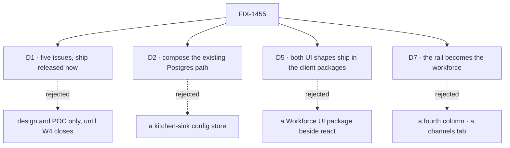

# FIX-1455 · Decisions

[Spec](SPEC.md) · **Decisions** · [Rules](BUSINESS-RULES.md) · [Plan](PLAN.md)

The calls that sit above any single issue. Six of them are locks the epic body and the Architect
already made — they are recorded here so no child reopens them, not re-argued. **One is new:
[D7](#d7)**, what the app's persistent rail is for. That is the one to read.

## The tree

D3, D4 and D6 are vocabulary and invent-kill locks with no live alternative; they are cards
below rather than branches above.

## D1 · Five issues under one objective, and ship work is released now

| | |
|---|---|
| **Instead of** | Design and POC only, holding ship work until W4's epic closes · or four issues, folding the patterns shed into the UI row |
| **Because** | The epic body fences *ship* on "W3 floor or that W4 first-cut still open". Both are closed, verified 2026-09-20: FIX-1351 is Done (19 of 20 children Done, one Duplicate); FIX-1385, FIX-1405 and FIX-1408 are all Done. FIX-1407 remains In Review carrying only FIX-1461 (docs) and FIX-1460 (a dead-helper decision) — neither is the first cut |
| **Locks in** | Children may open implementation PRs, not only specs. If FIX-1407's two strays turn out to change the first cut, that is a re-gate on this card, not a per-child decision |

**What would change my mind:** evidence that W4's two open strays move a surface a child builds
on. Then this epic returns to design and POC and the fence goes back up.

## D2 · Durable hire composes the persistence the app already has

| | |
|---|---|
| **Instead of** | A kitchen-sink-owned config store · a process-only roster that dies with the deploy (`openLab()`-shaped) |
| **Because** | A fifth persistence layer in the app that exists to teach the fourth is the worst possible lesson. The Postgres path is already wired in kitchen-sink for everything else it keeps |
| **Locks in** | FIX-1475 writes org-scoped state through the existing store. The file convention (`WORKER.md`, `CHANNEL.md`, a boards list) stays the *authoring* path; runtime hire writes durable state the next boot reloads. A child that finds the existing store cannot carry a shape comments up rather than adding one |

## D3 · Seat, Kind, Agent — and none of them is Layer 1

| | |
|---|---|
| **Instead of** | Minting Agent, Team, Channel or Board as an L1 type so the app has something concrete to render |
| **Because** | Workforce is Layer 2 on orchestration. A reference app that reaches past its own layer to make the demo easier teaches the layering is optional |
| **Locks in** | **Seat** = a hired durable worker instance, often its own session. **Kind** = a replaceable flow shape named by `WORKER.md` / `flow:`. **Agent** = a persistent identity with its own memory — not bound to a session, a channel or a flow. These words are what the UI labels say, not only what the docs say ([ER-6](BUSINESS-RULES.md)) |

## D4 · Channels are a family and its instances; boards are names in a file and drain is explicit

| | |
|---|---|
| **Instead of** | A ChannelFlow implementation per family · boards minted by a BoardFlow · seats that see every board on the channel |
| **Because** | Board v1 is settled upstream (FIX-1385/FIX-1922). A channel holds conversation; a seat does work. Which boards a seat drains is seat wiring, and making it ambient hides the one thing the example exists to show |
| **Locks in** | `CHANNELS.md` is kind/family config under `workforce/flows/channels/<kind>/`; `CHANNEL.md` is one named instance pointing at its family via `flow:`. One factory with kind clones (dm / topic / workstream). Boards are a bare name list in `CHANNEL.md` frontmatter; the framework mints a ledger per local name; code wires drain only, via `channelBoard` / `taskBoard`; an unattended board warns. FIX-1476 owns all of it and FIX-1477 renders it without re-deciding it |

## D5 · Both UI shapes ship in the client packages; kitchen-sink only consumes

| | |
|---|---|
| **Instead of** | A third "Workforce UI" package beside `react` and `client` · leaving the components in the app and letting readers copy files |
| **Because** | The rebuild's value is that it can be imported, not that it can be admired. A shape that needs kitchen-sink-specific plumbing to work is a design finding for FIX-1477's spec, not a licence to leave it in the app |
| **Locks in** | **Inline** = renders from the current turn's stream. **Resource-backed** = subscribes to a standing collection. Both ship from the existing client packages. Kitchen-sink defines no UI API of its own; if it has to, that is a cross-cutting question and comes up here |

## D6 · Patterns is shed as a dependency, and never bridged to seats

| | |
|---|---|
| **Instead of** | Keeping the dependency and plugging hired seats into `supervisor()` or another pattern factory to justify it |
| **Because** | A patterns "worker" is a block on a board inside one request. A Workforce worker is a hired seat — a durable flow instance, often another session. Bridging them collapses a multi-session roster and its channels into an in-process loop, which is exactly the thing the epic exists to demonstrate is different |
| **Locks in** | FIX-1478 audits every `@flow-state-dev/patterns` import in `apps/kitchen-sink` — today five files, all under `flows/chat-agent/` — maps each to a Workforce path or writes a one-line *keep because…*, and drops the package dependency only when no keep-notes remain. The patterns package itself is untouched |

## D7 · The persistent rail stops being a session list and becomes the workforce

| | |
|---|---|
| **Instead of** | A fourth column for channels · a tab strip inside the existing rail · a `/workforce` route beside `/` |
| **Because** | The app has exactly one persistent region and it is spent on a session list. A fourth column does not fit — the centre already loses its minimum below `sm`, and the right panel is 280–700px on its own. A tab strip hides whichever half you are not looking at, which is the opposite of a reference. A separate route says the workforce is a subsystem you visit, when the claim is that it is the app. Sessions do not disappear: a channel's history *is* the session list, scoped |
| **Locks in** | The rail is org → channels → seats. The right panel holds boards and roster and stops being conditional on build mode. Three children build against those regions: FIX-1476 fills the channel half, FIX-1475 the roster half, FIX-1477 ships the components for both. Reversible cheaply until FIX-1477 merges, and not after |

**What would change my mind:** a rendered narrow-width pass showing the rail cannot hold
channels and a roster together without one of them becoming a scroll-within-a-scroll. Then the
roster moves to the right panel with the boards and the rail is channels only.

## Who owns what

![Who owns what: seven cross-cutting rules against the five issues in the set, each rule with exactly one decides or builds cell and consumes cells elsewhere. The durable-roster rule is built by FIX-1475 and consumed by FIX-1477; the served-workforce rule is built by FIX-1429 and consumed by FIX-1475; the channel and board convention is decided by FIX-1476 and consumed by FIX-1477; the two UI shapes are decided and built by FIX-1477 and consumed by FIX-1475 and FIX-1476; one recipe per job is built by FIX-1478; the vocabulary rule is decided by FIX-1476 and consumed by every other row; and the shell regions rule is decided by the epic and built by FIX-1477, consumed by FIX-1475 and FIX-1476](figures/ownership.svg)

Every rule has exactly one owner. A cell that says *consumes* is a place a child must not
re-decide — the seam, not a wait. ER-6 and ER-7 are the two rows to check on any refresh: they
are the ones that bind three children each, and an owner moving there moves a figure too.

## Decided in review, recorded so no child reopens them

- **FIX-1455 is not a W5 item.** It was un-parented from FIX-1457 on 2026-09-20 by the owner and
  is an epic in its own right under *Workforce: Layer 2 Abstraction*. W5's description carries
  the amendment. No child re-parents it, and no child treats W5's set table as its own.
- **The ship fence is lifted, with the evidence on [D1](#d1).** A child that reads the epic
  body's "soft-after W4 first-cut" line and stops is reading a superseded state.
- **FIX-1429 has no spec and never will.** It is a `Bug` and takes the direct route
  ([orchestration.md](../../../docs/contributing/orchestration.md) → "Which issues get a
  spec"). Its empty spec-PR cell in the set table is correct. Its own open question — async
  `fsdev.config` boot versus a post-construction `createFlowState` registry — is the
  implementer's, resolved toward durable hire, and is *not* an epic-level fork.
- **Runtime channel-admin verbs are not in this set.** FIX-1415 is parked and adjacent. FIX-1476
  teaches the declarative convention and no worker-facing admin verbs.

## What the end-state POC showed

None built. The division into issues rests on one seam that a POC could test — whether the shell
regions in [D7](#d7) can be built by three children in parallel without one of them owning the
other two's layout — and that question is cheaper to answer by having FIX-1477 ship the
components first than by sketching an end state. If the coordinator dispatches one later, this
section takes its four lines.

## Open

**The five stale kitchen-sink tickets: fold, cancel, or leave open?**

The epic body soft-noted [FIX-1372](https://linear.app/fixpoint-labs/issue/FIX-1372) (skill
activator sees an empty catalog on the first turn),
[FIX-420](https://linear.app/fixpoint-labs/issue/FIX-420),
[FIX-472](https://linear.app/fixpoint-labs/issue/FIX-472),
[FIX-429](https://linear.app/fixpoint-labs/issue/FIX-429) and
[FIX-540](https://linear.app/fixpoint-labs/issue/FIX-540) as *not mass-canceled pending final PM
pass*. Nothing in this epic touches them and nothing here decides them.

**In plain terms.** Five old bugs and polish items sit against the app this epic rebuilds. Some
of them describe screens that will not exist afterwards.

**The trade-off.** Leaving them open costs a board that lies about what is broken, and a reader
who cannot tell which of them the rebuild already answers. Canceling them costs a real bug
(FIX-1372 is a first-turn correctness problem, not polish) quietly disappearing under a rebuild
that may not fix it.

**My recommendation:** triage them in two piles rather than one decision — FIX-1372 stays open
and is *verified against the rebuilt app* at wrap, because an empty catalog on the first turn is
a bug whether the shell changes or not; FIX-420, FIX-429, FIX-472 and FIX-540 close as superseded
by the rebuild, with this epic named as the superseder.

**What would change my mind:** any of the four naming a behaviour the rebuild does not replace.

**What being wrong costs:** one reopened ticket. This is cheap in both directions and the only
expensive option is leaving it undecided for another cycle.

## How it got here

- **Drafted (Sep 20)** — five issues under one objective; the epic body's spine and invent-kills
  taken as locked; the ship fence verified lifted; D7 added as the one new cross-cutting call,
  because the interface figures could not be drawn without answering it.
