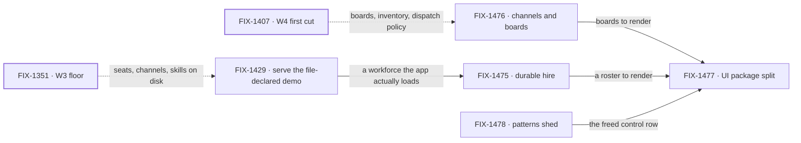

# FIX-1455 · Kitchen-sink rebuild: the Workforce reference people copy

**Spec** · [Decisions](DECISIONS.md) · [Rules](BUSINESS-RULES.md) · [Plan](PLAN.md)

Epic · 5 issues · Workforce: Layer 2 Abstraction · Goal 1, validate through real usage

## Five teams, before and after

| A team that… | Today | After this epic |
|---|---|---|
| **clones the reference app to learn Workforce** | Finds a chat app with four modes and a thinking-style menu. The workforce is a folder nothing serves | Opens it and sees a hired team, its channels, and its boards |
| **hires a team and redeploys** | The roster dies with the process | It is still there on the next boot, out of the Postgres the app already uses |
| **builds a Workforce UI of its own** | Copies kitchen-sink's components, because that is the only place they exist | Imports them from the client packages. Kitchen-sink imports the same ones |
| **wires a seat to a board** | Has no example at all | Has one channel kind, one named instance, and a seat that drains a subset — plus a warning for the board nobody watches |
| **wants to know which recipe to copy** | Finds a patterns recipe beside a Workforce one for the same job | Finds one, and a written reason wherever patterns stays |

**Why now.** The L2 surface a reference app would teach now exists: the W3 floor
([FIX-1351](https://linear.app/fixpoint-labs/issue/FIX-1351)) is Done, and W4's first cut —
boards ([FIX-1385](https://linear.app/fixpoint-labs/issue/FIX-1385)), inventory
([FIX-1405](https://linear.app/fixpoint-labs/issue/FIX-1405)), dispatch policy
([FIX-1408](https://linear.app/fixpoint-labs/issue/FIX-1408)) — is Done. The epic body fenced
*ship* work behind both; as of 2026-09-20 that fence is lifted ([D1](DECISIONS.md#d1)). The
cost of waiting is not a missing demo. The argument for building the file convention the way we
did is that it survives a production build, and the only app that could test that claim never
imports the generated module: after a real `pnpm build`, `desk-clerk` and `desk-note` appear in
**0** compiled chunks against **5** each for the three wired kinds (FIX-1429). The reference app
is where that claim is either true or merely asserted.

## What's in the box

Everything in the box is what a team gets by cloning the app. The fence at the bottom is what
keeps it a *consumer*: nothing in this epic ships an API that only kitchen-sink can call
([D2](DECISIONS.md#d2), [D5](DECISIONS.md#d5)).

## How the shell makes room

Channels, seats and boards have no home in the current chrome. The app has two routes — `/`
mounts the chat agent directly, `/devtool` — and one persistent region, a 256px rail
(`w-64`) whose vertical budget is spent on a scrollable **session list**. There is no channel
list, no seat roster, no board and no board column anywhere in the app. That is the real-estate
contest this epic resolves, and it is the one call the epic body had not already made
([D7](DECISIONS.md#d7)).

Read it by column width, not by label. The rail keeps its width and changes its content; the
right panel stops being conditional on a mode. The centre is the only region that survives
unchanged, because the turn stream is the one thing the app already gets right.

The split is not new — every region of the app is already one shape or the other, unnamed.
Spine item 3 moves both into the client packages rather than inventing them
([D5](DECISIONS.md#d5)). **Inline names the source a region reads — the session's item stream —
not how long its content lives**; the items are durable, so an inline region still shows earlier
turns and resolved approvals after a reload. The hooks and renderers each region uses today are
in the figure, and which one goes where is FIX-1477's to work out, not this document's.

Most of the patterns shed is behind the screen — five imports in `flows/chat-agent/`
— so this figure is honest about how little screen it frees on its own: one control row. The
rail's budget is freed by [D7](DECISIONS.md#d7), not by the shed. Both together are what pays
for channels and the roster.

The order is the content. Three children each own one of these regions, so which one yields
first is a seam between them rather than any one issue's layout call — it is fixed here and
consumed there ([ER-7](BUSINESS-RULES.md)).

## The set · as of 2026-09-20

This table is the live one. It is refreshed on the epic PR as issues move; the plan and the
figures point here rather than repeating it.

| Issue | What it delivers | Why the set needs it | Status |
|---|---|---|---|
| [FIX-1429](https://linear.app/fixpoint-labs/issue/FIX-1429) · **bug** | The file-declared workforce demo is served over the app's real HTTP route | Nothing else in the set can stand on a workforce the app never loads. It is also the only row that tests the file convention against a real build | Backlog · direct route, no spec PR |
| [FIX-1475](https://linear.app/fixpoint-labs/issue/FIX-1475) | Hired teams, channels and boards survive a redeploy, on the Postgres the app already uses | The substance. "Durable" is the whole difference between a reference and a demo | Backlog · blocked by FIX-1429 |
| [FIX-1476](https://linear.app/fixpoint-labs/issue/FIX-1476) | The shipped channel pair — a kind as `flows/channels/<kind>.ts`, an instance as `CHANNEL.md` — one ChannelFlow factory, board v1 seat drain | Without it there is no worked example of how a seat reaches the boards it is meant to watch — and no visible warning for the ones nobody watches | Backlog |
| [FIX-1477](https://linear.app/fixpoint-labs/issue/FIX-1477) | Inline and resource-backed components shipped in the client packages | The one row that makes the rebuild reusable rather than admirable. Without it every reader copies kitchen-sink files | Backlog |
| [FIX-1478](https://linear.app/fixpoint-labs/issue/FIX-1478) | `@flow-state-dev/patterns` dropped as a kitchen-sink dependency where Workforce covers it | A reference app teaching two recipes for one job teaches neither | Backlog |

0 done · 0 in flight · 5 not started. Four are substance and one (FIX-1429) is a bug the set
stands on. **Is five really four?** FIX-1478 is the row to weigh: shedding patterns changes no
behaviour a user can see, and the audit could ride along inside FIX-1477. It stays separate
because it is the only row whose deliverable is a *deletion*, and deletions that ride along with
a feature are the ones that get dropped when the feature runs long. Its collapse trigger: if the
audit finds fewer than three surfaces with an honest Workforce path, fold the remainder into
FIX-1477's PR and close it.

## How the issues flow into each other

An edge is what one issue hands the next. Dashed edges come from other epics and are consumed,
not owned. Only FIX-1429 → FIX-1475 is a hard block; the other three start together. FIX-1477
is last by preference, not by dependency — it can begin against today's shapes and absorb the
other rows' surfaces as they land.

## What stays as it is

- **Runtime channel-admin verbs** — create, delete, invite. That is
  [FIX-1415](https://linear.app/fixpoint-labs/issue/FIX-1415), parked, and adjacent. This epic
  is the declarative convention only.
- **The `@flow-state-dev/patterns` package itself.** FIX-1478 sheds a *consumer's* dependency;
  it does not dissolve the package or shrink its API.
- **`/devtool`.** Observing a run as it unfolds is a different surface with no child here.
- **DevForce and CyberForce.** They stay finish-line Labs beside kitchen-sink, never inside it.
- **Org identity.** [FIX-1442](https://linear.app/fixpoint-labs/issue/FIX-1442) is soft-related
  and consumed; this set does not re-decide it.

## Sign off

1. **[D1](DECISIONS.md#d1) · Five issues, one objective, ship released now.** The fence the
   epic body set is verified lifted. If wrong: a cycle spent on a reference app while the L2
   surface underneath it still moves, and every row is re-specced against a changed floor.
2. **[D7](DECISIONS.md#d7) · The persistent rail stops being a session list and becomes the
   workforce.** The new call — the epic body did not make it. If wrong: the first thing anyone
   sees in the reference app is the wrong thing, and three children have already built against
   it. Reversible for about a day's work after FIX-1477 lands, and not after.
3. **[D2](DECISIONS.md#d2) · Durable hire composes the existing Postgres persistence; no
   kitchen-sink store.** If wrong: a fifth config persistence layer exists and the reference app
   teaches it. This is an invent-kill from the epic body, restated because it is the one a child
   is most likely to breach quietly.

**Open: two.** First, whether FIX-1475's durability proof is scoped to runtime hire of seats
and the roster, or whether runtime channel administration comes into the set — as written,
[ER-2](BUSINESS-RULES.md) asks for a runtime-created channel that [ER-16](BUSINESS-RULES.md)
forbids ([DECISIONS.md → Open](DECISIONS.md#open-runtime-admin)). Second, whether the five
soft-noted stale kitchen-sink tickets
([FIX-1372](https://linear.app/fixpoint-labs/issue/FIX-1372),
[FIX-420](https://linear.app/fixpoint-labs/issue/FIX-420),
[FIX-472](https://linear.app/fixpoint-labs/issue/FIX-472),
[FIX-429](https://linear.app/fixpoint-labs/issue/FIX-429),
[FIX-540](https://linear.app/fixpoint-labs/issue/FIX-540)) fold into this set, cancel as
superseded, or stay open — the owner's call, written out in
[DECISIONS.md → Open](DECISIONS.md#open). The reasoning and what lost:
[DECISIONS.md](DECISIONS.md). The rules every child obeys:
[BUSINESS-RULES.md](BUSINESS-RULES.md). The order the work runs in: [PLAN.md](PLAN.md).
