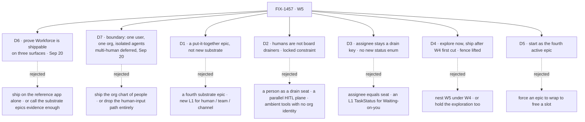

# FIX-1457 · Decisions

[Spec](SPEC.md) · **Decisions** · [Rules](BUSINESS-RULES.md) · [Plan](PLAN.md)

The calls above any single issue in W5: what was chosen, what lost, what each locks in. **[D6](#d6)
is the live one** — the restated objective, and the first sign-off ask. [D7](#d7) is the owner's
scope boundary, recorded not re-litigated; [D2](#d2) is now a **locked constraint, not a fork**;
[D3](#d3) is consumed from W4 with no re-gate; [D4](#d4)'s fence has lifted; [D5](#d5) is news.

**Re-cut by the owner on 2026-09-20.** FIX-1458 was canceled and the multi-human half deferred.
Nothing it touched was deleted: what it invented against is [D2](#d2); what it would have built is
[Grow into later](#later).

## The tree

## D6 · W5 proves Workforce is shippable, on three surfaces

> **Owner restatement, 2026-09-20:** *"the objective is about polishing and proving workforce so we
> can ship it… upgrading kitchen-sink to see workforce in action, improving devtool so that we can
> test workforce and see the activity unfold through various channels and workers, and getting at
> least a basic version of DevForce working."* The epic's live sign-off ask.

| | |
|---|---|
| **Instead of** | Proving it on the **reference app alone** — cloneable, runnable, a demo · or treating W3 and W4 shipping as evidence in itself, and launching on the architecture documents |
| **Because** | W3 and W4 each ended in a *claim* about what exists. A launch rests on **evidence**, and the three surfaces are three kinds of it: the app shows Workforce *can* run, devtool shows what it is *doing* while it runs, a real configuration shows it doing something worth doing. Drop devtool and the other two are asserted from log files; drop DevForce and the only workforce that ever ran was built to be demonstrated |
| **Locks in** | **The done condition is three artifacts, not a description** ([ER-19](BUSINESS-RULES.md)), each naming the child that produces it. **The set is open** ([ER-23](BUSINESS-RULES.md)) — filing a child against this objective is normal course, not a re-scope. **Two of the three have no producer today**, which is [Open 1](#open) |

**The DevForce tension, named rather than papered over.** Locked Architect input on FIX-1457 says the
finish-line Labs *"stay DevForce (D-12) + CyberForce (pentest) on the delivery countdown — do not…
treat W5 as 'build DevForce'"*. The restated objective puts a basic DevForce **inside** W5. The
owner's newer statement wins, and the fence is **narrowed, not lifted**: a thin configuration as
evidence is in, a DevForce anyone could adopt is not, CyberForce stays out, and no Lab product lands
inside the kitchen-sink ([ER-11](BUSINESS-RULES.md) keeps that half). *How* thin is sign-off ask 2.

**What would change my mind:** a launch date inside this cycle. Then the reference app alone is the
bar, and the other two become named launch follow-ups rather than quietly dropped legs.

## D7 · The boundary — one user, one org, isolated agents; the org chart of people grows in later

> **Owner call, 2026-09-20**, in the session that canceled FIX-1458 and closed
> [#1955](https://github.com/fixpoint-labs/flow-state-dev/pull/1955) unmerged: *"W5 ship cut =
> kitchen-sink + living assemblies (one-user-org / agent isolation). Multi-human org chart =
> grow-into later."* This is the box around [D6](#d6), not the objective.

| | |
|---|---|
| **Instead of** | Shipping the **org chart of people** — several principals, an audience routing between them, who may answer for whom, a durable `reviewedBy:` · or dropping the human-input path entirely once its explore was canceled |
| **Because** | The wide cut had exactly **one** child able to prove it, and that child is canceled. One user, one org is also the honest boundary for what W3 and W4 built: the isolation they delivered is **between agents**, not between people |
| **Locks in** | The human-input path stays, narrowed: a seat parks, and the person answers through a flow action carrying **the request's existing principal** — no second principal is derived, nothing routes between people ([ER-1](BUSINESS-RULES.md)). No child builds multi-human machinery ([ER-22](BUSINESS-RULES.md)); one that needs it raises it ([ER-17](BUSINESS-RULES.md)). Deferrals are listed in [Grow into later](#later) with revisit conditions |

## D1 · W5 is a put-it-together epic on Workforce L2, not a fourth substrate epic

| | |
|---|---|
| **Instead of** | A fourth substrate epic that adds the L1 a composition turns out to want · or a second Collab epic dressed as W5 |
| **Because** | The feature-complete bar — W3 closed, W4 first cut shipped, org never optional, Labs running without special wrappers — is a claim about what already exists. A fourth substrate epic would move the bar instead of testing it |
| **Locks in** | Every child composes existing pieces. A child that needs new L1 has found a **gap in W3 or W4** and comments up on this PR rather than building it here ([ER-5](BUSINESS-RULES.md), [ER-17](BUSINESS-RULES.md)) |

**What would change my mind:** the reference app or the devtool work finding that a run cannot be
observed, or a seat cannot reach its handbooks, without a new L1 type.

## D2 · Humans are not board drainers — a locked constraint, no longer a fork

> **Settled, and off the sign-off surface.** Flipped by the owner on 2026-09-20 (it had read *"a
> person occupies the same seat slot an agent does"*), and the same day FIX-1458 — the only child
> that would have designed against it — was canceled. What survives is not a design but a fence.

| | |
|---|---|
| **Instead of** | **Dead, and stays dead** — a person as a drain seat claiming board rows beside the agents (*Model A*) · HITL as ambient approval tools with no org identity · a parallel human work plane · human-only side boards agent seats cannot see · `assignee` ≡ a person |
| **Because** | A task needs human review **while a non-human owns the work**, and even when a person supplies something, the system still has to know what to do with it — **the flow owns the machine**. People drive through actions, not by draining a queue |
| **Locks in** | A **non-human seat owns the task** and **parks it with a reason** when it needs input. The human acts through a **flow action carrying the request's existing principal** — approve, provide input, unpark — and the flow decides what that means and continues. **No Human L1, no parallel HITL plane, no assignee-equals-person.** `flow: human` is optional Lab chrome, never the W5 spine |

**Why it is not an ask:** the cancellation removed the child that would have tested it, so there is
nothing to approve — only a fence to hold. A child that thinks the fence is wrong raises it
([ER-17](BUSINESS-RULES.md)); it does not build past it.

## D3 · Board assignee stays a drain key, and no L1 enum grows for a human's state

| | |
|---|---|
| **Instead of** | Collapsing board assignee and the seat registry into one noun · adding `waiting_on_you` and `idle` to L1 `TaskStatus` |
| **Because** | The assignee is *who a row drains to*; the seat is *who exists on the roster*. They resolve to each other and a merge is irreversible (the W4 invent-kill stands). **Waiting on you** is already expressible — parked, with a reason — and **Idle** is seat/session runtime |
| **Locks in** | Waiting-on-you is a **view** over existing status plus seat runtime — **including in devtool**, which renders the run and must not grow a status value to do it ([ER-8](BUSINESS-RULES.md)) |

## D4 · Explore now; ship after W4's first cut — **the fence has lifted**

| | |
|---|---|
| **Instead of** | Nesting W5 under W4 and starting nothing · or holding the exploration along with the ship work |
| **Because** | W5 is a **sibling** of W4: the W3→W4→W5 chain is a sequence of outcomes, not containment. Ship work composes the W4 first cut, so building against a floor in motion means rebuilding it. An exploration composes nothing, so holding it buys nothing |
| **Locks in** | **The ship fence, defined here once. It lifted on 2026-09-20** when W4's first cut landed, so it fences nothing now and is kept as the record of why nothing started sooner ([ER-10](BUSINESS-RULES.md)) |

## D5 · W5 starts as the fourth active epic, against a cap of two

| | |
|---|---|
| **Instead of** | Forcing W3 ([#1718](https://github.com/fixpoint-labs/flow-state-dev/pull/1718)), W4 ([#1905](https://github.com/fixpoint-labs/flow-state-dev/pull/1905)) or LAB-162 ([#1612](https://github.com/fixpoint-labs/flow-state-dev/pull/1612)) to wrap to free a slot |
| **Because** | The board was already at three open epic PRs when W5 opened. The owner chose the breach on 2026-09-19 rather than wrap an epic early and cost it real closure quality |
| **Locks in** | The cap is knowingly breached, not forgotten. **[D6](#d6) changes the arithmetic** — W5's live work was one exploration when this was decided, and the restated objective adds two unfiled bodies of work. Opening them against three other live epics is a **second** decision this card does not cover |

## Who owns what

![Who owns what: a matrix of six cross-cutting rules against the four live rows of the set — the exploration FIX-1467, the held child epic FIX-1455, the unfiled devtool view, and the unfiled basic DevForce. FIX-1467 owns the downstream-blocking walls rule; FIX-1455 owns the human-input path, the parked row, the runnable reference and the compose rule; the done condition splits into three legs, of which FIX-1455 owns one and the two unfiled rows hold the other two as empty dashed cells reading NO CHILD. A note records that the canceled FIX-1458 no longer has a column and that the rules it owned moved to FIX-1455 and FIX-1467. The figure's aria-label carries every cell and the count of the seventeen rules outside the matrix.](figures/ownership.svg)

**The two empty cells are the finding.** ER-19's three legs sit in three rows and two are unfiled, so
the done condition is owned in one third. An empty cell means *no child produces this* — different
from a blank cell, which means *this row does not touch the rule*.

**Two owners moved with the cancellation, and neither was left empty.** ER-1 and ER-2 were
FIX-1458's; they are now **FIX-1455's**, because it renders a parked row and calls the action that
answers it. ER-18's walls were also FIX-1458's and are **retargeted to FIX-1467**.

**Six rules need a column; the other seventeen don't** — eleven prohibitions, four run-the-set rules
and two further proofs bind every row equally.

## Grow into later — deferred, with a revisit condition

**Parked on purpose. These are not [Open](#open) questions** — nobody will answer them this epic, and
a row that reads as open invites a child to answer it. Each returns when its condition is met; the
owner named the general one as **when multi-user or sign-off pain is real**.

| Deferred | Why it is not in the cut | Comes back when |
|---|---|---|
| **Multi-user** — a second principal in an org, and the walls between them | [D7](#d7) | A second person needs different permissions in the same org |
| **The org chart of people** as a product | It was FIX-1458's to shape, and FIX-1458 is canceled | Multi-user lands, or a customer asks who owes a sign-off |
| **Originator ≠ reviewer** | Needs two principals to mean anything | With multi-user |
| **Durable `reviewedBy:`** — a persisted bind from a seat to the person who answers for it | Under one user there is one answer to *who*: the request's own principal | With the org chart of people |
| **The FIX-1455 bind requirements** the canceled explore would have handed down | The requirement's subject no longer exists. **If it is written down on FIX-1455, it is stale** | With durable `reviewedBy:` |
| **Multi-principal walls** — one person across many desks; whether channel members are principals; where a board lives once several principals reach it | All three are questions about a second person | With multi-user |
| **CyberForce** | [D6](#d6) admits DevForce as evidence and stops there | DevForce is proven and a second configuration is worth the cost |

## Decided in review, recorded so no child reopens them

**Round 1 (2026-09-20)** — greptile, cursor, codex and `second-look` on head `1d9218e`.

- **ER-19 gets a named producer rather than none.** Round 1 gave the single done condition a
  provisional owner so a coordinator could tell whether to file or wrap (W4's ER-20 → FIX-1430 set
  the precedent). The restated objective split it into three legs, and the same discipline per leg is
  what exposed the two unowned ones ([Open 1](#open)).
- **An exploration may not exit with a wall open that a downstream child needs**
  ([ER-18](BUSINESS-RULES.md)). The clause stands as round 1 wrote it; **its owner and its two named
  walls were retargeted** from FIX-1458 to FIX-1467.
- **ER-19 requires org-bound execution.** The re-cut narrowed *which* org identity is owed
  ([D7](#d7)), not whether one is.
- **ER-20 gains a wrap-time sweep of the shipped child diffs.** A spec-time check cannot see a child
  that ships what its spec never claimed.
- **D5 is news, not an ask** — though [D6](#d6) has since changed what it is news about.

**Salvaged from the canceled explore**, so it does not die with
[#1955](https://github.com/fixpoint-labs/flow-state-dev/pull/1955): its POC established that **a
session belongs to one user** — the runtime refuses a request arriving on another user's session
before any block runs — so a board a person answers into **cannot be session-scoped to the seat's
session**; the ledger is org-scoped. That lands on FIX-1455 and on the devtool gap, which renders
across sessions. True at one user as well as many, so it survives the re-cut.

## What the end-state POC showed

**None was built, and the restated objective makes that a closer call.** The question it answers —
*does the division into issues hold once it's all there?* — now has content: D6 names three surfaces,
and whether devtool observability is one child or three is exactly what a rough end-state falsifies.
But two of the three rows are unfiled, so there is no division to test. **Revisit the moment both
gaps are filed** ([Open 1](#open)) — before either starts building.

## How it got here

- **Drafted (Sep 19)** — from Jake's spine, the Cycle PM stamp and the Architect EM fences on
  FIX-1457, all locked input. D5 records the epic-slot breach.
- **Review round 1 folded (Sep 20)** — ER-19 gained an owner and org identity, ER-18 a
  downstream-blocking clause, ER-20 a wrap-time check. The objective did not move.
- **Objective gate taken, then D2 flipped (Sep 20)** — approved in the morning, D2 superseded the
  same day.
- **Re-cut and objective restated (Sep 20, 15:48 onward)** — the owner **canceled FIX-1458**, closed
  [#1955](https://github.com/fixpoint-labs/flow-state-dev/pull/1955) unmerged, set the boundary
  ([D7](#d7)), then restated the objective itself: **polish and prove Workforce so it can ship**, on
  kitchen-sink, devtool and a basic DevForce ([D6](#d6)). D2's fork collapsed into a locked
  constraint. FIX-1467 entered the set table, which had never carried it.
  **[ER-19 was rewritten a third time](BUSINESS-RULES.md)**, now as three named artifacts — and
  writing it that way is what showed **two of the three have no producer**, where the previous three
  versions each described a mechanism the set could not deliver without saying so. The vague *working
  assemblies* row was **resolved into** the devtool and DevForce gaps, and **ER-23** was added because
  the owner expects the set to grow. Not review feedback and not a review round: `reviewRounds` stays
  at 1.

## Open

Two, plus FIX-1467's own walls. (The multi-human questions that used to sit here are **not** open —
they are [deferred with a condition](#later), and a child must not answer them.)

1. **Two thirds of the done condition has no owner.** [ER-19](BUSINESS-RULES.md) names three
   artifacts; only the kitchen-sink one has a child. **Devtool observability** and **a basic
   DevForce** are named gaps with no ticket, no spec and no owner. Not a question about the
   objective — a question about whether the epic is staffed to reach it. Sign-off ask 3.
2. **How thin is "a basic DevForce"**, and does that narrow or lift the Architect fence against
   building the Labs here ([D6](#d6))? Sign-off ask 2 — open because the answer changes the epic's
   size, not just a child's scope.

**FIX-1467's walls** are that exploration's to lean on, not this document's to close: the noun and
the migration, the grant model, whether skills' package-local `references/` stays untouched, and what
ambient inheritance does at org → team → worker. **The first two are downstream-blocking**
([ER-18](BUSINESS-RULES.md)) — FIX-1455 teaches the convention and declares seats with those keys, so
an exploration exiting with either open releases its dependants onto nothing. Exploration may lean;
**no wall closes without the owner**.
