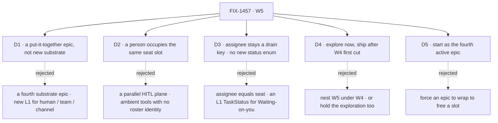

# FIX-1457 · Decisions

[Spec](SPEC.md) · **Decisions** · [Rules](BUSINESS-RULES.md) · [Plan](PLAN.md)

The calls that sit above any single issue in W5: what was chosen, what lost, and what each locks in
for the children under it. Two of them ([D2](#d2), [D4](#d4)) are on the sign-off surface with the
done-condition fork; [D3](#d3) is **consumed from W4 with no re-gate** and [D5](#d5) is **recorded
news, not an ask**. The exploration's walls are open by instruction, except where one binds a
downstream child ([ER-18](BUSINESS-RULES.md)).

## The tree

## D1 · W5 is a put-it-together epic on Workforce L2, not a fourth substrate epic

| | |
|---|---|
| **Instead of** | A fourth substrate epic that adds the L1 a composition turns out to want · or a second Collab epic dressed as W5 |
| **Because** | The feature-complete bar is W3 closed, W4 first cut shipped, org never optional, and Labs running without special wrappers. That bar is a claim about what already exists. A fourth substrate epic would move the bar instead of testing it, and nothing would ever have proved the first three |
| **Locks in** | Every child composes existing pieces. A child that finds it needs new L1 has found a **gap in W3 or W4**, and comments up on this PR rather than building it here ([ER-5](BUSINESS-RULES.md), [ER-17](BUSINESS-RULES.md)) |

**What would change my mind:** the exploration finding that a human seat cannot be expressed in the
existing seat slot at all. Then W5's first spine point is substrate work and belongs in a W4
follow-on, not here.

## D2 · A person occupies the same seat slot an agent does

| | |
|---|---|
| **Instead of** | HITL as ambient approval tools with no roster identity · a parallel human work plane beside boards and seats · human-only side boards agent seats cannot see |
| **Because** | The thing an org needs from a human step is **assignment and accountability**, and both are properties of the roster. A human step that lives outside the roster is invisible to inventory, to channel membership, and to the manager queue — so it can be assigned but not tracked. One slot means the queue does not care which kind of thing drains a row |
| **Locks in** | Human seats appear in inventory, hold channel membership, and claim or receive board rows like any seat. The **drain UX** differs — Waiting-on-you / approve / edit rather than a model loop — and that is the only difference the substrate sees. FIX-1458 explores **how**, never **whether** |

**What would change my mind:** evidence that the seat slot's obligations (a kind, a flow, a session)
are meaningless enough for a person that satisfying them is pure ceremony. That is one of the
exploration's open walls, and it is the wall that could reach up and change this card.

## D3 · Board assignee stays a drain key, and no L1 enum grows for a human's state

| | |
|---|---|
| **Instead of** | Collapsing board assignee and the Workforce seat registry into one noun · adding `waiting_on_you` and `idle` to L1 `TaskStatus` |
| **Because** | The assignee is *who a row drains to*; the seat is *who exists on the roster*. They resolve to each other and are not the same thing, and a merge is irreversible in a way neither is on its own (the W4 invent-kill stands). **Waiting on you** is already expressible — parked, with a reason and an audience — and **Idle** is seat/session runtime, not a property of the work. A status enum mirroring a UI's columns is a UI leaking into L1 |
| **Locks in** | The human drain story is a **view** over existing status plus seat runtime. Any child that finds itself wanting a new status value has hit a cross-cutting question, not a local one ([ER-8](BUSINESS-RULES.md)) |

## D4 · Explore now; ship after W4's first cut

| | |
|---|---|
| **Instead of** | Nesting W5 under W4 and starting nothing · or holding the exploration along with the ship work |
| **Because** | W5 is a **sibling** of W4, not a child: the W3→W4→W5 chain is a sequence of outcomes, not a containment. Ship work composes the W4 first cut, so building it against a floor still in motion means rebuilding it. The **exploration** composes nothing — it produces a shape — so holding it buys nothing and costs a cycle |
| **Locks in** | **The ship fence, defined here once and linked everywhere else.** FIX-1458 runs now; FIX-1455 and the assemblies cut may not *start* ship work until the W4 first cut lands. It is a fence on starting, not a dependency edge a child can satisfy early, and it lifts on an event in another epic — nothing a child here does can lift it ([ER-10](BUSINESS-RULES.md)) |

## D5 · W5 starts as the fourth active epic, against a cap of two

| | |
|---|---|
| **Instead of** | Forcing W3 ([#1718](https://github.com/fixpoint-labs/flow-state-dev/pull/1718)), W4 ([#1905](https://github.com/fixpoint-labs/flow-state-dev/pull/1905)) or LAB-162 ([#1612](https://github.com/fixpoint-labs/flow-state-dev/pull/1612)) to wrap to free a slot |
| **Because** | The board was already at three open epic PRs against a cap of two when W5 was opened. The owner chose the breach on 2026-09-19 rather than wrap an epic early — W5's live work this cycle is a **single exploration**, which is close to free, and forcing a wrap would have cost real closure quality on an epic that isn't finished |
| **Locks in** | The cap is knowingly breached, not forgotten. If W5 ship work starts before two of the four wrap, that is a **second** decision and this card does not cover it. It binds no child and drives no ER — it is here as the record, and it is **not** on the sign-off surface |

## Who owns what

Four of the five rules in the matrix have one committed owner. The fifth — **ER-19, the done
condition** — has a **provisional** one: FIX-1455, unless the assemblies cut says otherwise, which
is why its cell is drawn dashed and why ER-4 carries the same conditional. Provisional is not
committed, and it is [Open 3](#open) — still the thing about this set most worth arguing with at the
gate. A *consumes* cell is a place a child must not re-decide.

**Five rules need a column; the other sixteen don't** — ten prohibitions, four run-the-set rules and
two further proofs bind every row equally, so the matrix leaves them out.

## Decided in review, recorded so no child reopens them

**Round 1 (2026-09-20)** — four reviewers on head `1d9218e`.

- **ER-19 gets a provisional owner rather than none: FIX-1455, unless the assemblies cut says
  otherwise**, and ER-4 travels with it. The collapse path had no defined owner, so a coordinator
  could not tell whether to file assemblies work or wrap on FIX-1455. W4's ER-20 → FIX-1430 sets the
  precedent. **The row itself is not pre-empted** — collapsing the set to two children was proposed
  and **rejected** the same round, because the evidence that would decide it does not exist yet.
- **An exploration may not exit with a wall open that a downstream child needs** — the identity model
  and durable-hire persistence resolve, or the owner signs off leaving them open
  ([ER-18](BUSINESS-RULES.md)). No conflict with *keep the opens open*: that guards the **assemblies
  cut**, not a prerequisite reporting complete while the contract it supplies is undecided.
- **ER-19 now requires org-bound execution**, which the objective promises and the old condition
  could be satisfied without.
- **ER-20 gains a wrap-time sweep of the shipped child diffs.** A spec-time check cannot see a child
  that ships what its spec never claimed, and invent-kills are this epic's core fence.
- **D5 is news, not an ask.** `SPEC.md` carried it as a fourth sign-off item while the PR body
  correctly listed it as not-asked. The two surfaces disagreed; `SPEC.md` was the wrong one.

## What the end-state POC showed

**None was built, and that is a decision rather than an omission.** FIX-1458 *is* the humans-in-seats
exploration: an epic-altitude end-state POC would build the same thing one altitude up, a week
before the child that owns it starts, and against a W4 floor still in motion. The question an
end-state POC answers — *does the division into issues hold once it's all there?* — is also not
answerable yet, because the third row's division is precisely what is undecided ([Open 3](#open)).
**Revisit when** the assemblies cut is made: that is the moment the division becomes a real claim
and a rough end-state could falsify it.

## How it got here

- **Drafted (Sep 19)** — from Jake's three-point spine, the Cycle PM stamp and the Architect EM
  fences on FIX-1457, all locked input. Two children filed, one spine point uncut. D5 records the
  epic-slot breach the same day.
- **Review round 1 folded (Sep 20)** — greptile, cursor, codex and `second-look` on head `1d9218e`.
  ER-19 gained a provisional owner and org identity, ER-18 a downstream-blocking clause, ER-20 a
  wrap-time check; the sign-off surface dropped to three live asks. The objective did not move.

## Open

Three, plus the exploration's own walls. (Old Open 1 — *nothing names the proof surface* — is
answered provisionally above; its committed form is now Open 3.)

1. **Whether the kitchen-sink rebuild *is* spine point 3.** If it is, the assemblies row closes and
   W5 is two children. The locked input leans this way and stops short of saying it, and round 1
   declined to pre-empt it.
2. **The assemblies child cut.** Locked as *"exact child cut for assemblies after W4 first-cut
   lands"* — deliberately open, not a gap in this document.
3. **Whether ER-19's provisional owner becomes the committed one.** FIX-1455 holds it today; the cut
   either confirms that or moves ER-19 and ER-4 to the assemblies row.

**The exploration's four walls** are FIX-1458's to lean on, not this document's to close: human seat
as its own kind vs an agent-shaped seat with a `principal:` bind · one human ↔ many seats · whether
channel members *are* seats or may be unbound principals · how durable hire persists a human seat
(ties FIX-1455). Exploration may lean; **no wall closes without the owner**.

**Two of the four are downstream-blocking** — the identity model (first) and durable-hire
persistence (fourth). FIX-1458 does not report complete with either still open unless the owner
signs off leaving it open; the other two may stay open where the exploration shows they bind neither
FIX-1455 nor the assemblies cut ([ER-18](BUSINESS-RULES.md)).
