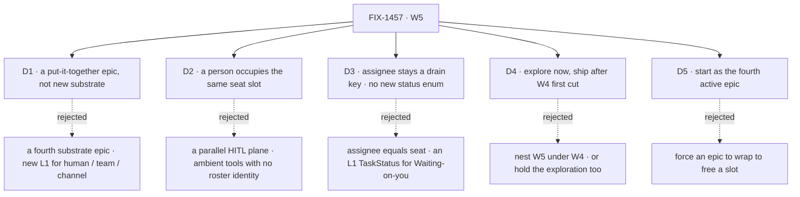

# FIX-1457 · Decisions

[Spec](SPEC.md) · **Decisions** · [Rules](BUSINESS-RULES.md) · [Plan](PLAN.md)

The calls that sit above any single issue in W5: what was chosen, what lost, and what each locks in
for the children under it. Four are the sign-off surface; the fifth records a deliberate process
breach. The exploration's own four walls are **open by instruction** and are listed at the bottom
rather than answered here.

## The tree

## D1 · W5 is a put-it-together epic on Workforce L2, not a fourth substrate epic

| | |
|---|---|
| **Instead of** | A fourth substrate epic that adds the L1 a composition turns out to want · or a second Collab epic dressed as W5 |
| **Because** | The feature-complete bar is W3 closed, W4 first cut shipped, org never optional, and Labs running without special wrappers. That bar is a claim about what already exists. A fourth substrate epic would move the bar instead of testing it, and nothing would ever have proved the first three |
| **Locks in** | Every child composes existing pieces. A child that finds it needs new L1 has found a **gap in W3 or W4**, and comments up on this PR rather than building it here ([ER-5](BUSINESS-RULES.md), [ER-17](BUSINESS-RULES.md)) |

**What would change my mind:** the exploration finding that a human seat cannot be expressed in the
existing seat slot at all. Then W5's first spine point is substrate work and belongs in a W4
follow-on, not here.

## D2 · A person occupies the same seat slot an agent does

| | |
|---|---|
| **Instead of** | HITL as ambient approval tools with no roster identity · a parallel human work plane beside boards and seats · human-only side boards agent seats cannot see |
| **Because** | The thing an org needs from a human step is **assignment and accountability**, and both are properties of the roster. A human step that lives outside the roster is invisible to inventory, to channel membership, and to the manager queue — so it can be assigned but not tracked. One slot means the queue does not care which kind of thing drains a row |
| **Locks in** | Human seats appear in inventory, hold channel membership, and claim or receive board rows like any seat. The **drain UX** differs — Waiting-on-you / approve / edit rather than a model loop — and that is the only difference the substrate sees. FIX-1458 explores **how**, never **whether** |

**What would change my mind:** evidence that the seat slot's obligations (a kind, a flow, a session)
are meaningless enough for a person that satisfying them is pure ceremony. That is one of the
exploration's open walls, and it is the wall that could reach up and change this card.

## D3 · Board assignee stays a drain key, and no L1 enum grows for a human's state

| | |
|---|---|
| **Instead of** | Collapsing board assignee and the Workforce seat registry into one noun · adding `waiting_on_you` and `idle` to L1 `TaskStatus` |
| **Because** | The assignee is *who a row drains to*; the seat is *who exists on the roster*. They resolve to each other and are not the same thing, and a merge is irreversible in a way neither is on its own (the W4 invent-kill stands). **Waiting on you** is already expressible — parked, with a reason and an audience — and **Idle** is seat/session runtime, not a property of the work. A status enum mirroring a UI's columns is a UI leaking into L1 |
| **Locks in** | The human drain story is a **view** over existing status plus seat runtime. Any child that finds itself wanting a new status value has hit a cross-cutting question, not a local one ([ER-8](BUSINESS-RULES.md)) |

## D4 · Explore now; ship after W4's first cut

| | |
|---|---|
| **Instead of** | Nesting W5 under W4 and starting nothing · or holding the exploration along with the ship work |
| **Because** | W5 is a **sibling** of W4, not a child: the W3→W4→W5 chain is a sequence of outcomes, not a containment. Ship work composes the W4 first cut, so building it against a floor still in motion means rebuilding it. The **exploration** composes nothing — it produces a shape — so holding it buys nothing and costs a cycle |
| **Locks in** | FIX-1458 runs now. FIX-1455 and the assemblies cut are **fenced** until the W4 first cut lands. This is a fence on *starting*, not a dependency edge some child can satisfy early ([ER-10](BUSINESS-RULES.md)) |

## D5 · W5 starts as the fourth active epic, against a cap of two

| | |
|---|---|
| **Instead of** | Forcing W3 ([#1718](https://github.com/fixpoint-labs/flow-state-dev/pull/1718)), W4 ([#1905](https://github.com/fixpoint-labs/flow-state-dev/pull/1905)) or LAB-162 ([#1612](https://github.com/fixpoint-labs/flow-state-dev/pull/1612)) to wrap to free a slot |
| **Because** | The board was already at three open epic PRs against a cap of two when W5 was opened. The owner chose the breach on 2026-09-19 rather than wrap an epic early — W5's live work this cycle is a **single exploration**, which is close to free, and forcing a wrap would have cost real closure quality on an epic that isn't finished |
| **Locks in** | The cap is knowingly breached, not forgotten. If W5 ship work starts before two of the four wrap, that is a **second** decision and this card does not cover it |

## Who owns what

Four of the five rules have exactly one live owner. The fifth — **ER-19, the done condition** — has
none, because the only row that could own it is not filed. That cell is drawn as a gap on purpose:
it is [Open 4](#open), and it is the thing about this set most worth arguing with at the gate. A
*consumes* cell is a place a child must not re-decide.

## Decided in review, recorded so no child reopens them

Nothing yet — this is the first draft. Answers to cross-cutting questions raised on this PR land
here.

## What the end-state POC showed

**None was built, and that is a decision rather than an omission.** FIX-1458 *is* the humans-in-seats
exploration: an epic-altitude end-state POC would build the same thing one altitude up, a week
before the child that owns it starts, and against a W4 floor still in motion. The question an
end-state POC answers — *does the division into issues hold once it's all there?* — is also not
answerable yet, because the third row's division is precisely what is undecided ([Open 3](#open)).
**Revisit when** the assemblies cut is made: that is the moment the division becomes a real claim
and a rough end-state could falsify it.

## How it got here

- **Drafted (Sep 19)** — from Jake's three-point spine, the Cycle PM stamp and the Architect EM
  fences on FIX-1457, all locked input. Two children filed, one spine point uncut. D5 records the
  epic-slot breach the same day.

## Open

Four, plus the exploration's own walls.

1. **Nothing in the set names its proof surface.** ER-19 describes what done looks like; no artifact
   runs it. This resolves with Open 3 or it doesn't resolve.
2. **Whether the kitchen-sink rebuild *is* spine point 3.** If it is, the assemblies row closes and
   W5 is two children. The locked input leans this way and stops short of saying it.
3. **The assemblies child cut.** Locked as *"exact child cut for assemblies after W4 first-cut
   lands"* — deliberately open, not a gap in this document.
4. **Who owns the done condition once it is cut** — the assemblies row, or FIX-1455.

**The exploration's four walls stay open by instruction** and are FIX-1458's to lean on, not this
document's to close: human seat as its own kind vs an agent-shaped seat with a `principal:` bind ·
one human ↔ many seats · whether channel members *are* seats or may be unbound principals · how
durable hire persists a human seat (ties FIX-1455). Exploration may lean; **no wall closes without
the owner**.
