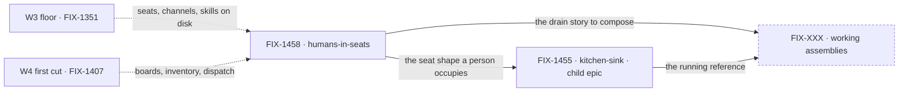

# FIX-1457 · W5: Living Workforce — humans in seats, and something you can run

**Spec** · [Decisions](DECISIONS.md) · [Rules](BUSINESS-RULES.md) · [Plan](PLAN.md)

Epic · 3 spine points, 2 filed children · Workforce: Layer 2 Abstraction · Goal 1 — validate
through real usage

## Four teams, before and after

| A team that… | Today | After this epic |
|---|---|---|
| **needs a person to approve what a seat is doing** | Bolts on an ambient approval tool with no roster identity. Nobody is accountable, and the org can't see who owes it | The person holds a **seat**. The row is assigned to them and waits on them, on the board the agent seats drain |
| **runs a manager queue over a mixed team** | Can only assign to agent seats. A human step falls out of the queue into Slack | The coordinator assigns to a seat. Whether it's a person changes the **drain UX**, not the routing |
| **wants to see Workforce working** | Reads four architecture documents and finds a kitchen-sink demo nothing serves | Clones a reference app that hires a team, opens channels and boards, and still has them after a redeploy |
| **asks what Workforce is feature-complete *for*** | The bar is described in tickets; nothing runs it end to end | A living reference runs the bar — W3 floor, W4 routing, org identity — with no special wrappers |

**Why now.** W3 made a Workforce **describable** and W4 is making work **reach** a seat. Neither
produced something a person can run, and neither answered who the seat is when the seat is a
person. Every consumer that has needed a human in the loop invented an ambient approval tool with
no roster identity — fine until an org has to say *who owes this* and *did they do it*. W5 is where
the substrate stops being substrate. It is deliberately **not** a fourth substrate epic
([D1](DECISIONS.md#d1)).

## What's in the box

The box is a **composition**, not a layer ([D1](DECISIONS.md#d1)). The only genuinely new thing is
the answer to *what a seat is when a person sits in it*, and that answer is being **shaped**, not
shipped, this cycle ([D4](DECISIONS.md#d4)). The dashed band across the middle is the ship fence:
explore crosses it now, ship does not. The bottom strip is what the set refuses to build.

## The set · as of 2026-09-19

The live table. Refreshed on the epic PR as issues move; the plan and the figures point here rather
than repeating it. **A held child epic carries no spec PR of its own here** — it runs its own
lifecycle ([ER-15](BUSINESS-RULES.md)) — and an empty cell in that row is correct, not a gap.

| Issue | What it delivers | Why the set needs it | Status |
|---|---|---|---|
| [FIX-1458](https://linear.app/fixpoint-labs/issue/FIX-1458) · Explore: humans-in-seats | The **shape** of a human seat: the same roster slot, a Waiting-on-you drain, and the four open walls either answered or explicitly left open | Spine point 1, and the gate on the other two — nothing else in the set can be specced until a person in a seat has a shape | **Needs spec** · route `spec` (Design + Feature) · no PR yet · **the one child sanctioned to run now** ([D4](DECISIONS.md#d4)) |
| [FIX-1455](https://linear.app/fixpoint-labs/issue/FIX-1455) · Kitchen-sink rebuild | The reference consumer people copy: durable hire, `CHANNEL.md` seats, boards, inventory, inline vs resource-backed UI | Spine point 2 — the living app the objective is proved in rather than described in | **Held child epic** · own `Epic` label, own child [FIX-1429](https://linear.app/fixpoint-labs/issue/FIX-1429) (a `Bug`) · runs its **own** lifecycle ([ER-15](BUSINESS-RULES.md)) · ship fenced. No spec PR here **by design** |
| FIX-XXX · working assemblies | Reference surfaces composing the W3 floor and the W4 first cut into runnable product shape | Spine point 3, and the only place [ER-19](BUSINESS-RULES.md) — the done condition — can be proved | **Not filed** · the child cut is **undecided** until W4 first cut lands ([Open 3](DECISIONS.md#open)). One row standing for a spine point, **not** a promise of one issue |

**0 done · 1 ready to spec · 1 held child epic · 1 not filed.** W4 (FIX-1407) is *In Development*
and its first cut has **not** shipped, so two of the three rows are fenced and the third is the
whole of this cycle's W5 work.

**Is three really two?** The assemblies row is the one that can collapse: the locked input already
leans against a third demo stack. **Collapse trigger:** an assemblies cut whose every item is
already a FIX-1455 issue — then the row closes and W5 is two children. The reverse risk is live
too, and it is [Open 4](DECISIONS.md#open): today **no filed child owns the epic's done
condition**, because the child that would has not been cut.

## How the issues flow into each other

An edge is what one node hands the next. Dashed **edges** come from other epics and are consumed,
never re-parented. The one dashed **node** is not filed yet. FIX-1455 is solid because it **is**
filed — *held* and *unfiled* are different states, and only the second is a placeholder.

## What stays as it is

- **The OOTB agent kind** ([FIX-1359](https://linear.app/fixpoint-labs/issue/FIX-1359)). Human seats
  compose with it; nothing here rewrites it.
- **Board assignee and L1 task status** ([D3](DECISIONS.md#d3)). Assignee stays a drain key that
  *may* resolve to a seat; Waiting-on-you is *parked + reason/audience*, which already exists.
- **Collab rooms** ([FIX-1341](https://linear.app/fixpoint-labs/issue/FIX-1341)). Parked, and
  explicitly not this epic.
- **The finish-line Labs** — DevForce, CyberForce. W5 teaches the conventions they will run on; none
  of their product lands in the kitchen-sink.
- **Package cohesion, the skills register, the memory story.** Consumed as they are; W5 invents no
  second copy of any.

## Sign off

1. **[D1](DECISIONS.md#d1) · W5 is a put-it-together epic, not a fourth substrate epic.** If wrong:
   a cycle spent composing pieces that turn out to be missing, which surfaces as children asking
   for new L1 and being told no.
2. **[D2](DECISIONS.md#d2) · A person occupies the same seat slot an agent does.** If wrong: the
   epic's first spine point is the wrong shape, and HITL stays an ambient tool with no accountability
   — the exact thing this epic exists to end.
3. **[D4](DECISIONS.md#d4) · Explore now; ship waits on W4's first cut.** If wrong: either W5 ships
   against a moving floor, or the exploration sits idle for a cycle it could have used.
4. **[D5](DECISIONS.md#d5) · W5 starts as the fourth active epic, against a cap of two.** Your call
   on 2026-09-19, recorded so a later reader knows the breach was deliberate. If wrong: four epics
   all move slowly instead of two moving fast.

**Open: four**, two of them structural — the assemblies child cut, and the fact that **no filed
child owns the done condition** ([Open 3 and 4](DECISIONS.md#open)). The exploration's four walls
stay open by instruction. Reasoning and what lost: [DECISIONS.md](DECISIONS.md). The rules every
child obeys: [BUSINESS-RULES.md](BUSINESS-RULES.md). The order the work runs in:
[PLAN.md](PLAN.md).
