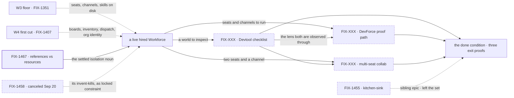

# FIX-1457 · W5: Workforce release QA — Devtool, a DevForce proof, multi-seat collab

**Spec** · [Decisions](DECISIONS.md) · [Rules](BUSINESS-RULES.md) · [Plan](PLAN.md)

Epic · **an open set · no live proof-producer, 3 named gaps** · Workforce: Layer 2 Abstraction ·
Goal 1 — foundation honesty / validate through real usage

> **Recalibrated by the owner on 2026-09-20 (18:05Z).** W5 is **Workforce release QA / polish** —
> get L2 tested and proven ready to ship. The done condition is **three named exit proofs**
> ([D6](DECISIONS.md#d6)), replacing the previous three-surfaces framing. **Kitchen-sink left the
> set** ([D9](DECISIONS.md#d9)); **proof-via-DevForce came in** ([D8](DECISIONS.md#d8)), reversing a
> standing invent-kill. The owner's words for the north star: *"Workforce is feature-complete enough
> that a finish-line Lab (DevForce) can actually build something with seats collaborating across
> channel(s), and Devtool can inspect that world without special wrappers."*

## Four teams, before and after

| A team that… | Today | After this epic |
|---|---|---|
| **is deciding whether Workforce is ready to ship** | "Ready" is a claim standing on architecture documents. Nothing has run a workforce and produced anything | Three named proofs, each pass/fail: the inspector is green, a Lab shipped a real artifact, two seats collaborated |
| **needs to watch what its workers are doing** | Opens a session and reads its stream. There is no roster, no channel list and no board browser — and a parked row's reason is inside a JSON expander | Opens Devtool on a live hired Workforce and reads the roster, the channels, the boards, the inventory and the parked rows, **without a special wrapper** |
| **wants to know a workforce can actually build something** | The Labs have a first build slice and no end-to-end run. Whether seats can ship a work product is untested | One DevForce path completes and hands back a **real artifact** — code, a PR, a work product — with seats and channels used honestly |
| **runs more than one seat** | Multi-seat is a composition the docs describe | ≥2 seats across ≥1 channel: work filed, assigned, drained, and a cross-seat handoff observed |

**Why now.** W3 made a Workforce **describable** and W4 made work **reach** a seat. Both ended in a
claim about what exists. Nothing between them and a launch is more substrate
([D1](DECISIONS.md#d1)) — it is **evidence**, and evidence is what a QA epic produces.

## What's in the box

![What's in the box: the objective is Workforce release QA, and the box holds three named exit proofs — ER-Devtool, a documented Devtool checklist green on a live hired Workforce; ER-DevForce, one DevForce path completing with a real artifact; and ER-Collab, two or more seats across at least one channel filing, assigning, draining and handing off. All three are drawn as empty slots marked NO CHILD because nothing in the set produces any of them yet. Beneath the box sits the unchanged substrate they compose and must not extend: boards, inventory, manager-queue, org identity, dispatch honesty, and the references-versus-resources split FIX-1467 settled. A boundary line reads one user, one org. To the side, kitchen-sink FIX-1455 is drawn outside the box as a sibling epic that left the set. Below, a grow-into-later band, and below a fence, everything the set refuses to build — including the four invent-kills the recalibration added and the one it killed. The figure's aria-label carries every item.](figures/end-state.svg)

**All three slots are empty.** That is what the figure is for: the done condition is three proofs and
not one has a producer. Beneath them is the substrate they compose and may not extend
([ER-4](BUSINESS-RULES.md)). Kitchen-sink sits **outside** the box — a sibling epic, not a member
([D9](DECISIONS.md#d9)).

## The set · as of 2026-09-20

The live table, and **an open one** ([ER-23](BUSINESS-RULES.md)) — the objective names three proofs
with no ticket, shown here as named gaps rather than left out. **Filing a child is the normal course
of this epic, not a re-scope.** Refreshed on the epic PR as issues move.

| Issue | What it delivers | Why the set needs it | Status |
|---|---|---|---|
| FIX-XXX · Devtool checklist | **ER-Devtool** — the six-area checklist green on a live hired Workforce: roster, channels, boards, inventory, parked rows, resources + references, **with no special wrapper** | The inspector is how the other two proofs are observed at all. Without it, "it worked" is asserted from a log | **No child — named gap.** Not filed. **Rows drafted** in [ER-Devtool](BUSINESS-RULES.md#er-devtool) against what the surfaces expose today; **two of six fail as written now**. **Possible collision with [FIX-1320](https://linear.app/fixpoint-labs/issue/FIX-1320)** — Sign-off 1 |
| FIX-XXX · DevForce proof path | **ER-DevForce** — the **thinnest** DevForce path that completes and produces a **real artifact**, seats and channels used honestly | A reference app shows Workforce *can* run. A Lab shipping a work product is the evidence a launch claim rests on | **No child — named gap.** Not filed. First build slice is Done ([FIX-1426](https://linear.app/fixpoint-labs/issue/FIX-1426), [FIX-1410](https://linear.app/fixpoint-labs/issue/FIX-1410)); an end-to-end path has no owner. Scope fenced by [ER-11](BUSINESS-RULES.md) |
| FIX-XXX · multi-seat collab scenario | **ER-Collab** — one graded scenario: ≥2 seats across ≥1 channel, work filed → assigned → drained, and a cross-seat handoff or reply **observed in Devtool** | Multi-seat is the composition W3 and W4 exist to enable and the one nothing has run | **No child — named gap.** Not filed. Composes boards ([FIX-1385](https://linear.app/fixpoint-labs/issue/FIX-1385)), inventory ([FIX-1405](https://linear.app/fixpoint-labs/issue/FIX-1405)), manager-queue ([FIX-1430](https://linear.app/fixpoint-labs/issue/FIX-1430)) |
| [FIX-1467](https://linear.app/fixpoint-labs/issue/FIX-1467) · `references/` vs `resources/` | The isolation convention: read-only handbooks ambient by tree, mutable resources by explicit grant | Settled the noun before anything teaches it. **Not a proving leg** — it never advanced the done condition | **Done · merged 2026-09-20.** Noun is `references/`, migration is `clearShadowedReferences`, grant model settled. **[ER-18](BUSINESS-RULES.md) is met** by it |
| [FIX-1468](https://linear.app/fixpoint-labs/issue/FIX-1468) · `ReadOnlyResourceRef` | A handle type that omits `writeContent` for read-only documents | FIX-1467's deliberately-deferred type change. Additive, independent | **Backlog** · filed 2026-09-20 as a spin-off. **Not a proving leg** |
| [FIX-1469](https://linear.app/fixpoint-labs/issue/FIX-1469) · `goals/` labs migration + KS documents | Decides the `goals/` labs document migration; would give kitchen-sink workforce documents | FIX-1467's deferred step S7. **Its kitchen-sink half is now stale** — it was filed while "upgrade kitchen-sink" was a W5 leg, and that leg left with [D9](DECISIONS.md#d9) | **Backlog** · filed 2026-09-20. **Not a proving leg.** Its KS half belongs to [FIX-1455](https://linear.app/fixpoint-labs/issue/FIX-1455); flagged, not moved |
| ~~[FIX-1458](https://linear.app/fixpoint-labs/issue/FIX-1458)~~ · humans-in-seats | Would have shaped the multi-person org chart | **Canceled 2026-09-20**, [#1955](https://github.com/fixpoint-labs/flow-state-dev/pull/1955) closed unmerged. Kept so a reader sees it was considered and dropped | **Canceled** · not re-specced, not reopened, no longer a child |

**1 done · 2 backlog spin-offs · 3 named gaps with no child · 1 canceled. Zero live proof-producers.**

**Every exit proof has no producer, and the one child that finished was never a proving leg.**
FIX-1467 is Done and it settled a convention; it did not advance the done condition, and saying so
is the point of this row. FIX-1468 and FIX-1469 are its spin-offs and neither is a leg either. So the
honest reading of this table is that W5's staffed work is complete and **its objective has not been
started**. Filing the three gaps is the first thing that has to happen ([Open 1](DECISIONS.md#open)).
**Kitchen-sink is not in this table by design** — FIX-1455 is a sibling epic, soft-related, running
its own lifecycle ([D9](DECISIONS.md#d9), [ER-15](BUSINESS-RULES.md)).

## How the issues flow into each other

An edge is what one node hands the next. **The three dashed nodes in the middle are the named gaps**
— all three inbound edges to the done condition matter equally, and none has an owner. The Devtool
checklist is drawn upstream of the other two because both are *observed in Devtool*, which makes it
the one that cannot be last. Kitchen-sink is dashed and outside the chain: it hands the set nothing
and the set owes it nothing.

## What stays as it is

- **Kitchen-sink** ([FIX-1455](https://linear.app/fixpoint-labs/issue/FIX-1455)) — a **sibling**
  epic on its own lifecycle. Not a child, not in the set, not specced here
  ([D9](DECISIONS.md#d9)).
- **The substrate.** Boards ([FIX-1385](https://linear.app/fixpoint-labs/issue/FIX-1385)), inventory
  ([FIX-1405](https://linear.app/fixpoint-labs/issue/FIX-1405)), manager-queue
  ([FIX-1430](https://linear.app/fixpoint-labs/issue/FIX-1430)), org never optional
  ([FIX-1442](https://linear.app/fixpoint-labs/issue/FIX-1442)), dispatch honesty
  ([FIX-1440](https://linear.app/fixpoint-labs/issue/FIX-1440)). Composed, never re-decided
  ([D1](DECISIONS.md#d1)).
- **CyberForce.** DevForce enters as the proof; the pentest Lab does not this cycle
  ([D8](DECISIONS.md#d8)).
- **Collab rooms** ([FIX-1341](https://linear.app/fixpoint-labs/issue/FIX-1341)), the skills
  register, the memory story, package cohesion.
- **Everything the cancellation deferred** ([Grow into later](DECISIONS.md#later)) — multi-user, an
  org chart of people, originator ≠ reviewer, durable `reviewedBy:`, multi-principal boards. Parked
  with a revisit condition, and **not** open questions.

## Sign off

**The objective gate is owed on this re-cut.** The recalibration is explicit that it is *"Not owner
merge approval… direction for the EM"* — so it sets the direction and does not discharge the gate.
Approving here certifies the objective and the three exit proofs, nothing below them.

**The recalibration answered the previous three asks and they are not carried forward.** The items
it left under *Still open* — the exact Devtool checklist rows, which DevForce artifact counts,
whether CyberForce gets a parallel thin proof this cycle — are explicitly **not blocking EM start on
polish**, so none of them is an ask here. The checklist rows are drafted below as the EM's own work
([ER-Devtool](BUSINESS-RULES.md#er-devtool)).

**One live ask**, and it is here because filing against it is about to commit a cycle's capacity to
the wrong epic.

1. **Does W5 file its own Devtool child, or does ER-Devtool ride
   [FIX-1320](https://linear.app/fixpoint-labs/issue/FIX-1320)?**
   - **Plain terms.** FIX-1320 (*Flow instances first-class*, **Spec Approved**) already owns
     Devtool's instance and session surfaces — its INST-4 is *"Devtool instance list/switch/sessions
     and request inspection,"* and its own text says completion *"requires actual UI verification on
     the real Devtool surface"* and that the proof *"is planned, not run."* Four of ER-Devtool's six
     areas read on exactly those surfaces. Two teams could end up building one inspector.
   - **Trade-off.** Riding FIX-1320 means one Devtool body of work and one UI verification pass, but
     W5's exit proof then depends on an epic W5 does not run, and ER-Devtool's workforce-specific
     rows — inventory, parked-row reasons, references vs resources — are outside FIX-1320's stated
     scope and would have to be added to it. Filing W5's own child keeps the proof in W5's hands and
     risks two passes over the same panel.
   - **Recommendation: ride FIX-1320 for the instance/session surfaces and file a small W5 child for
     the four workforce-specific rows.** FIX-1320's UI verification is unrun and W5 needs it run;
     that is one pass, not two, and the rows it does not cover are genuinely W5's.
   - **What would change my mind:** FIX-1320 slipping past this cycle. Then W5's proof is hostage to
     it, and a self-contained W5 Devtool child is worth the duplication.
   - **If wrong:** one Devtool pass is done twice, or W5's exit proof waits on another epic's
     schedule. Both are real cost; neither is incorrect behaviour.

**Not asked, reported as news.** [D8](DECISIONS.md#d8) — **proof-via-DevForce is in**, and the
invent-kill that said *don't treat W5 as build DevForce* is **dead**; unbounded Lab delivery stays
out. [D9](DECISIONS.md#d9) — kitchen-sink left the set. [ER-18](BUSINESS-RULES.md) is **met** by
FIX-1467's merge. [ER-15](BUSINESS-RULES.md) was **rewritten**: this epic drives no child epic.
[D7](DECISIONS.md#d7) (one user, one org) and [D2](DECISIONS.md#d2) (humans are not board drainers)
stand unchanged. **[FIX-1469](https://linear.app/fixpoint-labs/issue/FIX-1469)'s kitchen-sink half is
stale** — flagged for routing to FIX-1455, not moved.

**Open: one**, and it is structural — no exit proof has a producer
([Open 1](DECISIONS.md#open)). Reasoning and what lost: [DECISIONS.md](DECISIONS.md). The rules every
child obeys: [BUSINESS-RULES.md](BUSINESS-RULES.md). The order the work runs in: [PLAN.md](PLAN.md).
