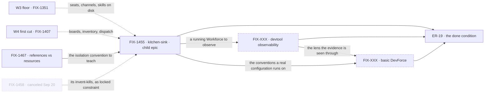

# FIX-1457 · W5: Living Workforce — polish and prove Workforce so it can ship

**Spec** · [Decisions](DECISIONS.md) · [Rules](BUSINESS-RULES.md) · [Plan](PLAN.md)

Epic · **an open set, 2 filed children + 2 named gaps** · Workforce: Layer 2 Abstraction · Goal 1 —
validate through real usage

> **Objective restated by the owner on 2026-09-20.** W5 is *"polishing and proving workforce so we
> can ship it"* — proved on three surfaces: **kitchen-sink** upgraded to show it in action,
> **devtool** improved so a run is observable as it unfolds across channels and workers, and **a
> basic DevForce** running a real workforce configuration ([D6](DECISIONS.md#d6)). The same day the
> owner **canceled** the humans-in-seats explore (FIX-1458 /
> [#1955](https://github.com/fixpoint-labs/flow-state-dev/pull/1955)) and set the boundary at
> **one-user-org / agent isolation** ([D7](DECISIONS.md#d7)). **The set is expected to grow**; two of
> the three surfaces have no child yet.

## Four teams, before and after

| A team that… | Today | After this epic |
|---|---|---|
| **is deciding whether Workforce is ready to adopt** | Reads four architecture documents. Nothing shows a Workforce running, so "ready" is a claim with no artifact behind it | Sees one running: a reference app with a hired team, watched live, plus a real configuration doing real work |
| **wants to see Workforce working** | Finds a kitchen-sink demo nothing serves | Clones a reference app that hires a team, opens channels and boards, and still has them after a redeploy |
| **needs to watch what its workers are doing** | Reads an NDJSON trace afterwards and infers what happened across channels and seats | Watches the run unfold in devtool — channels, workers, and the activity moving between them |
| **needs a seat to reach the right documents and no others** | Whitelists one `resources:` list per seat by hand; handbooks and mutable state share a noun | Handbooks are ambient down the tree and read-only; mutable resources stay an explicit grant |

**Why now.** W3 made a Workforce **describable** and W4 made work **reach** a seat. Both are claims
about what exists, and neither has been demonstrated end to end — so what stands between Workforce
and a launch is not another substrate epic ([D1](DECISIONS.md#d1)) but **evidence**.

## What's in the box

![What's in the box: the objective is to prove Workforce is shippable, on three surfaces — kitchen-sink upgraded to show it in action, devtool improved so a run is observable as it unfolds across channels and workers, and a basic DevForce running a real workforce configuration. Two of the three are drawn as empty slots because no child produces them yet. Underneath sits the living assembly they are all views of: durable hire, channels, seats, boards and inventory, plus agent isolation, where read-only handbooks are ambient down the tree and mutable resources need an explicit grant, plus park-and-answer, where a seat parks a row and the person answers through a flow action carrying the request's own principal. A boundary line marks the scope as one user and one org. Below it a band of work deferred to later, revisited when multi-user or sign-off pain is real, and below a fence the list of what the set refuses to build. The figure's aria-label carries every item.](figures/end-state.svg)

The top band is the objective as three artifacts, and **two of the three are drawn as empty slots** —
nothing in the set produces them, which is the most important thing this figure says. Beneath them
is the one running thing they are all views of. The boundary line is the scope cut
([D7](DECISIONS.md#d7)). **Grow into later** is deferred with a revisit condition, not refused; only
the bottom strip is refused outright.

## The set · as of 2026-09-20

The live table, and **an open one** ([ER-23](BUSINESS-RULES.md)) — the objective names work that has
no child yet, shown here as named gaps rather than left out. Refreshed on the epic PR as issues move.
**A held child epic carries no spec PR of its own here** — it runs its own lifecycle
([ER-15](BUSINESS-RULES.md)) — and an empty cell in that row is correct, not a gap.

| Issue | What it delivers | Why the set needs it | Status |
|---|---|---|---|
| [FIX-1467](https://linear.app/fixpoint-labs/issue/FIX-1467) · Explore: `references/` vs `resources/` | The split that makes **agent isolation declarable**: read-only handbooks ambient by tree, mutable resources by explicit grant | The reference app **teaches whichever noun wins** — it cannot be rebuilt against one about to be renamed ([ER-18](BUSINESS-RULES.md)) | **Spec in review** · route `spec` · spec [#1957](https://github.com/fixpoint-labs/flow-state-dev/pull/1957) |
| [FIX-1455](https://linear.app/fixpoint-labs/issue/FIX-1455) · Kitchen-sink rebuild | **Surface 1** — the reference consumer people copy: durable hire, `CHANNEL.md` seats, channels, boards, inventory | Workforce seen in action, in something a person can clone and run | **Held child epic** · own `Epic` label, own child [FIX-1429](https://linear.app/fixpoint-labs/issue/FIX-1429) · runs its **own** lifecycle · Backlog; ship fence lifted 2026-09-20, no ship ticket opened. No spec PR here **by design** |
| FIX-XXX · devtool observability | **Surface 2** — a run **observable as it unfolds**: channels, workers, and the activity between them, watched live rather than reconstructed | Without it, "Workforce works" is asserted from log files. It is also how the other two surfaces get tested at all | **No child — named gap.** Not filed, no owner. The nearest prior work ([FIX-1071](https://linear.app/fixpoint-labs/issue/FIX-1071)) is Done and its surface was **removed** by [FIX-1308](https://linear.app/fixpoint-labs/issue/FIX-1308) |
| FIX-XXX · basic DevForce | **Surface 3** — one real configuration running one genuine task end to end, watched doing it | A reference app is a demo; a Lab doing real work is the evidence a launch claim rests on | **No child — named gap.** Not filed. The first build slice **is Done** ([FIX-1426](https://linear.app/fixpoint-labs/issue/FIX-1426)); *basically working* has no owner. **Tension with locked input** — [D6](DECISIONS.md#d6), [ER-11](BUSINESS-RULES.md) |
| ~~[FIX-1458](https://linear.app/fixpoint-labs/issue/FIX-1458) · Explore: humans-in-seats~~ | Would have shaped the **multi-person** org chart — people bound to principals, an audience routing between them | **Canceled by the owner 2026-09-20**, spec [#1955](https://github.com/fixpoint-labs/flow-state-dev/pull/1955) closed unmerged. Kept so a reader sees it was considered and dropped. **What it invented against survives** as [D2](DECISIONS.md#d2); what it would have built is [deferred](DECISIONS.md#later) | **Canceled** · not re-specced, not reopened, no longer a child |

**0 done · 1 spec in review · 1 held child epic · 2 named gaps with no child · 1 canceled.**

**Two thirds of the done condition has no owner.** [ER-19](BUSINESS-RULES.md) names three artifacts;
one has a producer. That is not a gap in this document — it is the state of the epic, and filing the
two gaps is the first thing that has to happen for W5 to be deliverable
([Open 1](DECISIONS.md#open)). The earlier *working assemblies* placeholder is **resolved into these
two rows**: the assemblies were always whatever proves the composition, and the owner has now named
them.

## How the issues flow into each other

An edge is what one node hands the next. The two dashed **nodes** are the named gaps, and **all
three inbound edges to the done condition matter equally** — a set that files neither gap cannot
reach it. The faded node is the canceled explore, drawn because it still hands something forward:
its invent-kills, now [D2](DECISIONS.md#d2), bind FIX-1455 with no child in between. More nodes are
expected.

## What stays as it is

- **The OOTB agent kind** ([FIX-1359](https://linear.app/fixpoint-labs/issue/FIX-1359)) and **board
  assignee / L1 task status** ([D3](DECISIONS.md#d3)) — consumed, not re-decided.
- **Collab rooms** ([FIX-1341](https://linear.app/fixpoint-labs/issue/FIX-1341)) and **CyberForce**.
  DevForce enters as a proving surface; the pentest Lab does not ([D6](DECISIONS.md#d6)).
- **Package cohesion, the skills register, the memory story.**
- **Everything the cancellation deferred** ([Grow into later](DECISIONS.md#later)) — multi-user, an
  org chart of people, originator ≠ reviewer, durable `reviewedBy:`, multi-principal boards. Parked
  with a revisit condition, and **not** an open question.

## Sign off

**The gate is being re-taken.** You approved this set on 2026-09-20, then restated the objective and
re-cut it the same day. The objective moved, so the approval does not carry.

1. **Does "ready to launch Workforce" need all three surfaces, or is the reference app enough?**
   - **Plain terms.** The bar below is that Workforce can be **seen working** three ways: a cloneable
     app, a live view of it running, one real configuration doing real work. The cheaper bar is the
     app alone.
   - **Trade-off.** Three surfaces is what makes "ready" believable to someone outside the team — the
     app shows it *can* run, devtool shows what it is *doing*, DevForce shows it doing something
     worth doing. It is also two bodies of work that do not exist, and it puts the launch a cycle out.
   - **Recommendation: all three, as you framed it** — but file the two gaps before approving, so the
     bar has owners. Twice now this epic has carried a finish line nobody was working toward.
   - **Changes my mind:** a launch date inside this cycle. Then the app alone is the bar, and the
     other two become named launch follow-ups rather than quietly dropped.
   - **If wrong:** we build observability and a Lab slice to prove what the app had already proved.
     Real cost, no incorrect behaviour.
2. **How much DevForce — and does this override the fence that said the Labs are not W5's to build?**
   - **Plain terms.** Locked Architect input says the finish-line Labs stay on the delivery countdown
     and W5 must not become "build DevForce". You have now asked for a basic DevForce inside W5.
     Those disagree, and the newer one is yours.
   - **Trade-off.** A thin configuration — one real task through a real workforce, watched — is proof
     and costs little. A DevForce someone could adopt is a product, and it will eat the epic. That is
     what the fence was protecting against.
   - **Recommendation: the thin configuration, and write the fence down as narrowed rather than
     lifted.** CyberForce stays out; no Lab product lands inside kitchen-sink
     ([ER-11](BUSINESS-RULES.md) keeps that half).
   - **Changes my mind:** DevForce having a customer or a demo date. Then it is a deliverable with its
     own epic, not a proving surface borrowed by this one.
   - **If wrong:** W5 absorbs a Lab and stops being a proving epic — the failure the fence named.
3. **File the two gaps now, or approve the objective first and file after?**
   - **Plain terms.** Two of three surfaces have no ticket. Filing now commits the cycle's capacity;
     approving first keeps the objective settled while the work's shape is argued.
   - **Trade-off.** Filing now means the done condition has owners the day it is written — the
     specific failure this epic has repeated. Approving first is faster and risks a third repeat.
   - **Recommendation: approve the objective and file both in the same pass**, before any ship ticket
     opens. I can surface this; the filing is yours.
   - **Changes my mind:** either gap belonging to another epic — devtool work may sit closer to
     [FIX-1320](https://linear.app/fixpoint-labs/issue/FIX-1320).
   - **If wrong:** two tickets exist a cycle early and get re-cut. Cheap.

**Not asked, reported as news.** [D7](DECISIONS.md#d7) — one user, one org, multi-human deferred — is
your boundary, recorded not re-litigated. [D2](DECISIONS.md#d2) — humans are **not** board drain
seats — is a **locked constraint**, no longer a fork: the cancellation removed the child that would
have explored it. [D5](DECISIONS.md#d5) was your call on 2026-09-19.
[D3](DECISIONS.md#d3) is **consumed from W4 with no re-gate**.

**Open: two**, the first structural — two thirds of the done condition has no owner
([Open 1](DECISIONS.md#open)) — plus FIX-1467's own walls ([ER-18](BUSINESS-RULES.md)). Reasoning and
what lost: [DECISIONS.md](DECISIONS.md). The rules every child obeys:
[BUSINESS-RULES.md](BUSINESS-RULES.md). The order the work runs in: [PLAN.md](PLAN.md).
