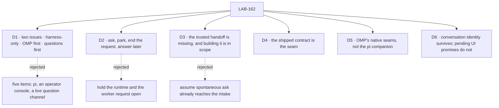

# LAB-162 · Decisions

[Spec](SPEC.md) · **Decisions** · [Rules](BUSINESS-RULES.md) · [Plan](PLAN.md)

The calls that sit above either issue: what was chosen, what lost, why, and what each locks in for
LAB-163 and LAB-164. Three are the sign-off surface. The rest were settled in review and are
recorded here so no child reopens them.

## The tree

## D1 · Two issues, harness-only: OMP first, questions first

| | |
|---|---|
| **Instead of** | Five work items — a pi harness, an in-editor operator console, a live question channel, notifications, tool approvals |
| **Because** | The console duplicates a surface [LAB-151](https://linear.app/fixpoint-labs/issue/LAB-151) owns and a decision [D-9](https://linear.app/fixpoint-labs/issue/FIX-1309) already made. Operator-approved tool execution is its own outcome, not free plumbing falling out of question delivery. There is no pi audience waiting; there is an OMP one |
| **Locks in** | Tool permissions stay host policy across the set. Pi is deferred, not refused. An adapter that ships alone does **not** discharge this epic — LAB-164 carries the outcome |

**What would change my mind:** an immediate pi audience, or evidence that tool approvals — not
questions — are what stalls real runs. Then the set's shape changes, not one issue's design.

## D2 · One human-wait model: ask, park, the request ends, answer starts a later attempt

| | |
|---|---|
| **Instead of** | Holding the runtime and the worker request open while a person thinks — `ctx.suspend`, a live RPC dialog awaited across the wait, a bespoke HTTP answer channel |
| **Because** | [FIX-1241 / D-1](https://linear.app/fixpoint-labs/issue/FIX-1241) ([record #1429](https://github.com/fixpoint-labs/flow-state-dev/issues/1429)) decided this already, and both inspected runtimes keep pending RPC UI requests in process memory — so a live dialog could not be a durable wait even if we wanted one. `announce` follows parking; it is a post-park notification, not a mid-run channel |
| **Locks in** | The manager stays authoritative for task and inbox state; the adapter only supplies evidence. A live RPC dialog is a runtime seam, never the wait. Tool approvals and extension UI are not operator questions and never enter the parked-question path — they follow the host's configured allow/deny policy |

## D3 · The trusted question handoff is missing today, and building it is in scope

| | |
|---|---|
| **Instead of** | Assuming spontaneous ask already reaches the manager, or routing it through prompt parsing, an invented fixed filename, or a question hidden in `finalMessage` |
| **Because** | The existing intake reads an attempt-keyed ask marker *after* the harness returns, and parks only when the handle is `completed` and that attempt has a question. A throw, a cancellation, a deadline abort or a non-completed handle does not take that arm — so a runtime stop cannot be relabelled as completion to make parking happen. Nothing puts an OMP question in that marker today |
| **Locks in** | LAB-164 owns the handoff and specifies it **jointly with LAB-163 before either affected interface is finalized**. The manager supplies the attempt-correlated destination through a trusted path or callback. The feasibility check first tests preserving the single marker intake plus an orderly completed harness step; if that is not honest or viable, the change returns here under D4 |

## D4 · The shipped harness contract is the seam; a change to it returns here

| | |
|---|---|
| **Instead of** | A private OMP-only seam beside the contract, or either issue widening it locally |
| **Because** | `packages/core/src/types/harness.ts` owns the contract; `packages/harness-manager` owns the slot and manager policy. Two authorities over one seam is what the manager was extracted to prevent |
| **Locks in** | Model-visible input stays prompt-only; cwd, resume and other run configuration travel the trusted channel. Session identity is reported through `onSession` during the run. `HarnessRunOutcome` is the terminal signal, not a process exit or an RPC acknowledgement. Any contract or intake change beyond D3's handoff returns here before either issue assumes it |

## D5 · OMP is a runtime, not a renamed pi executable

| | |
|---|---|
| **Instead of** | Porting the old file-mailbox companion, or building a shared pi/OMP abstraction over two runtimes we support one of |
| **Because** | Source inspection identifies `--mode rpc-ui` as the native-ask path; plain `rpc` carries extension dialogs but does not enable the native ask tool. Installed OMP 18.1.14 registered `ask` in a local `rpc-ui --tools ask` probe. The mode distinction rests on source, not on a local negative control — a strong lead, not a settled fact |
| **Locks in** | Runtime translation stays inside the OMP harness. Completion and cancellation events are OMP-specific, not interchangeable with pi's. The package name and adapter API belong to LAB-163's spec, not a speculative two-runtime layer |

## D6 · Conversation identity survives a restart; pending UI promises do not

| | |
|---|---|
| **Instead of** | Answering the original UI response id after a restart, or trusting a reported session path as proof that history was persisted |
| **Because** | Both runtimes hold outstanding RPC UI requests in process memory, so an old response id is unanswerable once the process is gone. Worse, a runtime can silently create a *new* session at an explicitly missing path — which looks like success and is the failure this epic exists to avoid |
| **Locks in** | The durable answer continues the recorded conversation in a **new attempt**. Resume lookup fails closed on missing, corrupt or mismatched material. Neither a reported path nor an in-memory id is evidence that resumable history exists |

## Who owns what

![Who owns what: seven cross-cutting rules by three columns, the epic LAB-162 and its two issues LAB-163 and LAB-164. LAB-163 builds dispatch and observation, cancellation, and same-session resume; LAB-164 consumes them. LAB-164 decides the trusted question handoff and LAB-163 co-specifies it, the one row with two authors. LAB-164 builds durable parking and decides what counts as a real question; LAB-163 consumes both. The epic itself decides that a harness-contract or question-intake change returns to it, and both issues consume that.](figures/ownership.svg)

Every rule has one owner. **ER-4 is the one row with two authors, on purpose** — LAB-164 decides
it, LAB-163 co-specifies it, and that joint seam is the work this epic exists to do (D3). A cell
that reads *consumes* is a place that child must not re-decide.

## Decided in review, recorded so no child reopens them

- **Live-blocked human wait is out** (must fix). It conflicts with D-1. Preserved as ask → durable
  park → the request ends → answer → same-session continuation. No worker suspension.
- **The in-editor console is out** (must fix). It conflicts with D-9 and with LAB-151's ownership.
  The owner selected harness-only; the console and notification items were removed.
- **The runtime-captured question has no trusted route to the intake** (must fix). Named as
  missing, with its owner, gates and escalation boundary. No child may claim the seam ships.
- **Tool authorization is a separate outcome** (should fix). Questions first; approvals removed
  from the outcome and from acceptance.
- **[FIX-1246](https://linear.app/fixpoint-labs/issue/FIX-1246) is not closed or superseded here**
  (should fix). It owns the broader substrate same-session POC; this epic adds OMP-specific
  capture/stop evidence and reuses its continuity standard. **Restarting a process is an
  adversarial condition, not proof** — the session identity and a generated fact must survive it,
  and no fresh-session success satisfies D-1 or FIX-1246.
- **The Claude-only baseline was stale** (should fix). The shipped multi-harness substrate is
  retained; the five placeholder work items became LAB-163 → LAB-164 under LAB-162, sharing the
  Development Workflow Orchestration project and the OMP proof milestone.
- **The negative persistence claim needed an evidence field** (note). Post-stop `ENOENT` checks
  were added; `rpc-ui --tools ask` is the local check, and source inspection the basis for the
  mode distinction.
- **Runtime audience: OMP first, pi deferred.** Reopen for an immediate pi audience, not because
  the protocol names look alike.

Two rounds were spent, on independent coherence, restraint, correctness and completeness lenses
over frozen inputs. The second reviewed the revised proposal before the final owner scope cut, so
it is not a clean verdict on the current bytes. Completeness found the revised objective complete
*at epic altitude* — not implemented. **No third round and no full-runtime pass is claimed.**

## What the end-state POC showed

**Built:** the original throwaway pi probes, plus a model-free RPC dialog probe run unchanged on
installed pi 0.85.1 and OMP 18.1.14, and a separate OMP `rpc-ui` registration check.
**See it:** [`spec-poc/epic-pi-harness/`](../../../spec-poc/epic-pi-harness/README.md) on this
branch, with its `runtime-check/` evidence files.
**Showed:** both runtimes answered the same `extension_ui_request` confirmation over stdio, and
OMP exposed native `ask` under `rpc-ui`. Post-stop filesystem checks found neither reported probe
session file. No model-driven ask, tool authorization, durable park, restart-resume or assembled
manager loop was proved — those seams are available, not demonstrated.
**Changed:** OMP went first; the console, the bespoke answer transport and live-held human wait
were cut; and the full-path proof stayed an explicit requirement rather than becoming a claimed
result.

Runtime comparison and evidence boundaries

| Concern | OMP | Upstream pi | Evidence |
|---|---|---|---|
| Headless control | `rpc` and `rpc-ui` over stdio | `rpc` over stdio | Source; both launched locally |
| Spontaneous ask | Native `ask`, enabled in `rpc-ui` | No native ask; a registered question tool is needed | Source; OMP registration checked locally |
| Extension confirmation | `extension_ui_request` / response | Same round-trip shape | Executed locally on both |
| Saved-session continuation | Explicit file + later prompt | Explicit file + later prompt | Source only; no restart-resume proof here |
| Terminal completion and cancellation | OMP-specific events and lifecycle | Pi-specific events and lifecycle | Source; not interchangeable |
| Durable human wait | Manager must own it | Manager must own it | Pending RPC maps are process-local |

Pinned source: OMP
[`daf07999`](https://github.com/can1357/oh-my-pi/tree/daf07999c2fee9b22edc7bf8fea1fb6272e0df5e)
and pi
[`b2602be7`](https://github.com/earendil-works/pi/tree/b2602be77cb7b0de45dd616407fd210daa48aa75).
The inspected manifests report 18.1.14 and 0.85.1; matching version strings are not proof that an
installed release contains every inspected main-branch change.

Primary references: [OMP RPC](https://github.com/can1357/oh-my-pi/blob/daf07999c2fee9b22edc7bf8fea1fb6272e0df5e/docs/rpc.md),
[OMP CLI setup](https://github.com/can1357/oh-my-pi/blob/daf07999c2fee9b22edc7bf8fea1fb6272e0df5e/packages/coding-agent/src/main.ts),
[OMP ask](https://github.com/can1357/oh-my-pi/blob/daf07999c2fee9b22edc7bf8fea1fb6272e0df5e/packages/coding-agent/src/tools/ask.ts),
[OMP sessions](https://github.com/can1357/oh-my-pi/blob/daf07999c2fee9b22edc7bf8fea1fb6272e0df5e/packages/coding-agent/src/session/session-manager.ts),
[pi RPC](https://github.com/earendil-works/pi/blob/b2602be77cb7b0de45dd616407fd210daa48aa75/packages/coding-agent/docs/rpc.md),
and [pi sessions](https://github.com/earendil-works/pi/blob/b2602be77cb7b0de45dd616407fd210daa48aa75/packages/coding-agent/src/core/session-manager.ts).

## How it got here

- **Original draft** — a pi harness plus an in-editor operator console and a live question channel.
- **Four-lens review** — found the conflicts with D-1 and D-9, a stale Claude-only baseline and
  unsupported live-wait assumptions; the branch was synced with the shipped harness substrate.
- **Owner scope choices and runtime research** — harness-only, OMP first, pi deferred; five
  placeholder work items replaced by LAB-163 → LAB-164 under LAB-162; the missing durable
  interaction proof made explicit.
- **Final review and owner cut** — tool approvals removed; the missing handoff and its
  completed-handle gate named (D3); FIX-1246 reconciled. The handoff design was deferred to the
  joint feasibility check rather than assumed to ship.
- **Rewritten as a four-document set (Sep 16)** — the same objective, scope and dispositions moved
  into these four documents with three figures. **No decision changed**; the old §1–§5 map onto
  them, and no review round was spent.

**Open: none.**
