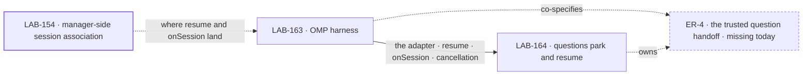

# LAB-162 · OMP coding runs ask, park, and continue

**Spec** · [Decisions](DECISIONS.md) · [Rules](BUSINESS-RULES.md) · [Plan](PLAN.md)

Epic · 2 issues · Development Workflow Orchestration · [LAB-162](https://linear.app/fixpoint-labs/issue/LAB-162) · [#1612](https://github.com/fixpoint-labs/flow-state-dev/pull/1612), never merged

> `pi-harness` is a historical branch and directory name from when this epic was scoped to
> upstream pi. The epic is OMP-only now. The name stays so the review links on #1612 keep working.

## Four teams, before and after

| A team that… | Today | After this epic |
|---|---|---|
| **wants an OMP run supervised** | The manager offers other harnesses; OMP is not one of its slots | Dispatches OMP through the same contract, in the same checkout, settling the same way |
| **has a run reach a real question** | It guesses, or a person sits watching it | It asks, the task parks, and no worker request is held open while a person thinks |
| **answers a parked coding run** | The surface exists, but a question the runtime raised has no trusted route into it | The same surface carries the answer, with no second inbox and no new verb |
| **needs the run to remember** | A second attempt starts a fresh conversation | The later attempt continues the recorded one, or fails rather than starting fresh |

**Outcome.** A person dispatches an OMP coding run through the harness manager. When it reaches a
real question, it asks and parks. The person answers through the existing operator surface, and a
later attempt continues the same coding conversation rather than starting over.

**Proof.** Dispatch a real OMP run, capture a spontaneous question, durably park the task and end
its attempt, stop the runtime, answer through the existing surface, resume the exact saved session,
and settle. A fact the run generated before the question must survive without being fed back in the
answer prompt. Cancellation stays cancellation; missing or mismatched resume data fails rather than
silently starting fresh.

**Lead measure.** Which parts of that proof have run, against which OMP version. Model-free RPC
compatibility is an available seam, not a completed outcome.

**Not doing.** Upstream pi support; a console or FSD-flow-running extension inside pi/OMP; a
second inbox or answer verb; operator-approved tool execution; worker `ctx.suspend`; holding a
runtime or request open during human wait; a bespoke HTTP answer channel; a shared pi/OMP
abstraction; changes to unrelated harnesses' policy.

**Kill line.** If OMP cannot safely capture a question, stop and persist the conversation, *and*
continue that exact session after an answer, return to the objective gate. Do not substitute live
blocking, fresh-session replay, or adapter-only delivery and call the epic complete. The full
sequence is **unproven**.

**Why now.** The manager already supervises more than one harness, and its question-marker path
already parks and answers. What it has no route for is a question the *runtime* raised mid-run:
the intake reads an attempt-keyed marker after the harness returns, and nothing puts an OMP
question there. So a supervised run either guesses or needs someone watching it — the cost of
every long coding run we dispatch, not a rare edge.

## What's in the box

![What's in the box: a dispatched OMP run is observed and cancelled on the shipped contract, captures a real question as attempt-correlated durable evidence, parks while the attempt and worker request end, and continues the same saved session after an answer. A fence marks that the runtime holds nothing durable and the manager owns the task, the inbox and the answer. Host tool-permission policy is composed in unchanged. The manager, inbox, answer action and operator surface are reused as is. Not built: upstream pi, an operator console, a second inbox or answer verb, operator-approved tool execution, worker suspension or live-held wait, a bespoke HTTP answer channel, a shared pi and OMP layer.](figures/end-state.svg)

The fence keeps this cheap: the runtime holds nothing durable, so there is no second authority over
a parked task and no live process to keep alive while a person thinks ([D2](DECISIONS.md#d2)). The
bottom strip is what the set refuses to build, most of it cut by the owner's scope choices rather
than by discovery.

## The set · as of 2026-09-16

The live table, refreshed on the epic PR as the issues move. The plan and the figures point here
rather than repeating it.

| Issue | What it delivers | Why the set needs it | Status |
|---|---|---|---|
| [LAB-163](https://linear.app/fixpoint-labs/issue/LAB-163) | Dispatch, observe, cancel and resume OMP through the shipped harness contract | Nothing can ask until something can run. Independently useful, and on its own it does not meet the outcome | Backlog · route *spec* · waits on the objective gate · no spec PR yet |
| [LAB-164](https://linear.app/fixpoint-labs/issue/LAB-164) | Captured questions as durable evidence, the park, the answer into the same session — and the full-path proof | The half that meets the outcome. It owns the missing handoff and the only proof that can clear the kill line | Backlog · route *spec* · delivery blocked by LAB-163 · no spec PR yet |

0 done · 0 in flight · 2 filed, both waiting on the objective gate.

**Is two really one?** No, and it is not three either. An adapter alone is genuinely useful and
genuinely insufficient — a supervised OMP run that still cannot ask. Questions without an adapter
have nothing to ask *from*. Splitting further was considered and cut: a transport issue, a
contract-extraction issue and a console were among the original five work items, and review found
them either duplicating shipped substrate or conflicting with decisions already made. No collapse
trigger was named. The **escalation** trigger is [ER-7](BUSINESS-RULES.md): a change to the harness
contract or the manager's question intake returns here before either issue assumes it.

## How the issues flow into each other

A solid edge is what one issue hands the next; a heavy border is done and outside the set. The
dashed node is **not an issue** — it is the seam that does not exist today, which LAB-164 owns and
LAB-163 co-specifies before either affected interface is finalized. Both issues are filed, so
neither is a placeholder.

## What stays as it is

- **The harness manager, the inbox, the answer action and the operator surface.** Reused, not
  extended. [LAB-140](https://linear.app/fixpoint-labs/issue/LAB-140) owns the manager program,
  [LAB-151](https://linear.app/fixpoint-labs/issue/LAB-151) the operator board.
- **Manager-side session association** — [LAB-154](https://linear.app/fixpoint-labs/issue/LAB-154),
  done. LAB-163 supplies OMP's side of `resume`/`onSession` and does not redo that work.
- **Tool permissions**, which stay the host's configured allow/deny policy.
- **Upstream pi.** Deferred, not refused forever — reopened for a real pi audience, not because
  the protocol names look alike.
- **Other harnesses' policy.** Nothing here changes how Claude Code or Codex behave.

## Sign off

1. **[D1](DECISIONS.md#d1) · Two issues, harness-only, OMP first, questions first, now.** If
   wrong: a cycle spent on a runtime audience we don't have, or on plumbing for a tool-approval
   feature nobody asked for. The smaller scope delays pi users and operator-controlled tool
   execution; reconsider when either is an immediate need.
2. **[D2](DECISIONS.md#d2) · One human-wait model — ask, park, end the request, answer later.**
   If wrong: the epic's *scope* changes rather than one issue's design, and
   [FIX-1241 / D-1](https://linear.app/fixpoint-labs/issue/FIX-1241) changes with it.
3. **[D3](DECISIONS.md#d3) · The trusted question handoff is missing, and building it is in
   scope.** If wrong optimistically, LAB-164 shrinks. If wrong the other way, the joint
   feasibility check says so before either interface is committed, and the kill line fires.

**What would change my mind on 1:** an immediate pi audience, or evidence that tool approvals —
not questions — are what blocks real runs.

**Open: none.** Approving this signs off the outcome and the two-issue scope. It approves no
implementation design, and neither issue starts before its own spec gate.
