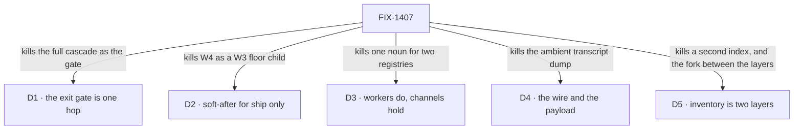

# FIX-1407 · Decisions

[Spec](SPEC.md) · **Decisions** · [Rules](BUSINESS-RULES.md) · [Plan](PLAN.md)

The calls above any single issue: what was chosen, what lost, what each locks in. All five are
**Architect locks carried into this document**, not calls taken here — FIX-1407's *FSD Architect —
EM guidance* section and each child's own fences are the source, and its **Still open** list stays
open except where the Architect has since closed an item himself ([D5](#d5)).

## The tree

Each edge names what the decision killed. The alternative that lost is in the card.

## D1 · The W4 first cut is one hop: channel/org board → seat runs, and assign team seats

| | |
|---|---|
| **Instead of** | Making the full nested cascade — channel/org board → personal board → request board → seat — the exit gate |
| **Because** | The routing claim needs one hop to be true or false. A cascade proves the same thing three times and cannot be finished on a schedule, which is how an epic with a behavioural gate never closes |
| **Locks in** | Nested personal / request decomposition is **phase-2 inside W4**, promoted by a POC that proves need. Three children (FIX-817, FIX-1415, FIX-1430's nested half) sit off the gate. Conversation, DM and transcript stay off the board — they belong to the inventory and ChannelFlow |

Off the gate is not free: a phase-2 child that is still parented holds the epic's **wrap** open
after the gate is met. That is [Open](#open), not a qualification on this card.

## D2 · W4 *ship* tickets are soft-after W3; W4 is not a child of W3

| | |
|---|---|
| **Instead of** | Nesting W4 under W3 · or letting a W4 ship PR merge onto a floor still being edited |
| **Because** | Every W4 child reads the file surface W3 is still closing. Nesting makes one epic that cannot wrap; ignoring the order lands a package format against a `tools:` fence and a `TEAM.md` layer that are still specs |
| **Locks in** | Filing, specs and **parallel POCs run now**. The fence lifts when **every W3 child that carries an implementation is merged to main**; children completed by decision, duplicated or cancelled do not hold it ([ER-14](BUSINESS-RULES.md)). Soft-after / soft-related in Linear, never parent |

## D3 · Workers and seats *do*; channels *hold*. A board assignee key is not a Workforce seat

| | |
|---|---|
| **Instead of** | One noun for both — merging the board's assignee registry with the Workforce roster · or an assignable channel that claims work as an executor |
| **Because** | Different lifetimes, different identity rules. A board assignee is a key on a ledger; a seat is a roster slot that mints a flow instance. Collapsing them means every board row implies a hired seat, and every seat implies a board |
| **Locks in** | The two map **by composition**, per child. No assignable-channel routing, no channel-as-claim-worker, no second `WorkerRegistry`. `defaultWorker` and `assignTask` are composition, not new primitives. **Agent is an opinionated default kind**, not a Layer-1 substrate type, and there are no thin/fat seat labels |

## D4 · Dispatch is the wire; handoff content is the payload policy — not competing forks

| | |
|---|---|
| **Instead of** | Choosing between "pass the parent session" and "pass a brief" · or a silent full parent transcript as the default |
| **Because** | One is mechanism, one is policy, and reading them as a fork is what produces both an ambient dump *and* a second runtime. A sub-agent is same-session background work with a different prompt; a worker assign is a roster seat in a **linked** session. Both need the link; only the second needs a payload rule |
| **Locks in** | Dispatch always passes `parentSessionId`; the child binds its parent **for life at mint**. Parent history reaches a child by **opt-in tools**, never an ambient dump, and a parent's private seat history never auto-bleeds. The default payload is the brief — `goal` / `constraints` / `acceptance` / `links` — plus channel transcript **only if both are on that channel**. **Shipped on FIX-1408**, as a decision rather than code |

**Linked is not nested.** A linked session is a sibling that names its parent. Nothing here
re-legitimizes nested, child or shadow sessions as a work hierarchy:
[FIX-1440](https://linear.app/fixpoint-labs/issue/FIX-1440) removed that substrate and FIX-1408
invent-kills its return. No child reads `parentSessionId` as a session tree.

## D5 · Runtime inventory is **two layers**, and choosing between them is not a fork

| | |
|---|---|
| **Instead of** | A second `WorkerRegistry`, a mega-loader that re-walks the tree differently, or a Graft rebuild for membership and DM lookup — **and** treating read-time compose versus an org-scoped resource as a fork to pick one of |
| **Because** | They answer different questions. The declared tree is what the files say; the live set is what is actually open. A compose helper goes stale the moment a channel mints; a live resource cannot tell you about a seat nobody has opened. Picking one produces the other by accident, badly |
| **Locks in** | **Layer 1 — declared roster, composed at read time.** The duplicated private `LabRoster` in `goals/devforce-lab/lab/host.mts` and `goals/pentest-lab/lab/host.mts` becomes one package-level export over the three existing readers (`readWorkforce`, `readResourcesDirectory`, `readChannelsDirectory`) — derived per read, no state, registers nothing. Both lab copies deleted. FIX-1405, or a thin sibling, owns it. **Layer 2 — runtime inventory** (Jake's lock, 2026-09-16): ChannelFlow updates an org-scoped resource as seats and channels open. It stays FIX-1405's **primary** runtime shape for DM find-or-create, membership and fan-out, and layer 1 does **not** replace it. `team.*` wildcards call layer 2 later, not at first ship |

**Compose is not a registry.** Layer 1 is a function over what the readers already return; the
invent-kill on a second index of truth ([ER-12](BUSINESS-RULES.md)) is unchanged by it.

## Who owns what

![Who owns what: a matrix of six cross-cutting rules against the seven issues in the set. The board is the work plane is built by FIX-1385 and consumed by FIX-1430. One package format is built by FIX-1394 and consumed by FIX-1430. Inventory in two layers is built by FIX-1405 and consumed by FIX-1385, FIX-817 and FIX-1415. The wire and the payload is decided by FIX-1408 and consumed by FIX-1385, FIX-1394 and FIX-1430. Assignee is not a seat is decided by FIX-1385 and consumed by FIX-1394 and FIX-1430. The propagation pass inherited from the project as PR-5 is built by FIX-1385. Every rule has exactly one owner.](figures/ownership.svg)

Every rule has exactly one owner. Read a row to see where a decision is made, where it is built,
and where it is only consumed; a *consumes* cell is a place a child must not re-decide. FIX-1430
consumes four rows and owns none, which is what makes it a proof rather than a surface.

## Decided in review, recorded so no child reopens them

**Round 1 · 2026-09-18**, five reviewers on
[#1905](https://github.com/fixpoint-labs/flow-state-dev/pull/1905).

- **The inventory is two layers, and the fork is dismissed** (Architect) → [D5](#d5),
  [ER-3](BUSINESS-RULES.md). Verified against the code first: `ReadWorkforceResult` is
  `{workers, errors, skillErrors}` only, the three readers are separate exports, and both labs
  hand-roll the same private `LabRoster` — so "one shared scan map" was intent, not an exported
  thing. The compose helper's public export stays on the owner's objective gate.
- **The W3 ship fence has one release condition** (Greptile P1). Three documents stated it three
  ways — *merges*, *no open children*, *close* — which diverge the moment a child closes by
  decision. Now stated once everywhere: every W3 child **that carries an implementation** is merged
  to main.
- **The proof consumes the package *contract*, not the implementation** (Greptile P1, sharpened by
  Codex). The FIX-1394 → FIX-1430 edge is non-blocking with the condition named
  ([the spec](SPEC.md#what-the-proof-consumes)). ER-2 still binds the proof: no third package shape.
- **FIX-1408's unclosed walls are owned, not orphaned.** Reuse-vs-create session policy, auto-scale
  / busy-copy, hire-or-dispatch-with-parent naming, which opt-in history packs are v1, and how a
  sub-agent's background work surfaces on a board row: **FIX-1394's POC owns the evidence, this
  epic owns the decision**. FIX-1408 is not reopened, and no child decides one locally
  ([ER-15](BUSINESS-RULES.md)).
- **FIX-1385 owns ER-19**, the project's PR-5 propagation pass — it mints the largest new Layer 2
  vocabulary surface in the set.

## What the end-state POC showed

**None built.** The division into issues came from the Architect's ownership carve rather than a
sketch, and four of the seven children are themselves POC-first. If the gate wants the division
tested first, the question one would answer is whether the package format and the board's assign
surface are really two issues.

## Open

**Seven children, or five?** *(Decides: the owner. Blocks: nothing today — it decides when the epic
can wrap.)*

- **The fork.** Keep all seven parented — or cut to five (FIX-1394, FIX-1405, FIX-1385, FIX-1408
  done, FIX-1430 as the proof) and re-home FIX-817 and FIX-1415 as related-not-child, dependency
  links preserved?
- **In plain terms.** The epic promises one behaviour: work filed for a team reaches a seat that
  runs it. Three issues build it, one demonstrates it, one is already done. The other two — a
  catalog an agent reads to plan, and letting a seat create and invite to channels — are real work
  in the same area that the promise does not need.
- **The trade-off.** Not "phase-2 costs nothing", which is what an earlier draft of this document
  implied and what one reviewer argued from. **The exit gate and the wrap are different moments**
  ([the spec](SPEC.md#the-set--as-of-2026-09-18) has the mechanism). Keeping seven means W4 proves
  what it set out to prove and then stays open, indefinitely, on two children it does not need.
  Cutting to five means W4 wraps when it hits its gate.
- **My recommendation: five.** An epic that cannot close after meeting its own exit gate has the
  wrong boundary, and both children fence themselves off a ship by their own Architect sections
  anyway.
- **What would change my mind.** The objection to splitting is that FIX-1405 would then have two
  dependent epics. That is answerable: FIX-817 and FIX-1415 are phase-2 *after* FIX-1405 lands, so
  the second dependent consumes shipped code, not a concurrent epic. What would actually change my
  mind is wanting one epic to hold the whole channel/board/inventory arc as a tracking unit, and
  being willing to pay for it with a W4 that stays open past its gate.
- **If wrong.** Cutting when you should have kept costs two re-parented issues and a dependency
  link to redraw — a tracker edit. Keeping when you should have cut costs the epic's finish: it
  sits open for as long as two phase-2 children take, and every wrap check reports it as live work
  when it is not.
