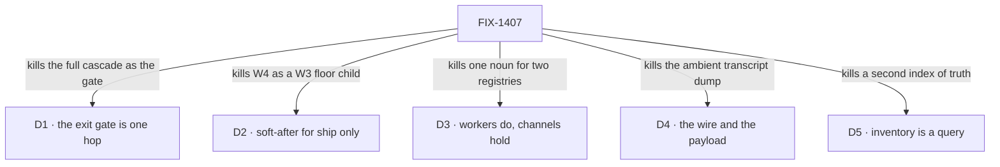

# FIX-1407 · Decisions

[Spec](SPEC.md) · **Decisions** · [Rules](BUSINESS-RULES.md) · [Plan](PLAN.md)

The calls that sit above any single issue: what was chosen, what lost, and what each locks in for
the seven issues under it. Three are the sign-off surface. All five are **Architect locks carried
into this document**, not calls taken here — FIX-1407's *FSD Architect — EM guidance* section and
each child's own fences are the source, and its **Still open** list stays open
([below](#open)).

## The tree

Each edge names what the decision killed. The alternative that lost, and why, is in the card.

## D1 · The W4 first cut is one hop: channel/org board → seat runs, and assign team seats

| | |
|---|---|
| **Instead of** | Making the full nested cascade — channel/org board → personal board → request board → seat — the exit gate |
| **Because** | The routing claim only needs one hop to be true or false. A cascade proves the same thing three times and cannot be finished on a schedule, which is how an epic with a behavioural gate never closes |
| **Locks in** | Personal / request nested decomposition is **phase-2 inside W4**, promoted by a POC that proves need, not by default. Three children (FIX-817, FIX-1415, and FIX-1430's nested half) sit off the gate and gate nothing. Conversation, DM and transcript stay off the board entirely — they belong to the inventory and ChannelFlow |

**What would change my mind on the objective:** evidence that one hop is already possible today by
composition, so the set is documenting rather than building. Then W4 is a docs pass with an
inventory attached, and the shape is wrong.

## D2 · W4 *ship* tickets are soft-after W3; W4 is not a child of W3

| | |
|---|---|
| **Instead of** | Nesting W4 under W3 as a floor child · or letting a W4 ship PR merge onto a floor still being edited |
| **Because** | Every W4 child reads the file surface W3 is still closing. Nesting makes one epic that cannot wrap; ignoring the order means a package format lands against a `tools:` fence and a `TEAM.md` layer that are still specs |
| **Locks in** | Filing, specs and **parallel POCs run now** on every child. No W4 *ship* PR merges while W3 has open children — today FIX-1377, FIX-1416, FIX-1435 and FIX-1441 ([ER-14](BUSINESS-RULES.md)). The relation is soft-after / soft-related in Linear, never parent |

## D3 · Workers and seats *do*; channels *hold*. A board assignee key is not a Workforce seat

| | |
|---|---|
| **Instead of** | One noun for both — merging the board's assignee registry with the Workforce roster · or an assignable channel that claims work as an executor |
| **Because** | They are different lifetimes with different identity rules. A board assignee is a key on a ledger; a seat is a roster slot that mints a flow instance. Collapsing them means every board row implies a hired seat, and every seat implies a board |
| **Locks in** | The two map **by composition**, per child. No assignable-channel routing, no channel-as-claim-worker, no second `WorkerRegistry`. `defaultWorker` is triage composition and `assignTask` is composition, not new primitives. Also locked: **Agent is an opinionated default kind**, not a Layer-1 substrate type, and there are no thin/fat seat labels |

## D4 · Dispatch is the wire; handoff content is the payload policy — they are not competing forks

| | |
|---|---|
| **Instead of** | Choosing between "pass the parent session" and "pass a brief" · or a silent full parent transcript as the default |
| **Because** | One is mechanism and one is policy, and reading them as a fork is what produces both an ambient dump *and* a second runtime. A sub-agent is same-session background work with a different prompt; a worker assign is a roster seat in a **linked** session. Both need the link; only the second needs a payload rule |
| **Locks in** | Dispatch always passes `parentSessionId`, and the child binds its parent **for life at mint**. Parent history reaches a child through **opt-in tools**, never an ambient dump, and a parent's private seat history never auto-bleeds. The default payload is a required brief — `goal` / `constraints` / `acceptance` / `links` — plus channel transcript **only if both are on that channel**, and opt-in named packs. A channel session and a parent worker session may coexist with separate tool packs. **Shipped on FIX-1408**, as a decision rather than as code |

## D5 · Runtime inventory is an L2 *query* over the one shared scan, never a second registry

| | |
|---|---|
| **Instead of** | A parallel mega-index of seats and channels · a second `WorkerRegistry` · rebuilding Graft for membership and DM lookup |
| **Because** | The shared Workforce map already exists and one scan already fills it. A second source of truth is a staleness bug with a schedule, and it is the thing three of this epic's children would each be tempted to build separately |
| **Locks in** | Inventory reads that map plus hire, `channelInstances` and open sessions. FIX-817's manifests read the same surface rather than building their own; FIX-1415's invite / find consumes it. `team.*` wildcards are a **later caller**, not part of the first ship, and do not block the channels convention. **The owner's stamped lean** is that ChannelFlow maintains an org-scoped resource — a lean, not a close: helper-vs-resource, eager-vs-lazy expansion, and DM as shared-kind-session vs special lane all stay on the [Still open](#open) list |

## Who owns what

![Who owns what: a matrix of six cross-cutting rules against the seven issues in the set. The board is the work plane is built by FIX-1385 and consumed by FIX-1430. One package format is built by FIX-1394 and consumed by FIX-1430. One runtime lookup is built by FIX-1405 and consumed by FIX-1385, FIX-817 and FIX-1415. The wire and the payload is decided by FIX-1408 and consumed by FIX-1385, FIX-1394 and FIX-1430. Assignee is not a seat is decided by FIX-1385 and consumed by FIX-1394 and FIX-1430. The last row, the propagation pass inherited from the project as PR-5, has no owner in the set and is drawn as a single gap spanning every column.](figures/ownership.svg)

Every rule in the set has one owner, with one exception drawn as a gap: **ER-19, the project's
PR-5 propagation pass, is assigned to this epic at project altitude and to no child in it**. Read
a row to see where a decision is made, where it is built, and where it is only consumed; a
*consumes* cell is a place a child must not re-decide. FIX-1430 consumes four rows and owns none,
which is what would make it a proof.

## Decided in review, recorded so no child reopens them

Nothing yet — this is the epic-spec's first dispatch and the PR has had no review. Cross-cutting
answers land here as they arrive, under [ER-15](BUSINESS-RULES.md).

## What the end-state POC showed

**No end-state POC has been built.** The division into issues came from the Architect's child
ownership carve rather than from a sketch, and four of the seven children are themselves
POC-first — FIX-1394 explicitly so. If the gate wants the division tested before any of it starts,
an end-state POC on this branch is the instrument, and the question it would answer is whether the
package format and the board's assign surface are really two issues.

## Open

**1. Does the set ratify at seven — and is FIX-1430 the epic's proof?**
*(Decides: the owner. Blocks: nothing today; it decides what the epic promises and when it can
wrap.)*

- **The fork.** Keep all seven with two marked phase-2 and FIX-1430 adopted as the proof — or cut
  the epic back to the four the body names, and let FIX-817 and FIX-1415 stand on their own?
- **In plain terms.** The epic promises one behaviour: work filed for a team reaches a seat that
  runs it. Three of the seven issues build that. One (FIX-1430) is the only thing that would
  *demonstrate* it, and right now the epic has a behavioural promise and nothing that checks it.
  The other two — a catalog an agent can read to plan, and letting a seat create and invite to
  channels — are real work that serves the same area but not the promise; both tickets fence
  themselves off a ship until other things land.
- **The trade-off.** Keeping seven means one epic owns the whole routing surface, its two
  phase-2 children stay next to the inventory they read, and a reader sees the real backlog. It
  also means a set with three of seven on the path to its own gate — the shape where a tail grows
  while the proof never starts, which is exactly what W3's necessity check was watching. Cutting
  to four keeps the epic honest about what it promises, and costs two issues re-homed with no
  epic holding their shared dependency on FIX-1405.
- **My recommendation: keep seven, mark FIX-817 and FIX-1415 phase-2 explicitly, and adopt
  FIX-1430 as the proof.** A behavioural exit gate with no child that runs it is the defect worth
  fixing here; FIX-1430 already describes exactly the gate's one hop, and its own nested-board half
  is already fenced to phase-2 by its Architect section. The two phase-2 children cost nothing
  while they gate nothing, and splitting them from FIX-1405 would put one manifest surface in two
  epics — which is what [D5](#d5) exists to prevent.
- **What would change my mind.** If you want W4 to wrap fast on the three named issues, cut it to
  four: the proof can be a fifth issue filed against the gate rather than an existing showcase
  adopted into the role. And if FIX-1430 is intended as a DevForce Lab artefact rather than a
  framework proof, adopting it makes the epic's finish depend on a Lab's schedule.
- **If wrong.** Two issues sit in an epic that wraps before they start, and get re-parented — a
  tracker edit. Or the epic wraps on three shipped surfaces with nothing having run them, which is
  the more expensive half, because "work routes to a seat" would be a claim rather than a result.

**2. Who owns FIX-1408's unclosed walls?** *(Decides: the owner, with the Architect. Blocks:
nothing today; it decides where the reuse-vs-create policy lands.)* FIX-1408 closed as **Done**
with its *locked distinctions* recorded ([D4](#d4)) and its own open walls untouched:
reuse-vs-create session policy after POC, auto-scale / busy-copy behaviour, the
hire-or-dispatch-with-parent API naming, which opt-in history packs are v1, and how a sub-agent's
background work surfaces on a board row. Those are cross-cutting — FIX-1394's and FIX-1430's POCs
both press on them — and they now have no owning issue. **Recommendation:** let FIX-1394's POC
matrix answer reuse-vs-create and record the answer here, rather than re-opening a closed ticket.
**If wrong:** the first child to hit it decides locally, which is the second-authority failure
[ER-15](BUSINESS-RULES.md) exists to prevent.

**3. The project's PR-5 propagation pass is assigned to this epic and to no child in it.**
*(Decides: the owner. Blocks: nothing.)* The project spec
([#1818](https://github.com/fixpoint-labs/flow-state-dev/pull/1818)) names FIX-1407 as PR-5's
owner — *a new surface uses the settled Layer 2 name, never the superseded one* — checked at "the
propagation pass". No child in the set carries that work, and the epic body does not mention it.
Recorded as [ER-19](BUSINESS-RULES.md) with no owner rather than quietly dropped. It is a gap, not
a refusal; nothing in the set is blocked by it.

## How it got here

- **Stood up (Sep 18)** — four documents from FIX-1407's D-4 body and its Architect EM guidance,
  plus each child's own fences. No product direction was added: the exit gate, the sequencing, the
  vocabulary and every invent-kill are carried, and the Architect's **Still open** list is carried
  open.
- **The set was written as seven, not four (Sep 18)** — FIX-817, FIX-1415 and FIX-1430 are
  parented in Linear but absent from the epic body. Recorded in the set table with the split
  visible, and put to the gate as Open 1 rather than resolved on the branch.
- **FIX-1408 recorded as done-by-decision (Sep 18)** — no implementation PR; its locked
  distinctions became D4 and ER-4, and its unclosed walls became Open 2.
