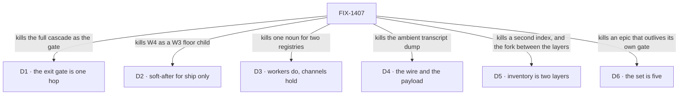

# FIX-1407 · Decisions

[Spec](SPEC.md) · **Decisions** · [Rules](BUSINESS-RULES.md) · [Plan](PLAN.md)

<!-- EDITING NOTE. Three phrases in this set read like colour and are load-bearing; an
     editorial pass on 2026-09-19 cut all three and had to restore them on review.
     In this file: D3's "and there are no thin/fat seat labels" (a lock, not a flourish)
     and D5's two concrete paths goals/devforce-lab/lab/host.mts and
     goals/pentest-lab/lab/host.mts (what an implementer actually deletes).
     In BUSINESS-RULES.md: ER-22's "not something it builds".
     Cut derivation here freely. Do not cut these. -->

The calls above any single issue: what was chosen, what lost, what each locks in. D1 to D5 are
**Architect locks carried into this document** — FIX-1407's *FSD Architect — EM guidance* section
and each child's own fences are the source. [D6](#d6) is the one call taken here: the owner's, at
the objective gate.

## The tree

Each edge names what the decision killed. The alternative that lost is in the card.

## D1 · The W4 first cut is one hop: channel/org board → seat runs, and assign team seats

| | |
|---|---|
| **Instead of** | Making the full nested cascade — channel/org board → personal board → request board → seat — the exit gate |
| **Because** | The routing claim needs one hop to be true or false. A cascade proves the same thing three times and cannot be finished on a schedule, which is how an epic with a behavioural gate never closes |
| **Locks in** | Nested personal / request decomposition is **phase-2 inside W4**, promoted by a POC that proves need. What sits off the gate is FIX-1430's nested half. Conversation, DM and transcript stay off the board — they belong to the inventory and ChannelFlow |

Off the gate was not free while FIX-817 and FIX-1415 were parented: a phase-2 child still holds the
**wrap** open after the gate is met. [D6](#d6) closed that.

## D2 · W4 *ship* tickets are soft-after W3; W4 is not a child of W3

| | |
|---|---|
| **Instead of** | Nesting W4 under W3 · or letting a W4 ship PR merge onto a floor still being edited |
| **Because** | Every W4 child reads the file surface W3 is still closing. Nesting makes one epic that cannot wrap; ignoring the order lands a package format against a `tools:` fence and a `TEAM.md` layer that are still specs |
| **Locks in** | Filing, specs and **parallel POCs run now**. The fence lifts when **every W3 child that carries an implementation is merged to main**; children completed by decision, duplicated or cancelled do not hold it ([ER-14](BUSINESS-RULES.md)). Soft-after in Linear, never parent |

## D3 · Workers and seats *do*; channels *hold*. A board assignee key is not a Workforce seat

| | |
|---|---|
| **Instead of** | One noun for both — merging the board's assignee registry with the Workforce roster · or an assignable channel that claims work as an executor |
| **Because** | Different lifetimes, different identity rules. A board assignee is a key on a ledger; a seat is a roster slot that mints a flow instance. Collapsing them means every board row implies a hired seat, and every seat implies a board |
| **Locks in** | The two map **by composition**, per child. No assignable-channel routing, no channel-as-claim-worker, no second `WorkerRegistry`. `defaultWorker` and `assignTask` are composition, not new primitives. **Agent is an opinionated default kind**, not a Layer-1 substrate type, and there are no thin/fat seat labels |

## D4 · Dispatch is the wire; handoff content is the payload policy — not competing forks

| | |
|---|---|
| **Instead of** | Choosing between "pass the parent session" and "pass a brief" · or a silent full parent transcript as the default |
| **Because** | One is mechanism, one is policy, and reading them as a fork is what produces both an ambient dump *and* a second runtime. A sub-agent is same-session background work with a different prompt; a worker assign is a roster seat in a **linked** session. Both need the link; only the second needs a payload rule |
| **Locks in** | Dispatch always passes `parentSessionId`; the child binds its parent **for life at mint**. Parent history reaches a child by **opt-in tools**, never an ambient dump. The default payload is the brief — `goal` / `constraints` / `acceptance` / `links` — plus channel transcript **only if both are on that channel**. **Shipped on FIX-1408**, as a decision rather than code |

**Linked is not nested.** A linked session is a sibling that names its parent.
[FIX-1440](https://linear.app/fixpoint-labs/issue/FIX-1440) removed the nested-session substrate and
FIX-1408 invent-kills its return; no child reads `parentSessionId` as a session tree.

## D5 · Runtime inventory is **two layers**, and choosing between them is not a fork

| | |
|---|---|
| **Instead of** | A second `WorkerRegistry`, a mega-loader that re-walks the tree differently, or a Graft rebuild for membership and DM lookup — **and** treating read-time compose versus an org-scoped resource as a fork to pick one of |
| **Because** | They answer different questions. The declared tree is what the files say; the live set is what is actually open. A compose helper goes stale the moment a channel mints; a live resource cannot tell you about a seat nobody has opened. Picking one produces the other by accident, badly |
| **Locks in** | **Layer 1 — declared roster, composed at read time.** The duplicated private `LabRoster` in `goals/devforce-lab/lab/host.mts` and `goals/pentest-lab/lab/host.mts` becomes one package-level export over the three existing readers (`readWorkforce`, `readResourcesDirectory`, `readChannelsDirectory`) — derived per read, no state, registers nothing. Both lab copies deleted. **Layer 2 — runtime inventory** (Jake's lock, 2026-09-16): ChannelFlow updates an org-scoped resource as seats and channels open. It stays FIX-1405's **primary** runtime shape for DM find-or-create, membership and fan-out **as inventory questions — who exists and is open**, and layer 1 does not replace it. It does **not** take over a channel's session-local `members` or its post-refusal fence ([ER-3](BUSINESS-RULES.md), [ER-12](BUSINESS-RULES.md)). `team.*` wildcards call layer 2 later, not at first ship |

Layer 1's **public export is approved** (objective gate, 2026-09-19), and FIX-1405 has since
specified it as `readDeclaredRoster(root)` — the contract [ER-23](BUSINESS-RULES.md) blocks
FIX-817 on, stated there.

## D6 · The set is five children; two related issues are re-homed rather than parented

| | |
|---|---|
| **Instead of** | Keeping all seven parented — an epic that meets its own exit gate and then stays open, indefinitely, on two children it does not need |
| **Because** | **The exit gate and the wrap are different moments.** The wrap term requires every child to be Linear-terminal, and a Backlog or Todo phase-2 child is not. An epic that cannot close after proving what it set out to prove has the wrong boundary — and both re-homed issues fence themselves off a ship by their own Architect sections anyway |
| **Locks in** | Five children: FIX-1394, FIX-1405, FIX-1385, FIX-1408 (done), and **FIX-1430 adopted as the proof**, which gives [ER-20](BUSINESS-RULES.md) its owner. FIX-817 and FIX-1415 are **related-not-child**, keeping their FIX-1405 dependency. Re-homing does not release them from this set's rules: FIX-817 still waits for FIX-1405's approved spec ([ER-23](BUSINESS-RULES.md)), and neither may re-decide [ER-3](BUSINESS-RULES.md) |

**Re-homed is not descoped.** Both stay filed and keep their dependency edges. What changed is
which epic's wrap they hold: none.

## Who owns what

![Who owns what: a matrix of six cross-cutting rules against the five issues in the set. The board is the work plane is built by FIX-1385 and consumed by FIX-1430. One package format is built by FIX-1394 and consumed by FIX-1430. Inventory in two layers is built by FIX-1405 and consumed by FIX-1385. The wire and the payload is decided by FIX-1408 and consumed by FIX-1385, FIX-1394 and FIX-1430. Assignee is not a seat is decided by FIX-1385 and consumed by FIX-1394 and FIX-1430. The propagation pass inherited from the project as PR-5 is built by FIX-1385. Every rule has exactly one owner. A footnote records that FIX-817 and FIX-1415, related but not in the set, also consume inventory in two layers.](figures/ownership.svg)

A *consumes* cell is a place a child must not re-decide. FIX-1430 consumes four rows and owns none
— what makes it a proof rather than a surface; what it owns is [ER-20](BUSINESS-RULES.md), the
done-condition. [FIX-817 and FIX-1415](SPEC.md#related-not-children) consume ER-3 from outside the
set, and may not re-decide it either.

## Decided in review, recorded so no child reopens them

| Decided | Because | Now lives in |
|---|---|---|
| Inventory is **two layers**; the helper-vs-resource fork is dismissed | The declared tree and the live set answer different questions, and picking one produces the other badly. Checked against the code first: "one shared scan map" was intent, not an exported thing | [D5](#d5) · ER-3 |
| The W3 ship fence has **one** release condition | Three documents stated it three ways — *merges*, *no open children*, *close* — which diverge the moment a child closes by decision | [D2](#d2) · ER-14 |
| The proof consumes the package **contract**, not the implementation | Binding it to a shipped package hangs the exit gate on ship tickets that do not exist yet. ER-2 still binds the proof: no third package shape | [the spec](SPEC.md#what-the-proof-consumes) |
| **FIX-1385 owns ER-19**, the project's PR-5 propagation pass | It mints the largest new Layer 2 vocabulary surface in the set | ER-19 |
| **The objective gate**: the exit gate stands as one hop · **the set is five**, FIX-1430 the proof · the compose helper's public export approved · the ship fence as written | The owner, 2026-09-19, ratifying the three-item ask as recommended | [D1](#d1) · [D6](#d6) · [D5](#d5) · [D2](#d2) |
| FIX-1394's POC keeps **one** of FIX-1408's walls — *which opt-in history packs are v1*; the other four return to the epic | A history pack **is** a library package with opt-in attachment, so the matrix already probes it. The other four are session policy with no package content, and loading them leaves the probe set unfixable | ER-15 · [Open](#open) |
| ER-3 means **(a)** a contrast with the declared tree — **not (b)** relocating ChannelFlow's post fence onto an org resource | A channel's `members` is already live, read on the refusal path in the session the post lands in; (b) would put one fact in two places and tax every post | ER-3 · ER-12 |

Rows 1–4 are round 1 (2026-09-18, five reviewers on
[#1905](https://github.com/fixpoint-labs/flow-state-dev/pull/1905)); rows 5–7 are 2026-09-19, the
last two raised up from a child rather than decided locally ([ER-15](BUSINESS-RULES.md) working).

**Two of these stay falsifiable.** ER-3's reading flips on evidence that a channel's `members` is
*not* current on the refusal path — a factual question, and FIX-1385 rewrites rather than adjusts if
it is wrong. The ER-15 split flips if those four walls turn out to carry package content after all.

## What the end-state POC showed

**None built.** The division came from the Architect's ownership carve, three of the five children
are themselves POC-first, and the gate approved it without one. The question a POC would still
answer: are the package format and the board's assign surface really two issues?

## Open

**The set question is closed** at the objective gate as [D6](#d6), and the compose helper's public
export with it ([D5](#d5)). What is open is the four walls below.

### Four of FIX-1408's walls, returned to the epic

*(Decides: the epic, as EM calls, on evidence. Blocks: nothing today. Bites: FIX-1385, the first
child that builds over the wire.)*

| Wall | What it decides | What would settle it |
|---|---|---|
| **Reuse-vs-create session policy** | Whether assigning a seat that is already running reuses its session or mints a second | FIX-1385's first real assign. Also on the Architect's Still-open list ([ER-13](BUSINESS-RULES.md)) |
| **Auto-scale / busy-copy** | Whether a busy seat gets a second copy under load, or work queues on the board | FIX-1430 running a queue deep enough to make it matter |
| **Hire-or-dispatch-with-parent naming** | What the call that mints a linked child is *called*, given [D4](#d4) fixed what it does | FIX-1385's board → seat call site — the first place the name is read by someone who did not write it |
| **A sub-agent's background work on a board row** | Whether same-session background work is visible on the row at all, and as what | FIX-1385, which owns the row, with [ER-11](BUSINESS-RULES.md) binding: a view, never a new status |

**Why parked rather than asked.** None is a business call, and three of the four are answered by
*building* FIX-1385 rather than by deciding in advance. **What being wrong costs:** if they are
still open when FIX-1385 reaches its assign surface, that child stalls or decides one locally —
which [ER-15](BUSINESS-RULES.md) forbids. Settle them on FIX-1385's spec review at the latest.

Not this epic's to close: the Architect's **Still open** list
([ER-13](BUSINESS-RULES.md)) — exact package schema, reuse-vs-create, nested cascade timing, how
many POCs before a ship cut. Those close with the owner, on the evidence FIX-1394's matrix produces.
