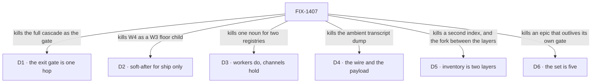

# FIX-1407 · Decisions

[Spec](SPEC.md) · **Decisions** · [Rules](BUSINESS-RULES.md) · [Plan](PLAN.md)

<!-- EDITING NOTE. Three phrases in this set read like colour and are load-bearing; an
     editorial pass on 2026-09-19 cut all three and had to restore them on review. The
     2026-09-19 refresh pass held them deliberately — check they are still here.
     In this file: D3's "and there are no thin/fat seat labels" (a lock, not a flourish)
     and D5's two concrete paths goals/devforce-lab/lab/host.mts and
     goals/pentest-lab/lab/host.mts (what an implementer actually deletes).
     In BUSINESS-RULES.md: ER-22's "not something it builds".
     Cut derivation here freely. Do not cut these. -->

The calls above any single issue: what was chosen, what lost, what each locks in. D1 to D5 are
**Architect locks carried into this document**; [D6](#d6) is the one call taken here, the owner's
at the objective gate.

## The tree

Each edge names what the decision killed. The alternative that lost is in the card.

## D1 · The W4 first cut is one hop: channel/org board → seat runs, and assign team seats

| | |
|---|---|
| **Instead of** | Making the full nested cascade — channel/org board → personal board → request board → seat — the exit gate |
| **Because** | The routing claim needs one hop to be true or false. A cascade proves the same thing three times and cannot be finished on a schedule, which is how an epic with a behavioural gate never closes |
| **Locks in** | Nested personal / request decomposition is **phase-2 inside W4**, promoted by a POC that proves need. What sits off the gate is FIX-1430's nested half. Conversation, DM and transcript stay off the board |

## D2 · W4 *ship* tickets are soft-after W3; W4 is not a child of W3

| | |
|---|---|
| **Instead of** | Nesting W4 under W3 · or letting a W4 ship PR merge onto a floor still being edited |
| **Because** | Every W4 child reads the file surface W3 is still closing. Nesting makes one epic that cannot wrap; ignoring the order lands a package format against a `tools:` fence and a `TEAM.md` layer that are still specs |
| **Locks in** | Filing, specs and **parallel POCs run now**. The fence lifts when **every W3 child that carries an implementation is merged to main**; children completed by decision, duplicated or cancelled do not hold it ([ER-14](BUSINESS-RULES.md)). Soft-after in Linear, never parent |

Whether that condition is the right *unit* — the package, or the files a PR actually touches — is
now [a pending re-gate](#er-14-re-gate) with the owner. The card stands until he moves it.

## D3 · Workers and seats *do*; channels *hold*. A board assignee key is not a Workforce seat

| | |
|---|---|
| **Instead of** | One noun for both — merging the board's assignee registry with the Workforce roster · or an assignable channel that claims work as an executor |
| **Because** | Different lifetimes, different identity rules. A board assignee is a key on a ledger; a seat is a roster slot that mints a flow instance. Collapsing them means every board row implies a hired seat, and every seat implies a board |
| **Locks in** | The two map **by composition**, per child. No assignable-channel routing, no channel-as-claim-worker, no second `WorkerRegistry`. `defaultWorker` and `assignTask` are composition, not new primitives. **Agent is an opinionated default kind**, not a Layer-1 substrate type, and there are no thin/fat seat labels |

## D4 · Dispatch is the wire; handoff content is the payload policy — not competing forks

| | |
|---|---|
| **Instead of** | Choosing between "pass the parent session" and "pass a brief" · or a silent full parent transcript as the default |
| **Because** | One is mechanism, one is policy, and reading them as a fork produces both an ambient dump *and* a second runtime. A sub-agent is same-session background work with a different prompt; a worker assign is a roster seat in a **linked** session. Both need the link; only the second needs a payload rule |
| **Locks in** | Dispatch always passes `parentSessionId`; the child binds its parent **for life at mint**. Parent history reaches a child by **opt-in tools**, never an ambient dump. The default payload is the brief — `goal` / `constraints` / `acceptance` / `links` — plus channel transcript **only if both are on that channel**. **Shipped on FIX-1408**, as a decision rather than code |

**Linked is not nested.** A linked session is a sibling that names its parent;
[FIX-1440](https://linear.app/fixpoint-labs/issue/FIX-1440) removed the nested-session substrate and
no child reads `parentSessionId` as a session tree. **Which** session a child names was first read
on the wire by FIX-1430 and is not the one its spec assumed — [below](#refuted-mechanisms).

## D5 · Runtime inventory is **two layers**, and choosing between them is not a fork

| | |
|---|---|
| **Instead of** | A second `WorkerRegistry`, a mega-loader that re-walks the tree differently, or a Graft rebuild for membership and DM lookup — **and** treating read-time compose versus an org-scoped resource as a fork to pick one of |
| **Because** | They answer different questions. The declared tree is what the files say; the live set is what is actually open. A compose helper goes stale the moment a channel mints; a live resource cannot tell you about a seat nobody has opened. Picking one produces the other by accident, badly |
| **Locks in** | **Layer 1 — declared roster, composed at read time.** The duplicated private `LabRoster` in `goals/devforce-lab/lab/host.mts` and `goals/pentest-lab/lab/host.mts` becomes one package-level export over the three existing readers (`readWorkforce`, `readResourcesDirectory`, `readChannelsDirectory`) — derived per read, no state, registers nothing. Both lab copies deleted. **Layer 2 — runtime inventory** (Jake's lock, 2026-09-16): ChannelFlow updates an org-scoped resource as seats and channels open. It stays FIX-1405's **primary** runtime shape for DM find-or-create, membership and fan-out **as inventory questions — who exists and is open**, and layer 1 does not replace it. It does **not** take over a channel's session-local `members` or its post-refusal fence ([ER-3](BUSINESS-RULES.md), [ER-12](BUSINESS-RULES.md)). `team.*` wildcards call layer 2 later, not at first ship |

Layer 1's **public export is approved** (objective gate), and FIX-1405 specified it as
`readDeclaredRoster(root)` — the contract [ER-23](BUSINESS-RULES.md) blocks FIX-817 on.

## D6 · The set is five children; two related issues are re-homed rather than parented

| | |
|---|---|
| **Instead of** | Keeping all seven parented — an epic that meets its own exit gate and then stays open, indefinitely, on two children it does not need |
| **Because** | **The exit gate and the wrap are different moments.** The wrap term requires every child to be [terminal](PLAN.md#terminal), and a phase-2 child that has never been built is not. An epic that cannot close after proving what it set out to prove has the wrong boundary |
| **Locks in** | Five children: FIX-1394, FIX-1405, FIX-1385, FIX-1408 (done), and **FIX-1430 adopted as the proof**, which gives [ER-20](BUSINESS-RULES.md) its owner. FIX-817 and FIX-1415 are **related-not-child**, keeping their FIX-1405 dependency and this set's rules — FIX-817 still waits for FIX-1405's approved spec ([ER-23](BUSINESS-RULES.md)), and neither may re-decide [ER-3](BUSINESS-RULES.md) |

**Re-homed is not descoped.** Both stay filed and keep their dependency edges; what changed is which
epic's wrap they hold: none.

**The tracker is at six, not five.** [FIX-1451](https://linear.app/fixpoint-labs/issue/FIX-1451) was
parented after this card was ratified, so the count it fixed and the count Linear holds disagree —
and the [wrap term](PLAN.md#wrap) reads the tracker. A refresh does not reopen an owner call: it is
[an open question](#open), on the evidence bar the first two met.

## Who owns what

A *consumes* cell is a place a child must not re-decide. **It is not a sequencing edge** — ER-3 is
FIX-1385's to obey, not to wait on. FIX-1430 consumes four rows and owns none, which is what makes
it a proof rather than a surface; what it owns is [ER-20](BUSINESS-RULES.md), a done-condition
rather than a matrix row, and **FIX-1385 provides the surface ER-20 stands on without owning it**.
[FIX-817 and FIX-1415](SPEC.md#related-not-children) consume ER-3 from outside the set.

## Decided in review, recorded so no child reopens them

| Decided | Because | Now lives in |
|---|---|---|
| Inventory is **two layers**; the helper-vs-resource fork is dismissed | The declared tree and the live set answer different questions | [D5](#d5) · ER-3 |
| The W3 ship fence has **one** release condition | Three documents stated it three ways — *merges*, *no open children*, *close* — which diverge the moment a child closes by decision | [D2](#d2) · ER-14 |
| The proof consumes **no package work** — not the implementation, and not the contract either | Binding it to either hangs the exit gate on work the lab does not need. ER-2 still binds it as a **fence** | [the spec](SPEC.md#what-the-proof-consumes) |
| **FIX-1385 owns ER-19**, the project's PR-5, **narrowed** to a check over this set's own diff | Running the repo-wide pass before the vocabulary lock pays the rename twice (project **PD-4**) | ER-19 |
| **The objective gate**: the exit gate is one hop · **the set is five**, FIX-1430 the proof · the compose helper's public export approved · **the ship fence as written** | The owner, 2026-09-19, ratifying the three-item ask as recommended | [D1](#d1) · [D6](#d6) · [D5](#d5) · [D2](#d2) |
| FIX-1394's POC keeps **one** of FIX-1408's walls — *which opt-in history packs are v1*; the other four returned to the epic, of which **three are still open** | A history pack **is** a library package with opt-in attachment, so the matrix already probes it. The four are session policy with no package content | ER-15 · [Open](#open) |
| The **inventory → boards** sequencing edge the epic asserted does not exist; dropped. **The set's one blocking edge is FIX-1385's implementation before FIX-1430** | FIX-1385's spec names inventory only as an optional read, and its BR-7 carries the caller's `assignee` with no seat resolution | [the graph](SPEC.md#how-the-issues-flow-into-each-other) · [the seams table](PLAN.md#coordination-seams-to-watch) |
| **A package is authored in Markdown**, as the new file, scoped to **instructions and tools** — and the format **may not be designed disk-only** | The owner, 2026-09-19, on FIX-1394's first ratify fork. His own direction is the load-bearing half: packages an LLM writes are **stored as a resource, never saved to disk**, so a format readable only off the filesystem is wrong on arrival. *Don't collapse* is no longer a live result | [ER-2](BUSINESS-RULES.md) · [Open](#open) |
| ER-3 means **(a)** a contrast with the declared tree — **not (b)** relocating ChannelFlow's post fence onto an org resource | A channel's `members` is already live, read on the refusal path in the session the post lands in; (b) would put one fact in two places and tax every post | ER-3 · ER-12 |
| **Drain width is 1.** Work queues behind a busy seat; a busy seat never takes a second row concurrently | Closes FIX-1408's *auto-scale / busy-copy* wall on FIX-1430's evidence, the way [ER-15](BUSINESS-RULES.md) says such a wall closes: the lab ran at **both** widths and wrote the comparison out, rather than a number being picked. **Reversible** — the `MANAGER_QUEUE_DRAIN_WIDTH` knob stays, which is how the other case remains reachable | FIX-1430's `lab/README.md` · [Open](#open), one wall lighter |
| **Two of FIX-1430's approved rules had their stated mechanism refuted by the code.** Both texts are corrected; both rules stand and are graded | **BR-5:** a row does run in its own session, with a parent bound at mint and none of the coordinator's transcript — but the parent is the **draining seat's** session, not the filer's, because the dispatch that mints the child happens at the seat, after the filing. **BR-11:** `adoptLapsedLease` (`packages/orchestration/src/task-board/task-entry.ts`) **renews** a lapsed lease so a successor *can* take the row back; `StaleTaskClaimError` fires only when a reclaim genuinely won. The substance — a lapsed row is really back in the queue — now grades the stronger true claim: the next drain takes it and runs it on the seat whose own file answers for the desk it was filed for | ER-4 · FIX-1430's `BUSINESS-RULES.md` and `lab/README.md` |

The first four rows are round 1 (2026-09-18, five reviewers on
[#1905](https://github.com/fixpoint-labs/flow-state-dev/pull/1905)); the rest are 2026-09-19, raised
up from a child rather than decided locally ([ER-15](BUSINESS-RULES.md) working). **The last two
rows are a child's PR correcting the epic** — the same mechanism as the cross-spec pass above it,
pointed at a fact rather than a scope. None reopens an approved decision.

**Two stay falsifiable.** ER-3's reading flips on evidence that a channel's `members` is *not*
current on the refusal path; the ER-15 split flips if those walls turn out to carry package content
after all.

## What the end-state POC showed

**None built.** The division came from the Architect's ownership carve, three of the five children
are themselves POC-first, and the gate approved it without one. The question a POC would still
answer: are the package format and the board's assign surface really two issues?

## Open

The set question is closed ([D6](#d6)), the compose helper's public export with it ([D5](#d5)), and
one of FIX-1394's two ratify decisions closed on 2026-09-19. What is open is the second, the
sixth-child question, **a re-gate on ER-14**, and three of FIX-1408's walls.

### Are documents in v1, or left out? — it blocks FIX-1394

*(Decides: the owner. Blocks: FIX-1394's ratify and the ship tickets behind it
([ER-8](BUSINESS-RULES.md)). Six parts in full on the matrix PR
[#1921](https://github.com/fixpoint-labs/flow-state-dev/pull/1921).)*

Nothing in the framework can carry a document to a *single* seat today, so a package advertising one
delivers prompt text re-sent every turn. **Recommendation, unchanged:** *leave it out and say so in
the format* — adding a document slot later is additive, shipping one that quietly means something
else is not. [FIX-1454](https://linear.app/fixpoint-labs/issue/FIX-1454) files the underlying gap,
which is the fact this rests on rather than a reason to reopen it.

### Does FIX-1451 belong under this epic?

*(Decides: the owner. Blocks: nothing today. Bites: the wrap.)*
A filed, parented sixth child against a ratified set of five — stated in full at
[the spec](SPEC.md#the-sixth-child). **Recommendation: re-home it as related-not-child**, the way
FIX-817 and FIX-1415 went, because the exit gate does not depend on it and a `Backlog` child holds
the wrap open indefinitely. **What would change my mind:** if skill-context honesty is part of what
*package cohesion* is supposed to deliver, it is a child and the wrap waits for it.

### Does the W3 ship fence narrow to per-PR overlap? — a pending re-gate

*(Decides: the owner, and only the owner — this document records him ratifying **the ship fence as
written** at the objective gate, so narrowing it is a re-gate, not an epic call. Blocks: whether
[#1928](https://github.com/fixpoint-labs/flow-state-dev/pull/1928) may merge. The recommendation
below is **mine**, and unanswered.)*

**The facts.** #1928 publishes `@flow-state-dev/workforce` and carries a changeset, so it is a
**ship PR** by [ER-14](BUSINESS-RULES.md)'s letter. FIX-1435 — a W3 child carrying an
implementation, hoisting the duplicated slot-descent walk in the resources loaders — is still
`Todo`, so the fence has not lifted and it parks a finished PR. **By substance the overlap is
empty:** #1928's 13 paths sit under `packages/workforce/src/channel/`, `src/inventory/`, `test/`,
the README, `apps/docs/` and a changeset — **none** under `packages/workforce/src/loader/`, where
FIX-1435 lands. Same package, disjoint files.

**My recommendation: narrow ER-14 to per-PR overlap** — a W4 ship PR is fenced only when its diff
touches files an unlanded W3 child will edit. The rule's own stated risk is W4 shipping onto
unlanded W3 *code*, and a fence that parks on package identity rather than file overlap costs merges
it was never aimed at. **What would change my mind:** evidence that FIX-1435's hoist changes the
*behaviour* of a loader #1928's code calls — then the package is the right unit and #1928 waits.
**What being wrong costs:** a W4 change merged onto a floor still moving under it, so a conflict or
a silent behavioural change surfaces on `main` rather than in a rebase. **Nothing is narrowed
here:** ER-14's row stands exactly as written, and three W4 ship PRs have already merged under it.

**Why the three above are here and the three below are not.** Those are business calls the owner
owns and nothing else can settle; the three below are engineering walls that *building* answers
([ER-15](BUSINESS-RULES.md)).

### Three of FIX-1408's walls, still with the epic

*(Decides: the epic, as EM calls, on evidence. Blocks: nothing today. The fourth —
auto-scale / busy-copy — closed on 2026-09-19 as [drain width is 1](#drain-width).)*

| Wall | What it decides | What would settle it |
|---|---|---|
| **Reuse-vs-create session policy** | Whether assigning a seat that is already running reuses its session or mints a second | **FIX-1430** — its lab reports which dispatcher `session` knob it ran. Also on the Architect's Still-open list ([ER-13](BUSINESS-RULES.md)) |
| **Hire-or-dispatch-with-parent naming** | What the call that mints a linked child is *called*, given [D4](#d4) fixed what it does | **FIX-1430's** board → seat call site — the first one read by anybody who did not write the name |
| **A sub-agent's background work on a board row** | Whether same-session background work is visible on the row at all, and as what | **Unowned, and orphaned.** It was FIX-1385's as the owner of the row; FIX-1385 closed without building a coordinator assign, so nothing left in the set will force it. [ER-11](BUSINESS-RULES.md) binds whoever takes it — a view, never a new status. **Named out at [the wrap](PLAN.md#wrap)**, so the epic cannot close by confirming a pass nobody ran |

**What being wrong costs.** The bet was that FIX-1385 would force three of these; it did not. The
two still settleable ride on FIX-1430 — so if the proof runs and nobody reads what it reports, they
leave W4 unanswered with no child left to force them. The third has no owner at all.

**A second unowned residue, from FIX-1385.** A seat naming a board id **no channel minted** is not
refused; it silently resolves a second, empty ledger, with only `warnUnattendedBoards` as a signal
(FIX-1385's BR-15: *there is no registry of legal board ids and this issue doesn't add one*). The
cross-flow half **did** ship — a board's id is derived from its channel, never written, so two flows
reach one logical board by naming the same channel and board name. The unrefused half has **no owner
and no filed ticket**, and FIX-1385 being Done does not give it one.

Not this epic's to close: the Architect's **Still open** list ([ER-13](BUSINESS-RULES.md)) — exact
package schema, reuse-vs-create, nested cascade timing, how many POCs before a ship cut. Those close
with the owner, on the evidence FIX-1394's matrix produces.
