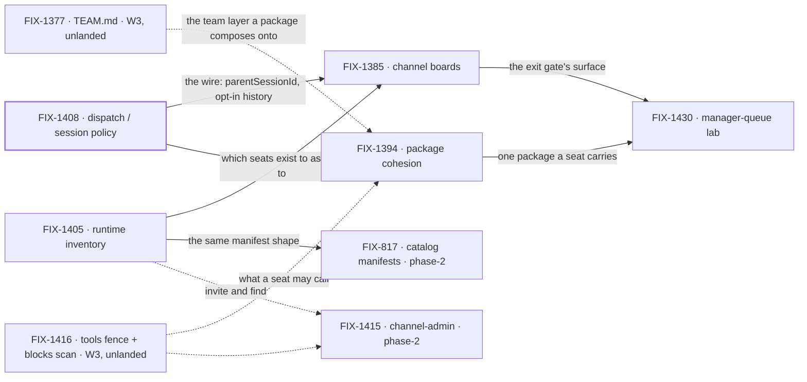

# FIX-1407 · W4: work reaches a seat

**Spec** · [Decisions](DECISIONS.md) · [Rules](BUSINESS-RULES.md) · [Plan](PLAN.md)

Epic · 7 issues · Workforce: Layer 2 Abstraction · Goal 1 — Workforce multi-seat real usage /
architecture cohesion

## Four teams, before and after

| A team that… | Today | After this epic's first cut |
|---|---|---|
| **has a piece of work for a team of seats** | Nowhere shared to put it. Work is dispatched by hand, from code, one seat at a time | It goes on the channel's board. A seat claims it or is assigned it, and runs it |
| **writes one package for a seat** | Two overlapping systems — the seat's own prompt file and skills — and no answer to which one a tool belongs in | One package format, two attachment modes: always-on for a seat, opt-in for a library |
| **asks what seats and channels exist right now** | Opaque strings. `engineering.*` cannot expand, and a seat asking another seat has no way to find their DM | One runtime lookup answers membership, author checks, fan-out and DM find-or-create |
| **hands work from one seat to another** | Invents an ambient transcript dump, or a second runtime | A named brief, a linked session bound to its parent for life, and parent history only through opt-in tools |

**Why now.** W3 made a Workforce *describable* — workers, channels, resources and skills all
declare in one tree. Nothing yet says how **work reaches** one of those declared seats. Four
surfaces are missing or disagree: the package story (a seat's prompt file versus skills), what
exists at runtime (no inventory, so membership is an opaque string), what *assign* means (a
sub-agent, a roster seat, a board row — all three, unreconciled), and where work lives at all.
That gap is why a declared team is still a demo. This epic closes the routing half of Goal 1: W3
proved a seat is *described*, W4 proves a seat is *given work*. It does not move the corpus-wide
goal count on its own — the lead measure moves when a child ships a goal check.

## What's in the box

![What's in the box: the W4 first cut is a channel or org board that routes work to a seat run and assigns team seats — the exit gate, one hop — plus one package format with two attachment modes, a runtime inventory of seats and channels as one L2 query, and the shipped dispatch and session policy. Composed in by the app: custom kinds as flow factories, and defaultWorker triage. A phase-2 panel inside W4, off the exit gate, holds the nested personal and request board cascade, channel-admin verbs, catalog manifests and the manager-queue lab's nested half. Below a fence, what is not built: no Agent, Channel, Team, MessageBoard, TeamFlow or SessionBoard L1 type, no Collab RC, no silent parent transcript, no merged board-assignee and seat registry, no team wildcards as first ship, no second WorkerRegistry or mega-loader, no assignable-channel routing, no BoardFlow as the only mint, no Graft rebuild.](figures/end-state.svg)

Everything inside the box is what a team gets once the first cut lands. The **exit gate is the top
row and only the top row**: a channel or org board routes work to a seat run, and can assign team
seats ([D1](DECISIONS.md#d1)). The strip under it is phase-2 *inside* W4 — named so nobody reads
it as refused, and fenced off the gate so the epic can finish. The bottom strip is what the set
refuses to build, and every item in it was named out by the Architect rather than forgotten.

## The set · as of 2026-09-18

This table is the live one. It is refreshed on the epic PR as issues move; the plan and the
figures point here rather than repeating it.

**The epic body names four.** Three more were parented after it was written, and whether they
belong is the one thing the objective gate has to settle — see [sign-off](#sign-off) and
[Open 1](DECISIONS.md#open).

| Issue | What it delivers | Why the set needs it | Status |
|---|---|---|---|
| FIX-1408 | Dispatch / session policy — sub-agent is same-session background, worker assign is a roster seat in a **linked** session, `parentSessionId` always at mint, history by opt-in tools | The wire everything else routes over. Locked as decision, not code | **Done** · closed 2026-09-18 · no impl PR ([below](#a-note-on-fix-1408)) |
| FIX-1394 | Package cohesion — one package format, two attachment modes (seat always-on, library opt-in). POC-first | Half the epic's title. Two overlapping surfaces grow board and tool sugar twice until this settles | Not started · Backlog |
| FIX-1405 | Runtime inventory of seats + channels; lean is an org-scoped resource ChannelFlow maintains | Assigning a **team** seat needs to know which seats exist. Without it the board can route to a literal id and nothing else | Not started · Backlog |
| FIX-1385 | Channel workstreams + boards — a channel holds `0..N` TaskCollections; channel actions and `taskTools` are two doors on one surface | **The exit gate's surface.** It is the board in "channel/org board → seat runs" | Not started · Todo |
| FIX-817 | Collection / catalog manifests + agent introspection — one discovery shape over seats, channels, resources, tools, skills | Planning *before* assign. Not on the path to the exit gate; it reads the same inventory FIX-1405 builds | Not started · Todo · `Open Question` |
| FIX-1415 | Channel-admin capability — create / delete / invite behind the seat's `tools:` fence | Design only until Collab park and inventory land, by its own Architect fence. Off the exit gate | Not started · Todo |
| FIX-1430 | Manager-queue lab — a coordinator seat owns a channel + workstream board, assigns to linked seats, and shows queue state as **views** over existing task status | The only child shaped like a **proof** of the exit gate. Nothing else in the set runs it end to end | Not started · Todo |

1 done · 0 in flight · 6 not started. Four are the epic body's set; three (FIX-817, FIX-1415,
FIX-1430) were parented later and the body does not name them.

**Is seven really four?** Seven is **three plus a proof plus two phase-2** — and the counting is
the gate's call, not mine. FIX-1394, FIX-1405 and FIX-1385 are the first cut the body names.
FIX-1430 is the only child that would *run* the exit gate, and a set with a behavioural gate and
nothing that runs it is missing its proof, so my recommendation is to adopt it as one. FIX-817 and
FIX-1415 both sit behind FIX-1405 and both fence themselves off a ship; kept as phase-2, they gate
nothing and keep one shared surface with its owner. The full trade, including the arm where two of
them leave the epic, is [Open 1](DECISIONS.md#open).

**A note on FIX-1408.** It went Backlog → Done on 2026-09-18 with no implementation PR: what
shipped is the **decision**, recorded as [D4](DECISIONS.md#d4) and [ER-4](BUSINESS-RULES.md). Its
own open walls are not closed by that and now have no owning issue
([Open 2](DECISIONS.md#open)).

## How the issues flow into each other

A solid edge is what one issue hands the next and blocks until it lands. **Dashed edges from the
left are inputs from W3 that have not landed** — FIX-1377 and FIX-1416 are spec-approved and still
to be built, so no W4 child may write as though they exist ([ER-18](BUSINESS-RULES.md)). The
dashed edge into FIX-1415 is soft: its own fence holds it for Collab and inventory, so it waits
rather than blocks. A heavy border is done. Every node is filed, so the set carries no
placeholders.

## What stays as it is

- **Collab RC ([FIX-1341](https://linear.app/fixpoint-labs/issue/FIX-1341)).** Dynamic rooms,
  membership mutate and the roster stay parked. FIX-1415 shapes a capability surface; it does not
  reopen Collab.
- **The W3 floor ([FIX-1351](https://linear.app/fixpoint-labs/issue/FIX-1351)).** A sibling epic,
  soft-*after* for ship and never a parent ([D2](DECISIONS.md#d2)).
- **The OOTB agent kind ([FIX-1359](https://linear.app/fixpoint-labs/issue/FIX-1359)).** Shipped,
  parallel history. Package cohesion flags drift against it; it is not redesigned from zero.
- **The board's claim system.** One task board, one claim system. `assignee` stays optional and
  `TaskStatus` does not grow ([ER-11](BUSINESS-RULES.md)).
- **`goals/devforce-lab/` ([FIX-1426](https://linear.app/fixpoint-labs/issue/FIX-1426), Done).**
  The coding seam only. It does not grow into FIX-1430's showcase.

## Sign off

1. **[D1](DECISIONS.md#d1) · The exit gate is channel/org board → seat runs / assign team seats.
   The nested personal/request cascade is phase-2.** If wrong: the epic either finishes on a cut
   too thin to prove routing, or never finishes because the gate kept moving.
2. **[Open 1](DECISIONS.md#open) · Does the set ratify at seven, and is FIX-1430 the proof?**
   Three issues were parented after the body was written. Two of them (FIX-817, FIX-1415) are
   phase-2 by their own fences; the third (FIX-1430) is the only child shaped to run the gate, and
   the epic currently has a behavioural exit gate with **nothing that proves it**. The full
   six-part ask is in [DECISIONS.md → Open](DECISIONS.md#open).
3. **[D2](DECISIONS.md#d2) · W4 *ship* PRs are soft-after W3; filing, specs and POCs run now.** If
   wrong: either W4 ships onto a floor that moves under it, or four children idle for a floor that
   was never going to block them.

**Open: two.** Whether the set is seven, and who owns FIX-1408's unclosed walls
([DECISIONS.md → Open](DECISIONS.md#open)). The rules every child obeys are in
[BUSINESS-RULES.md](BUSINESS-RULES.md); the order the work runs in, and what each issue entails,
is [PLAN.md](PLAN.md).
