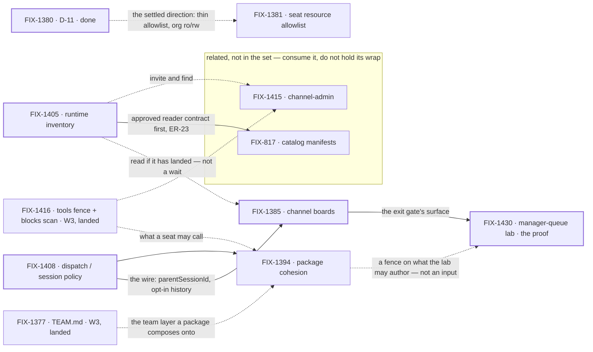

# FIX-1407 · W4: work reaches a seat

**Spec** · [Decisions](DECISIONS.md) · [Rules](BUSINESS-RULES.md) · [Plan](PLAN.md)

Epic · 6 issues · Workforce: Layer 2 Abstraction · Goal 1 — Workforce multi-seat real usage /
architecture cohesion

## Four teams, before and after

| A team that… | Today | After this epic's first cut |
|---|---|---|
| **has work for a team of seats** | Nowhere shared to put it. Dispatched by hand, from code, one seat at a time | It goes on the channel's board. A seat claims it or is assigned it, and runs it |
| **writes one package for a seat** | Two overlapping systems — the seat's prompt file and skills — and no answer to which one a tool belongs in | One answer: **one package format, written in Markdown**, scoped to instructions and tools, with two attachment modes. A team writes one without an engineer |
| **asks what seats and channels exist** | Opaque strings. `engineering.*` cannot expand, and a seat cannot find another seat's DM | A declared roster read from the tree, plus a live org resource for what is actually open |
| **hands work from one seat to another** | Invents an ambient transcript dump, or a second runtime | A brief, a linked session bound to its parent for life, and parent history only by opt-in tools |

**Why now.** W3 made a Workforce *describable*. Nothing yet says how **work reaches** one of those
declared seats: no shared place to file it, no runtime answer to "which seats exist", and three
unreconciled meanings of *assign*. W3 proved a seat is described; W4 proves a seat is given work.

## What's in the box

The **exit gate is the top row and only the top row** ([D1](DECISIONS.md#d1)). The strip under it is
phase-2 *inside* W4 — named so nobody reads it as refused, and nothing on it holds the wrap
([D6](DECISIONS.md#d6)). The bottom strip is what the set refuses to build, named out rather than
forgotten.

## The set · as of 2026-09-19

The live table. Refreshed on the epic PR as issues move; the plan and the figures point here, and
Linear mirrors it ([ER-16](BUSINESS-RULES.md)). **A closed spec PR is review history, not the
document:** read the spec branch's head, or the Linear document on the issue.

| Issue | What it delivers | Why the set needs it | Status |
|---|---|---|---|
| FIX-1408 | Dispatch / session policy: sub-agent is same-session background, worker assign is a roster seat in a **linked** session, `parentSessionId` at mint, history by opt-in tools | The wire everything else routes over | **Done** · 2026-09-18 · no impl PR ([below](#a-note-on-fix-1408)) |
| FIX-1394 | **One package format as a Markdown file**, scoped to instructions and tools, two attachment modes, and **not disk-only** ([ER-2](BUSINESS-RULES.md)). POC-first | Half the epic's title. Two overlapping surfaces grow board and tool sugar twice until this settles | **Ratify unblocked** · matrix [#1921](https://github.com/fixpoint-labs/flow-state-dev/pull/1921) open, never merges · both forks now [decided](DECISIONS.md#decided-in-review) — authorship, and [documents](DECISIONS.md#documents-answer) |
| FIX-1405 | Inventory in two layers: a declared roster composed from the existing readers, and the live org resource ChannelFlow updates | The epic's third promise in its own right — *which seats and channels exist* — and what `team.*` addressing calls later ([ER-7](BUSINESS-RULES.md)). It does **not** gate the boards | **Done** · 2026-09-19 · PR-A [#1920](https://github.com/fixpoint-labs/flow-state-dev/pull/1920), S4 [#1923](https://github.com/fixpoint-labs/flow-state-dev/pull/1923) and S5–S7 [#1928](https://github.com/fixpoint-labs/flow-state-dev/pull/1928) all **merged** — terminal by merge |
| FIX-1385 | A channel holding `0..N` TaskCollections; channel actions and `taskTools` as two doors on one surface. Plus the PR-5 name check over its own diff ([ER-19](BUSINESS-RULES.md)) | **The exit gate's surface** — the board in "channel/org board → seat runs" | **Done** · 2026-09-19 · [#1922](https://github.com/fixpoint-labs/flow-state-dev/pull/1922) **merged** — one full-scope PR, not the spec's four ([the seam it discharged](PLAN.md#coordination-seams-to-watch)) |
| FIX-1430 | Manager-queue lab: a coordinator seat owns a channel board, assigns to linked seats, shows queue state as **views** over existing task status | The **proof** of the exit gate, and the owner of [ER-20](BUSINESS-RULES.md) | **Done** · 2026-09-19 · [#1929](https://github.com/fixpoint-labs/flow-state-dev/pull/1929) **merged** — but **the gate it exists to run [has not run](#er-20-has-not-run)** |
| [FIX-1381](https://linear.app/fixpoint-labs/issue/FIX-1381) | **Seat resource allowlist** — thin seat/kind refs by `ro`/`rw`. The ship ticket for D-11 Ask 1 | Nothing today can control which resources a worker or skill reaches: `resourcesFromDocs` hard-codes `scope: "org"` and `workerConfigSchema` admits only `instructions`, `teamInstructions`, `seatSkills`. **Pulled in by the owner** ([below](#the-sixth-child-pulled-in)) | **Spec in progress** · `Backlog`, moving to a spec-writing status · spec being written on `spec/FIX-1381` · **no spec PR yet** |

**Four of six children are complete; two are open.** FIX-1408 done by decision, and FIX-1385,
FIX-1405 and FIX-1430 all merged to `main` on 2026-09-19. **FIX-1394** is unblocked at its ratify
now that [the documents question is answered](DECISIONS.md#documents-answer). **FIX-1381** was
pulled into the set at 16:01 and has neither a spec nor an implementation — the least-advanced child
by some distance.

**Read that as four of six, not as the epic being done.** Two separate things are true and neither
implies the other: most of the set is merged, and **the thing the set exists to prove has never been
observed**. Nor is the finish line where it was this morning — [the set grew](#the-sixth-child-pulled-in).

**[ER-20](BUSINESS-RULES.md) is OPEN. Its row reads `NOT RUN`.** The acceptance goal calls a real
model and no environment reachable from this epic has an inference key, so the check fails loudly by
name rather than degrading to a scripted filer. Everything around it is green — routing, sessions,
the waiting row, refusal by name — with controls that go red at the leg they name. **The wrap term
is enforced against ER-20 as written:** W4 does not wrap until that row says PASS.
[#1929](https://github.com/fixpoint-labs/flow-state-dev/pull/1929) **has since merged, and it did
not change this.** A merged proof whose gate never ran is exactly the *claiming routing works rather
than having seen it* that ER-20 exists to prevent, and it is now the literal state of the set. What
stands between W4 and its wrap is **a machine with an inference key, and [FIX-1381](#the-sixth-child-pulled-in)**
— the second is work that can be done, the first is not.

**The sixth child, and what it cost.** [FIX-1381](https://linear.app/fixpoint-labs/issue/FIX-1381)
joined the set at the owner's own word — *"pull it in"*, 2026-09-19 16:01, answering whether to take
it into the epic's tail or leave it in backlog. It arrived from his own question earlier that day,
whether resource access inside workers and skills could be controlled yet. It cannot: `resourcesFromDocs`
hard-codes `scope: "org"` (`packages/workforce/src/resources-from-docs.ts:80`), `workerConfigSchema`
admits only `instructions`, `teamInstructions` and `seatSkills`
(`packages/workforce/src/worker-config.ts:89`), and no access gate exists anywhere in `workforce/src`
or `orchestration/src`. It needed no new ticket: **FIX-1381 already covered it exactly**, as the ship
ticket for D-11 Ask 1, its own invent-kill naming that `WorkerConfig` gap.

**It moved the wrap out, and that was said before the call was made.** The [wrap](PLAN.md#wrap) now
needs FIX-1381 terminal **as well as** ER-20 passing, and FIX-1381 has no spec yet — so W4's finish
is further away today than it was this morning. The owner made that call with the consequence in
front of him. **It enters cheaper than a cold child:** [D-11 (FIX-1380)](https://linear.app/fixpoint-labs/issue/FIX-1380)
is **Done** and already decides its direction — Ask 1 the thin allowlist, Ask 3 org `ro` automatic
and `rw` by permission — so only its spec is outstanding, not its shape.

**On its Architect fence.** FIX-1381's body fences it against being nested under **W3**. That fence
is about W3 and it still stands; the owner pulled it into **W4**, which the fence does not speak to.
Not a fence broken — a different parent.

**Related, not absorbed.** [FIX-1454](https://linear.app/fixpoint-labs/issue/FIX-1454) is the
scope-*existence* half — resources cannot be scoped to a single seat at all — which is a different
question from which resources a seat may reach.
[FIX-1442](https://linear.app/fixpoint-labs/issue/FIX-1442), the org-identity security pass, is
adjacent. Neither is folded in here.

**And FIX-1451 is still unconfirmed** — separately from the above.
[FIX-1451](https://linear.app/fixpoint-labs/issue/FIX-1451), a `Bug` (*skill `allowed-tools`
promises a grant it does not make*), was parented on 2026-09-19 but never confirmed as a child, so
the tracker now holds **seven** against a set of six. Real work nobody disputes; the question is
only whether this epic's wrap waits for it. **Not re-parented here** — re-parenting is a deliberate
act with its own evidence, never a side effect of a refresh. Still
[an open question](DECISIONS.md#open).

**Related, not children.** [FIX-817](https://linear.app/fixpoint-labs/issue/FIX-817) (catalog
manifests) and [FIX-1415](https://linear.app/fixpoint-labs/issue/FIX-1415) (channel-admin verbs) are
real work in the same area the epic's promise does not need. Both **keep their FIX-1405 dependency**
and still obey this set's rules: FIX-817 waits on FIX-1405's **approved** spec
([ER-23](BUSINESS-RULES.md)), and neither may re-decide [ER-3](BUSINESS-RULES.md).

**A note on FIX-1408.** Done with no implementation PR: what shipped is the **decision**
([D4](DECISIONS.md#d4)). Of its five open walls, **one** is evidenced by FIX-1394's POC, **one**
closed on FIX-1430's evidence ([drain width is 1](DECISIONS.md#drain-width)), and **three** are
parked in [Open](DECISIONS.md#open) ([ER-15](BUSINESS-RULES.md)).

## How the issues flow into each other

A **solid** edge blocks; a **dashed** edge does not, and its label says why — **landed code** to
write against ([ER-18](BUSINESS-RULES.md)), a **fence** the child holds itself to
([the proof](#what-the-proof-consumes)), or a surface read **if it has landed**. A heavy border is
done. The two in the box are [related, not children](#related-not-children).

**Exactly one edge inside the set blocks, and it is discharged** — FIX-1385's implementation before
FIX-1430. FIX-1385 merged, so the proof's one prerequisite exists and its build ran. The inventory
does **not** gate the boards: FIX-1385's spec names the declared roster only as an optional read,
and its BR-7 carries the caller's `assignee` verbatim rather than resolving a seat
([ER-5](BUSINESS-RULES.md)).

**The proof consumes no package work — not the implementation, and not the contract either.**
FIX-1430's seats run on surfaces already on `main` at `d8e4c99` that FIX-1394 does not change, and
the lab authors no package shape at all, so it stayed compatible with every answer FIX-1394 could
reach — including the one it reached. [ER-2](BUSINESS-RULES.md) still binds it as a **fence**: no
shape the ratified format would contradict. Binding the proof to a shipped package, or to a ratify,
would hang the exit gate on work it does not need — the unreachable gate [D1](DECISIONS.md#d1)
exists to prevent.

## What stays as it is

- **Collab RC ([FIX-1341](https://linear.app/fixpoint-labs/issue/FIX-1341))** — parked. FIX-1415
  shapes a capability surface; it does not reopen Collab.
- **The W3 floor ([FIX-1351](https://linear.app/fixpoint-labs/issue/FIX-1351))** — soft-*after* for
  ship, never a parent ([D2](DECISIONS.md#d2)).
- **Session substrate ([FIX-1440](https://linear.app/fixpoint-labs/issue/FIX-1440))** — linked
  dispatch does not re-legitimize nested sessions as a work hierarchy ([D4](DECISIONS.md#d4)).
- **The OOTB agent kind ([FIX-1359](https://linear.app/fixpoint-labs/issue/FIX-1359))** — shipped.
  Package cohesion flags drift against it; it is not redesigned from zero.
- **The board's claim system** — `assignee` stays optional, `TaskStatus` does not grow
  ([ER-11](BUSINESS-RULES.md)).
- **`goals/devforce-lab/` ([FIX-1426](https://linear.app/fixpoint-labs/issue/FIX-1426))** — the
  coding seam only; it does not grow into FIX-1430's showcase.

## Signed off · 2026-09-19

The owner ratified all three items of this section's ask, each with the recommendation it carried.
What each one killed is in the card behind it.

1. **[D1](DECISIONS.md#d1) · The exit gate is channel/org board → seat runs / assign team seats.**
   The nested cascade is phase-2 inside W4.
2. **[D6](DECISIONS.md#d6) · The set was five**, FIX-1430 adopted as the proof, which gives
   [ER-20](BUSINESS-RULES.md) its owner; FIX-817 / FIX-1415 re-homed as
   [related-not-child](#related-not-children), dependency preserved. **[Extended to six on
   2026-09-19](DECISIONS.md#d6)** by the owner, pulling in FIX-1381.
3. **[D2](DECISIONS.md#d2) · W4 *ship* PRs are soft-after W3**, as written: the fence lifts when
   every W3 child that carries an implementation is merged to main.

Also approved: **the public export of the compose helper on `@flow-state-dev/workforce`**
([D5](DECISIONS.md#d5)). **Since the gate, both of FIX-1394's ratify forks are answered.** *Who
authors a package* — the Markdown file, and **not disk-only**, because packages an LLM writes are
stored as a resource rather than saved to disk. And *[are documents in
v1](DECISIONS.md#documents-answer)* — **all documents org-scoped for now**, a seat's document being
simply a resource under that seat on the org, with per-resource configurability arriving later on
**resource templates**, which do not exist yet. Both bind through [ER-2](BUSINESS-RULES.md), and the
ratify is unblocked.

**One thing is between W4 and the gate, and it is not work:** **a machine with an inference key.**
That is the whole of what [ER-20](#er-20-has-not-run) waits for — every line of code it needs is
merged. Behind the gate, the wrap also now waits on **FIX-1381**, which has yet to be specced
([above](#the-sixth-child-pulled-in)).

**Open with you, blocking nothing today:** **whether FIX-1451 belongs under this epic**
([above](#the-unconfirmed-child)), and a **[pending re-gate on
ER-14](DECISIONS.md#er-14-re-gate)** — you merged #1928 through the fence, which settles that PR but
says nothing about the rule; narrowing it reopens what you ratified as item 3 above, so only you can
do it. **With the epic:** FIX-1408's three remaining session-policy walls
([Open](DECISIONS.md#open)).
