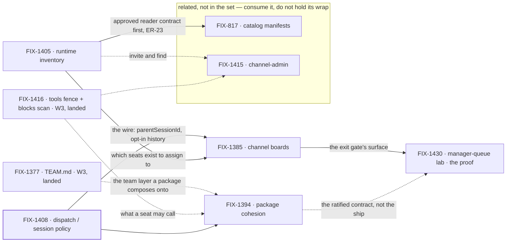

# FIX-1407 · W4: work reaches a seat

**Spec** · [Decisions](DECISIONS.md) · [Rules](BUSINESS-RULES.md) · [Plan](PLAN.md)

Epic · 5 issues · Workforce: Layer 2 Abstraction · Goal 1 — Workforce multi-seat real usage /
architecture cohesion

## Four teams, before and after

| A team that… | Today | After this epic's first cut |
|---|---|---|
| **has work for a team of seats** | Nowhere shared to put it. Dispatched by hand, from code, one seat at a time | It goes on the channel's board. A seat claims it or is assigned it, and runs it |
| **writes one package for a seat** | Two overlapping systems — the seat's prompt file and skills — and no answer to which one a tool belongs in | One package format, two attachment modes: always-on for a seat, opt-in for a library |
| **asks what seats and channels exist** | Opaque strings. `engineering.*` cannot expand, and a seat cannot find another seat's DM | A declared roster read from the tree, plus a live org resource for what is actually open |
| **hands work from one seat to another** | Invents an ambient transcript dump, or a second runtime | A brief, a linked session bound to its parent for life, and parent history only by opt-in tools |

**Why now.** W3 made a Workforce *describable*. Nothing yet says how **work reaches** one of those
declared seats: no shared place to file it, no runtime answer to "which seats exist", and three
unreconciled meanings of *assign*. W3 proved a seat is described; W4 proves a seat is given work.

## What's in the box

![What's in the box: the W4 first cut is a channel or org board that routes work to a seat run and assigns team seats — the exit gate, one hop — plus one package format with two attachment modes, a runtime inventory in two layers (a declared roster composed at read time and a live org resource ChannelFlow updates), and the shipped dispatch and session policy. Composed in by the app: custom kinds as flow factories, and defaultWorker triage. A phase-2 panel inside W4, off the exit gate and holding no wrap, holds just two items: the nested personal and request board cascade, and the manager-queue lab's nested half. Below a fence, what is not built: no Agent, Channel, Team, MessageBoard, TeamFlow or SessionBoard L1 type, no Collab RC, no silent parent transcript, no nested or shadow session substrate as a work hierarchy, no merged board-assignee and seat registry, no team wildcards as first ship, no second WorkerRegistry or mega-loader, no assignable-channel routing, no BoardFlow as the only mint, no Graft rebuild.](figures/end-state.svg)

The **exit gate is the top row and only the top row** ([D1](DECISIONS.md#d1)). The strip under it is
phase-2 *inside* W4 — named so nobody reads it as refused, and since the set cut to five
([D6](DECISIONS.md#d6)) nothing on it holds the wrap. The bottom strip is what the set refuses to
build, each item named out rather than forgotten.

## The set · as of 2026-09-19

The live table. Refreshed on the epic PR as issues move; the plan and the figures point here.

| Issue | What it delivers | Why the set needs it | Status |
|---|---|---|---|
| FIX-1408 | Dispatch / session policy: sub-agent is same-session background, worker assign is a roster seat in a **linked** session, `parentSessionId` at mint, history by opt-in tools | The wire everything else routes over | **Done** · 2026-09-18 · no impl PR ([below](#a-note-on-fix-1408)) |
| FIX-1394 | One package format, two attachment modes. POC-first | Half the epic's title. Two overlapping surfaces grow board and tool sugar twice until this settles | **In spec** · 2026-09-19 · in flight |
| FIX-1405 | Inventory in two layers: a declared roster composed from the existing readers, and the live org resource ChannelFlow updates | Assigning a **team** seat needs to know which seats exist. Without it a board routes to a literal id and nothing else | **In spec** · 2026-09-19 · in flight |
| FIX-1385 | A channel holding `0..N` TaskCollections; channel actions and `taskTools` as two doors on one surface. Also the PR-5 propagation pass ([ER-19](BUSINESS-RULES.md)) | **The exit gate's surface** — the board in "channel/org board → seat runs" | **In spec** · 2026-09-19 · in flight |
| FIX-1430 | Manager-queue lab: a coordinator seat owns a channel board, assigns to linked seats, shows queue state as **views** over existing task status | The **proof** of the exit gate — adopted at the objective gate, and the owner of [ER-20](BUSINESS-RULES.md) | Not started · follows the three first-cut specs |

1 done · 3 in flight · 1 not started.

**Five, settled at the objective gate** (2026-09-19). The epic body named four; three more were
parented afterwards. The gate kept the four and adopted FIX-1430 as the proof
([D6](DECISIONS.md#d6)). Not bookkeeping: **the exit gate and the wrap are different moments**, and
a parented phase-2 child would not have gated the exit gate — it would have held the epic open past
it, indefinitely. At five, W4 wraps when it meets its own gate.

**Related, not children.** [FIX-817](https://linear.app/fixpoint-labs/issue/FIX-817) (catalog
manifests) and [FIX-1415](https://linear.app/fixpoint-labs/issue/FIX-1415) (channel-admin verbs) are
real work in the same area that this epic's promise does not need. Both **keep their dependency on
FIX-1405** and still obey this set's rules where they touch it: FIX-817 does not start until
FIX-1405's spec is **approved** ([ER-23](BUSINESS-RULES.md)), and neither may re-decide
[ER-3](BUSINESS-RULES.md).

**A note on FIX-1408.** Backlog → Done on 2026-09-18 with no implementation PR: what shipped is the
**decision** ([D4](DECISIONS.md#d4)). Its open walls are not closed by that — **one** is evidenced
by FIX-1394's POC, and the other **four** came back to the epic and are parked in
[Open](DECISIONS.md#open) ([ER-15](BUSINESS-RULES.md)).

## How the issues flow into each other

A **solid** edge blocks; a **dashed** edge does not, and its label says what makes starting safe
anyway — **landed code** to write against (the two W3 inputs, merged 2026-09-19,
[ER-18](BUSINESS-RULES.md)), a ratified contract rather than a shipped surface (below), or a fence
the child holds itself to. A heavy border is done. The two in the box are
[related, not children](#related-not-children).

**The proof consumes package cohesion's contract, not its implementation.** FIX-1430's seats can
carry instructions and tools on today's surfaces — both existing labs already do. What the proof may
not do is invent a *third* shape the ratified format would contradict
([ER-2](BUSINESS-RULES.md)). Binding it to a shipped package instead would hang the exit gate on
ship tickets that do not exist yet — the unreachable gate [D1](DECISIONS.md#d1) exists to prevent.

## What stays as it is

- **Collab RC ([FIX-1341](https://linear.app/fixpoint-labs/issue/FIX-1341))** — parked. FIX-1415
  shapes a capability surface; it does not reopen Collab.
- **The W3 floor ([FIX-1351](https://linear.app/fixpoint-labs/issue/FIX-1351))** — a sibling epic,
  soft-*after* for ship and never a parent ([D2](DECISIONS.md#d2)).
- **Session substrate ([FIX-1440](https://linear.app/fixpoint-labs/issue/FIX-1440))** — linked
  dispatch does not re-legitimize nested sessions as a work hierarchy ([D4](DECISIONS.md#d4)).
- **The OOTB agent kind ([FIX-1359](https://linear.app/fixpoint-labs/issue/FIX-1359))** — shipped.
  Package cohesion flags drift against it; it is not redesigned from zero.
- **The board's claim system** — `assignee` stays optional, `TaskStatus` does not grow
  ([ER-11](BUSINESS-RULES.md)).
- **`goals/devforce-lab/` ([FIX-1426](https://linear.app/fixpoint-labs/issue/FIX-1426))** — the
  coding seam only. It does not grow into FIX-1430's showcase.

## Signed off · 2026-09-19

The owner ratified all three items of this section's ask, each with the recommendation it carried.
What each one killed is in the card behind it.

1. **[D1](DECISIONS.md#d1) · The exit gate is channel/org board → seat runs / assign team seats.**
   The nested cascade is phase-2 inside W4.
2. **[D6](DECISIONS.md#d6) · The set is five.** FIX-1430 adopted as the proof — which gives
   [ER-20](BUSINESS-RULES.md) its owner — and FIX-817 / FIX-1415 re-homed as
   [related-not-child](#related-not-children), dependency preserved.
3. **[D2](DECISIONS.md#d2) · W4 *ship* PRs are soft-after W3**, as written: the fence lifts when
   every W3 child that carries an implementation is merged to main. Filing, specs and POCs run now.

Also approved: **the public export of the compose helper on `@flow-state-dev/workforce`**
([D5](DECISIONS.md#d5)).

**Open: four** — FIX-1408's returned session-policy walls, epic-owned and parked in
[Open](DECISIONS.md#open). None blocks a start; they bite when FIX-1385 reaches its assign surface.
