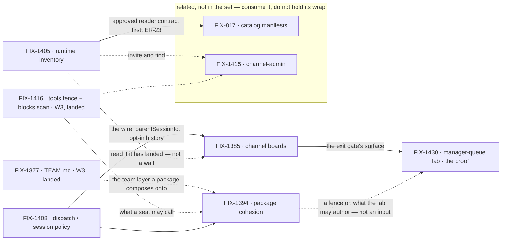

# FIX-1407 · W4: work reaches a seat

**Spec** · [Decisions](DECISIONS.md) · [Rules](BUSINESS-RULES.md) · [Plan](PLAN.md)

Epic · 5 issues · Workforce: Layer 2 Abstraction · Goal 1 — Workforce multi-seat real usage /
architecture cohesion

## Four teams, before and after

| A team that… | Today | After this epic's first cut |
|---|---|---|
| **has work for a team of seats** | Nowhere shared to put it. Dispatched by hand, from code, one seat at a time | It goes on the channel's board. A seat claims it or is assigned it, and runs it |
| **writes one package for a seat** | Two overlapping systems — the seat's prompt file and skills — and no answer to which one a tool belongs in | One answer: **one package format, written in Markdown**, scoped to instructions and tools, with two attachment modes (always-on for a seat, opt-in for a library). A team writes one without an engineer |
| **asks what seats and channels exist** | Opaque strings. `engineering.*` cannot expand, and a seat cannot find another seat's DM | A declared roster read from the tree, plus a live org resource for what is actually open |
| **hands work from one seat to another** | Invents an ambient transcript dump, or a second runtime | A brief, a linked session bound to its parent for life, and parent history only by opt-in tools |

**Why now.** W3 made a Workforce *describable*. Nothing yet says how **work reaches** one of those
declared seats: no shared place to file it, no runtime answer to "which seats exist", and three
unreconciled meanings of *assign*. W3 proved a seat is described; W4 proves a seat is given work.

## What's in the box

![What's in the box: the W4 first cut is a channel or org board that routes work to a seat run and assigns team seats — the exit gate, one hop — plus the package format FIX-1394's ratify recorded — one format authored as a Markdown file, scoped to instructions and tools, with two attachment modes, and not designed disk-only, with whether documents are in v1 still open — a runtime inventory in two layers (a declared roster composed at read time and a live org resource ChannelFlow updates), and the shipped dispatch and session policy. Composed in by the app: custom kinds as flow factories, and defaultWorker triage. A phase-2 panel inside W4, off the exit gate and holding no wrap, holds just two items: the nested personal and request board cascade, and the manager-queue lab's nested half. Below a fence, what is not built: no Agent, Channel, Team, MessageBoard, TeamFlow or SessionBoard L1 type, no Collab RC, no silent parent transcript, no nested or shadow session substrate as a work hierarchy, no merged board-assignee and seat registry, no team wildcards as first ship, no second WorkerRegistry or mega-loader, no assignable-channel routing, no BoardFlow as the only mint, no Graft rebuild.](figures/end-state.svg)

The **exit gate is the top row and only the top row** ([D1](DECISIONS.md#d1)). The strip under it is
phase-2 *inside* W4 — named so nobody reads it as refused, and since the set cut to five
([D6](DECISIONS.md#d6)) nothing on it holds the wrap. The bottom strip is what the set refuses to
build, each item named out rather than forgotten.

## The set · as of 2026-09-19

The live table. Refreshed on the epic PR as issues move; the plan and the figures point here.

**Linear is written, and is the mirror again.** The egress that put `api.linear.app` out of reach
from every session on this epic is gone, and the queued backlog landed on 2026-09-19: every child's
status, the four approved specs as Linear documents on their issues, and three new tickets
([FIX-1451](https://linear.app/fixpoint-labs/issue/FIX-1451),
[FIX-1452](https://linear.app/fixpoint-labs/issue/FIX-1452),
[FIX-1453](https://linear.app/fixpoint-labs/issue/FIX-1453)). [ER-16](BUSINESS-RULES.md) holds
again. The branch is the source and Linear the mirror, in that order — but the tracker is no longer
a surface to read past.

**Read the branch head, not the closed PR's diff.** A closed spec PR's diff is frozen at the commit
it closed on; the branch is not, and `spec/FIX-1405` kept landing corrections after #1916 closed.
Each approved spec now also exists as a document on its Linear issue, which is the durable copy our
convention names. Treat a closed spec PR as the review history rather than as the document.

| Issue | What it delivers | Why the set needs it | Status |
|---|---|---|---|
| FIX-1408 | Dispatch / session policy: sub-agent is same-session background, worker assign is a roster seat in a **linked** session, `parentSessionId` at mint, history by opt-in tools | The wire everything else routes over | **Done** · 2026-09-18 · no impl PR ([below](#a-note-on-fix-1408)) |
| FIX-1394 | **One package format as a Markdown file**, scoped to instructions and tools, with two attachment modes — and a format that is **not disk-only** ([ER-2](BUSINESS-RULES.md)). POC-first | Half the epic's title. Two overlapping surfaces grow board and tool sugar twice until this settles | **Ratify · half answered** · spec approved, [#1915](https://github.com/fixpoint-labs/flow-state-dev/pull/1915) closed unmerged · matrix [#1921](https://github.com/fixpoint-labs/flow-state-dev/pull/1921) open, never merges · authorship [decided](DECISIONS.md#decided-in-review), documents still open |
| FIX-1405 | Inventory in two layers: a declared roster composed from the existing readers, and the live org resource ChannelFlow updates | The epic's third promise in its own right — *which seats and channels exist*, answered from the tree and from what is open — and what `team.*` addressing calls later ([ER-7](BUSINESS-RULES.md)). It does **not** gate the boards | **In review** · spec approved, [#1916](https://github.com/fixpoint-labs/flow-state-dev/pull/1916) closed unmerged · PR-A [#1920](https://github.com/fixpoint-labs/flow-state-dev/pull/1920) and S4 [#1923](https://github.com/fixpoint-labs/flow-state-dev/pull/1923) both **merged** · S5/S6 in flight, no PR yet |
| FIX-1385 | A channel holding `0..N` TaskCollections; channel actions and `taskTools` as two doors on one surface. Also the PR-5 name check over its own diff ([ER-19](BUSINESS-RULES.md)) | **The exit gate's surface** — the board in "channel/org board → seat runs" | **Done** · 2026-09-19 · spec approved, [#1917](https://github.com/fixpoint-labs/flow-state-dev/pull/1917) closed unmerged · [#1922](https://github.com/fixpoint-labs/flow-state-dev/pull/1922) **merged** — one full-scope PR, not the spec's four ([below](#one-pr-not-four)) |
| FIX-1430 | Manager-queue lab: a coordinator seat owns a channel board, assigns to linked seats, shows queue state as **views** over existing task status | The **proof** of the exit gate — adopted at the objective gate, and the owner of [ER-20](BUSINESS-RULES.md) | **Spec approved · unblocked** · [#1919](https://github.com/fixpoint-labs/flow-state-dev/pull/1919) closed unmerged · build **not started**; the surface it waits on merged 2026-09-19 |

**All four specs are approved.** 2 done · 1 in review · 1 at ratify, half answered · 1 unblocked and
not started.

**FIX-1385 shipped in one PR, not the four its plan named.** The dispatch scoped that worker to full
scope in a single change, and PR-A through PR-D had no external gate between them
([#1922](https://github.com/fixpoint-labs/flow-state-dev/pull/1922)). It matters here only because
the [seams table](PLAN.md#coordination-seams-to-watch) ordered *FIX-1385's PR-A* ahead of
FIX-1405's PR-B: that seam is discharged in the order it named — the whole of FIX-1385 landed
first, and FIX-1405's S5/S6 rebase onto it.

**Five, settled at the objective gate** (2026-09-19). The epic body named four; three more were
parented afterwards. The gate kept the four and adopted FIX-1430 as the proof
([D6](DECISIONS.md#d6)). Not bookkeeping: **the exit gate and the wrap are different moments**, and
a parented phase-2 child would not have gated the exit gate — it would have held the epic open past
it, indefinitely. At five, W4 wraps when it meets its own gate.

**The tracker has since moved to six.** [FIX-1451](https://linear.app/fixpoint-labs/issue/FIX-1451)
— a `Bug`, *skill `allowed-tools` promises a grant it does not make* — was filed on 2026-09-19 and
parented under FIX-1407. It is real work in this epic's area and nothing here disputes it. But the
[wrap](PLAN.md#wrap) requires every remaining child to be terminal, so a sixth child sitting in
`Backlog` reintroduces exactly what the paragraph above bought: an epic held open past its own exit
gate. **Not re-parented here:** re-parenting is a deliberate act with its own evidence, never a side
effect of a status refresh. Carried to the owner as [an open question](DECISIONS.md#open).

**Related, not children.** [FIX-817](https://linear.app/fixpoint-labs/issue/FIX-817) (catalog
manifests) and [FIX-1415](https://linear.app/fixpoint-labs/issue/FIX-1415) (channel-admin verbs) are
real work in the same area that this epic's promise does not need. Both **keep their dependency on
FIX-1405** and still obey this set's rules where they touch it: FIX-817 does not start until
FIX-1405's spec is **approved** ([ER-23](BUSINESS-RULES.md)), and neither may re-decide
[ER-3](BUSINESS-RULES.md).

**A note on FIX-1408.** Backlog → Done on 2026-09-18 with no implementation PR: what shipped is the
**decision** ([D4](DECISIONS.md#d4)). Its open walls are not closed by that — **one** is evidenced
by FIX-1394's POC, and the other **four** came back to the epic and are parked in
[Open](DECISIONS.md#open) ([ER-15](BUSINESS-RULES.md)).

## How the issues flow into each other

A **solid** edge blocks; a **dashed** edge does not, and its label says why — **landed code** to
write against (the two W3 inputs, merged 2026-09-19, [ER-18](BUSINESS-RULES.md)), a **fence** the
child holds itself to rather than an input it waits on ([the proof](#what-the-proof-consumes)), or
a surface a child reads **if it has landed** and works without if it has not. A heavy border is
done. The two in the box are [related, not children](#related-not-children).

**Exactly one edge inside the set blocks, and as of 2026-09-19 it is discharged** — FIX-1385's
implementation before FIX-1430, which FIX-1430's own plan states. FIX-1385 merged, so the proof's
one prerequisite inside the set now exists and its build may start. The inventory does **not** gate
the boards: FIX-1385's spec names the declared roster only as an optional read, and its BR-7 carries
the caller's `assignee` verbatim rather than resolving a seat ([ER-5](BUSINESS-RULES.md)). The one
**merge-order** seam between FIX-1385 and FIX-1405's PR-B settled in the order it named
([above](#one-pr-not-four)); it lives in [the plan](PLAN.md#coordination-seams-to-watch), and a
merge order was never a start dependency.

**The proof consumes no package work — not the implementation, and not the contract either.**
FIX-1430's seats carry instructions, skills and tools on surfaces already on `main` at `d8e4c99`,
and FIX-1394 changes none of them: its spec promises today's behaviour byte for byte. So the lab
has nothing to write against and nothing to wait for — and because it authors no package shape at
all, it stayed compatible with every answer FIX-1394 could reach, including the one it reached.
[ER-2](BUSINESS-RULES.md) still binds it, as a **fence**: the lab may not invent a shape the
ratified format would contradict. Binding the proof to a shipped package — or to a ratify — would
hang the exit gate on work it does not need, which is the unreachable gate [D1](DECISIONS.md#d1)
exists to prevent.

## What stays as it is

- **Collab RC ([FIX-1341](https://linear.app/fixpoint-labs/issue/FIX-1341))** — parked. FIX-1415
  shapes a capability surface; it does not reopen Collab.
- **The W3 floor ([FIX-1351](https://linear.app/fixpoint-labs/issue/FIX-1351))** — a sibling epic,
  soft-*after* for ship and never a parent ([D2](DECISIONS.md#d2)).
- **Session substrate ([FIX-1440](https://linear.app/fixpoint-labs/issue/FIX-1440))** — linked
  dispatch does not re-legitimize nested sessions as a work hierarchy ([D4](DECISIONS.md#d4)).
- **The OOTB agent kind ([FIX-1359](https://linear.app/fixpoint-labs/issue/FIX-1359))** — shipped.
  Package cohesion flags drift against it; it is not redesigned from zero.
- **The board's claim system** — `assignee` stays optional, `TaskStatus` does not grow
  ([ER-11](BUSINESS-RULES.md)).
- **`goals/devforce-lab/` ([FIX-1426](https://linear.app/fixpoint-labs/issue/FIX-1426))** — the
  coding seam only. It does not grow into FIX-1430's showcase.

## Signed off · 2026-09-19

The owner ratified all three items of this section's ask, each with the recommendation it carried.
What each one killed is in the card behind it.

1. **[D1](DECISIONS.md#d1) · The exit gate is channel/org board → seat runs / assign team seats.**
   The nested cascade is phase-2 inside W4.
2. **[D6](DECISIONS.md#d6) · The set is five.** FIX-1430 adopted as the proof — which gives
   [ER-20](BUSINESS-RULES.md) its owner — and FIX-817 / FIX-1415 re-homed as
   [related-not-child](#related-not-children), dependency preserved.
3. **[D2](DECISIONS.md#d2) · W4 *ship* PRs are soft-after W3**, as written: the fence lifts when
   every W3 child that carries an implementation is merged to main. Filing, specs and POCs run now.

Also approved: **the public export of the compose helper on `@flow-state-dev/workforce`**
([D5](DECISIONS.md#d5)).

**Since the gate: one of FIX-1394's two ratify decisions is answered.** *Who authors a package* is
settled as recommended — **build the Markdown file, scoped to instructions and tools** — with the
owner's own direction attached: eventually anyone will have an LLM write one, and **those are stored
as a resource rather than saved to disk**, so the format may not be designed disk-only. Recorded as
[decided](DECISIONS.md#decided-in-review) and now binding through [ER-2](BUSINESS-RULES.md).

**Open: two with you, four with the epic.** **With you:** *are documents in v1?* — still parked on
[#1921](https://github.com/fixpoint-labs/flow-state-dev/pull/1921), written in full there,
recommendation unchanged (*leave them out*); and **whether FIX-1451 belongs under this epic**
([above](#the-sixth-child)). **With the epic:** FIX-1408's four returned session-policy walls, in
[Open](DECISIONS.md#open) — none blocks a start, and FIX-1385 shipped without forcing any of them.
