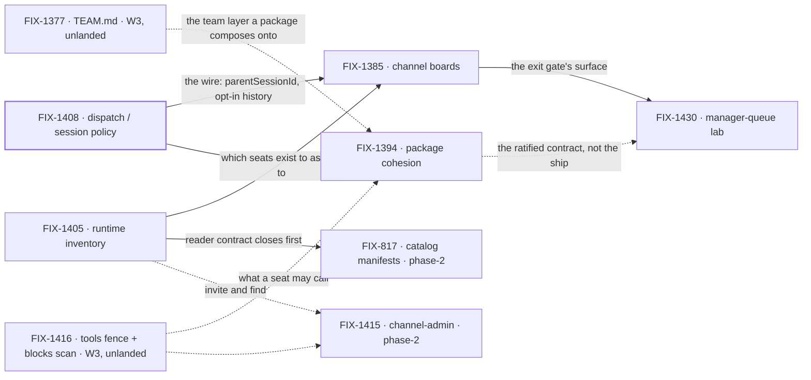

# FIX-1407 · W4: work reaches a seat

**Spec** · [Decisions](DECISIONS.md) · [Rules](BUSINESS-RULES.md) · [Plan](PLAN.md)

Epic · 7 issues · Workforce: Layer 2 Abstraction · Goal 1 — Workforce multi-seat real usage /
architecture cohesion

## Four teams, before and after

| A team that… | Today | After this epic's first cut |
|---|---|---|
| **has work for a team of seats** | Nowhere shared to put it. Dispatched by hand, from code, one seat at a time | It goes on the channel's board. A seat claims it or is assigned it, and runs it |
| **writes one package for a seat** | Two overlapping systems — the seat's prompt file and skills — and no answer to which one a tool belongs in | One package format, two attachment modes: always-on for a seat, opt-in for a library |
| **asks what seats and channels exist** | Opaque strings. `engineering.*` cannot expand, and a seat cannot find another seat's DM | A declared roster read from the tree, plus a live org resource for what is actually open |
| **hands work from one seat to another** | Invents an ambient transcript dump, or a second runtime | A brief, a linked session bound to its parent for life, and parent history only by opt-in tools |

**Why now.** W3 made a Workforce *describable*. Nothing yet says how **work reaches** one of those
declared seats: no shared place to file it, no runtime answer to "which seats exist", and three
unreconciled meanings of *assign*. That gap is why a declared team is still a demo. W3 proved a
seat is described; W4 proves a seat is given work. It does not move the corpus-wide goal count on
its own — the lead measure moves when a child ships a goal check.

## What's in the box

![What's in the box: the W4 first cut is a channel or org board that routes work to a seat run and assigns team seats — the exit gate, one hop — plus one package format with two attachment modes, a runtime inventory in two layers (a declared roster composed at read time and a live org resource ChannelFlow updates), and the shipped dispatch and session policy. Composed in by the app: custom kinds as flow factories, and defaultWorker triage. A phase-2 panel inside W4, off the exit gate but holding the wrap, holds the nested personal and request board cascade, channel-admin verbs, catalog manifests and the manager-queue lab's nested half. Below a fence, what is not built: no Agent, Channel, Team, MessageBoard, TeamFlow or SessionBoard L1 type, no Collab RC, no silent parent transcript, no nested or shadow session substrate as a work hierarchy, no merged board-assignee and seat registry, no team wildcards as first ship, no second WorkerRegistry or mega-loader, no assignable-channel routing, no BoardFlow as the only mint, no Graft rebuild.](figures/end-state.svg)

The **exit gate is the top row and only the top row** ([D1](DECISIONS.md#d1)). The strip under it
is phase-2 *inside* W4 — named so nobody reads it as refused, and fenced off the gate so the gate
is reachable on a schedule. Off the gate is not free; see below. The bottom strip is what the set
refuses to build, every item named out by the Architect rather than forgotten.

## The set · as of 2026-09-18

The live table. Refreshed on the epic PR as issues move; the plan and the figures point here.

| Issue | What it delivers | Why the set needs it | Status |
|---|---|---|---|
| FIX-1408 | Dispatch / session policy: sub-agent is same-session background, worker assign is a roster seat in a **linked** session, `parentSessionId` at mint, history by opt-in tools | The wire everything else routes over | **Done** · 2026-09-18 · no impl PR ([below](#a-note-on-fix-1408)) |
| FIX-1394 | One package format, two attachment modes. POC-first | Half the epic's title. Two overlapping surfaces grow board and tool sugar twice until this settles | Not started · Backlog |
| FIX-1405 | Inventory in two layers: a declared roster composed from the existing readers, and the live org resource ChannelFlow updates | Assigning a **team** seat needs to know which seats exist. Without it a board routes to a literal id and nothing else | Not started · Backlog |
| FIX-1385 | A channel holding `0..N` TaskCollections; channel actions and `taskTools` as two doors on one surface. Also the PR-5 propagation pass ([ER-19](BUSINESS-RULES.md)) | **The exit gate's surface** — the board in "channel/org board → seat runs" | Not started · Todo |
| FIX-817 | Catalog manifests + agent introspection: one discovery shape over seats, channels, resources, tools, skills | Planning *before* assign. Off the exit gate, but **holds the wrap** | Not started · Todo · `Open Question` |
| FIX-1415 | Channel create / delete / invite as a capability, behind the seat's `tools:` fence | Off the exit gate by its own fence, but **holds the wrap** | Not started · Todo |
| FIX-1430 | Manager-queue lab: a coordinator seat owns a channel board, assigns to linked seats, shows queue state as **views** over existing task status | The only child shaped like a **proof** of the exit gate | Not started · Todo |

1 done · 0 in flight · 6 not started.

**Four, or seven?** The epic body names four — FIX-1408, FIX-1394, FIX-1405, FIX-1385. FIX-817,
FIX-1415 and FIX-1430 were parented afterwards and the body does not mention them. That is what the
objective gate has to settle, and it is not bookkeeping, because **the epic's exit gate and its
wrap are different moments.** The wrap term in `.agents/workflows/epic-wake.js` requires every child
to be Linear-terminal, merged or `DONE`, and `TERMINAL_LINEAR` matches only done / closed /
cancelled / duplicate / dropped / won't-do. A Backlog or Todo child is none of those. So a phase-2
child does not gate the exit gate — it holds the epic open past it, indefinitely. Both arms priced:
[Open](DECISIONS.md#open).

**A note on FIX-1408.** Backlog → Done on 2026-09-18 with no implementation PR: what shipped is the
**decision** ([D4](DECISIONS.md#d4), [ER-4](BUSINESS-RULES.md)). Its own open walls are not closed
by that — FIX-1394's POC owns the evidence and this epic owns the decision
([decided in review](DECISIONS.md#decided-in-review)).

## How the issues flow into each other

A **solid** edge blocks: what it carries does not exist until it lands. A **dashed** edge does not,
and its label says what makes starting safe anyway — an approved spec to write against (the two W3
inputs, [ER-18](BUSINESS-RULES.md)), a ratified contract rather than a shipped surface (below), or
a fence the child holds itself to (FIX-1415). A heavy border is done. Every node is filed.

**The proof consumes package cohesion's contract, not its implementation.** FIX-1430's seats can
carry instructions and tools on today's surfaces — both existing labs already do. What the proof
may not do is invent a *third* shape the ratified format would contradict; that is
[ER-2](BUSINESS-RULES.md) binding it. Binding the proof to a shipped package instead would hang the
exit gate on ship tickets that are cut only after a POC ratify and do not exist yet — the
unreachable gate [D1](DECISIONS.md#d1) exists to prevent.

## What stays as it is

- **Collab RC ([FIX-1341](https://linear.app/fixpoint-labs/issue/FIX-1341))** — parked. FIX-1415
  shapes a capability surface; it does not reopen Collab.
- **The W3 floor ([FIX-1351](https://linear.app/fixpoint-labs/issue/FIX-1351))** — a sibling epic,
  soft-*after* for ship and never a parent ([D2](DECISIONS.md#d2)).
- **Session substrate ([FIX-1440](https://linear.app/fixpoint-labs/issue/FIX-1440))** — linked
  dispatch does not re-legitimize nested, child or shadow sessions as a work hierarchy
  ([D4](DECISIONS.md#d4)).
- **The OOTB agent kind ([FIX-1359](https://linear.app/fixpoint-labs/issue/FIX-1359))** — shipped.
  Package cohesion flags drift against it; it is not redesigned from zero.
- **The board's claim system** — `assignee` stays optional, `TaskStatus` does not grow
  ([ER-11](BUSINESS-RULES.md)).
- **`goals/devforce-lab/` ([FIX-1426](https://linear.app/fixpoint-labs/issue/FIX-1426))** — the
  coding seam only. It does not grow into FIX-1430's showcase.

## Sign off

1. **[D1](DECISIONS.md#d1) · The exit gate is channel/org board → seat runs / assign team seats;
   the nested cascade is phase-2.** If wrong: the epic finishes on a cut too thin to prove routing,
   or never finishes because the gate kept moving.
2. **[Open](DECISIONS.md#open) · Seven children, or five?** Keeping FIX-817 and FIX-1415 parented
   means W4 reaches its exit gate and then stays open until they are done. Re-homing them as
   related-not-child means W4 wraps at its gate. **Recommendation: five.** If wrong: either the
   epic sits open for months after proving what it set out to prove, or two issues lose the epic
   holding their shared dependency on FIX-1405.
3. **[D2](DECISIONS.md#d2) · W4 *ship* PRs are soft-after W3; filing, specs and POCs run now.** The
   fence lifts when **every W3 child that carries an implementation is merged to main**; children
   completed by decision, duplicated or cancelled do not hold it. If wrong: either W4 ships onto a
   floor that moves under it, or six children idle for a floor that was never going to block them.

**Open: one** — the set. Rules: [BUSINESS-RULES.md](BUSINESS-RULES.md). Sequencing and what each
issue entails: [PLAN.md](PLAN.md).
