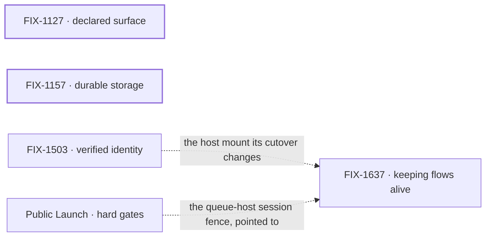

# Framework simplification & cleanup — what FSD says is what it does

**Spec** · [Decisions](DECISIONS.md) · [Rules](BUSINESS-RULES.md) · [Plan](PLAN.md)

This project began in May as an editorial and structural pass driven by a first-principles
review: keep the power, tighten the first hour. That pass is done bar two package extractions.
Since August it has been where FSD fixes the places its surface says one thing and does another,
or offers two of something where a builder needs one, while FSD is pre-1.0 and ahead of its
public release, when a fix breaks the fewest people.

## The outcome

| | |
|---|---|
| **Winning when** | A builder can take every FSD doc, type and default at its word: nothing declared is silently dropped, no job makes them choose between two primitives, a reachable host is not open by default, and a common job such as keeping a flow alive has one published path. Nothing a builder can do today is cut to get there |
| **The read** | Open issues labelled **Bug** in this project. Almost every one is a statement the runtime contradicts. **26 today; zero is done.** It rises when a bug is found as well as falls when one is fixed, so read it beside what was filed that week |
| **Now** | 2 epics done · 2 in flight. 66 open issues, **55 under no epic**. No finish date: the Linear target, May 22, passed with the original pass ([Decisions](DECISIONS.md) → Open) |
| **Kill line** | If a surface cut here keeps coming back within a release because builders needed it, the project is aimed at the wrong thing. What changes is layering, hiding power behind progressive disclosure, not the remaining cut list |

Above the fence is what this project changes; below it is what its epics touch but other projects
own. The fence is one test: does the change make an existing statement true, or remove a second of
something? A change that adds a capability belongs to another project.

## The epics — derived live 2026-09-29 19:54 UTC

| Epic | Outcome it owns | State | Surface |
|---|---|---|---|
| [FIX-1127](https://linear.app/fixpoint-labs/issue/FIX-1127) · **declared surface** | Everything FSD declares or documents is true: four flow options that were silently dropped, a crash on the getting-started path, a resource declaration that leaked between blocks | **done** · 3/3 · Aug 12 | [PR #1249](https://github.com/fixpoint-labs/flow-state-dev/pull/1249), closed at wrap |
| [FIX-1157](https://linear.app/fixpoint-labs/issue/FIX-1157) · **durable storage** | Scope state and resources offer the same verbs where safe; the asymmetry is stated once | **done** · 6/7, 1 canceled · Aug 28 | [PR #1365](https://github.com/fixpoint-labs/flow-state-dev/pull/1365), closed at wrap |
| [FIX-1503](https://linear.app/fixpoint-labs/issue/FIX-1503) · **verified identity** | A reachable host requires a verified principal on every `/api/flows` route but the mint | **in flight** · 0/1 filed, 3 unfiled | [`specs/epics/FIX-1503/`](https://github.com/fixpoint-labs/flow-state-dev/tree/main/specs/epics/FIX-1503), merged Sep 22 |
| [FIX-1637](https://linear.app/fixpoint-labs/issue/FIX-1637) · **keeping flows alive** | One published path for how a flow stays alive 24/7, with no new product noun | **in flight** · 0/8 · direction merged today | [`specs/epics/FIX-1637/`](https://github.com/fixpoint-labs/flow-state-dev/tree/main/specs/epics/FIX-1637), merged Sep 29 |

2 done · 2 in flight · 0 not started. Every state above is re-derived from Linear and the child
implementation PRs each refresh.

**One state disagrees with its surface.** FIX-1503's direction merged on Sep 22, which is
approval, but Linear still reads *In Spec Review* and its three children are still unfiled a week
later. It is counted in flight because Linear's state is *started*; nothing under it has begun.

The two wrapped epics stand alone. The live pair share one seam: the keeping-alive docs describe
how a host is mounted, and verified identity changes exactly that ([Plan](PLAN.md) → seams;
[Rules](BUSINESS-RULES.md) → PR-1).

## What this project is not

- **Not a reduction of the model.** Block kinds, state scopes, capabilities, skills, tools, `ui`
  and thought-fabric stay; the review that opened this project retracted those cuts after reading
  the code ([Decisions](DECISIONS.md) → *decided once*).
- **Not new capability.** A missing feature found here is filed where features live.
- **Not a login product.** The host verifies people; FSD mints and checks a token.
