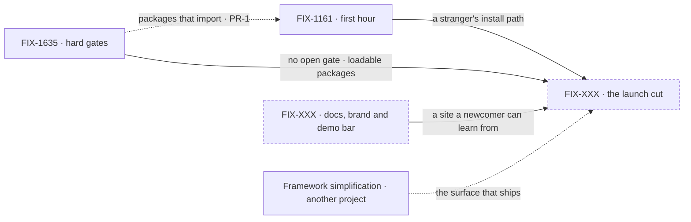

# Public Launch

**Spec** · [Decisions](DECISIONS.md) · [Rules](BUSINESS-RULES.md) · [Plan](PLAN.md)

This project covers the gap between "the framework runs" and "the framework is launched": a
stranger can install FSD from npm, get a working app in their own project, learn it from the docs
alone, and not be hurt by a defect we already know about.

## The outcome

| | |
|---|---|
| **Winning when** | A stranger with Node installed goes from one command to a working app streaming from a real model, in a new project or one they already have. They never clone our repo or read our source. Every public package installs and imports from npm, and the published surface has no known cross-user leak or silent data loss |
| **The read** | Five checks of "launched", each run from a clean machine. (1) Every public package installs and imports from npm. (2) One command gets you a streaming app. (3) A first flow can be built from the docs alone. (4) No open hard gate. (5) The demo's showcase paths run on the public deploy. Check 5 is about whether they work, not how polished they look (PD-2). None of the five is shown today, because nothing has been published yet |
| **Now** | 0 done · 1 in flight · 1 not started · 2 not filed. The first hour is in development. The hard gates objective went up for review on Sep 29 |
| **Kill line** | If the hard-gates list grows faster than it closes, with every pass finding new launch blockers, then the launch definition is too big for one cut. The thing to change is the cut, for example a 0.x release to a small cohort. Relaxing the gates is not the fix |

The fence asks one question: would a stranger hit this, or be harmed by it, the day the doors
open? Everything below the line ships on its own project's timeline, and the launch uses whatever
has landed by the cut. Framework simplification is the one exception: the launch waits for it
([Decisions](DECISIONS.md) → decided once).

## The epics — as of 2026-09-29

| Epic | Outcome it owns | State | Surface |
|---|---|---|---|
| [FIX-1161](https://linear.app/fixpoint-labs/issue/FIX-1161) · **first hour** | Someone new gets a working, streaming AI feature from one command in a new or existing project, and their coding assistant writes FSD code that runs | **in flight**: Linear In Development | epic [PR #1301](https://github.com/fixpoint-labs/flow-state-dev/pull/1301) (closed) · branch `epic/building-with-fsd` |
| [FIX-1635](https://linear.app/fixpoint-labs/issue/FIX-1635) · **hard gates** | The known defects that block a public release are closed: trust boundaries, silent data loss, published artifacts that fail to load, lost generator output | **not started**: Linear Backlog. Objective in review | epic spec [PR #2360](https://github.com/fixpoint-labs/flow-state-dev/pull/2360) (open) · GitHub mirror [#2357](https://github.com/fixpoint-labs/flow-state-dev/issues/2357) |
| FIX-XXX · **docs, brand and demo bar** | A first-time visitor finds one consistent story in the docs, the READMEs and the demo, can build a first flow without help, and finds the showcase paths working | *not filed*. The issues it would claim are in [Plan](PLAN.md) | — |
| FIX-XXX · **the launch cut** | The attended first publish, the go-live, and the announcement | *not filed*. The issues it would claim are in [Plan](PLAN.md) | — |

The counts are in the outcome's **Now** row. Status is derived from Linear and child
implementation PRs at each refresh, and child progress lives on each epic's own surface. A closed
epic spec PR does not mean the epic is done.

Everything flows into the launch cut. Hard gates and the first hour run in parallel, linked only
by a rule, not an order: the scaffold installs the packages hard gates makes loadable
([Rules](BUSINESS-RULES.md) PR-1).

## What this project is not

- **Not feature work.** Memory, Workforce, orchestration, persistence and RAG ship on their own
  projects. The launch uses what they have shipped by the cut and waits for none of them.
- **Not framework simplification.** That project is a prerequisite to launch, not part of it.
- **Not post-launch growth.** Community programs, a plugin registry, contribution flows and
  analytics come after there are users.
- **Not a polish backlog.** Kitchen-sink polish, parked product bets and Ops repair are not launch
  gates ([Decisions](DECISIONS.md) PD-2).
