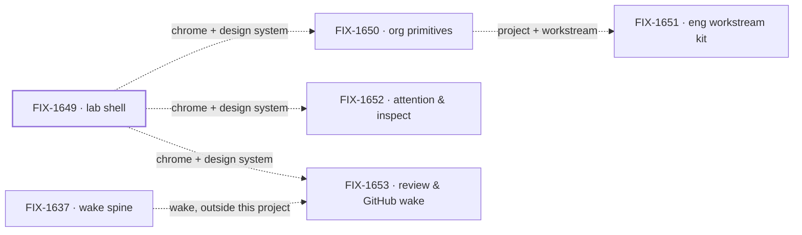

# Workforce: Shift Manager

**Spec** · [Decisions](DECISIONS.md) · [Rules](BUSINESS-RULES.md) · [Plan](PLAN.md)

Shift Manager is the Workforce app Jake dogfoods: one app that opens any Lab built completely on
Workforce, with one shell, one design system, and the org, workstream, attention and review
surfaces a person works in. Layer 2 vocabulary is not here; it stays in
[Workforce: Layer 2 Abstraction](https://linear.app/fixpoint-labs/project/workforce-layer-2-abstraction-9f5c6119ed12).

## The outcome

| | |
|---|---|
| **Winning when** | Jake runs his own work from Shift Manager: projects, workstreams, chat, attention and resources reached from one shell over live Workforce data, and DevForce and CyberForce run in it with no special wrapper |
| **The read** | Nav surfaces a person reaches over live Workforce data, in the shared design system. Five named; all five are reached on `main`, graded by FIX-1663's closure on 01444863c. Attention (Inbox) and resources (Jump to) are interim forms until FIX-1652 |
| **Now** | 1 done · 1 in flight · 3 not started. The shell (FIX-1649) wrapped on Oct 4 when its closure merged; org primitives (FIX-1650) is building toward its closure, FIX-1720; the other three are held |
| **Kill line** | If Shift Manager needs nouns of its own beside Workforce to be usable, the project is mis-shaped: the fix goes to Workforce, not into more epics here |

Above the fence is what this project builds; below it is what it consumes and never extends.
The fence is one test: a noun a second app would need goes to Workforce, not into Shift Manager.

## The epics — derived live 2026-10-04 11:10 UTC

| Epic | What it owns | State | Surface |
|---|---|---|---|
| [FIX-1649](https://linear.app/fixpoint-labs/issue/FIX-1649) · **lab shell** | The chrome, the new design system, nav to every surface, skinning of reused FSD components | **done**, wrapped Oct 4: every implementation PR merged, closure FIX-1663 passed on 01444863c and merged as [#2709](https://github.com/fixpoint-labs/flow-state-dev/pull/2709). Linear still reads Spec Approved, and 14 children whose work merged are not Done there; those status writes are pending with Jake. FIX-1671, FIX-1673, FIX-1675 and FIX-1705 are open follow-ups still parented here | [retained spec](https://github.com/fixpoint-labs/flow-state-dev/tree/main/specs/epics/FIX-1649) via [PR #2421](https://github.com/fixpoint-labs/flow-state-dev/pull/2421); no open implementation PR |
| [FIX-1650](https://linear.app/fixpoint-labs/issue/FIX-1650) · **org primitives** | Project, workstream as channel plus flow, CoS and Ops defaults, single user | **in flight**, epic spec approved Oct 1 (Linear: Spec Approved); FIX-1718 projects (its PRs merging, #2647 and #2685 on `main`) and FIX-1719 CoS in development, closure FIX-1720 in development, bug children in review | [retained spec](https://github.com/fixpoint-labs/flow-state-dev/tree/main/specs/epics/FIX-1650) via [PR #2602](https://github.com/fixpoint-labs/flow-state-dev/pull/2602), merged at approval |
| [FIX-1651](https://linear.app/fixpoint-labs/issue/FIX-1651) · **eng workstream kit** | Epic and issue thin sync, per-issue board, EM, Lead and specialist seats | *not started*, held (Backlog) | — |
| [FIX-1652](https://linear.app/fixpoint-labs/issue/FIX-1652) · **attention & inspect** | Needs-you, harness visibility, the resources list | *not started*, held (Backlog) | — |
| [FIX-1653](https://linear.app/fixpoint-labs/issue/FIX-1653) · **review & GitHub wake** | Review and GitHub wake as Layer 2 of the FIX-1637 wake spine | *not started*, held (Backlog) | — |

1 done · 1 in flight · 3 not started · 0 not filed. Every state is re-derived from Linear and the
epics' implementation PRs each refresh. An epic spec merges at approval, so a merged spec PR
means approved, not done; done is the children's implementation PRs and the closure. FIX-1649 is
done on those, ahead of its Linear state.

Every edge is soft, per the owner: none is a merge gate. The shell is done, so every later
surface renders in it; the eng kit waits on the workstream org primitives define.

## What this project is not

- **Not Layer 2 vocabulary.** Seat, channel, board and kind are decided in Layer 2 Abstraction;
  Shift Manager consumes them.
- **Not a Heartbeats, Paperclip or Grok Bot clone.** Their layout is a reference, not a target.
- **Not a Conductor or factory shell beside Workforce.** DevForce and CyberForce are Labs built on
  it, not siblings to it.
- **Not the kitchen-sink.** That stays the teach surface.
