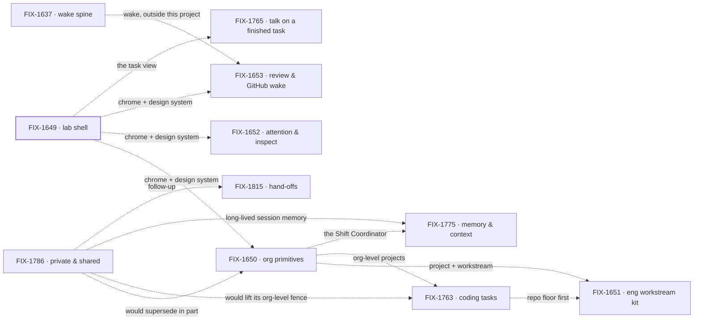

# Workforce: Shift Manager

**Spec** · [Decisions](DECISIONS.md) · [Rules](BUSINESS-RULES.md) · [Plan](PLAN.md)

Shift Manager is the Workforce app Jake dogfoods: one app that opens any Lab built completely on
Workforce, with one shell, one design system, and the org, workstream, attention and review
surfaces a person works in. Layer 2 vocabulary is not here; it stays in
[Workforce: Layer 2 Abstraction](https://linear.app/fixpoint-labs/project/workforce-layer-2-abstraction-9f5c6119ed12).

## The outcome

| | |
|---|---|
| **Winning when** | Jake runs his own work from Shift Manager: projects, workstreams, chat, attention and resources reached from one shell over live Workforce data, and DevForce and CyberForce run in it with no special wrapper |
| **The read** | Nav surfaces a person reaches over live Workforce data, in the shared design system. Five named; all five are reached on `main`, graded by FIX-1663's closure on 01444863c. Attention (Inbox) and resources (Jump to) are interim forms until FIX-1652 |
| **Now** | 1 done · 3 in flight · 6 not started. The shell (FIX-1649) is done; org primitives (FIX-1650) merged its closure, FIX-1720, as #2781 and has not wrapped. Hand-offs (FIX-1815) was approved Oct 8. FIX-1786 was approved Oct 6; its five tensions with calls in force wait on the owner's answers ([Decisions](DECISIONS.md) → Open) |
| **Kill line** | If Shift Manager needs nouns of its own beside Workforce to be usable, the project is mis-shaped: the fix goes to Workforce, not into more epics here |

Above the fence is what this project builds; below it is what it consumes and never extends.
The fence is one test: a noun a second app would need goes to Workforce, not into Shift Manager.

## The epics — derived live 2026-10-08 21:05 UTC

| Epic | What it owns | State | Surface |
|---|---|---|---|
| [FIX-1649](https://linear.app/fixpoint-labs/issue/FIX-1649) · **lab shell** | The chrome, the new design system, nav to every surface, skinning of reused FSD components | **done**, wrapped Oct 4: closure FIX-1663 merged as [#2709](https://github.com/fixpoint-labs/flow-state-dev/pull/2709); Linear Done the same day, 35 of 35 children | [retained spec](https://github.com/fixpoint-labs/flow-state-dev/tree/main/specs/epics/FIX-1649) |
| [FIX-1650](https://linear.app/fixpoint-labs/issue/FIX-1650) · **org primitives** | Project, workstream as channel plus flow, CoS and Ops defaults, single user | **in flight**, approved Oct 1 (Linear: Spec Approved), 15 of 20 children done, 3 canceled; closure FIX-1720 merged Oct 6 as [#2781](https://github.com/fixpoint-labs/flow-state-dev/pull/2781), not yet wrapped; FIX-1726 and FIX-1745 open in Backlog | [retained spec](https://github.com/fixpoint-labs/flow-state-dev/tree/main/specs/epics/FIX-1650) |
| [FIX-1763](https://linear.app/fixpoint-labs/issue/FIX-1763) · **coding tasks** | A project records one optional repository; a harness codes in a worktree mapped from it | *not started* (Linear: Todo, no epic spec). **Its children are already building:** FIX-1762's repository floor, FIX-1778 and FIX-1780 done; FIX-1766 spec approved; FIX-1767 and FIX-1768 in Backlog | — |
| [FIX-1765](https://linear.app/fixpoint-labs/issue/FIX-1765) · **talk on a finished task** | A finished task still takes a message, surfaced upward | *not started* (Todo); first child FIX-1764 | — |
| [FIX-1775](https://linear.app/fixpoint-labs/issue/FIX-1775) · **memory & context** | Shipped memory for the Shift Coordinator; long sessions kept inside the window | *not started* (Todo); first child FIX-1776 | — |
| [FIX-1786](https://linear.app/fixpoint-labs/issue/FIX-1786) · **private & shared** | Private by default, only resources shared: workers as resources, coordinators for mailboxes and rooms | **in flight**, approved Oct 6 (Linear: Spec Approved): spec merged as [#2795](https://github.com/fixpoint-labs/flow-state-dev/pull/2795) by the owner. 3 of 13 children done (inventory FIX-1787, FIX-1789, FIX-1790); FIX-1788 in review, four in development, five in or past spec review | [retained spec](https://github.com/fixpoint-labs/flow-state-dev/tree/main/specs/epics/FIX-1786) |
| [FIX-1815](https://linear.app/fixpoint-labs/issue/FIX-1815) · **hand-offs** | Ask (wait for one answer, continue) and assign (a board job, its session open until done), over one answer-once fence. FIX-1786's follow-up | **in flight**, approved Oct 8 (Linear: Spec Approved): spec merged as [#2891](https://github.com/fixpoint-labs/flow-state-dev/pull/2891) by the owner. 5 children, none started; issue specs for FIX-1816 and FIX-1817 starting | [retained spec](https://github.com/fixpoint-labs/flow-state-dev/tree/main/specs/epics/FIX-1815) |
| [FIX-1651](https://linear.app/fixpoint-labs/issue/FIX-1651) · **eng workstream kit** | Epic and issue thin sync, per-issue board, EM, Lead and specialist seats | *not started*, held (Backlog) | — |
| [FIX-1652](https://linear.app/fixpoint-labs/issue/FIX-1652) · **attention & inspect** | Needs-you, harness visibility, the resources list | *not started*, held (Backlog) | — |
| [FIX-1653](https://linear.app/fixpoint-labs/issue/FIX-1653) · **review & GitHub wake** | Review and GitHub wake as Layer 2 of the FIX-1637 wake spine | *not started*, held (Backlog) | — |

1 done · 3 in flight · 6 not started · 0 not filed, re-derived from Linear and the implementation
PRs each refresh. One contradiction is flagged, not resolved: FIX-1763 has no approved objective,
yet its children are building, and its repository floor has merged.

Every edge is soft, per the owner: none is a merge gate. FIX-1763 holds FIX-1651 to FIX-1653 until
its repo floor is real; FIX-1762 merged it on Oct 6. The edges out of FIX-1786, bar the follow-up, are
tensions, not hand-offs: its objective is approved, and they stay tensions until the owner's answers land.

## What this project is not

- **Not Layer 2 vocabulary.** Seat, channel, board and kind are decided in Layer 2 Abstraction;
  Shift Manager consumes them. *FIX-1786, filed here, tests this:
  [Decisions](DECISIONS.md) → Open, ask 2.*
- **Not a Heartbeats, Paperclip or Grok Bot clone.** Their layout is a reference, not a target.
- **Not a Conductor or factory shell beside Workforce.** DevForce and CyberForce are Labs built on
  it, not siblings to it.
- **Not the kitchen-sink.** That stays the teach surface.
